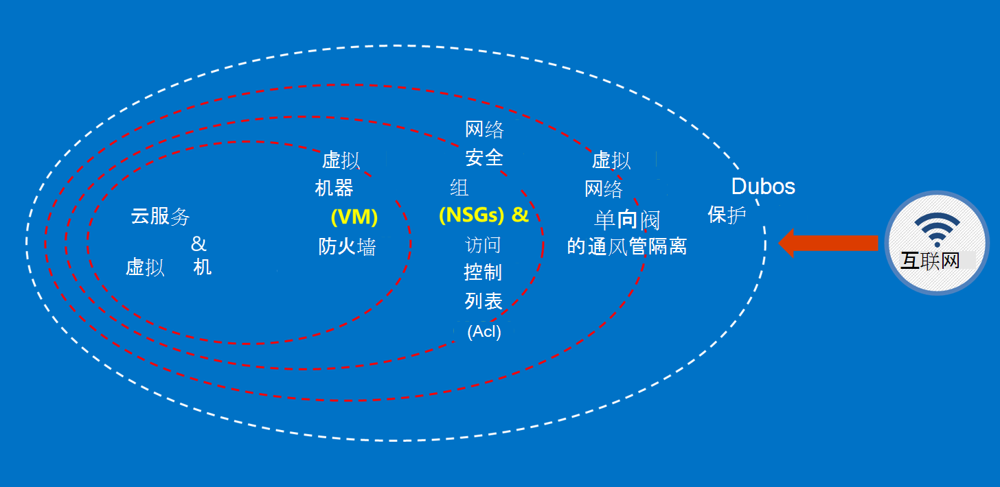

<properties
    pageTitle="Azure 政府文档 |Microsoft Azure"
    description="这为 Azure 政府开发应用程序提供功能和指导的比较"
    services="Azure-Government"
    cloud="gov" 
    documentationCenter=""
    authors="ryansoc"
    manager="zakramer"
    editor=""/>

<tags
    ms.service="multiple"
    ms.devlang="na"
    ms.topic="article"
    ms.tgt_pltfrm="na"
    ms.workload="azure-government"
    ms.date="08/25/2016"
    ms.author="ryansoc"/>

#  Azure 政府文档概述

##  Azure 政府文档简介

此网站描述[Microsoft Azure 政府](https://azure.microsoft.com/features/gov/)服务的功能，并提供一般性指导原则适用于所有客户。 在 Azure 政府订阅包括尤其是受管制的数据前, 应熟悉 Azure 政府功能，如果您有任何疑问，请咨询您的帐户小组。

您应参考[Microsoft Azure 信任中心的法规遵从性页](http://www.microsoft.com/en-us/TrustCenter/Compliance/default.aspx)有关特定资格鉴定和法规所涵盖的 Azure 政府服务的当前信息。 其他 Microsoft 服务可能会有，但不是 Azure 政府介绍服务的范围内，由本文档得不到解决。 Azure 的政府服务可能还允许您使用不同的更多的资源、 应用程序、 或由第三方提供的服务 — — 或由 Microsoft 单独条款和隐私策略 — 它不包括在本文的讨论范围。 您是负责审查所有此类"加载项"产品，如市场上的产品，以确保它们满足法规遵从性方面的条款。

Azure 政府是可用于处理受到某些政府的法规和要求 （例如 NIST 800.171 (DIB)、 ITAR，IRS 1075、 DoD L4 和 CJIS） 需要遵守管理法规的 Azure 政府使用的数据的实体。 Azure 的政府客户进行资格验证。

Azure 政府关于资格问题的实体，应咨询其帐户工作组。

##  保护客户数据在 Azure 的政府的原则

Azure 的政府提供了各种功能和服务，可用于构建云解决方案，以满足监管控制数据的需要。 符合客户解决方案是没有什么比有效地实施全新的 Azure 政府能力，加上可靠的数据的安全性。
当主机在 Azure 政府解决方案时，Microsoft 处理许多这些云基础结构级别的要求。

下图显示了 Azure 的深层防御模型。 例如，Microsoft 提供了基本的云基础架构 DDOS，以及客户的功能，如 DDOS 需要特定于客户的应用程序的安全装置。

此页面列出了用于保护您的服务和应用程序中，如何应用这些原则; 提供指导和最佳做法的基本原则换句话说，如何客户应作出明智地利用 Azure 政府以满足的义务和责任所需的处理 ITAR 信息的解决方案。

保护客户数据的总体原则是︰
* 使用加密的数据保护
* 管理机密信息
* 隔离以限制数据访问

##  保护客户数据使用加密

降低风险和满足管理法规要求带来焦点和数据加密的重要性不断增加。 使用有效的加密实现增强当前的网络和应用程序安全措施 — — 并降低您的云环境的总体风险。

### 存放时加密
静态数据的加密应用于保护客户保存在磁盘存储的内容。 有几种方法，可能发生此错误︰

### 存储服务加密

Azure 存储服务加密启用级别的存储帐户，从而阻止 blob 和页面 blob 写入到 Azure 存储时被自动加密。 从 Azure 存储中读取数据，它将被解密存储服务在返回前。 用于保护您的数据，而无需修改或任何应用程序中添加代码。

### Azure 的磁盘加密
使用 Azure 磁盘加密进行加密的 OS 磁盘和数据磁盘使用 Azure 虚拟机器。 与 Azure 密钥存储库的集成，可控制并帮助您管理磁盘加密密钥。

### 客户端-端加密
客户端-端加密内置 Java 和.NET 存储客户端库，它可以利用 Azure 密钥存储库 Api，使其更容易实现。 使用 Azure 密钥存储库来为特定的个人使用 Azure Active Directory 访问 Azure 密钥存储库中的机密。

### 在传输过程中的加密

可用于连接到 Azure 政府基本加密支持传输级别安全 (TLS) 1.2 协议和 X.509 证书。 联邦信息处理标准 (FIPS) 140-2 1 级加密算法还用于基础结构政府 Azure 数据中心之间的网络连接。  Windows Server 2012 R2 和 8-plus 的虚拟机和 Azure 文件共享的 Windows 可以使用的虚拟机和文件共享之间的加密的 SMB 3.0。 使用客户端加密来加密数据，然后传输到存储在客户端应用程序中，并将解密后的数据存储传递。

### 加密的最佳做法

* IaaS 的虚拟机︰ 使用 Azure 的磁盘加密。 打开存储服务加密用于备份在 Azure 存储中，这些磁盘 VHD 文件进行加密，但这只对新写入的数据进行加密。 这意味着，如果您创建虚拟机，然后保存 VHD 文件的存储帐户上启用存储服务加密，只有所做的更改将被加密，不是原始的 VHD 文件。
* 客户端-端加密︰ 这是最安全的方法，您的数据进行加密，因为它途之前, 对它进行加密，并且加密存放的数据。 但是，它确实需要将代码添加到应用程序使用存储空间，您可能不想做。 在这些情况下，您可以使用 HTTPs 为您的数据在传输过程和存储服务加密加密存放的数据。 客户端-端加密还涉及到多个客户端上的负载 — 您必须尤其是加密和传输大量的数据在可伸缩性计划中，考虑到这。

Azure 中的加密选项的详细信息，请参阅[存储安全指南 》](/storage-security-guide)。

##  通过管理机密保护客户数据

安全的密钥管理对于保护云中的数据至关重要。 客户应尽量简化了密钥管理和维护对云应用程序和服务用于加密数据的密钥的控制。

### 用于管理机密信息的最佳做法

* 使用密钥存储库通过硬编码配置文件，脚本，或在源代码公开的机密信息的风险降至最低。 Azure 的密钥存储库加密密钥 （如 Azure 磁盘加密的加密密钥） 和机密信息 （例如密码），通过将它们存放在 FIPS 140-2 2 级验证硬件安全模块 (Hsm)。 为加强保证，您可以导入或在这些 Hsm 中生成键。
* 应用程序代码和模板应只包含机密信息的 URI 引用 （这意味着实际的秘密不是代码、 配置或源代码存储库）。 这样可以防止内部或外部 repos，如在 GitHub 的搜集 bot 的关键网络钓鱼攻击。
* 利用强大的 RBAC 控制密钥存储库中。 如果信任的操作员离开公司或转移到新组公司中，他们应当避免能够访问机密信息。  

有关其他信息，请参阅[密钥存储库的 Azure 政府](/azure-government/azure-government-tech-keyvault)

##  隔离以限制数据访问

隔离是所有有关使用边界、 分段和容器来限制对授权的用户、 服务和应用程序的数据访问。 例如，承租人的分离是多租户的云平台，例如 Microsoft Azure 必不可少的安全机制。 逻辑隔离可帮助防止一个租户干扰任何其他租户的操作。

### 环境隔离
Azure 政府环境不是 Microsoft 的网络的其余部分分开的物理实例。 这通过一系列的物理和逻辑控制，包括︰ 使用生物识别设备和照相机的物理屏障的保护。  使用特定的凭据和 Microsoft 专业人员需要对生产环境的逻辑访问的多因素身份验证。  所有的服务基础结构的 Azure 政府位于美国境内。

#### 每个客户隔离
Azure 实现网络访问控制和职责划分 VLAN 隔离，Acl，通过负载平衡器和 IP 筛选器

客户可以将其资源进一步隔离跨订阅、 资源组、 虚拟网络和子网。

在 Microsoft Azure 中隔离的详细信息请参阅[隔离部分的 Azure 安全指南 》](/azure-security-getting-started/#isolation)。

为补充信息和更新请订阅<a href="https://blogs.msdn.microsoft.com/azuregov/">Microsoft Azure 的政府博客。</a>
