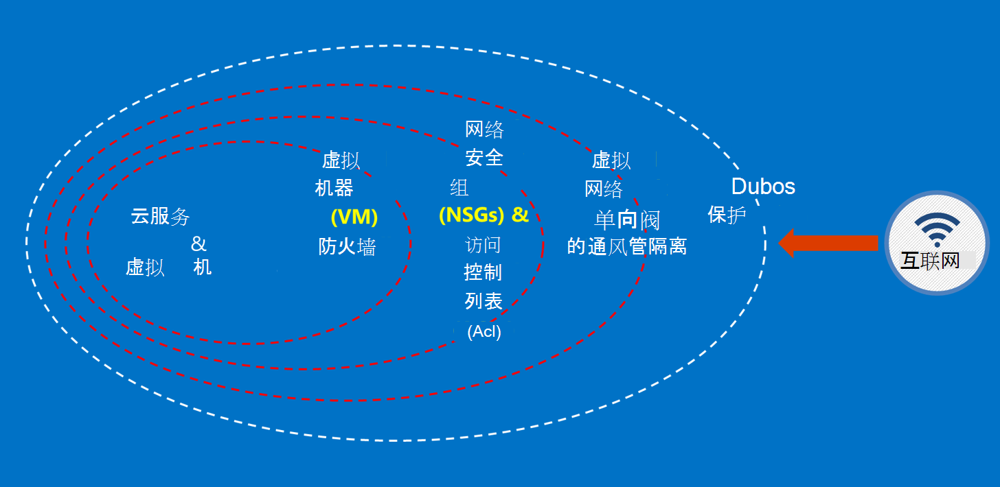

<properties
    pageTitle="Azure 的政府服务 |Microsoft Azure"
    description="提供和 Azure 政府中的可用服务的概述"
    services="Azure-Government"
    cloud="gov"
    documentationCenter=""
    authors="zakramer"
    manager="liki"
    editor="" />

<tags
    ms.service="multiple"
    ms.devlang="na"
    ms.topic="article"
    ms.tgt_pltfrm="na"
    ms.workload="azure-government"
    ms.date="10/18/2016"
    ms.author="ryansoc" />

#  安全

##  保护客户数据在 Azure 的政府的原则

Azure 的政府提供了各种功能和服务，可用于构建云解决方案，以满足监管控制数据的需要。 符合客户解决方案是没有什么比有效地实施全新的 Azure 政府能力，加上可靠的数据的安全性。

当主机在 Azure 政府解决方案时，Microsoft 处理许多这些云基础结构级别的要求。

下图显示了 Azure 的深层防御模型。 例如，Microsoft 提供了基本的云基础架构 DDOS，以及客户的功能，如 DDOS 需要特定于客户的应用程序的安全装置。

此页面列出了用于保护您的服务和应用程序中，如何应用这些原则; 提供指导和最佳做法的基本原则换句话说，如何客户应作出明智地利用 Azure 政府以满足的义务和责任所需的处理 ITAR 信息的解决方案。

 保护客户数据的总体原则是︰

- 使用加密的数据保护
- 管理机密信息
- 隔离以限制数据访问

###  保护客户数据使用加密

降低风险和满足管理法规要求带来焦点和数据加密的重要性不断增加。 使用有效的加密实现增强当前的网络和应用程序安全措施 — — 并降低您的云环境的总体风险。

#### 存放时加密
静态数据的加密应用于保护客户保存在磁盘存储的内容。 有几种方法，可能发生此错误︰

#### 存储服务加密

Azure 存储服务加密启用级别的存储帐户，从而阻止 blob 和页面 blob 写入到 Azure 存储时被自动加密。 从 Azure 存储中读取数据，它将被解密存储服务在返回前。 用于保护您的数据，而无需修改或任何应用程序中添加代码。

#### 客户端-端加密
客户端-端加密内置 Java 和.NET 存储客户端库，它可以利用 Azure 密钥存储库 Api，使其更容易实现。 使用 Azure 密钥存储库来为特定的个人使用 Azure Active Directory 访问 Azure 密钥存储库中的机密。

#### 在传输过程中的加密

可用于连接到 Azure 政府基本加密支持传输级别安全 (TLS) 1.2 协议和 X.509 证书。 联邦信息处理标准 (FIPS) 140-2 1 级加密算法还用于基础结构政府 Azure 数据中心之间的网络连接。  Windows Server 2012 R2 和 8-plus 的虚拟机和 Azure 文件共享的 Windows 可以使用的虚拟机和文件共享之间的加密的 SMB 3.0。 使用客户端加密来加密数据，然后传输到存储在客户端应用程序中，并将解密后的数据存储传递。

#### 加密的最佳做法

- IaaS 的虚拟机︰ 使用 Azure 的磁盘加密。 打开存储服务加密用于备份在 Azure 存储中，这些磁盘 VHD 文件进行加密，但这只对新写入的数据进行加密。 这意味着，如果您创建虚拟机，然后保存 VHD 文件的存储帐户上启用存储服务加密，只有所做的更改将被加密，不是原始的 VHD 文件。
- 客户端-端加密︰ 这是最安全的方法，您的数据进行加密，因为它途之前, 对它进行加密，并且加密存放的数据。 但是，它确实需要将代码添加到应用程序使用存储空间，您可能不想做。 在这些情况下，您可以使用 HTTPs 为您的数据在传输过程和存储服务加密加密存放的数据。 客户端-端加密还涉及到多个客户端上的负载 — 您必须尤其是加密和传输大量的数据在可伸缩性计划中，考虑到这。

###  通过管理机密保护客户数据

安全的密钥管理对于保护云中的数据至关重要。 客户应尽量简化了密钥管理和维护对云应用程序和服务用于加密数据的密钥的控制。

#### 用于管理机密信息的最佳做法

- 使用密钥存储库通过硬编码配置文件，脚本，或在源代码公开的机密信息的风险降至最低。 Azure 的密钥存储库加密密钥 （如 Azure 磁盘加密的加密密钥） 和机密信息 （例如密码），通过将它们存放在 FIPS 140-2 2 级验证硬件安全模块 (Hsm)。 为加强保证，您可以导入或在这些 Hsm 中生成键。
- 应用程序代码和模板应只包含机密信息的 URI 引用 （这意味着实际的秘密不是代码、 配置或源代码存储库）。 这样可以防止内部或外部 repos，如在 GitHub 的搜集 bot 的关键网络钓鱼攻击。
- 利用强大的 RBAC 控制密钥存储库中。 如果信任的操作员离开公司或转移到新组公司中，他们应当避免能够访问机密信息。

有关详细信息<a href="https://azure.microsoft.com/documentation/services/key-vault">Azure 密钥存储库公共文档。</a>

###  隔离以限制数据访问

隔离是所有有关使用边界、 分段和容器来限制对授权的用户、 服务和应用程序的数据访问。 例如，承租人的分离是多租户的云平台，例如 Microsoft Azure 必不可少的安全机制。 逻辑隔离可帮助防止一个租户干扰任何其他租户的操作。

#### 环境隔离
Azure 政府环境不是 Microsoft 的网络的其余部分分开的物理实例。 这被通过一系列的物理和逻辑控制，包括以下︰

- 使用生物识别设备和照相机的物理屏障的保护。
- 使用特定的凭据和 Microsoft 专业人员需要对生产环境的逻辑访问的多因素身份验证。
- 所有的服务基础结构的 Azure 政府位于美国境内。

#### 每个客户隔离
Azure 实现网络访问控制和职责划分 VLAN 隔离，Acl，通过负载平衡器和 IP 筛选器

客户可以将其资源进一步隔离跨订阅、 资源组、 虚拟网络和子网。

## 筛选

近期发布的 FedRAMP 高和国防部 (DoD) 的影响等级鉴定。 这在 Azure 政府环境提高了安全性和法规遵从性栏。

我们现在正在与法律和信用 (NACLC) 屏蔽在国家机构检查所有我们运算符部分 5.6.2.2 的 DoD 云计算安全要求指南 (SRG) 中定义︰

>[AZURE.NOTE] 最小的背景调查所需的 CSP 为级别 4 拥有访问权限的人员和 5 信息基础对"非关键敏感"(例如 DoD 的 ADP-2) 是国家机构检查与法律和信用 (NACLC) （适用于"非关键敏感"承包商），或"中等风险"位置标志中等风险背景调查 (MBI)。

下表总结了我们当前筛选 Azure 政府运算符︰

Azure Gov 筛选和背景检查 | 说明|
---|---|
美国公民 |美国公民的验证。
Microsoft 云背景检查 （每两年）|社会保险号码列表中搜索，刑事历史记录检查列表中的外部资产控制办公室 (OFAC)、 工业局和安全列表 (BIS)，办公室的国防贸易控制 Debarred 人。
国家机构咨询法和贷方 (NACLC) （每五年一次） | 添加指纹与 FBI 的数据库的背景检查。 其他信息，请转到<a href="https://www.opm.gov/investigations/background-investigations/federal-investigations-notices/1997/fin97-02/">办公室人员管理站点</a>。 | 
<a href="https://www.microsoft.com/en-us/TrustCenter/Compliance/CJIS">刑事司法信息服务 (CJIS)</a> | CJIS 是一种状态，本地和 FBI 政府屏蔽哪些进程指纹记录并验证操作人员，他们可以提供对关键刑事司法信息 (CJI) 数据的访问上的刑事历史记录。  每种状态 does 自己背景检查和雇员的潜在访问 CJI 后续审批。|

对于 Azure 的操作人员，以下访问原则适用︰

- 清楚地定义了这职责，独立负责申请、 审核和部署更改。
- 访问是通过定义具有特定功能的接口。
- 访问是实时 (JIT)，且仅在每个事件的基础上或对于特定的维护事件，并始终在有限期限内获得。
- 访问是基于规则，与定义的角色只分配故障排除所需的权限。

筛选标准包括美国公民的所有 Microsoft 支持和操作人员的验证之前访问权限授予 Azure 政府托管系统。 传输数据所需的技术支持人员使用 Azure 政府内的安全功能。 安全的数据传输要求一组单独的身份验证凭据以访问。 例如，若要访问系统元数据，操作人员使用特定的基于 web 的内部管理工具、 只读的 Api 和 JIT 提升。

## 下一步行动

为补充信息和更新请订阅<a href="https://blogs.msdn.microsoft.com/azuregov/">Microsoft Azure 的政府博客。</a>
