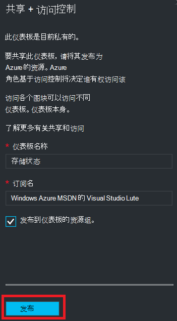

<properties
   pageTitle="Azure 门户的仪表板访问 |Microsoft Azure"
   description="本文说明如何共享对 Azure 门户中的仪表板的访问权限。"
   services="azure-portal"
   documentationCenter=""
   authors="tfitzmac"
   manager="timlt"
   editor="tysonn"/>

<tags
   ms.service="multiple"
   ms.devlang="NA"
   ms.topic="article"
   ms.tgt_pltfrm="NA"
   ms.workload="na"
   ms.date="08/01/2016"
   ms.author="tomfitz"/>

# 共享 Azure 的仪表板

配置仪表板之后, 您可以发布它，并将其与其他用户共享您的组织中。 您允许其他人访问您的仪表板使用 Azure 的[基于角色的访问控制](../active-directory/role-based-access-control-configure.md)。 用户组分配的角色，并且该角色定义的用户是否可以查看或修改已发布的仪表板。 

所有已发布的仪表板实现为 Azure 的资源，这意味着它们以可管理您的订阅中项的形式存在，包含在资源组中。  访问控制的角度，从仪表板是没有什么不同于其他资源，如虚拟机或存储帐户。

> [AZURE.TIP] 操控板上的各个图块实施他们自己根据它们所显示的资源的访问控制要求。  因此，您可以设计的仪表板，广泛同时仍保护各个图块上的数据共享。

## 了解仪表板的访问控制

使用基于角色的访问控制，可以将用户分配给三个不同级别的作用域的角色︰

- 订阅
- 资源组
- 资源

分配的权限被继承从预订到的资源。 已发布的仪表板是一个资源。 因此，您可能已经分配给订阅的角色，这也适用于已发布的仪表板的用户。 

下面是一个示例。  让我们假设您已经订阅了 Azure 和各个团队成员分配角色的**所有者**、**参与者**或**读者**订阅。 所有者或参与者的用户将能够列出、 查看、 创建、 修改或删除该订阅中的仪表板。  读取器的用户可以对列表和视图的仪表板，但无法修改或删除它们。  具有阅读者访问权限的用户都可以访问已发布的仪表板进行本地编辑 (例如，在解决问题时)，但是不能将这些更改发布回服务器。  他们将可以选择使自己的仪表板的私有副本

但是，您还指派权限到资源组包含多个仪表板或单个仪表板。 例如，您可能会决定，一组用户应具有有限的权限通过订阅但提高访问特定仪表板。 为这些用户分配角色为该仪表板。 

## 发布仪表板

让我们假设您已经完成配置您想要使用一组用户共享您的订阅中的仪表板。 下面的步骤描述了自定义的组称为存储管理器，但您可以将组命名自己喜欢。 有关创建 Active Directory 组并向该组添加用户的信息，请参阅[在 Azure Active Directory 中的管理组](../active-directory/active-directory-accessmanagement-manage-groups.md)。

1. 在仪表板中，选择**共享**。

     

2. 在分配之前访问，您必须发布该仪表板。 默认情况下，到资源组名为**仪表板**将发布仪表板。 选择**发布**。

     

现在发布您的仪表板。 如果订阅中继承的权限是合适的您不需要执行任何其他操作。 您的组织中的其他用户将能够访问和修改基于其订阅级别角色的仪表板。 但是，对于本教程，让一组用户为角色指派为该仪表板。

## 指派到仪表板的访问权限

1. 后发布该仪表板，请选择**管理用户**。

     

2. 您将看到现有已分配角色为此仪表板的用户的列表。 您的现有用户列表将与下面的图像不同。 很可能，订阅被继承分配。 若要添加新用户或组，选择**添加**。

     

3. 选择表示您想要授予的权限的角色。 对于本例，请选择**讨论参与者**。

     

4. 选择用户或组，您想要分配到该角色。 如果未看到该用户或组正在寻找在列表中，使用搜索框。 可用的组列表取决于您在活动目录中创建的组。

      

5. 完成添加用户或组，请选择**确定**。 

6. 新的分配被添加到用户列表中。 请注意其**访问**被列为**分配**，而不是**继承**。

     

## 下一步行动

- 有关角色的列表，请参阅[RBAC︰ 内置角色](../active-directory/role-based-access-built-in-roles.md)。
- 若要了解有关管理资源，请参阅[管理 Azure 通过门户的资源](resource-group-portal.md)。