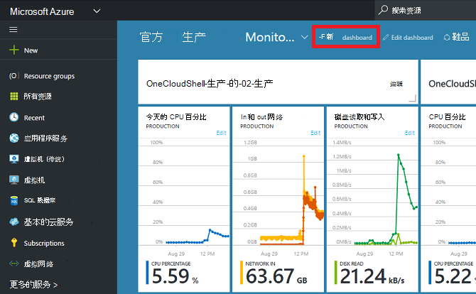

<properties
   pageTitle="Azure 门户的仪表板 |Microsoft Azure"
   description="本文介绍如何创建和编辑仪表板在 Azure 的门户。"
   services="azure-portal"
   documentationCenter=""
   authors="sewatson"
   manager="timlt"
   editor="tysonn"/>

<tags
   ms.service="multiple"
   ms.devlang="NA"
   ms.topic="article"
   ms.tgt_pltfrm="NA"
   ms.workload="na"
   ms.date="09/06/2016"
   ms.author="sewatson"/>

# 创建并共享 Azure 门户的仪表板

您可以创建多个仪表板并将它们与其他用户有权访问您的 Azure 订阅共享。  这篇文章经过创建/编辑、 发布和管理仪表板的基础知识。

## 自定义仪表板与刀片式服务器

几个月前启动的仪表板，因为没有刀片式服务器的自定义项中的稳定降低和仪表板的自定义项中的快速增长。 这种强使用率趋势显示您希望自定义面板，通过刀片。 若要支持泛滥的趋势，我们将删除自定义刀片式服务器并将专用于仪表板功能增强我们工作的能力。 如果您自定义一个叶片，很快就将删除您的自定义。 若要保留该自定义项，固定到仪表板的自定义图块。 只需右击平铺，如下图所示选择**附到仪表板**。

## 创建仪表板

若要创建仪表板，请选择当前仪表板的名称旁边的**新建仪表板**按钮。  

此操作将创建一个新的、 空的专用仪表板并将您放入其中命名您的仪表板和添加或重新排列图块的自定义模式。  在此模式下，可折叠的拼贴库接管左侧的导航菜单。  拼贴库使您可以以各种方式 Azure 资源查找拼贴︰ 可以浏览由[资源组](../azure-resource-manager/resource-group-overview.md#resource-groups)、 资源类型、[标记](../resource-group-using-tags.md)，或通过按名称搜索所需的资源。  

通过拖放到控制板面上所需的位置添加平铺。

没有调用**常规**拼贴不与特定的资源相关联的一个新类别。  在此示例中，我们将附减价平铺。  您可以使用该图块将自定义内容添加到您的仪表板。  该图块支持纯文本、[减价语法](https://daringfireball.net/projects/markdown/syntax)以及一组有限的 HTML。  (为了安全，不能执行某些操作，如插入`<script>`标记或使用某些样式元素的 CSS 可能干扰门户。) 

## 编辑仪表板

创建您的仪表板后, 可以收回图块拼贴库或刀片式服务器的拼贴表示。 让我们收回我们的资源组的表示。 可以浏览该项目，或从资源组刀片两针。 这两种方法会导致锁定的图块表示的资源组。

后固定项目，它将出现在您的仪表板上。

现在，我们有减价平铺视图和资源组固定到仪表板，我们可以调整并重新平铺排列到合适的版式。

通过将鼠标指针悬停并选择"..."或右键单击图块上您可以看到该图块的上下文的所有命令。 默认情况下，有两项︰

1. **从仪表板脱离**– 删除仪表板拼贴
2.  **自定义**– 输入自定义模式

通过选择自定义，您可以调整大小并重新排列拼贴。 若要调整平铺视图，请选择新的大小从上下文菜单中，如下图中所示。

或者，如果该图块支持任意大小，可以将右下角拖到所需大小。

在调整大小的图块后, 查看仪表板。

完后自定义仪表板，只需选择**完成自定义**退出自定义模式或用鼠标右键单击并从上下文菜单中选择**执行自定义**。

## 发布仪表板和管理访问控制

创建仪表板时，时，默认情况下，这意味着您是唯一的人可以查看此专用。  若要使其他人可以看到，使用**共享**按钮旁边的其他仪表板命令出现。

您需要选择订阅和发布到您的仪表板的资源组。 无缝地集成到生态系统的仪表板，我们已经在 （因此不能共享通过键入电子邮件地址） 作为 Azure 资源实现共享仪表板。  对大多数门户中图块中显示的信息的访问受[Azure 角色基于访问控制](../active-directory/role-based-access-control-configure.md )。 访问控制的角度，从共享的仪表板是从虚拟机或存储帐户没有什么不同。  

让我们假设您已经订阅了 Azure 和您的团队成员已分配的**所有者**、**参与者**或**读者**订阅的角色。  所有者或参与者的用户将能够列出、 查看、 创建、 修改或删除该订阅中的仪表板。  读取器的用户可以对列表和视图的仪表板，但无法修改或删除它们。  具有阅读者访问权限的用户可以访问共享的仪表板，进行本地编辑，但也不能将这些更改发布回服务器。  但是，他们可以为自己使用的仪表板的私有副本。  与以往一样，在仪表板上的各个图块强制自己根据它们对应的资源的访问控制规则。  

为方便起见，门户发布的经验将指导您模式向仪表板放置称为**仪表板**的资源组中的位置。  

您还可以选择将某个仪表板发布到特定资源组。  该仪表板的访问控制与资源组的访问控制。  可管理的资源，该资源组中的用户也可以访问仪表板。

发布您的仪表板后，**共享 + 访问**控件窗格将刷新并显示您已发布的仪表板，包括链接到仪表板的用户访问管理信息。  该链接可启动标准的基于角色的访问控制刀片用于管理 Azure 的任何资源的访问。  您总是可以获得返回到该视图通过选择**共享**。

## 下一步行动

- 要管理资源，请参阅[管理 Azure 通过门户的资源](resource-group-portal.md)。
- 若要部署的资源，请参阅[部署资源与资源管理器模板和 Azure 的门户](../resource-group-template-deploy-portal.md)。