<properties 
    pageTitle="使用 Azure 门户管理 Azure 资源 |Microsoft Azure" 
    description="使用 Azure 门户和 Azure 资源管理来管理您的资源。 演示如何使用仪表板来监视资源。" 
    services="azure-resource-manager,azure-portal" 
    documentationCenter="" 
    authors="tfitzmac" 
    manager="timlt" 
    editor="tysonn"/>

<tags 
    ms.service="azure-resource-manager" 
    ms.workload="multiple" 
    ms.tgt_pltfrm="na" 
    ms.devlang="na" 
    ms.topic="article" 
    ms.date="09/12/2016" 
    ms.author="tomfitz"/>

# 管理门户网站通过 Azure 资源

> [AZURE.SELECTOR]
- [Azure PowerShell](../powershell-azure-resource-manager.md)
- [Azure CLI](../xplat-cli-azure-resource-manager.md)
- [门户网站](resource-group-portal.md) 
- [REST API，](../resource-manager-rest-api.md)

本主题演示如何通过来使用[Azure 门户](https://portal.azure.com) [Azure 资源管理器](../azure-resource-manager/resource-group-overview.md)来管理 Azure 的资源。 若要了解有关部署通过门户的资源，请参阅[部署资源与资源管理器模板和 Azure 的门户](../resource-group-template-deploy-portal.md)。

目前，并非每个服务支持的门户网站或资源管理器。 对于这些服务，您需要使用[传统的门户网站](https://manage.windowsazure.com)。 每个服务的状态，请参阅[Azure 门户可用性图表](https://azure.microsoft.com/features/azure-portal/availability/)。

## 管理资源组

1. 要查看您的订阅中的所有资源组，请选择**资源组**。

    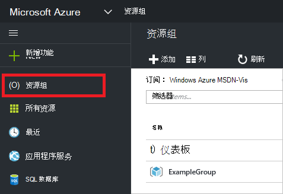

1. 若要创建一个空的资源组，请选择**添加**。

    

1. 提供的名称和新的资源组的位置。 选择**创建**。

    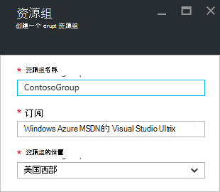

1. 您可能需要选择**刷新**以查看最近创建的资源组。

    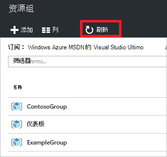

1. 若要自定义的资源组显示的信息，请选择**列**。

    

1. 选择要添加的列，然后选择**更新**。

    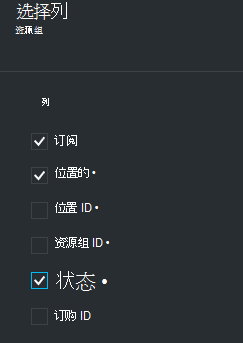

1. 若要了解如何将资源部署到新的资源组，请参阅[部署资源与资源管理器模板和 Azure 的门户](../resource-group-template-deploy-portal.md)。

1. 快速访问某一资源组，可以将刀片式服务器锁定到您的仪表板。

    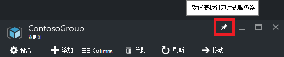

1. 仪表板显示资源组和资源。 您可以选择资源组或其资源的任何以导航到该项目。

    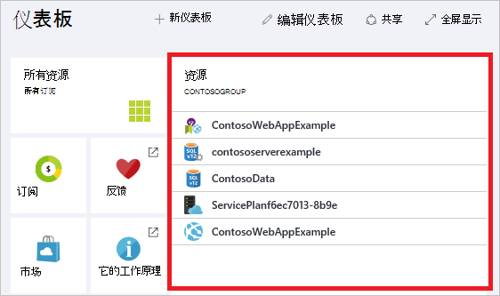

## 标记的资源

可以将标记应用到资源组和资源，以逻辑方式组织您的资产。 有关如何使用标签的信息，请参阅[使用标签来组织您的 Azure 资源](../resource-group-using-tags.md)。

[AZURE.INCLUDE [resource-manager-tag-resource](../../includes/resource-manager-tag-resources.md)]

## 资源监视器

当选择某个资源时，资源刀片式服务器提供默认关系图和表来监视该资源类型。

1. 选择一个资源，并注意**监控**部分。 它包括相关的资源类型的图表。 下图显示了默认的监视存储帐户的数据。

    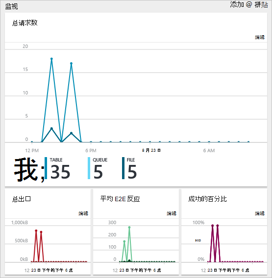

1. 您可以通过选择节上面的省略号 （...） 到您的仪表板收回刀片式服务器的一部分。 您还可以自定义大小刀片式服务器中的部分或将其完全删除。 下图演示如何固定、 自定义，或移除的 CPU 和内存的部分。

    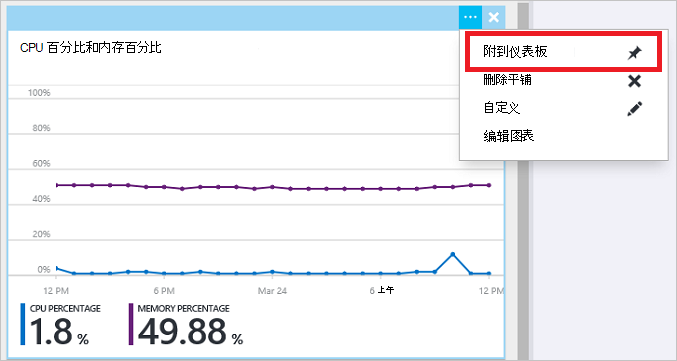

1. 锁定到仪表板的部分，您将看到摘要仪表板上。 然后选择您立即采用有关的数据的更多详细信息。

    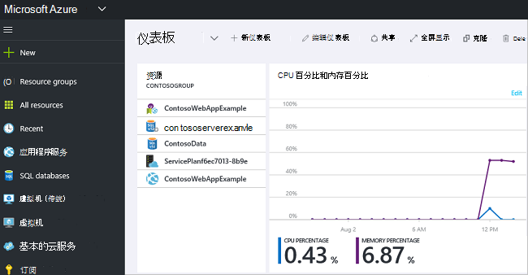

1. 若要完全自定义的数据通过门户监视、 定位到默认仪表板，和选择**新的仪表板**。

    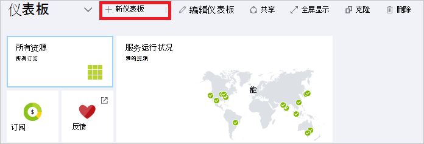

1. 为新仪表板的名称并将牌拖动到仪表板。 拼贴被筛选不同的选项。

    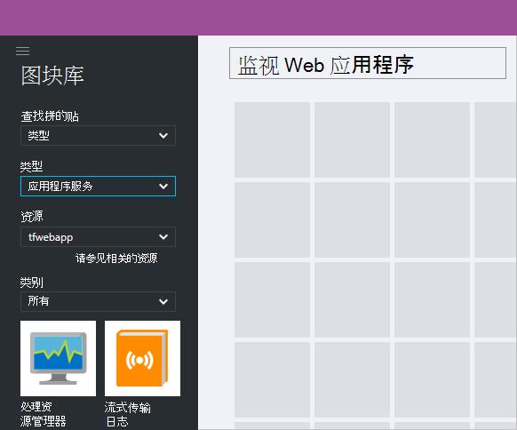

     若要了解有关使用仪表板，请参阅[创建和共享 Azure 门户的仪表板](azure-portal-dashboards.md)。

## 管理资源

刀片式服务器的资源，请参阅管理资源的选项。 门户网站提供了该特定资源类型的管理选项。 您看到顶部和左侧的资源刀片式服务器的管理命令。

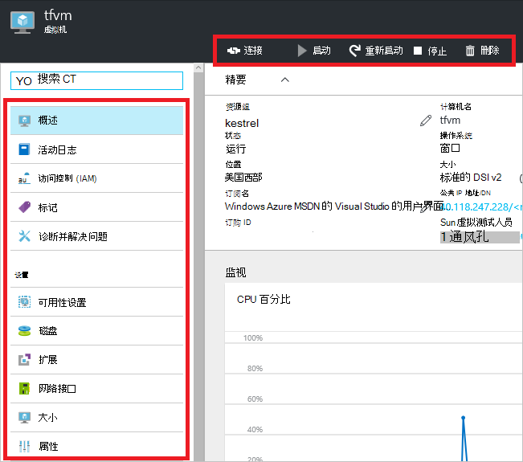

从下列选项中，您可以执行操作，例如启动和停止虚拟机，或重新配置虚拟机的属性。

## 移动资源

如果您需要将资源移动到另一个资源组或另一个订阅，请参阅[移动到新的资源组或预订的资源](../resource-group-move-resources.md)。

## 锁定资源

您可以锁定以防止意外地删除或修改关键资源组织中的其他用户订阅、 资源组或资源。 有关详细信息，请参阅[锁定资源使用 Azure 资源管理器中](../resource-group-lock-resources.md)。

[AZURE.INCLUDE [resource-manager-lock-resources](../../includes/resource-manager-lock-resources.md)]

## 查看您的订阅和成本

所有资源可以查看有关您的订购和汇总的成本信息。 选择**订阅**和订阅您想要查看。 您可能只有一个选择的订阅。

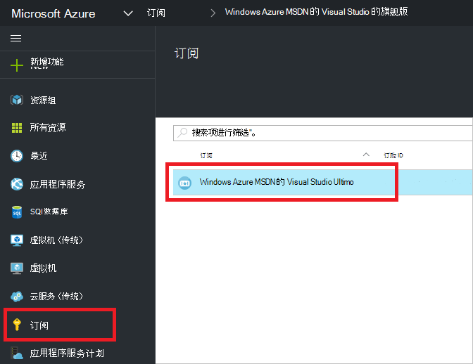

在订阅刀片式服务器，您将看到燃速。

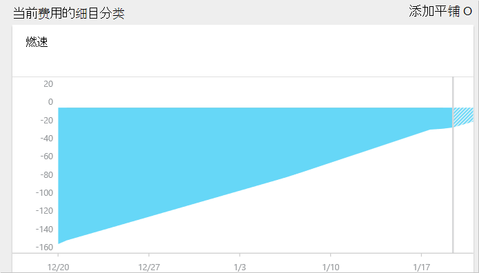

而且，按资源类型成本的细目分类。

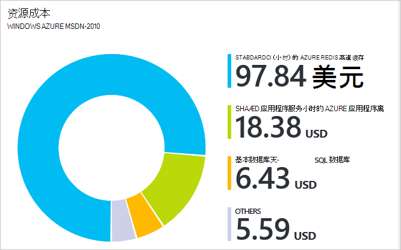

## 导出模板

设置资源组之后, 您可以查看该资源组的资源管理器模板。 导出模板具有两个优点︰

1. 因为该模板中包含的完整基础结构，可以轻松地自动未来部署的解决方案。

2. 您可以熟悉模板语法通过查看在 JavaScript 对象符号 (JSON) 表示您的解决方案。

有关分步指南，请参阅[导出 Azure 资源管理器模板从现有的资源](../resource-manager-export-template.md)。

## 删除资源组或资源

删除某一资源组将删除它所包含的所有资源。 您还可以删除资源组内的单个资源。 要谨慎小心，当您删除某一资源组，因为有可能会链接到其他资源组中的资源。 资源管理器不会删除链接的资源，但它们不可能没有预期的资源而正确操作。

## 下一步行动

- 要查看审核日志，请参阅[审核操作与资源管理器](../resource-group-audit.md)。
- 部署错误进行疑难解答，请参阅[疑难解答资源组部署与 Azure 的门户](../resource-manager-troubleshoot-deployments-portal.md)。
- 若要部署通过门户的资源，请参阅[部署资源与资源管理器模板和 Azure 的门户](../resource-group-template-deploy-portal.md)。
- 若要管理对资源的访问，请参阅[使用管理 Azure 订阅资源访问权限的角色分配](../active-directory/role-based-access-control-configure.md)。

