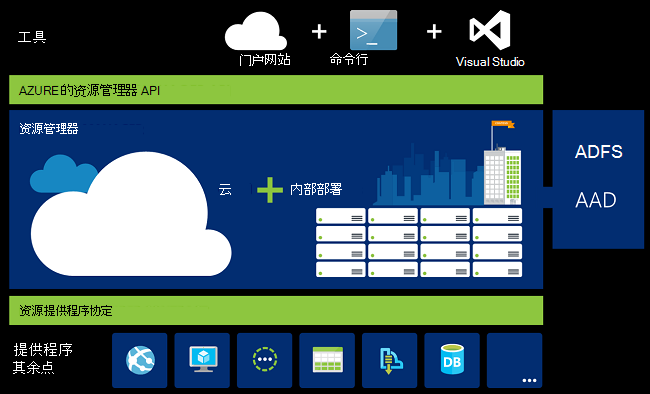
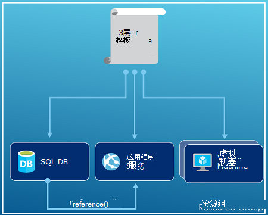
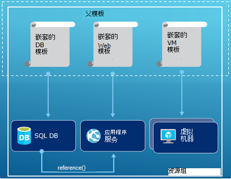
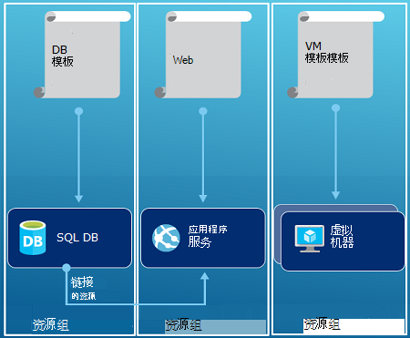

<properties
   pageTitle="Azure 的资源管理器概述 |Microsoft Azure"
   description="描述如何使用 Azure 资源管理器进行部署、 管理，和访问控制的资源在 Azure 上。"
   services="azure-resource-manager"
   documentationCenter="na"
   authors="tfitzmac"
   manager="timlt"
   editor="tysonn"/>

<tags
   ms.service="azure-resource-manager"
   ms.devlang="na"
   ms.topic="get-started-article"
   ms.tgt_pltfrm="na"
   ms.workload="na"
   ms.date="10/21/2016"
   ms.author="tomfitz"/>

# Azure 的资源管理器概述

您的应用程序的基础结构通常组成许多组件 – 也许虚拟机、 存储帐户和虚拟网络或 web 应用程序、 数据库、 数据库服务器和第三方服务。 您看不到这些组件作为单独的实体，而是看其部分为相关和相互依赖的单个实体。 要部署、 管理和监控它们作为一个组。 Azure 的资源管理器使您能够使用您的解决方案作为一个组中的资源。 您可以部署、 更新或删除您的解决方案在单一的协调操作中的所有资源。 您的部署使用的模板，该模板可以适合不同的环境，如测试、 临时和生产。 资源管理器提供安全性，审核和标记功能，让您在部署后管理您的资源。 

## 术语

如果您是新到 Azure 资源管理器中，有一些您可能不熟悉的术语。

- **资源**-可通过 Azure 的管理项目。 某些公共资源是虚拟机、 存储帐户、 web 应用程序、 数据库和虚拟网络，但有很多更多。
- **资源组**的容器存放 Azure 的解决方案的相关的资源。 资源组可以包含的解决方案中，所有资源或仅需作为一个组来管理这些资源。 您决定要将资源分配给资源组基于什么最有意义的您的组织的方式。 请参阅[资源组](#resource-groups)。
- **资源提供程序**-您可以部署和管理通过资源管理器中的资源提供服务。 每个资源提供商提供如何使用部署资源的操作。 一些常见的资源提供程序是 Microsoft.Compute，提供虚拟机资源、 Microsoft.Storage，提供存储帐户资源和 Microsoft.Web，提供与 web 应用程序相关的资源。 请参阅[资源提供程序](#resource-providers)。
- **资源管理器模板**-JavaScript 对象符号 (JSON) 文件中定义一个或多个将部署到某一资源组的资源。 它还定义了已部署的资源之间的依赖关系。 可以使用模板来部署资源，持续和反复。 请参见[模板部署](#template-deployment)。
- **声明性语法**的语法，用于声明"这是我想要创建"无需编写的编程序列命令来创建它。 资源管理器模板是一种声明性语法。 在文件中，您将定义基础结构部署到 Azure 的属性。 

## 使用资源管理器的好处

资源管理器提供了以下几个优点︰

- 您可以部署、 管理和监视解决方案作为一个组，而不是单独处理这些资源的所有资源。
- 重复可以部署您的解决方案在整个开发生命周期，并确信您的资源部署在一致的状态。
- 您可以管理您的基础架构，通过声明性的模板，而不是脚本。
- 您可以定义以便按正确的顺序来部署资源之间的依赖关系。
- 因为基于角色的访问控制 (RBAC) 本机集成管理平台，可以适用于所有服务在资源组中的访问控制。
- 可以将标记应用到资源以逻辑方式组织您的订阅中的所有资源。
- 可以通过查看成本资源共享相同的标记组中阐明组织的帐单。  

资源管理器提供了一种可以部署和管理您的解决方案的新方法。 如果您使用较早的部署模型，希望了解所做的更改，请参阅[了解资源管理器部署和经典的部署](../resource-manager-deployment-model.md)。

## 一致的管理层

资源管理器提供一个一致的管理层通过 Azure PowerShell，Azure CLI，Azure 门户，REST API 和开发工具执行的任务。 所有工具都使用一组通用的操作。 您使用的工具，更好地为您，可以交替使用它们而不会混淆。 

下面的图像显示方式与相同的 Azure 资源管理器 API 进行交互的所有工具。 API 将请求传递给资源管理器服务，它对进行身份验证并授权请求。 资源管理器然后将请求路由到适当的资源提供程序。

## 指南

以下建议可帮助您充分利用的资源管理器使用您的解决方案时。

1. 定义和部署您的基础结构，通过使用声明性语法在资源管理器的模板，而不是通过强制性的命令。
2. 在模板中定义的所有部署和配置步骤。 您应该有没有手动设置您的解决方案的步骤。
3. 运行强制性的命令来管理资源，如启动或停止应用程序或机器。
4. 在资源组中相同的生命周期排列的资源。 对于所有其他组织的资源使用标记。

建议的详细信息，请参阅[创建 Azure 资源管理器模板的最佳方法](../resource-manager-template-best-practices.md)。

## 资源组

有几个重要因素来定义资源组时，请考虑︰

1. 在组中的所有资源应该都共享相同的生命周期。 部署、 更新和删除它们组合在一起。 如果需要在不同的部署周期存在一个资源，如数据库服务器，它应该是另一个资源组中。
2. 每个资源在一个资源组只能存在。
3. 您可以添加或删除任何时候到资源组的资源。
4. 可以从一个资源组的资源移动到另一个组。 有关详细信息，请参阅[移动到新的资源组或预订的资源](../resource-group-move-resources.md)。
4. 资源组可以包含位于不同地区的资源。
5. 资源组可以用于确定访问控制用于管理操作的范围。
6. 资源与其他资源组的资源交互。 这种交互时常见的两种资源相互关联但不是共享相同的生命周期 （例如，web 应用程序连接到数据库）。

创建资源组时，您需要提供该资源组的位置。 您可能会想，"为什么某一资源组需要一个位置？ 但，如果资源可以有比资源组中的不同位置，为什么资源组位置重要根本吗？ 资源组存储有关资源的元数据。 因此，当您指定该资源组的位置，并指定该元数据的存储位置。 出于法规遵从性考虑，您可能需要确保您的数据存储在特定区域。

## 资源提供程序

每个资源提供商提供资源和操作使用 Azure 服务的一的组。 例如，如果您想要存储密钥和密码，您使用**Microsoft.KeyVault**资源提供程序。 此资源提供商提供称为**电子仓库**创建密钥存储库，并要求在密钥存储库中创建一个密钥**存储库中的机密**的资源类型的资源类型。 

在开始之前部署您的资源，您应了解可用的资源提供程序。 了解资源提供者和资源的名称可帮助您定义您想要将部署到 Azure 的资源。

检索与以下 PowerShell cmdlet 的所有资源提供程序︰

    Get-AzureRmResourceProvider -ListAvailable

或者，使用 Azure CLI 时，则检索所有资源提供程序使用以下命令︰

    azure provider list

对于那些需要使用的资源提供程序可以一下返回的列表。

若要获取有关资源提供程序的详细信息，请添加您的命令提供程序命名空间。 该命令返回的资源提供者，和受支持的位置以及每种资源类型的 API 版本支持的资源类型。 以下的 PowerShell cmdlet 获取有关 Microsoft.Compute 的详细信息︰

    (Get-AzureRmResourceProvider -ProviderNamespace Microsoft.Compute).ResourceTypes

或者，使用 Azure CLI 时，检索支持的资源类型、 位置和 API 版本为 Microsoft.Compute，使用以下命令︰

    azure provider show Microsoft.Compute --json > c:\Azure\compute.json

有关详细信息，请参阅[资源管理器提供程序、 地区、 API 版本和架构](../resource-manager-supported-services.md)。

## 模板部署

使用资源管理器中，您可以创建一个模板定义的 Azure 解决方案的配置和基础结构 （采用 JSON 格式）。 通过使用模板，可以重复部署您的解决方案在整个生命周期和有的信心，您的资源部署在一致的状态。 从门户创建一个解决方案时，该解决方案会自动包括部署模板。 您不必从头创建模板，因为您可以开始使用模板为您的解决方案，进行自定义以满足您的特定需求。 通过导出当前状态的资源组中，或查看特定部署所使用的模板，您可以检索现有资源组的模板。 查看[导出模板](../resource-manager-export-template.md)是了解模板语法的有用方式。

若要了解有关的模板以及如何构造格式的详细信息，请参阅[创作 Azure 资源管理器模板](../resource-group-authoring-templates.md)和[资源管理器模板演练](../resource-manager-template-walkthrough.md)。

资源管理器进程处理像任何其他请求的模板 （请参阅[一致的管理层](#consistent-management-layer)图像）。 它分析模板并将它的语法转换为适当的资源提供程序的 REST API 操作。 例如，当资源管理器接收具有下面的资源定义的模板︰

    "resources": [
      {
        "apiVersion": "2016-01-01",
        "type": "Microsoft.Storage/storageAccounts",
        "name": "mystorageaccount",
        "location": "westus",
        "sku": {
          "name": "Standard_LRS"
        },
        "kind": "Storage",
        "properties": {
        }
      }
      ]

它将定义转换为以下的 REST API 操作发送到 Microsoft.Storage 资源提供程序︰

    PUT
    https://management.azure.com/subscriptions/{subscriptionId}/resourceGroups/{resourceGroupName}/providers/Microsoft.Storage/storageAccounts/mystorageaccount?api-version=2016-01-01
    REQUEST BODY
    {
      "location": "westus",
      "properties": {
      }
      "sku": {
        "name": "Standard_LRS"
      },   
      "kind": "Storage"
    }

如何定义模板和资源组是完全由您和您希望如何管理您的解决方案。 例如，可以将三层应用程序通过一个模板部署到单个资源组。

但是，您不需要在单个模板中定义的整个基础。 通常情况下，其意义将划分到一组目标、 具有特定用途的模板部署要求。 您可以轻松地重用这些模板的目的不同的解决方案。 要部署特定的解决方案，您可以创建链接所需的所有模板的主模板。 下图演示如何部署三层解决方案，通过一个包含三个嵌套的模板的父模板。

如果构想各分层具有单独的生命周期，则可以部署您单独的资源组的三个层次。 请注意资源仍然可以链接到其他资源组中的资源。

关于模板设计的更多建议，请参阅[设计 Azure 资源管理器模板的模式](../best-practices-resource-manager-design-templates.md)。 有关嵌套模板的信息，请参阅[使用链接的模板使用 Azure 资源管理器中](../resource-group-linked-templates.md)。

Azure 的资源管理器分析依赖项以确保按正确的顺序创建资源。 如果一个资源依赖于其他资源 （例如，虚拟机的磁盘需要存储帐户） 中的值，则设置依赖项。 有关详细信息，请参阅[在 Azure 资源管理器模板中的定义依赖项](../resource-group-define-dependencies.md)。

此外可以使用模板对基础架构进行更新。 例如，可以将资源添加到您的解决方案并添加为已部署的资源的配置规则。 如果该模板指定创建资源，但该资源已存在，Azure 资源管理器执行更新，而不是创建新的资产。 Azure 的资源管理器更新现有资产到相同的状态会随着新。  

资源管理器提供了扩展方案时需要其他操作，如安装未包含在安装程序中的特定软件。 如果您已经在使用配置管理服务，如 DSC、 厨师的简历或傀儡，您可以通过使用扩展继续使用该服务。 有关虚拟机的扩展信息，请参阅[关于虚拟机的扩展和功能](../virtual-machines/virtual-machines-windows-extensions-features.md)。 

最后，该模板将成为您的应用程序的源代码的一部分。 您可以将其签入到源代码的代码存储库并随着您的应用程序的发展更新。 可以通过 Visual Studio 模板进行编辑。

定义您的模板之后, 您就可以将资源部署到 Azure。 可以将资源部署的命令，请参阅︰

- [部署资源使用资源管理器模板和 Azure PowerShell](../resource-group-template-deploy.md)
- [部署资源使用资源管理器模板和 Azure CLI](../resource-group-template-deploy-cli.md)
- [将资源使用资源管理器模板和 Azure 门户部署](../resource-group-template-deploy-portal.md)
- [部署使用资源管理器模板和 REST API，资源管理器的资源](../resource-group-template-deploy-rest.md)

## 标记

资源管理器提供了一种标记功能使您能够根据您的要求管理或付费的资源分类。 具有一套复杂资源组和资源，并需要直观地显示对您最方便的方式在这些资产时，可以使用标记。 例如，可以标记在您的组织中起类似的角色，或者属于同一部门的资源。 不带标记，您组织中的用户可以创建多个可能很难以后识别和管理的资源。 例如，您可能希望删除特定项目的所有资源。 如果这些资源未标记的项目，您必须手动查找它们。 标记可以减少不必要的成本，在您的订阅中的重要方法。 

资源不需要驻留在相同的资源组，共享一个标签。 您可以创建自己的标记分类，以确保您的组织中的所有用户都使用常用标记而不是用户不小心应用标记稍有不同 （例如，"部门"而不是"部"）。

下面的示例演示应用于一个虚拟机的标记。

    "resources": [    
      {
        "type": "Microsoft.Compute/virtualMachines",
        "apiVersion": "2015-06-15",
        "name": "SimpleWindowsVM",
        "location": "[resourceGroup().location]",
        "tags": {
            "costCenter": "Finance"
        },
        ...
      }
    ]

若要检索标记值的所有资源，请使用以下 PowerShell cmdlet:

    Find-AzureRmResource -TagName costCenter -TagValue Finance

或者，下面的 Azure CLI 命令︰

    azure resource list -t costCenter=Finance --json

您还可以查看标记的资源通过 Azure 的门户。

您的订阅[使用情况报告](../billing/billing-understand-your-bill.md)包括标记名称和值，这使您可以通过标记划分出成本。 有关标记的详细信息，请参阅[使用标签来组织您的 Azure 资源](../resource-group-using-tags.md)。

## 访问控制

资源管理器，可以控制哪些用户有权访问您组织的特定操作。 它本身集成管理平台的基于角色的访问控制 (RBAC)，并将该访问控制应用到资源组中的所有服务。 

有两个主要的概念要理解在使用基于角色的访问控制时︰

- 角色定义的描述的一组权限，并可在多个分配。
- 角色分配的特定作用域 （订购、 资源组或资源） 的关联具有标识 （用户或组） 的定义。 分配较低范围由继承。

您可以将用户添加到预定义的平台和特定资源的角色。 例如，您可以利用名为读取器，允许用户查看的资源，但不能更改这些预定义角色。 贵组织中需要这种类型的访问读者角色中添加用户并将角色应用到订阅、 资源组或资源。

Azure 提供了下列四个平台角色︰

1.  所有者 — 可以管理所有内容，包括访问
2.  参与者-可以管理访问之外的全部内容
3.  读者-可以查看的所有内容，但不能进行更改
4.  用户访问管理员-可以管理用户对 Azure 的资源访问权限

Azure 还提供了几个特定资源的角色。 一些常见的原因是︰

1.  虚拟机参与者-可以管理虚拟机，但不是授予访问到它们，和它们连接到虚拟网络或存储帐户将无法管理
2.  网络参与者-可以管理所有网络资源，但不是授予对它们的访问
3.  存储帐户参与者-可以管理存储帐户，但不是授予对它们的访问
4. SQL Server 参与者-可以管理 SQL 服务器和数据库，但不是及其与安全相关的策略
5. 网站讨论参与者的可以管理网站，但无法连接到的 web 计划

有关角色和允许的操作的完整列表，请参阅[RBAC︰ 内置角色的](../active-directory/role-based-access-built-in-roles.md)。 有关基于角色的访问控制的详细信息，请参阅[基于 Azure 角色的访问控制](../active-directory/role-based-access-control-configure.md)。 

在某些情况下，您想要运行的代码或脚本访问资源，但不是希望在用户的凭据下运行它。 相反，您想要创建一个调用服务应用程序主体的标识和分配合适的角色，为服务主体。 资源管理器使您能够创建应用程序的凭据，并以编程方式对应用程序进行身份验证。 若要了解有关创建服务主体，请参阅以下主题之一︰

- [使用 Azure PowerShell 创建服务主体访问资源](../resource-group-authenticate-service-principal.md)
- [使用 Azure CLI 创建服务主体访问资源](../resource-group-authenticate-service-principal-cli.md)
- [使用门户网站创建活动目录应用程序和服务主体可以访问的资源](../resource-group-create-service-principal-portal.md)

您可以显式锁定关键资源，以防用户删除或修改它们。 有关详细信息，请参阅[锁定资源使用 Azure 资源管理器中](../resource-group-lock-resources.md)。

## 活动日志

资源管理器记录的创建、 修改或删除某个资源的所有操作。 可以使用活动日志，以查找错误进行故障排除时或监视您组织内的用户如何修改资源。 若要查看日志，请**设置**刀片式服务器的资源组中选择**活动日志**。 您可以通过许多不同的值，包括用户启动操作筛选日志。 有关如何使用活动日志的信息，请参阅[审核操作使用资源管理器中](../resource-group-audit.md)。

## 自定义的策略

资源管理器使您可以创建自定义的策略来管理您的资源。 您创建的策略的类型可以包括多种不同的方案。 您可以强制执行资源、 限制可以部署哪些类型和资源的实例或哪些区域可以承载一种类型的资源的限制上的命名约定。 您可以要求由部门组织付费的资源的标记值。 创建策略，以帮助降低成本和维护您的订购中的一致性。 

定义使用 JSON 的策略，然后将这些策略应用跨您的订阅或在资源组中。 策略是不同的基于角色的访问控制，因为它们应用于资源类型。

下面的示例演示一个策略，以确保通过指定的所有资源，都包括 costCenter 标记的标记的一致性。

    {
      "if": {
        "not" : {
          "field" : "tags",
          "containsKey" : "costCenter"
        }
      },
      "then" : {
        "effect" : "deny"
      }
    }

有很多更多的可以创建的策略类型。 有关详细信息，请参阅[使用策略来管理资源和控制访问权限](../resource-manager-policy.md)。

## Sdk

Azure Sdk 都可用于多种语言和平台。
每个这些语言实现都可以通过 GitHub 及其生态系统包管理器。

每个这些 Sdk 中的代码是从 Azure RESTful API 规范生成的。
这些规范是开源，基于 Swagger 2.0 规范。
SDK 代码生成通过开放源代码项目，称为 AutoRest。
AutoRest 变换成多种语言的客户端库这些 rest 风格的 API 规范。
如果您想要提高在 Sdk 中生成任何的方面，整个的一套工具来创建 Sdk 是代码的开放、 免费提供，并根据被广泛采用的 API 规范格式。

这里是我们打开源 SDK 的存储库。 我们欢迎反馈问题，并请求中拉出。

[.NET](https://github.com/Azure/azure-sdk-for-net) | [Java](https://github.com/Azure/azure-sdk-for-java) | [Node.js](https://github.com/Azure/azure-sdk-for-node) | [PHP](https://github.com/Azure/azure-sdk-for-php) | [Python](https://github.com/Azure/azure-sdk-for-python) | [拼音](https://github.com/Azure/azure-sdk-ruby)

> [AZURE.NOTE]如果 SDK 并不提供所需的功能，还可以调用到[Azure REST API](https://msdn.microsoft.com/library/azure/dn790568.aspx)直接。

## 示例

### .NET

- [管理 Azure 的资源和资源组](https://azure.microsoft.com/documentation/samples/resource-manager-dotnet-resources-and-groups/)
- [部署一个 SSH 启用虚拟机模板](https://azure.microsoft.com/documentation/samples/resource-manager-dotnet-template-deployment/)

### Java

- [管理 Azure 的资源](https://azure.microsoft.com/documentation/samples/resources-java-manage-resource/)
- [管理 Azure 的资源组](https://azure.microsoft.com/documentation/samples/resources-java-manage-resource-group/)
- [部署一个 SSH 启用虚拟机模板](https://azure.microsoft.com/documentation/samples/resources-java-deploy-using-arm-template/)

### Node.js

- [管理 Azure 的资源和资源组](https://azure.microsoft.com/documentation/samples/resource-manager-node-resources-and-groups/)
- [部署一个 SSH 启用虚拟机模板](https://azure.microsoft.com/documentation/samples/resource-manager-node-template-deployment/)

### Python

- [管理 Azure 的资源和资源组](https://azure.microsoft.com/documentation/samples/resource-manager-python-resources-and-groups/)
- [部署一个 SSH 启用虚拟机模板](https://azure.microsoft.com/documentation/samples/resource-manager-python-template-deployment/)

### 拼音

- [管理 Azure 的资源和资源组](https://azure.microsoft.com/documentation/samples/resource-manager-ruby-resources-and-groups/)
- [部署一个 SSH 启用虚拟机模板](https://azure.microsoft.com/documentation/samples/resource-manager-ruby-template-deployment/)

除了这些示例中，您可以搜索库示例。

[.NET](https://azure.microsoft.com/documentation/samples/?service=azure-resource-manager&platform=dotnet) | [Java](https://azure.microsoft.com/documentation/samples/?service=azure-resource-manager&platform=java) | [Node.js](https://azure.microsoft.com/documentation/samples/?service=azure-resource-manager&platform=nodejs) | [Python](https://azure.microsoft.com/documentation/samples/?service=azure-resource-manager&platform=python) | [拼音](https://azure.microsoft.com/documentation/samples/?service=azure-resource-manager&platform=ruby)

## 下一步行动

- 使用模板的简单介绍，请参阅[将从现有资源 Azure 资源管理器模板导出](../resource-manager-export-template.md)。
- 有关创建模板的更全面的演练中，[资源管理器模板演练](../resource-manager-template-walkthrough.md)。
- 若要了解您可以在模板中使用的函数，请参见[模板函数](../resource-group-template-functions.md)
- 有关使用 Visual Studio 与资源管理器的信息，请参阅[创建和部署通过 Visual Studio Azure 的资源组](../vs-azure-tools-resource-groups-deployment-projects-create-deploy.md)。
- 有关使用 VS 代码使用资源管理器的信息，请参阅[使用 Azure Visual Studio 代码中的资源管理器模板](../resource-manager-vs-code.md)。

以下是本概述视频演示︰

[AZURE.VIDEO azure-resource-manager-overview]

[powershellref]: https://msdn.microsoft.com/library/azure/dn757692(v=azure.200).aspx
