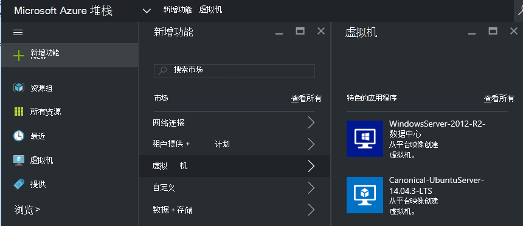
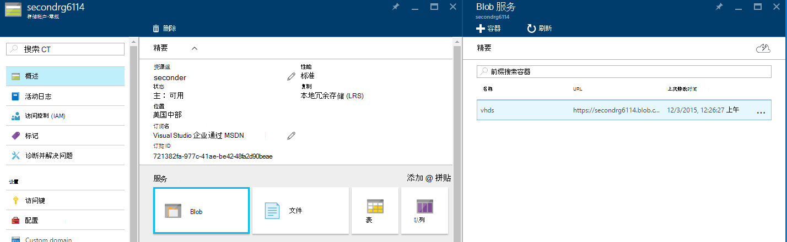
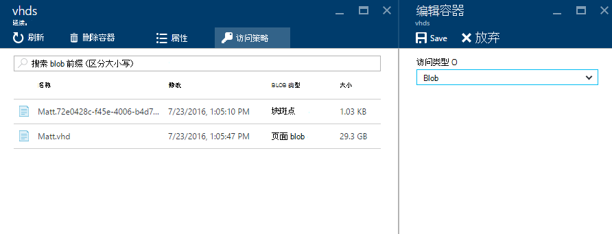
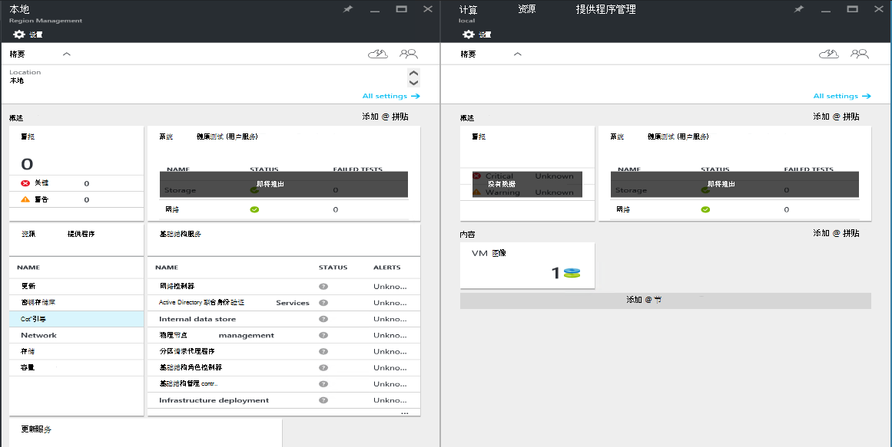
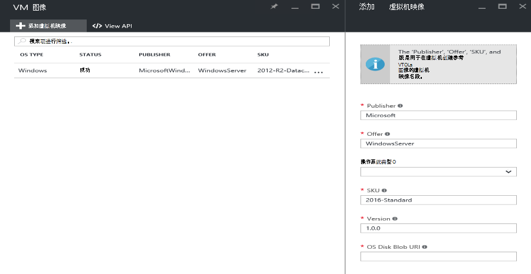

<properties
    pageTitle="将 VM 映像添加到 Azure 堆栈 |Microsoft Azure"
    description="添加为承租人使用贵组织的自定义 Windows 或 Linux 虚拟机映像"
    services="azure-stack"
    documentationCenter=""
    authors="mattmcg"
    manager="darmour"
    editor=""/>

<tags
    ms.service="azure-stack"
    ms.workload="na"
    ms.tgt_pltfrm="na"
    ms.devlang="na"
    ms.topic="get-started-article"
    ms.date="09/26/2016"
    ms.author="mattmcg"/>

# <a name="make-a-custom-virtual-machine-image-available-in-azure-stack"></a>在 Azure 堆栈中提供自定义虚拟机映像


Azure 堆栈使管理员能够使 VM 映像，其组织的自定义 VHD，如其承租人使用。 图像可以引用的 Azure 资源管理器模板或添加到 Azure 市场市场项目创建 UI。 默认情况下，在 Azure 堆栈技术预览包含 Windows Server 2012 R2 图像。

> [AZURE.NOTE] 可以通过在用户界面中，选择**新建**，然后选择**虚拟机**类别部署 VM 映像与市场项目。 VM 映像项目列出。


## <a name="add-a-vm-image-to-marketplace-with-powershell"></a>将 VM 映像添加到使用 PowerShell 的市场

如果 VM 控制台 （或另一个外部连接的设备） 在本地可用的虚拟机映像 VHD，使用以下步骤︰

1. 准备 VHD 格式 (而不是 VHDX) 中的 Windows 或 Linux 的操作系统虚拟硬盘映像。
    -   对于 Windows 映像，文章[上传到 Azure 的资源管理器部署 Windows 虚拟机映像](virtual-machines-windows-upload-image.md)包含图像准备**准备上载 VHD**一节中的说明。
    -   对于 Linux 映像，请按照准备映像或使用现有的 Azure 堆栈 Linux 映像[部署 Linux 虚拟机 Azure 堆栈上](azure-stack-linux.md)了文章中所述的步骤。

2. 克隆[Azure 堆栈工具库](https://aka.ms/azurestackaddvmimage)中，然后再将导**ComputeAdmin**模块

    ```powershell
    Import-Module .\ComputeAdmin\AzureStack.ComputeAdmin.psm1
    ```

3. 通过调用添加 VMImage cmdlet 添加虚拟机映像。
    -  包括出版商、 优惠、 SKU，以及虚拟机映像的版本。 这些参数使用 Azure 资源管理器模板引用 VM 映像。
    -  指定 Windows 或 Linux osType。
    -  在窗体中包括您 Azure Active Directory 的租户 ID * &lt;myaadtenant&gt;*。 onmicrosoft.com。
    - 下面是一个示例调用的脚本︰

    ```powershell
       Add-VMImage -publisher "Canonical" -offer "UbuntuServer" -sku "14.04.3-LTS" -version "1.0.0" -osType Linux -osDiskLocalPath 'C:\Users\AzureStackAdmin\Desktop\UbuntuServer.vhd' -tenantID <myaadtenant>.onmicrosoft.com
    ```

    > [AZURE.NOTE] 该 cmdlet 请求添加虚拟机映像的凭据。 请向管理员提供 Azure Active Directory 凭据，如serviceadmin@ * &lt;myaadtenant&gt;*。 onmicrosoft.com，提示。  

此命令执行以下任务︰
- 对 Azure 堆栈环境进行身份验证
- 将本地 VHD 上载到新创建的临时帐户
- 将 VM 映像添加到虚拟机映像存储库
- 创建市场项目

若要验证该命令已成功运行在门户中，进入市场，然后验证虚拟机映像的**虚拟机**类别中可用。

> 

以下是命令参数的说明。


| 参数 | 说明 |
|----------| ------------ |
|**tenantID** | 您在窗体中的 Azure Active Directory 租户 ID * &lt;AADTenantID*。 onmicrosoft.com&gt;。 |
|**发布服务器** | 部署映像时承租人使用 VM 映像发布服务器名段。 例如，Microsoft。 在此字段中不包括空格或其他特殊字符。|
|**提供** | 部署虚拟机映像时承租人使用 VM 映像优惠名段。 例如，WindowsServer'。 在此字段中不包括空格或其他特殊字符。 |
| **sku** | 部署虚拟机映像时承租人使用 VM 映像 SKU 名称段。 例如，Datacenter2016。 在此字段中不包括空格或其他特殊字符。 |
|**版本** | 部署虚拟机映像时承租人使用虚拟机映像的版本。 此版本的格式是*\#。\#。\#*.例如，1.0.0 版。 在此字段中不包括空格或其他特殊字符。|
| **osType** | OsType 的图像必须是 Windows 或 Linux。 |
|**osDiskLocalPath** | OS 磁盘 VHD 所上载作为 VM 映像扩展到 Azure 堆栈的本地路径。 |
|**dataDiskLocalPaths**| 可以为虚拟机映像的一部分上载的数据磁盘的本地路径可选数组。|
|**CreateGalleryItem**| 决定是否创建在市场中的某一项一个布尔型标志。 默认设置为 true。|
|**标题**| 市场上项的显示名称。 默认设置为虚拟机映像的出版商提供 Sku。|
|**说明**| 市场上项的说明。 |
|**osDiskBlobURI**| （可选），该脚本还接受 osDisk Blob 存储 URI。|
|**dataDiskBlobURIs**| （可选） 此脚本还接受 Blob 存储 Uri 的数组，用于向图像中添加数据磁盘。|


## <a name="add-a-vm-image-through-the-portal"></a>通过门户虚拟机映像中添加

> [AZURE.NOTE] 此方法需要单独创建市场项目。

图像的一个要求是可以由一个 Blob 存储 URI 引用它们。 准备在 VHD 格式 (不 VHDX)，Windows 或 Linux 的操作系统虚拟硬盘映像，然后将图像传到 Azure 中或在 Azure 堆栈中的存储帐户。 如果您的映像已上载到 Azure 或 Azure 堆栈中的 Blob 存储，您可以跳过此步骤。

[上载到 Azure 的资源管理器部署 Windows 虚拟机映像](https://azure.microsoft.com/documentation/articles/virtual-machines-windows-upload-image/)的文章通过**上传到您的存储帐户 VM 映像**的步骤中执行的步骤。 请记住以下原则︰

-   对于 Linux 图像，按照说明准备映像，或使用现有的 Azure 堆栈 Linux 映像[部署 Linux 虚拟机 Azure 堆栈上](azure-stack-linux.md)了文章中所述。

- 它是将图像传到 Azure 堆栈 Blob 存储比到 Azure Blob 存储，由于需要更少的时间推到 Azure 堆栈映像库中的虚拟机映像，所以效率更高。 同时执行上载说明，一定要用来代替登录到 Azure 步骤的[验证与 Microsoft Azure 堆栈的 PowerShell](azure-stack-deploy-template-powershell.md)步骤。

- 记下 Blob 存储上载的图像的位置的 URI。 它具有以下格式︰ * &lt;storageAccount&gt;/&lt;blobContainer&gt;/&lt;targetVHDName&gt;*.vhd

2.  若要使该 blob 匿名访问，请转到存储帐户 blob 容器，其中 VM 映像 VHD 上载到**Blob，** ，然后选择**访问策略**。 如果需要，改为可以生成共享的访问签名的容器，包括其作为 blob URI 的一部分。





1.  以管理员身份登录到 Azure 堆栈。 请转到**管理区域**。 然后在**RPs**下, 选择**计算资源提供商** > **VM 映像** > **添加**

    

2.  在下面的刀片，输入出版商、 优惠、 SKU，和虚拟机映像的版本。 这些名称段是指在 Azure 资源管理器模板的虚拟机映像。 请确保正确选择**osType** 。 **OsDiskBlobURI**，输入在步骤 1 中上载图像的位置的 URI。 单击**创建**以开始创建 VM 映像。

    

3.  当成功添加图像时，虚拟机映像状态将更改为成功。

4.  承租人可以将 VM 映像部署通过 Azure 资源管理器模板中指定的发布服务器、 优惠、 SKU 和虚拟机映像的版本。 若要使虚拟机映像更易于供租户消耗在 UI 中，最好创建[市场项目](azure-stack-create-and-publish-marketplace-item.md)。
