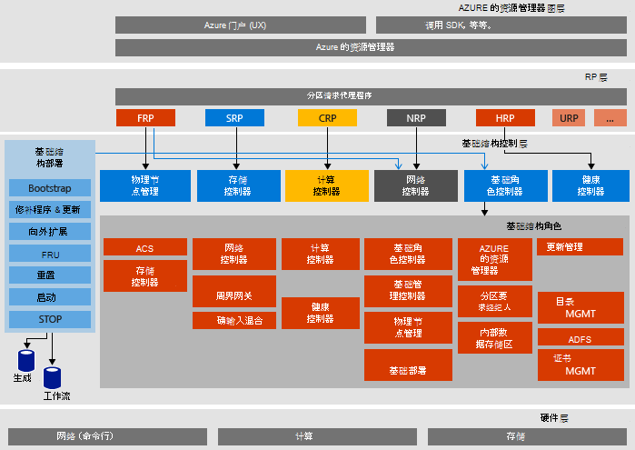

<properties
    pageTitle="Microsoft Azure 堆栈证明的概念 (POC) 体系结构 |Microsoft Azure"
    description="查看 Microsoft Azure 堆栈 POC 的体系结构。"
    services="azure-stack"
    documentationCenter=""
    authors="heathl17"
    manager="byronr"
    editor=""/>

<tags
    ms.service="azure-stack"
    ms.workload="na"
    ms.tgt_pltfrm="na"
    ms.devlang="na"
    ms.topic="article"
    ms.date="10/25/2016"
    ms.author="helaw"/>

# Microsoft Azure 堆栈 POC 的体系结构

Azure 堆栈 POC 是 Azure 堆栈技术预览 2 单节点部署。 在单个主机计算机上运行的虚拟机中安装的所有组件。 

## 逻辑体系结构关系图
下图说明了 Azure 堆栈 POC 及其组件的逻辑体系结构。

## 虚拟机的角色
Azure 堆栈 POC 提供服务的 POC 主机使用以下虚拟机︰

 - **MAS ACS01**托管堆栈 Azure 存储服务的虚拟机。

 - **MAS ADFS01**Active Directory 联合身份验证服务承载的虚拟机。  技术预览 2 中未使用此虚拟机。  

 - **MAS ASQL01** Azure 堆栈结构角色提供内部数据存储的虚拟机。  

 - **MAS BGPNAT01**作为边缘路由器的虚拟机并为 Azure 堆栈提供了 NAT 和 VPN 功能。

 - **MAS CA01**虚拟机提供的堆栈 Azure 角色服务的证书颁发机构服务。

 - **MAS CON01**有关安装 PowerShell，Visual Studio 和其他工具的开发人员可用的虚拟机。

 - **MAS DC01**虚拟机承载 Microsoft Azure 堆栈的 Active Directory、 DNS 和 DHCP 服务。

 - **MAS GWY01**提供边缘网关服务，如组织网络的 VPN 站点到站点连接的虚拟机。

 - **MAS NC01** 主持管理 Azure 堆栈网络服务的网络控制器的虚拟机。  

 - **MAS SLB01** 虚拟机提供负载平衡以承租人和 Azure 堆栈的基础结构服务的 Azure 堆栈中的服务。  

 - **MAS SUS01** 虚拟计算机承载 Windows 服务器更新服务，并负责提供更新到 Azure 堆栈的其他虚拟机。

 - **MAS WAS01** 门户和 Azure 资源管理器服务承载的虚拟机。

 - **MAS XRP01**承载的 Microsoft Azure 堆栈上，其中包括计算、 网络和存储资源提供程序的核心资源提供程序的虚拟机。

## 存储服务
存储服务中的物理主机上的操作系统包括︰

 - **ACS Blob 服务**Azure 一致存储 Blob 服务，该服务提供了斑点和表存储服务。

 - **SoFS**向外扩展文件服务器。

 - **参照 CSV**可恢复的文件系统群集共享卷。

 - **虚拟磁盘**、**存储空间**和**存储空间直接**将各自在 Windows 服务器，以使 Microsoft Azure 堆栈核心存储资源提供的基础存储技术。

## 下一步行动

[部署 Azure 堆栈](azure-stack-deploy.md)

[第一个方案尝试](azure-stack-first-scenarios.md)

