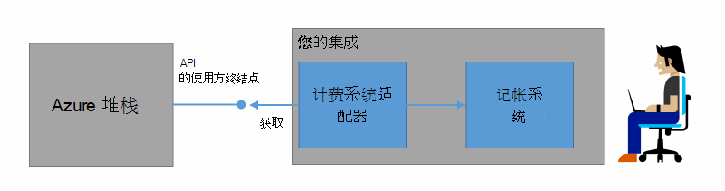
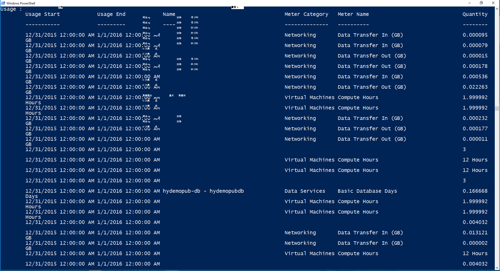

<properties
    pageTitle="客户帐单和按容量使用计费 Azure 堆栈中的 |Microsoft Azure"
    description="了解如何从 Azure 堆栈中检索资源的使用情况。"
    services="azure-stack"
    documentationCenter=""
    authors="AlfredoPizzirani"
    manager="byronr"
    editor=""/>

<tags
    ms.service="azure-stack"
    ms.workload="na"
    ms.tgt_pltfrm="na"
    ms.devlang="na"
    ms.topic="article"
    ms.date="10/18/2016"
    ms.author="alfredop"/>

# 客户帐单和 Azure 堆栈中的存储容量使用计费

既然您使用 Azure 堆栈，最好要考虑如何跟踪使用情况。 服务提供商依赖于向他们的客户，并了解提供服务的成本的使用信息。
企业中，太，通常跟踪使用情况按部门。

Azure 堆栈不计费系统。 它将不会收取您所使用的资源为租户。 但是，Azure 堆栈有基础结构来收集和聚合的每个单个资源提供程序的使用情况数据。 可以访问这些数据并将其导出到计费系统通过使用付费的适配器，或将其导出到 Microsoft 电源双像一个商业智能工具。

## 可以查找哪些使用信息，以及如何？

Azure 堆栈资源提供程序按小时为间隔生成使用记录。 记录显示每个资源的消耗，以及哪种订阅消耗的资源量。 此数据存储中。 您可以访问通过 REST API 的数据。

服务管理员可以检索所有租户订阅的使用率数据。 个别租户可以检索自己的信息。

使用记录具有信息存储、 网络和计算使用。 米的列表，请参见[这篇文章](azure-stack-usage-related-faq.md)。

## 使用信息检索

若要生成的记录，是至关重要的必须运行并正在使用的系统资源。 如果您不确定您是否具有运行任何资源，在 Azure 堆栈市场部署，然后运行虚拟机 (VM)。 查看虚拟机监视刀片式服务器以确保它正在运行。

我们建议您运行 Windows PowerShell cmdlet 以查看使用率数据。
PowerShell 调用资源使用 Api。

1.  [安装和配置 Azure PowerShell](https://azure.microsoft.com/en-us/documentation/articles/powershell-install-configure/)。

2.  若要登录到 Azure 资源管理器中，使用 PowerShell cmdlet**登录 AzureRmAccount**。

3.  若要选择用于创建资源的订阅，请键入**Get AzureRmSubscription — SubscriptionName"子"|选择 AzureRmSubscription**。

4.  若要检索数据，请使用 PowerShell cmdlet [**Get UsageAggregates**](https://msdn.microsoft.com/en-us/library/mt619285.aspx)。
    如果使用数据可用，它返回 PowerShell，如以下示例所示。 PowerShell 返回 1000 行的每次调用的使用情况。
    *延续*参数用于检索的前 1000 位以外的行集。 有关使用数据的详细信息，请参阅[资源使用 API 参考](azure-stack-provider-resource-api.md)。

    

## 下一步行动

[提供程序资源使用 API](azure-stack-provider-resource-api.md)

[组织资源使用 API](azure-stack-tenant-resource-usage-api.md)

[与使用相关的常见问题解答](azure-stack-usage-related-faq.md)
