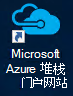
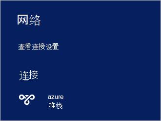

<properties
    pageTitle="连接到 Azure 堆栈 |Microsoft Azure"
    description="了解如何连接 Azure 堆栈"
    services="azure-stack"
    documentationCenter=""
    authors="ErikjeMS"
    manager="byronr"
    editor=""/>

<tags
    ms.service="azure-stack"
    ms.workload="na"
    ms.tgt_pltfrm="na"
    ms.devlang="na"
    ms.topic="get-started-article"
    ms.date="10/18/2016"
    ms.author="erikje"/>

# <a name="connect-to-azure-stack"></a>连接到 Azure 堆栈
要管理资源，您必须连接到 Azure 堆栈 POC 计算机。 您可以使用下面的连接选项之一︰

 - 远程桌面︰ 允许一个并发用户快速从 POC 计算机连接。
 - 虚拟专用网络 (VPN): 允许从 Azure 堆栈结构 （需要配置） 的外部客户端连接的多个并发用户。

## <a name="connect-with-remote-desktop"></a>使用远程桌面连接
使用远程桌面连接时，一个并发用户可以使用来管理资源的门户。 您还可以在 MAS CON01 虚拟机上使用工具。

1.  登录到 Azure 堆栈 POC 的物理计算机。

2.  打开远程桌面连接，并连接到 MA CON01。 输入**AzureStack\AzureStackAdmin**作为用户名和 Azure 堆栈安装期间提供的管理密码。  

3.  在 MAS CON01 桌面上，双击**Microsoft Azure 堆栈门户网站**图标以打开[门户网站](azure-stack-key-features.md#portal)(https://portal.azurestack.local/)。

    

4.  使用在安装过程中指定的 Azure Active Directory 凭据登录。

## <a name="connect-with-vpn"></a>使用 VPN 连接
虚拟专用网络连接允许从 Azure 堆栈结构之外的客户端连接的多个并发用户。 您可以使用门户管理哪些资源。 此外可以使用工具，例如 Visual Studio 和 PowerShell，本地客户端上。

1.  AzureRM 模块安装通过使用下面的命令︰
   
    ```PowerShell
    Install-Module -Name AzureRm -RequiredVersion 1.2.6 -Scope CurrentUser
    ```   
   
2. 下载的 Azure 堆栈工具脚本。  这些支持可以通过浏览到[GitHub 存储库](https://github.com/Azure/AzureStack-Tools)，或以管理员身份运行以下 Windows PowerShell 脚本下载文件︰
    
    >[AZURE.NOTE]  下列步骤要求 PowerShell 5.0。  要检查您的版本，请运行 $PSVersionTable.PSVersion，"长"的版本进行比较。  

    ```PowerShell
       
       #Download the tools archive
       invoke-webrequest https://github.com/Azure/AzureStack-Tools/archive/master.zip -OutFile master.zip

       #Expand the downloaded files. 
       expand-archive master.zip -DestinationPath . -Force

       #Change to the tools directory
       cd AzureStack-Tools-master
    ````

3.  在相同的 PowerShell 会话中，导航到**连接**文件夹中，并导入 AzureStack.Connect.psm1 模块︰

    ```PowerShell
    cd Connect
    import-module .\AzureStack.Connect.psm1
    ```

4.  若要创建 Azure 堆栈 VPN 连接，请运行下面的 Windows PowerShell。 在运行之前填充的管理员密码和 Azure 堆栈主机地址域。 
    
    ```PowerShell
    #Change the IP Address below to match your Azure Stack host
    $hostIP = "<HostIP>"

    # Change password below to reference the password provided for administrator during Azure Stack installation
    $Password = ConvertTo-SecureString "<Admin Password>" -AsPlainText -Force

    # Add Azure Stack One Node host & CA to the trusted hosts on your client computer
    Set-Item wsman:\localhost\Client\TrustedHosts -Value $hostIP -Concatenate
    Set-Item wsman:\localhost\Client\TrustedHosts -Value mas-ca01.azurestack.local -Concatenate  

    # Update Azure Stack host address to be the IP Address of the Azure Stack POC Host
    $natIp = Get-AzureStackNatServerAddress -HostComputer $hostIP -Password $Password

    # Create VPN connection entry for the current user
    Add-AzureStackVpnConnection -ServerAddress $natIp -Password $Password

    # Connect to the Azure Stack instance. This command (or the GUI steps in step 5) can be used to reconnect
    Connect-AzureStackVpn -Password $Password 
    ```

5. 出现提示时，请信任 Azure 栈主机。

6. 出现提示时，安装的证书 （Powershell 会话窗口的背后显示提示）。

7. 要测试该门户连接 Internet 浏览器中，导航到*https://portal.azurestack.local*。

8. 要查看和管理 Azure 堆栈连接，请在客户机上使用**网络**︰

    

>[AZURE.NOTE] 此 VPN 连接不提供对虚拟机或其他资源的连接。 资源的连接的信息，请参阅[一个节点 VPN 连接](azure-stack-create-vpn-connection-one-node-tp2.md)


## <a name="next-steps"></a>下一步行动
[第一个任务](azure-stack-first-scenarios.md)

[安装并使用 PowerShell 连接](azure-stack-connect-powershell.md)

[安装和使用 CLI 连接](azure-stack-connect-cli.md)


