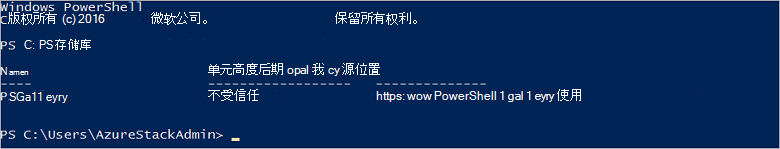

<properties
    pageTitle="连接到使用 PowerShell Azure 堆栈 |Microsoft Azure"
    description="了解如何管理使用 PowerShell Azure 堆栈"
    services="azure-stack"
    documentationCenter=""
    authors="HeathL17"
    manager="byronr"
    editor=""/>

<tags
    ms.service="azure-stack"
    ms.workload="na"
    ms.tgt_pltfrm="na"
    ms.devlang="na"
    ms.topic="article"
    ms.date="10/19/2016"
    ms.author="helaw"/>

# 安装 PowerShell 并连接到 Azure 堆栈
在本指南中，我们将步行通过连接到 Azure 堆栈，使用 PowerShell 的步骤。 完成后，这些步骤还可以帮助您管理和部署资源。

## 安装 Azure 堆栈 PowerShell cmdlet

1.  从 PowerShell 库安装 AzureRM cmdlet。 要开始，请打开在 MAS CON01 PowerShell 控制台，并运行下面的命令来返回可用 PowerShell 资料库的列表︰

        Get-PSRepository

      

2.  运行以下命令以安装 AzureRM 模块︰

        Install-Module -Name AzureRM -RequiredVersion 1.2.6 -Scope CurrentUser

    >[AZURE.NOTE] *-范围 CurrentUser*是可选的。 如果要多于当前用户有权访问模块，使用提升权限的命令提示符并离开*作用域*参数。

3.  若要确认安装的 AzureRM 模块，执行以下命令︰

        Get-Command -Module AzureRM.AzureStackAdmin

## 连接到 Azure 堆栈
模块是可用于处理配置到 Azure 堆栈 PowerShell 连接，为您的下载。  请[Azure 堆栈工具](http://aka.ms/ConnectToAzureStackPS)访问模块和附加步骤。 

## 检索订阅列表
在本节中，您验证 PowerShell cmdlet 正在对 Azure 堆栈通过检索和选择使用的预订。

运行以下命令来检索与您的帐户相关联的 Azure 堆栈订阅的列表︰

    Get-AzureRmSubscription

## 下一步行动
[部署使用 PowerShell 的模板](azure-stack-deploy-template-powershell.md)

[使用 Azure CLI 连接](azure-stack-connect-cli.md)

[部署与 Visual Studio 模板](azure-stack-deploy-template-visual-studio.md)

