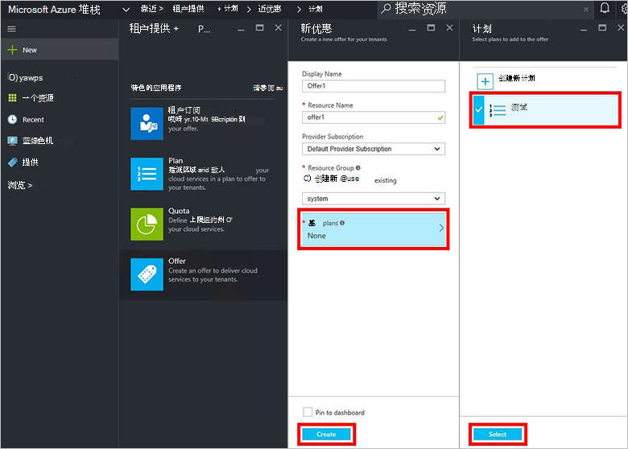

<properties
    pageTitle="在 Azure 堆栈中创建报价 |Microsoft Azure"
    description="作为服务管理员，了解如何为您承租人 Azure 堆栈中创建报价。"
    services="azure-stack"
    documentationCenter=""
    authors="ErikjeMS"
    manager="byronr"
    editor=""/>

<tags
    ms.service="azure-stack"
    ms.workload="na"
    ms.tgt_pltfrm="na"
    ms.devlang="na"
    ms.topic="get-started-article"
    ms.date="09/26/2016"
    ms.author="erikje"/>

# 在 Azure 堆栈中创建报价

[提供](azure-stack-key-features.md#services-plans-offers-and-subscriptions)的组的一个或多个提供程序向承租人购买或订阅的计划。 本文档演示如何创建包含[您创建的计划](azure-stack-create-plan.md)的最后一步中的提供。 这项优惠使订阅者能够提供虚拟机。

1.  到门户网站以服务管理员的身份[登录](azure-stack-connect-azure-stack.md#log-in-as-a-service-administrator)，然后单击**新建** > **租户提供 + 计划** > **提供**。
    

2.  在**新提供**刀片式服务器，填入**显示名称**和**资源名称**，然后选择新的或现有的**资源组**。 显示名称是优惠的友好名称。 只有管理员可以看到资源名称。 它是管理员使用处理作为 Azure 资源管理器资源提供名称。

    

3.  单击**基本计划**，在**规划**刀片式服务器，选择要在此项优惠活动，包括的计划，然后单击**选择**。 单击**创建**以创建此项优惠活动。

    
    
4. 单击**提供**，然后单击您刚刚创建的报价。

    

5.  单击**更改状态**，然后单击**公用**。
  
    

必须成为公共的承租人，以获取完整的视图在订阅时提供。 可提供︰

- **公共**︰ 对承租人可见。

- **专用**︰ 只有服务管理员可以看到。 有用而起草的计划或服务，或者如果服务管理员想要批准的每个预订。

- **已取消**︰ 到新的订阅服务器已关闭。 服务管理员可以使用已停止使用，以防止未来的预订，但保留当前的订阅服务器不变。

对提议的更改没有立即对租户可见。 若要查看所做的更改，您可能必须注销/登录以查看在"订阅器"的新订阅时创建资源/资源组。

## 下一步行动

[优惠订阅，并且设置虚拟机](azure-stack-subscribe-plan-provision-vm.md)
