<properties
    pageTitle="在 Azure 堆栈中创建计划 |Microsoft Azure"
    description="服务管理员，创建一个允许订阅服务器提供虚拟机的计划。"
    services="azure-stack"
    documentationCenter=""
    authors="ErikjeMS"
    manager="byronr"
    editor=""/>

<tags
    ms.service="azure-stack"
    ms.workload="na"
    ms.tgt_pltfrm="na"
    ms.devlang="na"
    ms.topic="get-started-article"
    ms.date="09/26/2016"
    ms.author="erikje"/>

# 在 Azure 堆栈中创建一个计划

[计划](azure-stack-key-features.md#services-plans-offers-and-subscriptions)是分组的一个或多个服务。 作为一个提供程序，您可以创建计划能够为您的租户。 反过来，您提供要使用的计划和服务，其中包括订阅您的租户。 本示例演示了如何创建计划，其中包括计算、 网络和存储资源提供程序。 此计划使订阅者能够提供虚拟机。

1.  在 internet 浏览器中，导航到 https://portal.azurestack.local。

2.  到 Azure 堆栈门户以服务管理员的身份[登录](azure-stack-connect-azure-stack.md#log-in-as-a-service-administrator)并输入您的服务管理员凭据 （过程[运行 PowerShell 脚本](azure-stack-run-powershell-script.md)部分的第 5 步中创建的帐户），然后单击**登录**。

    服务管理员可以创建产品和计划，并管理用户。

3.  单击**新建**以创建计划和承租人可以订阅的服务， > **租户提供 + 计划** > **计划**。

    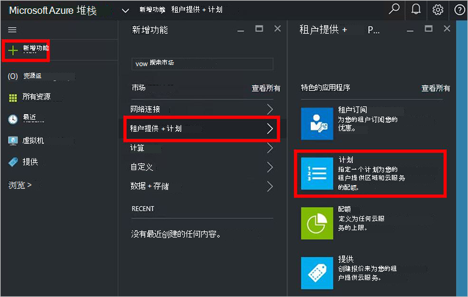

4.  在**新计划**刀片式服务器，填入**显示名称**和**资源名称**。 显示名称是承租人看到计划的友好名称。 只有管理员可以看到资源名称。 它是管理员用来处理作为 Azure 资源管理器资源的计划的名称。

    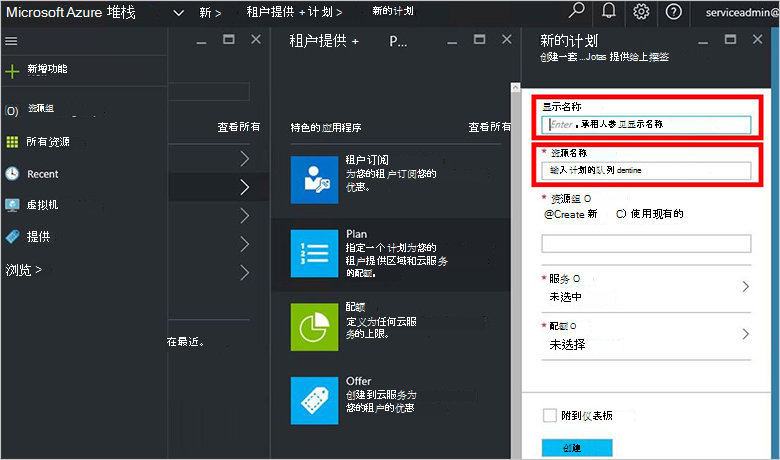

5.  创建新的**资源组**，或选择一个现有的容器 (例如"OffersAndPlans") 的计划

    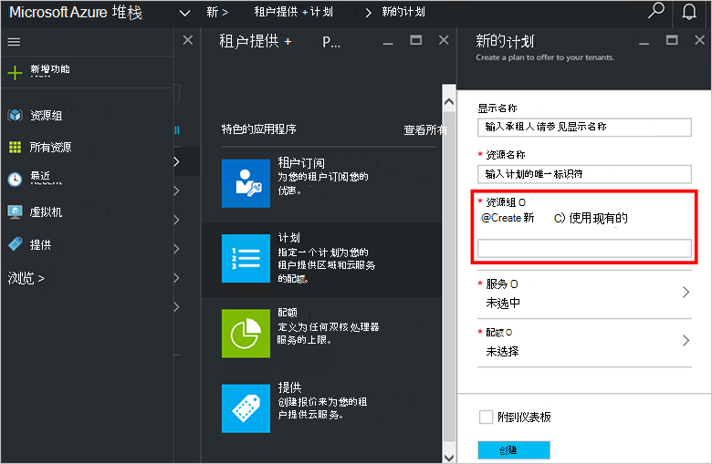

6.  单击**服务**、 **Microsoft.Compute**、 **Microsoft.Network**和**Microsoft.Storage**，选择，然后单击**选择**。

    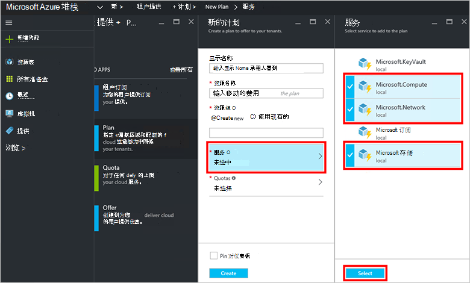

7.  单击**配额**，请单击**Microsoft.Storage （本地）**，然后选择默认配额或单击**创建新的配额**进行自定义配额。

    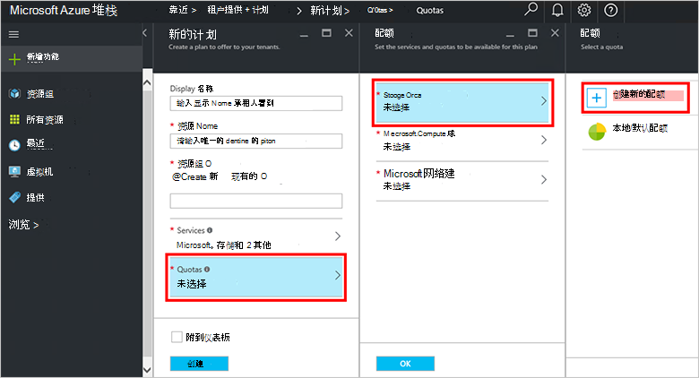

8.  键入的名称配额**配额设置**设置配额值并单击**确定**，和，然后单击**创建**。

    

9. 单击**Microsoft.Network （本地）**，然后选择默认配额，或单击**创建新的配额**进行自定义配额。

    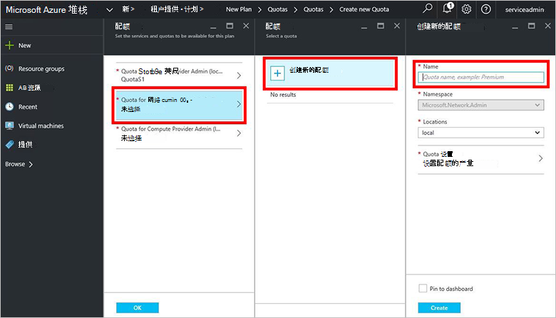

10. 键入的名称配额**配额设置**设置配额值并单击**确定**，和，然后单击**创建**。

    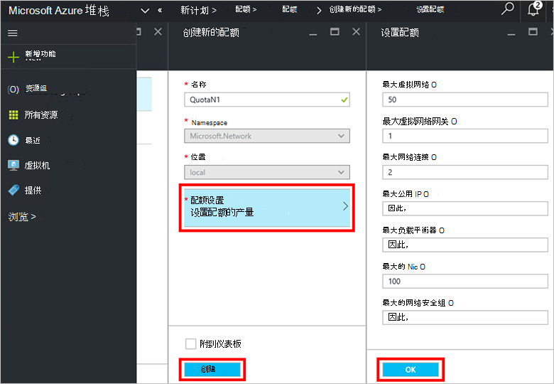

11. 单击**Microsoft.Compute （本地）**，然后选择默认配额，或单击**创建新的配额**进行自定义配额。

    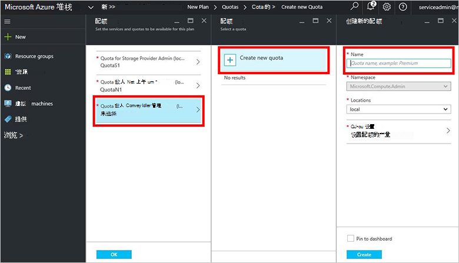

12.  键入的名称配额**配额设置**设置配额值并单击**确定**，和，然后单击**创建**。

    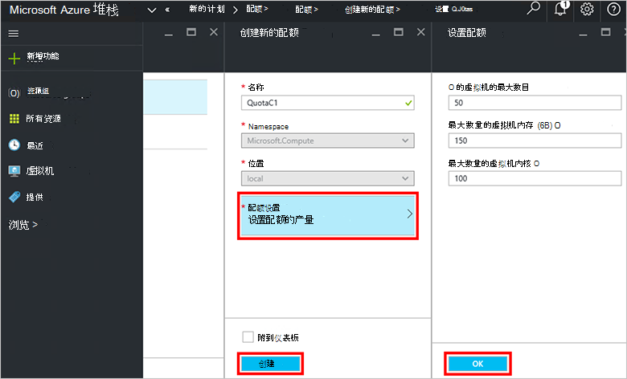

13. 在**配额**刀片式服务器，单击**确定**，然后在**新计划**刀片式服务器，单击**创建**创建计划。

    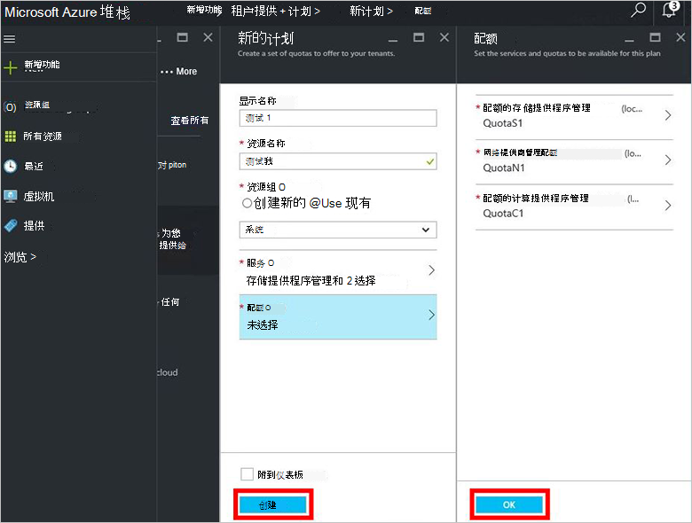

14. 若要查看您的新计划，单击**所有资源**，然后搜索的计划并单击其名称。

    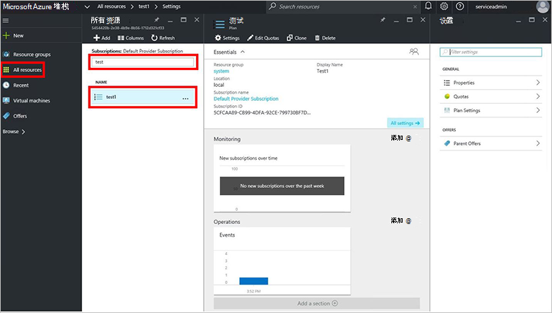

## 下一步行动

[创建报价](azure-stack-create-offer.md)
