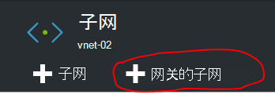

<properties
    pageTitle="创建两个虚拟网络中不同的 Azure 堆栈 PoC 环境之间的站点到站点 VPN 连接 |Microsoft Azure"
    description="将允许云管理员创建两个单节点 POC TP2 环境之间的站点到站点 VPN 连接的分步过程。"
    services="azure-stack"
    documentationCenter=""
    authors="ScottNapolitan"
    manager="darmour"
    editor=""/>

<tags
    ms.service="azure-stack"
    ms.workload="na"
    ms.tgt_pltfrm="na"
    ms.devlang="na"
    ms.topic="get-started-article"
    ms.date="09/26/2016"
    ms.author="scottnap"/>

# 创建两个虚拟网络中不同的 Azure 堆栈 PoC 环境之间的站点到站点 VPN 连接

## 概述

这篇文章将引导您完成创建两种单独的 Azure 堆栈的概念验证 (POC) 环境中的两个虚拟网络之间的站点到站点 VPN 连接的步骤。 这样做的目的是帮助人评估站点的网关了解如何设置在两个不同的 Azure 堆栈部署的虚拟网络间的 VPN 连接。  在这样做的过程中您将了解 VPN 网关在 Azure 堆栈中的工作方式。

>[AZURE.NOTE] 本文专门对 Azure 堆栈 TP2 POC。

### 连接图

下面是显示了当我们正在做我们的配置应该类似图。

### 在开始之前

若要完成此配置，您需要以下各项因此开始之前，确保您有这些事情。

-   符合定义的[Azure 堆栈部署系统必备组件](azure-stack-deploy.md)，Azure 堆栈 POC 的硬件要求和由该文档定义的其他系统必备的两个服务器。

-   Azure 堆栈技术预览 2 部署包。

## 部署的 POC 环境

将部署两种 Azure 堆栈 POC 环境，若要完成此配置。

-   对于每个部署的 POC，您只需按照[部署 Azure 堆栈 POC](azure-stack-run-powershell-script.md)文章中详细描述的部署指导。
    我们将把一般情况下为 POC1 和 POC2 本文档中每个 POC 的环境。

## 针对计算、 网络和存储配置配额

您需要计算、 网络和存储配置配额，以便这些服务可以与一个计划关联，然后承租人提供可以订阅。

>[AZURE.NOTE] 您需要执行下列步骤为每个 Azure 堆栈 POC 环境。

TP1 从已创建的服务配额的经验。 如何在 TP2 创建配额的步骤可以位于<http://aka.ms/mas-create-quotas>。 您可以接受此练习的所有配额设置的默认值。

## 创建计划和优惠

[计划](azure-stack-key-features.md)是分组的一个或多个服务。 作为一个提供程序，您可以创建计划能够为您的租户。 反过来，您提供要使用的计划和服务，其中包括订阅您的租户。

>[AZURE.NOTE] 您将需要为每个 Azure 堆栈 POC 环境中执行这些步骤。

1.  首先创建一个计划。 若要执行此操作，您可以按照[创建计划](azure-stack-create-plan.md)在线文章中的步骤。

2.  创建报价[创建 Azure 堆栈中提议](azure-stack-create-offer.md)中所述的步骤。

3.  登录到门户作为租户管理员和 [订阅到您创建的报价] (azure 的堆栈-订阅-计划-设置-vm.md。

## 在 POC 1 中创建的网络资源

现在我们将以实际创建我们需要我们的配置设置的资源。 以下步骤说明了我们将会做什么。 这些说明将显示如何创建资源通过门户网站，但可以通过 PowerShell 实现相同的操作。

### 以承租人身份登录

作为测试计划、 服务和订阅，可以使用其承租人租户，服务管理员可以登录。 如果您没有[创建一个租户帐户](azure-stack-add-new-user-aad.md)登录之前的一个。

### 创建虚拟网络和虚拟机的子网

1.  使用一个租户的帐户登录。

2.  在 Azure 的门户中，请单击**新建**图标。

     
3.  从市场上菜单中选择**网络**。

4.  单击菜单上的**虚拟网络**项目。

5.  单击**创建**按钮底部的资源描述刀片式服务器。 根据此表的相应字段中输入下面的值。

  	| **字段**             | **值** |
  	|----------------------- | ------ |
  	| 名称                  |vnet-01 |
  	| 地址空间         | 10.0.10.0/23 |
  	| 子网名称           | 子网-01 |
  	| 子网的地址范围  | 10.0.10.0/24 |

6.  您应该看到前面**订阅**字段中填充创建的订阅。

7.  资源组，可以创建新的资源组，或如果您已经拥有一个，选择使用现有的。

8.  验证的默认位置。

9.  单击**创建**按钮。

### 创建网关网

1.  打开您刚从仪表板创建 (Vnet-01) 的虚拟网络资源。

2.  在设置刀片式服务器，选择子网

3.  单击要添加到虚拟网络的网关网**网关的子网**按钮。

     
4.  默认情况下，子网的名称设置为**GatewaySubnet** 。
    网关的子网是特殊，必须具有该特定名称才能正常工作。

5.  在**地址范围**字段中，输入**10.0.11.0/24**。

6.  单击**创建**按钮创建网关网。

### 创建虚拟网络网关

1.  在 Azure 的门户中，请单击**新建**图标。

    

2.  从市场上菜单中选择**网络**。

3.  从网络资源的列表中选择**虚拟网络网关**。

4.  查看说明，然后单击**创建**。

5.  在**名称**字段中键入**GW1**。

6.  单击以选择一个虚拟网络的**虚拟网络**项目。
    从列表中选择**Vnet-01** 。

7.  单击**公用 IP 地址**菜单项。 选择公用 IP 地址刀片式服务器打开时单击创建新按钮上。

8.  在**名称**字段中，输入**GW1 PiP**然后单击**Ok。**

9.  **网关类型**应具有默认选中的**VPN** 。 请保留此设置。

10. 该**VPN 类型**应具有**基于路由的**默认选中的。
    请保留此设置。

11. 验证**订阅**和**位置**是否正确。 如果您愿意的话可以收回到仪表板的资源。 单击**创建**。

### 创建本地网关

本地网关的资源就在我们的方案有点儿奇怪。
它是在 Azure，可以找到相同的资源，但是在 Azure 它通常应表示物理、 后端设备可用于连接到 Azure 中的虚拟网络网关。 在我们的示例中，连接的两端都实际虚拟网络网关 ！

一种方式思考一下这个更广义始终本地网关资源旨在表明在连接的另一端的远程网关。 由于 POC 的设计的方式，我们实际上需要本地网关的公用 IP 地址的其他 POC NAT VM 上提供外部网络适配器的地址。 然后，我们将创建 NAT 映射 NAT VM 以确保正确连接两个端点上。

### 获取外部的 NAT VM 适配器的 IP 地址

1.  POC2 为登录到 Azure 堆栈的物理计算机。

2.  [Windows 键] + R 键打开**运行**菜单，然后键入**mstsc**并点击输入。

3.  在**计算机**字段中输入**MA BGPNAT01**的名称并单击**连接**按钮。

4.  单击开始菜单，PowerShell 右击并选择**以管理员身份运行**。

5.  类型**IPConfig /all**。

6.  查找连接到后端网络，以太网适配器和绑定到该适配器的 IPv4 地址记下。 在我的环境中，是**10.16.167.195** ，但您的服务器会使用不同的地方。

7.  记录此地址。 这是我们将使用我们在 POC1 中创建的本地网络网关资源的公共 IP 地址。

### 创建本地网络网关资源

1.  POC1 为登录到 Azure 堆栈的物理计算机。

2.  在**计算机**字段中，输入**MA CON01**的名称，然后单击**连接**按钮。

3.  在 Azure 的门户中，请单击**新建**图标。

    

4.  从市场上菜单中选择**网络**。

5.  从资源的列表中选择**本地网关**。

6.  在**名称**字段中输入**POC2 网关**。

7.  我们不知道我们其他网关的 IP 地址，但这确定是因为我们可以回来并在以后更改它。 现在，在**IP 地址字段**中输入**10.16.167.195** 。

8.  在**地址空间**字段中输入我们将创建在 POC2 Vnet 的地址空间。 这将**10.0.20.0/23**所以输入该值。

9.  请验证您的**订购**、**资源组**和**位置**都正确，然后单击**创建**。

### 创建连接

1.  在 Azure 的门户中，请单击**新建**图标。

     

2.  从市场上菜单中选择**网络**。

3.  从资源的列表中选择**连接**。

4.  在**基本**设置刀片式服务器，作为**连接类型**中选择**站点到站点 (IPSec)** 。

5.  选择**订购**、**资源组**和**位置**，然后单击**确定**。

6.  在**设置**刀片式服务器，选择**虚拟网络网关**(**GW1**) 之前创建。

7.  选择**本地****网关**(**POC2 GW**) 之前创建。

8.  在**连接名称**字段中，输入**POC1 POC2**。

9.  在**共享密钥 (PSK)**字段中输入**12345**。 单击**确定**。

### 创建虚拟机

为了验证通过 VPN 连接传送的数据，您需要发送和接收数据中每个 POC 的虚拟机。 我们现在在 POC1 中创建虚拟机并将其置于我们我们虚拟网络中的虚拟机网。

1. 在 Azure 的门户中，请单击 **新建**图标。

     

2.  从市场上菜单中选择**虚拟机**。

3.  在虚拟机映像列表中，选择**Windows Server 2012 R2 数据中心**图像。

4.  **基础知识**刀片式服务器，在**名称**字段中输入的值**VM01**。

5.  请输入有效的用户名和密码。 您将使用此帐户登录到虚拟机之后创建它。

6.  提供**订购**、**资源组**和**位置**，然后单击**确定**。

7.  在**大小**刀片式服务器，选择此实例的虚拟机大小，然后单击**选择**。

8.  设置刀片式服务器，您可以接受默认值，只需确保，选择虚拟网络是**VNET-01** ，子网设置为**10.0.10.0/24**。 单击**确定**。

9.  查看**摘要**刀片式服务器上的设置，然后单击**确定**。

## 在 POC 2 中创建的网络资源

### 以承租人身份登录

作为测试计划、 服务和订阅，可以使用其承租人租户，服务管理员可以登录。 如果您没有[创建一个租户帐户](azure-stack-add-new-user-aad.md)登录之前的一个。

### 创建虚拟网络和虚拟机的子网

1. 使用一个租户的帐户登录。

2. 在 Azure 的门户中，请单击 **新建**图标。

     

3.  从市场上菜单中选择**网络**。

4.  单击菜单上的**虚拟网络**项目。

5.  单击**创建**按钮底部的资源描述刀片式服务器。 在下表中列出的相应字段中输入下面的值。

  	|**字段**              |**值** |
  	| ----------------------|----------|
  	| 名称                  | vnet-02 |
  	| 地址空间         | 10.0.20.0/23 |
  	| 子网名称           | 子网-02 |
  	| 子网的地址范围  | 10.0.20.0/24 |

6.  您应该看到前面**订阅**字段中填充创建的订阅。

7.  资源组，可以创建新的资源组，或如果您已经拥有一个，选择使用现有的。

8.  验证的默认**位置**。 如果需要，您可以锁定到仪表板，方便用户的虚拟网络。

9.  单击**创建**按钮。

### 创建网关网

1.  打开数字仪表板创建 (**Vnet-02**) 的虚拟网络资源。

2.  在**设置**刀片式服务器，选择**网。**

3.  单击要添加到虚拟网络的网关网**网关的子网**按钮。

     

4.  默认情况下，子网的名称设置为**GatewaySubnet** 。
    网关的子网是特殊，必须具有该特定名称才能正常工作。

5.  在**地址范围**字段中，输入**10.0.20.0/24**。

6.  单击**创建**按钮创建网关网。

### 创建虚拟网络网关

1. 在 Azure 的门户中，请单击 **新建**图标。

     

2.  从市场上菜单中选择**网络**。

3.  从网络资源的列表中选择**虚拟网络网关**。

4.  查看说明，然后单击**创建**。

5.  在**名称**字段中键入**GW2**。

6.  单击以选择一个虚拟网络的**虚拟网络**项目。
    从列表中选择**Vnet-02** 。

7.  单击**公用 IP 地址**菜单项。 选择公用 IP 地址刀片式服务器打开时单击创建新按钮上。

8.  在**名称**字段中，输入**GW2 PiP**然后单击**Ok。**

9.  **网关类型**应具有默认选中的**VPN** 。 请保留此设置。

10. 该**VPN 类型**应具有**基于路由的**默认选中的。
    请保留此设置。

11. 验证**订阅**和**位置**是否正确。 如果您愿意的话可以收回到仪表板的资源。 单击**创建**。

### 创建本地网关

#### 获取外部的 NAT VM 适配器的 IP 地址

1.  POC1 为登录到 Azure 堆栈的物理计算机。

2.  按并按住 [Windows 键] + R 键打开**运行**菜单，然后键入**mstsc**并点击输入。

3.  在**计算机**字段中输入**MA BGPNAT01**的名称并单击**连接**按钮。

4.  在开始菜单上单击和 PowerShell 右击并选择**以管理员身份运行**。

5.  类型**IPConfig /all**。

6.  查找连接到后端网络，以太网适配器和绑定到该适配器的 IPv4 地址记下。 在我的环境是**10.16.169.131** ，但您的服务器会使用不同的地方。

7.  记录此地址。 这是什么我们将稍后使用作为我们在 POC1 中创建本地网关资源的公共 IP 地址。

#### 创建本地网络网关资源

1.  POC2 为登录到 Azure 堆栈的物理计算机。

2.  在**计算机**字段中输入**MA CON01**的名称并单击**连接**按钮。

3. 在 Azure 的门户中，请单击**新建**图标。

     

4.  从市场上菜单中选择**网络**。

5.  从资源的列表中选择**本地网关**。

6.  在**名称**字段中输入**POC1 网关**。

7.  现在我们需要我们记录公用 IP 地址 POC1 中的虚拟网络网关。 在**IP 地址字段**中输入**10.16.169.131** 。

8.  在**地址空间**字段中输入 POC1- **10.0.0.0/16** **Vnet-01**的地址空间。

9.  请验证您的**订购**、**资源组**和**位置**都正确，然后单击**创建**。

## 创建连接

1. 在 Azure 的门户中，请单击 **新建**图标。

     

2.  从市场上菜单中选择**网络**。

3.  从资源的列表中选择**连接**。

4.  在**基本**设置刀片式服务器，作为**连接类型**中选择**站点到站点 (IPSec)** 。

5.  选择**订购**、**资源组**和**位置**，然后单击**确定**。

6.  在**设置**刀片式服务器，选择**虚拟网络网关**(**GW1**) 之前创建。

7.  选择**本地****网关**(**POC1 GW**) 之前创建。

8.  在**连接名称**字段中，输入**POC2 POC1**。

9.  在**共享密钥 (PSK)**字段中输入**12345**。 如果您选择一个不同的值时，请记住，它必须符合 POC1 中指定的共享密钥的值。 单击**确定**。

## 创建虚拟机

现在在 POC1 中创建虚拟机并将其置于我们我们虚拟网络中的虚拟机网。

1.  在 Azure 的门户中，请单击**新建**图标。

     

2.  从市场上菜单中选择**虚拟机**。

3.  在虚拟机映像列表中，选择**Windows Server 2012 R2 数据中心**图像。

4.  **基础知识**刀片式服务器，在**名称**字段中输入的值**VM02**。

5.  请输入有效的用户名和密码。 您将使用此帐户登录到虚拟机之后创建它。

6.  提供**订购**、**资源组**和**位置**，然后单击**确定**。

7.  在**大小**刀片式服务器，选择此实例的虚拟机大小，然后单击**选择**。

8.  设置刀片式服务器，您可以接受默认值，只需确保，选择虚拟网络是**VNET-02** ，子网设置为**20.0.0.0/24**。 单击**确定**。

9.  查看**摘要**刀片式服务器上的设置，然后单击**确定**。

## 配置为网关遍历每个 POC 中的 NAT VM

由于 POC 被设计为独立且独立于在其部署的物理主机的网络，"外部"VIP 网络网关连接到的不是实际上外部，但改为执行网络地址转换 (NAT) 路由器背后隐藏。 路由器是实际上一个 Windows 服务器的虚拟机 (**MA BGPNAT01**) POC 基础架构中运行路由和远程 Access Services (RRAS) 角色。 我们需要在 MAS BGPNAT01 虚拟机以允许站点到站点 VPN 连接两端连接上配置 NAT。

>[AZURE.NOTE] 此配置是只 POC 环境所需要的。

### 配置 NAT

您需要按照以下两个 POC 的环境中。

1.  POC1 为登录到 Azure 堆栈的物理计算机。

2.  按并按住 [Windows 键] + R 键打开**运行**菜单，然后键入**mstsc**并点击输入。

3.  在**计算机**字段中输入**MA BGPNAT01**的名称并单击**连接**按钮。

4.  在开始菜单上单击和 PowerShell 右击并选择**以管理员身份运行**。

5.  类型**IPConfig /all**。

6.  查找连接到后端网络，以太网适配器和绑定到该适配器的 IPv4 地址记下。 在我的环境中， **10.16.169.131** （以下面的红色圆圈），但您的服务器会使用不同的地方。

     

7.  输入以下 PowerShell 命令到指定的端口的外部 NAT 地址 IKE 身份验证。 请记住要将 IP 地址更改为匹配您的环境。

        Add-NetNatExternalAddress -NatName BGPNAT -IPAddress 10.16.169.131 PortStart 499 -PortEnd 501

8. 接下来，我们将创建一个静态 NAT 映射外部地址映射到网关公用 IP 地址映射为 IPSEC 隧道的第 1 阶段的 ISAKMP 端口 500。

        Add-NetNatStaticMapping -NatName BGPNAT -Protocol UDP -ExternalIPAddress 10.16.169.131 -InternalIPAddress 192.168.102.1 -ExternalPort 500 -InternalPort 500

9.  最后，我们需要做 NAT 遍历它使用端口 4500 成功通过 NAT 设备中建立完整的 IPEC 隧道。

         Add-NetNatStaticMapping -NatName BGPNAT -Protocol UDP -ExternalIPAddress 10.16.169.131 -InternalIPAddress 192.168.102.1 -ExternalPort 4500 -InternalPort 4500

10.  重复步骤 1-9 中 POC2。

## 测试连接

现在，我们应该验证已建立的站点对站点连接，我们可以流经该通信量。 此任务非常简单，因为它只涉及到我们在这两种 POC 环境中创建虚拟机的一个登录和执行 ping 命令我们在其他环境中创建虚拟机。 若要确保，我们将放流量通过站点到站点连接，我们希望确保我们 ping 远程子网上，不 VIP VM 的直接 IP (DIP) 地址。 要做到这一点，我们需要找出另一端的连接地址。

### 登录到组织中 POC1 的虚拟机

1.  对于 POC1，登录到 Azure 堆栈物理计算机并登录到门户使用租户帐户中。

3.  单击左侧的导航栏中的**虚拟机**图标。

4.  查找您创建的虚拟机列表中较早的**VM01** ，然后单击它。

5. 为该虚拟机刀片上单击**连接**。

     

6.  打开命令提示符，从内部的虚拟机和类型**IPConfig /all**。

7.  在输出中查找的**IPv4 地址**，请记下它。 这是您将从 POC2 ping 的地址。 在此环境下，该地址是**10.0.10.4**，但您的环境中可能会有所不同。 但是，它应范围内以前创建的**10.0.10.0/24**子网。

### 登录到组织中 POC2 的虚拟机

1.  登录到 Azure 堆栈物理计算机 POC2 和登录到门户使用租户帐户。

3.  单击左侧的导航栏中的**虚拟机**图标。

4.  查找您创建的虚拟机列表中较早的**VM02** ，然后单击它。

5.  为该虚拟机刀片上单击**连接**。

     

6.  打开命令提示符，从内部的虚拟机和类型**IPConfig /all**。

7.  您应该看到落在 10.0.20.0/24 的 IPv4 地址。 在我的测试实验室，该地址是 10.0.20.4，但您可能会有所不同。

8.  现在从虚拟机在 POC2 中我们想要通过隧道 ping POC1，在 VM。 为此我们 ping 我们从 VM01 开始记录 DIP。
    这在我的实验室中是 10.0.10.4，但一定要 ping 您在您的实验室中找到的地址。 您应该看到如下所示的结果。

     

9.  从远程虚拟机回复指示测试成功 ！ 您可以关闭虚拟机连接窗口或者，如果您愿意，请尝试执行一些其他数据传输来测试您的连接 （如文件副本）。

### 查看数据传输通过网关连接的统计信息

如果您想要知道有多少数据传递到您的站点到站点连接，此信息可用于连接刀片式服务器。 该测试也是另一个好的方法来验证您发送 ping 实际经历的 VPN 连接。

1.  虽然仍然登录到**ClientVM** POC2，登录到**Microsoft Azure 堆栈 POC 门户**使用您组织的帐户中。

2.  单击**浏览**菜单项，然后选择**连接**。

3.  单击列表中的**POC2 POC1**连接。

4.  在连接刀片式服务器，您可以看到中的数据，数据出统计信息。 在下面的图片可以看到比只 ping 一些较大的数值会考虑的。 这是因为我们做一些的文件传输。 您应该看到一些非零值。

     
