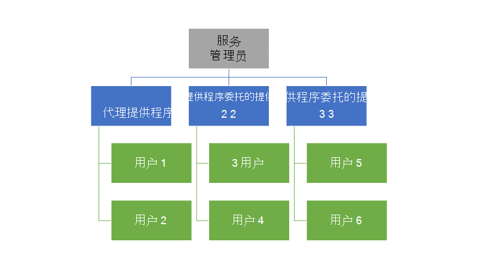
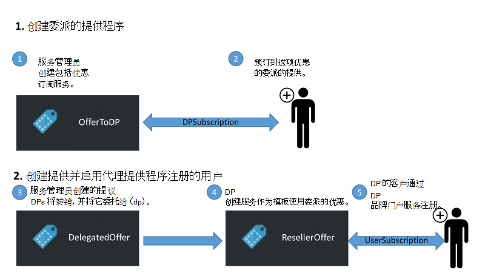
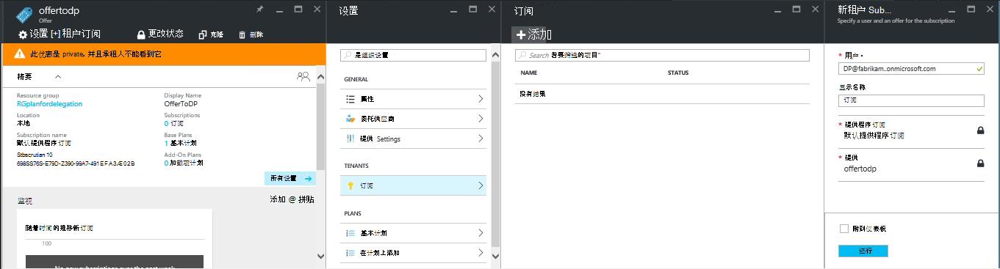
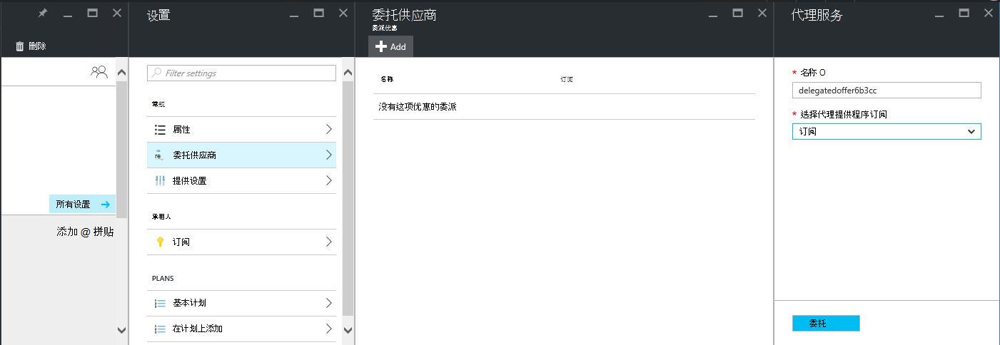
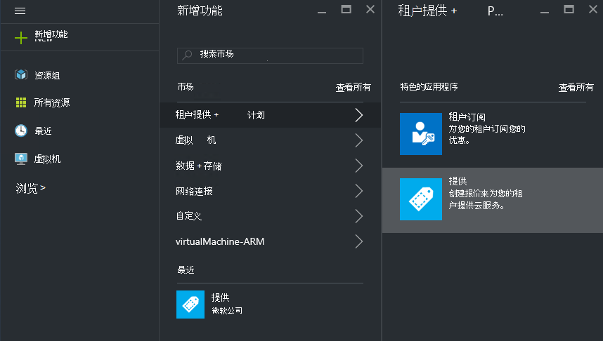
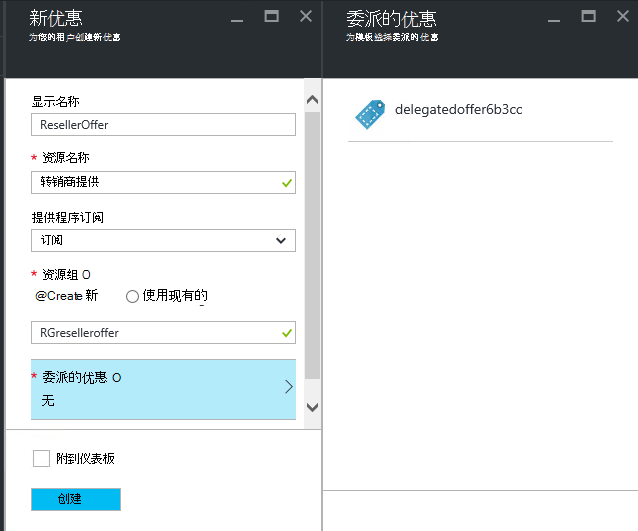
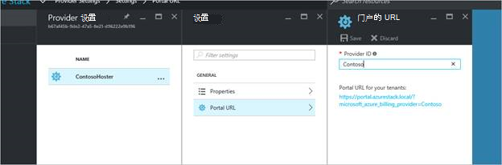
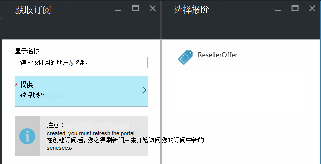

<properties
    pageTitle="委派 Azure 堆栈中的提供 |Microsoft Azure"
    description="了解如何将负责提供创建和注册用户的其他人。"
    services="azure-stack"
    documentationCenter=""
    authors="AlfredoPizzirani"
    manager="byronr"
    editor=""/>

<tags
    ms.service="azure-stack"
    ms.workload="na"
    ms.tgt_pltfrm="na"
    ms.devlang="na"
    ms.topic="article"
    ms.date="10/07/2016"
    ms.author="alfredop"/>

#委派 Azure 堆栈中提供

作为服务管理员，通常希望将负责提供创建和注册用户的其他人。 例如，这可能发生如果您是服务提供商并希望转销商注册客户，并以您的名义下对其进行管理。 它也可以发生在一个企业，如果您是中央 IT 组的一部分，需要部门或分支机构注册用户，而无需您的干预。

委派可以帮助您完成这些任务，从而帮助您访问和管理多个用户不能够直接进行。 下面的插图显示一个级别的委派，但 Azure 堆栈支持多个级别。 委派的提供程序可以反过来将委托给其他供应商，多达 5 层。

管理员可以委托的服务创建和承租人对其他用户通过使用委派功能。

##角色和委派中的步骤

若要了解委派，请记住，所涉及的三个角色︰

-   **服务管理员**管理 Azure 堆栈结构创建服务模板，并将委托他人向其用户提供它。

-   委派的用户称为**委托提供程序**。 他们可以属于其他部门 （如其他 Azure Active Directory 承租人）。

-   **用户**注册服务，并使用它们管理其工作量、 创建虚拟机、 存储数据，等等。

下图中所示，有两个步骤中设置委派。

1.  确定代理提供程序。 执行此操作通过订阅它们提供基于包含只是订阅服务的计划。
    这项优惠订阅的用户获取某些服务管理员的功能，包括扩展优惠和签署为它们的用户的能力。

2.  委托给代理提供程序提供。 这项优惠作为代理提供程序可提供的模板。 委派的提供商现在就可以采取此项优惠活动，为其选择名称 （但不是能更改其服务和配额），并提供给客户。

要作为代理提供程序，用户需要建立关系，与主要的提供者;换句话说，他们需要创建订阅。 在这种情况下，此订阅标识为有权代表的主要提供商存在优惠的委派的提供。

建立这种关系后，系统管理员可以将提供委托给代理提供程序。 委派的提供商现在就可以采取此项优惠活动，将其重命名 （但不是改变其实质），并提供给其客户。

要建立委派的提供程序，委托报价，并验证用户可以对其进行注册、 执行以下各节中的说明进行操作。

##设置角色

若要查看代理提供程序在工作，除了服务管理员帐户都需要额外的 Azure Active Directory 帐户。 如果您没有这些，创建两个帐户。 帐户可以属于任何 AAD 租户。 我们将称其为代理提供程序 (DP) 和用户。

| **角色** | **组织权限** |
| -------------------- | ----------------------- |
|  委派的提供程序 | 用户 |
| 用户 | 用户 |

##确定代理提供程序

1.  以服务管理员身份登录。

2.  创建将使承租人成为代理提供程序提供。 这就要求您创建一个计划，并根据它提供︰

    一。  [创建计划](azure-stack-create-plan.md)。
        该计划应包括只是订阅服务。 在本文中，我们使用一个名为 PlanForDelegation 的计划。

    b。  [创建报价](azure-stack-create-offer.md)
    基于此计划。 在本文中，我们将使用名为 OfferToDP 的优惠。

    c。  提议的创建完成后，代理提供程序的用户 ID 作为优惠租户通过单击添加    **订阅** &gt; **添加** &gt; **新租户订阅**。

  

> [AZURE.NOTE]您拥有所有的 Azure 堆栈优惠，选择使提供公共和让用户注册，或保持私有和让服务管理员管理注册。 委托供应商通常是一小群，要控制以保持此优惠专用记起在大多数情况下，入住者。

##服务管理员创建代理的提议

您现在已经建立了您委派的提供商。 下一步是创建计划，提议将委派，并将使用您的客户。 完全按照您希望客户能够看到它，因为代理提供程序将不能更改计划，它包括的配额，则应定义此项优惠。

1.  服务管理员、[创建计划](azure-stack-create-plan.md)和基于它的[优惠](azure-stack-create-offer.md)。 对于这篇文章中，我们使用名为 DelegatedOffer 的优惠。
> [AZURE.NOTE]此优惠不需要公开。 它可以成为公共如果选择，但是，在大多数情况下，您只希望委托提供程序有权访问它。 一旦您将委托专用优惠，如以下步骤所述，委派的提供程序将具有对它的访问。

2.  代理此项优惠活动。 转到 DelegatedOffer，然后在设置窗格上，单击**委派提供商** &gt; **添加**。

3.  从下拉列表框中选择委派提供商的订阅，然后单击**代理**。

> 

##代理提供程序自定义所提供

为委托提供登录和创建为模板使用委派的优惠的新报价。

1.  单击**新建** &gt; **租户提供 + 计划** &gt; **提供**。

    

2.  为服务指定一个名称。 在这里，我们选择 ResellerOffer。 选择委派的服务基础，然后单击**创建**。
    
    

    >[AZURE.NOTE] 请注意比较提供作为经验丰富的服务管理员创建的区别。 委派的提供程序不构造提供基本计划和加载项计划;她只能选择从提供的被委派给她，并不会对它们进行更改。

3. 通过单击**浏览**公开提议&gt;**提供**，选择服务，然后单击**更改状态**。

4. 委派的提供程序公开这些优惠通过他或她自己的门户网站的 URL。 请注意，这些优惠只通过此委派门户可见。 若要查找和更改此 URL:

    一。  单击**浏览**&gt; **提供程序设置** &gt; **门户的 URL**。

    b。  如果需要，请更改提供程序 ID。

    c。  将门户复制到一个单独的位置，如记事本的 URL。

    
<!-- -->
现在，您已经完成委派的优惠为代理提供程序创建。 为代理提供程序注销。 关闭您一直使用的浏览器选项卡。

##此项优惠活动注册

1.  在新的浏览器窗口，转到委派的入口在上一步中保存的 URL。 以用户身份登录到门户。 注意︰ 必须使用委派的入口，为这一步。 委派的优惠将不会显示否则。

2.  在仪表板中，单击**订阅**。 您将看到委托代理提供程序创建优惠只提供给用户︰

> 

提供委派的过程到此结束。 用户可以立即注册优惠订阅获得通过。

##多层委派

多层委托允许委派提供程序委托提供给其他实体。 这样，例如，创建更深的分销商渠道，在其中管理 Azure 堆栈提供委托给分销商，又将委托给转销商提供。
Azure 堆栈支持最多五个级别的委派。

若要创建多个存储层提供委派的代理提供程序又将此项优惠活动委托给下一个提供程序。 过程是相同的委托供应商与服务管理员一样 （请参阅[服务管理创建委派的优惠](#service-admin-creates-the-delegated-offer)）。

##下一步行动
[配置虚拟机](azure-stack-provision-vm.md)
