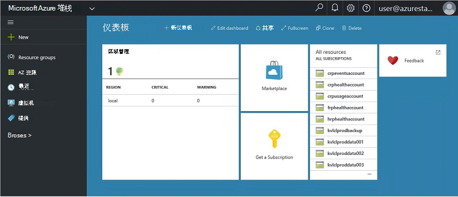
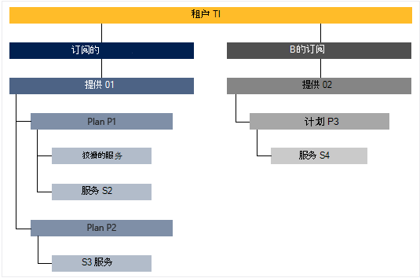

<properties
    pageTitle="主要功能和 Azure 堆栈中的概念 |Microsoft Azure"
    description="学习的主要功能和 Azure 堆栈中的概念。"
    services="azure-stack"
    documentationCenter=""
    authors="Heathl17"
    manager="byronr"
    editor=""/>

<tags
    ms.service="azure-stack"
    ms.workload="na"
    ms.tgt_pltfrm="na"
    ms.devlang="na"
    ms.topic="article"
    ms.date="10/25/2016"
    ms.author="helaw"/>

# 主要功能和 Azure 堆栈中的概念

如果您不熟悉 Microsoft Azure 堆栈，则这些条款和功能说明可能有帮助。

## 角色

有两种类型的用户，Microsoft Azure 堆栈、 服务管理员和租户 （客户）。

-  **服务管理员**可以配置和管理资源提供商、 租户提供、 计划、 服务、 配额和定价。
-  **租户**获得 （或购买） 服务管理员提供的服务。 承租人可以调配、 监视和管理它们已订阅，如 Web 应用程序、 存储和虚拟机的服务。

## 门户网站

与 Microsoft Azure 堆栈进行交互的主要方法是门户网站，PowerShell。

Microsoft Azure 堆栈门户是 Azure 门户服务器上运行的实例。 它是一个网站，提供自助服务的经验，用于对资源和云容量，从而实现快速应用程序和服务开发和部署基于角色的访问控制 (RBAC) 的服务管理员和承租人。

## 区域、 服务、 计划、 服务和订阅

在 Azure 堆栈服务传送到承租人使用区域、 订阅、 服务和计划。 承租人可以订阅多个提供。 提供可以有一个或多个计划，和计划可具有一个或多个服务。

示例层次结构的一个租户订阅优惠，每个都有不同的计划和服务。

### 地区
Azure 堆栈区域是规模和管理的一个基本要素。  一个组织可以有每个地区的可用资源的多个区域。  地区也可能有不同的服务产品。

### 服务

Microsoft Azure 堆栈使提供程序可以提供各种各样的服务和应用程序，如虚拟机、 SQL Server 数据库，SharePoint、 交换等。

### 计划

计划是分组的一个或多个服务。 作为一个提供程序，您可以创建计划能够为您的租户。 反过来，您提供要使用的计划和服务，其中包括订阅您的租户。

可以配置配额设置，以帮助您管理您的云容量添加到计划中的每一项服务。 配额可包括例如 VM、 RAM 和 CPU 限制的限制和每个用户订阅应用。 可以按位置区分配额。 例如，包含从区域 A 的计算服务的规划可以有两个虚拟机、 4 GB RAM，以及 10 个 CPU 内核的配额。

当撰写优惠，服务管理员可以包括**基本计划**。 默认情况下，如果承租人预订了提供会包含这些基本计划。 只要用户订阅 （并创建订阅），用户可以对这些基本计划 （与相应的配额） 中指定的所有资源提供程序的访问。

服务管理员还可以在报价中包括**附加计划**。 默认情况下，订阅中不包含加载项计划。 加载项计划是其他计划 （配额） 预订所有者可以添加对它们的订阅优惠中可用。

### 提供

服务提供商的供应商向承租人购买的一个或多个计划组 （订阅）。 例如，提供 Alpha 可以包含计划 A （从包含一套计算服务地区 1) 和 （从包含一组存储和网络服务的地区 2) 计划 B。

提供附带了一组基本计划，以及服务管理员可以创建承租人可以向其订阅添加的附加计划。

### 订阅

订阅是承租人如何购买您的提供。 订阅是通过提供一个租户的组合。 租户可以有多个提供的订阅。 每个订阅，适用于只有一个优惠。 一个租户订阅确定他们可以访问哪些计划/服务。

订阅可帮助组织的访问和使用云资源和服务的提供商。

## Azure 的资源管理器

通过使用 Azure 资源管理器，您可以使用基于模板的进行声明性模型中的基础结构资源。   它提供了一个单一的界面，可用于部署、 管理和监视您的解决方案组件，如虚拟机、 存储帐户、 web 应用程序和数据库。 有关完整的信息和指导，请参阅[Azure 资源管理器概述](../azure-resource-manager/resource-group-overview.md)。

### 资源组

资源组是资源、 服务和应用程序的集合，并且每个资源都有一个类型，如虚拟机、 虚拟网络、 公用 Ip、 存储帐户和网站。 每个资源必须在资源组和资源组逻辑上帮助组织资源，如通过工作负载或位置。

下面是一些定义资源组时，需要考虑的重要事项︰

-   每个资源在一个资源组只能存在。

-   将部署、 更新和删除的资源组中的项组合在一起。 如果一个资源，如数据库服务器，需要在不同的部署周期存在，它应该是另一个资源组中。

-   您可以添加或删除任何时候到资源组的资源。

-   可以从一个资源组的资源移动到另一个组。

-   资源组可以包含位于不同地区的资源。

-   资源组可以用于确定访问控制用于管理操作的范围。

-   资源可以链接到另一个资源组中的某个资源，必须与彼此进行交互的两种资源，但它们不共享相同的生命周期。 例如，多个应用程序必须连接到一个数据库，但该数据库必须不会更新或删除应用程序相同的步调。

-   在 Microsoft Azure 堆栈，例如计划和提供的资源还可以管理资源组中。

-   您可以重新部署资源组。  这可用于测试或开发的目的。  

### Azure 的资源管理器模板

使用 Azure 资源管理器中，您可以创建定义您的应用程序的配置和部署的简单模板 （采用 JSON 格式）。 此模板称为 Azure 资源管理器模板，并提供了一种声明性的方法来定义部署。 通过使用模板，可以重复部署整个应用程序生命周期的应用程序并可以的相信您的资源部署在一致的状态。

## 资源提供程序 (RPs) — — 网络 RP，计算 RP，存储 RP

资源提供程序是所有基于 Azure 的 IaaS 的形成奠定了基础的 web 服务和 PaaS 服务。 Azure 的资源管理器依赖于不同的 RPs 提供主机服务的访问。

有三个主要的 RPs︰ 网络、 存储和计算。 每个这些 RPs 可帮助您配置和控制其各自的资源。 服务管理员也可以添加新的自定义资源提供程序。

### 计算 RP

计算资源提供者 (CRP) 允许 Azure 堆栈承租人若要创建自己的虚拟机。 它还提供服务管理员设置和配置承租人的资源提供程序的功能。 CRP 包括创建虚拟机和虚拟机的扩展能力。 虚拟机的扩展服务可帮助 Windows 和 Linux 虚拟机提供 IaaS 的能力。

### 网络 RP

网络资源提供者 (NRP) 提供了一系列的用于私有云软件定义网络 (SDN) 和网络功能虚拟化 (NFV) 的功能。 这些功能是符合 Azure 的公有云，以便可以写入一次，同时在 Azure 的公有云或内部 Microsoft Azure 堆栈中部署应用程序模板。 网络 RP 为您提供了更精细的网络控制、 元数据标记、 更快速的配置、 快速且可重复的自定义和多个控件接口 （包括 PowerShell，.NET SDK，Node.JS SDK，基于 REST 的 API）。 NRP 可用于创建软件负载平衡器公用 Ip 网络安全组，及其他的虚拟网络。

### RP 存储

存储 RP 提供四个一致 Azure 存储服务︰ 斑点、 表、 队列和帐户管理。 它还提供了存储云管理服务以促进一致 Azure 存储服务的服务提供程序管理。 Azure 存储提供了存储和检索大量的非结构化数据，如文档和媒体文件与 Azure Blob 的灵活性和结构化的 NoSQL 基于 Azure 表的数据。 在 Azure 存储的详细信息，请参阅[Microsoft Azure 存储的简介](../storage/storage-introduction.md)。

#### Blob 存储

Blob 存储存储任何数据集。 Blob 可以是任何类型的文本或二进制数据，例如文档、 媒体文件或应用程序安装程序。 表存储存储结构化的数据集。 表存储是 NoSQL key 属性数据存储，从而允许进行快速开发，并对大量数据的快速访问。 队列的存储提供了可靠的消息传送工作流处理和云服务的组件之间进行通信。

每个 blob 被组织在容器下。 容器还提供一种将安全策略分配到组的对象。 存储帐户可以包含任意数量的容器，容器可以包含任意数量的 blob，存储帐户 500 TB 的容量限制。 Blob 存储提供三种类型的 blob、 阻止 blob，追加 blob 和页面 blob （磁盘）。 块 blob 适合流式传输和存储云对象进行了优化，是一个不错的选择，用于存储文档、 媒体文件、 备份等。追加 blob 相似块 blob，但经过优化的追加操作。 只能通过给结尾添加新块，追加 blob 可以进行更新。 追加 blob 的方案，例如日志记录，需要新的数据只能写入 blob 的末尾的一个不错的选择。 适合页面 blob 表示 IaaS 磁盘并支持随机写入，并且可能达 1 TB 的大小。 Azure 虚拟机网络附加磁盘是作为页面 blob 存储 VHD 的 IaaS。

#### 表存储

表存储是微软 NoSQL 项/属性存储 — 而无需使其不同于传统的关系数据库的架构设计。 由于数据存储缺少架构，可以很容易地根据您的应用程序发展变化的需要调整您的数据。 表存储是易于使用，，因此开发人员可以快速地创建应用程序。 表存储为键属性存储区中，意味着每个表中的值存储与一个类型化的属性名。 属性名称可用于筛选和指定选择条件。 属性和属性值的集合构成一个实体。 表存储缺少架构，因为同一个表中的两个实体可以包含不同的属性，集合，这些属性可以为不同类型。 表存储可用于存储灵活的数据集，如用户数据的 web 应用程序、 通讯簿、 设备信息和任何其他类型的元数据，您的服务需要。 可以将任意数量的实体存储在表中，并存储帐户可能包含任意数量的表的存储帐户的容量限制。

#### 队列存储
Azure 队列存储提供了云应用程序组件之间的消息传递。 在设计时用于缩放的应用程序，应用程序组件通常分隔，以便他们可以独立地扩展。 队列存储提供了异步消息传递应用程序组件之间的通信是否运行在云中，在桌面上，在内部服务器上，或移动设备上。 队列存储还支持异步任务管理和建立工作流程。

## 基于角色的访问控制 (RBAC)

您可以使用 RBAC 系统访问权限授予授权的用户、 组和服务通过将他们分配在订购、 资源组或各个资源级别角色。 每个角色定义了用户、 组或服务已通过 Microsoft Azure 堆栈的资源的访问级别。

Azure RBAC 已适用于所有资源类型的三个基本的角色︰ 所有者、 参与者和读者。 所有者拥有完全访问所有资源包括委托给其他用户访问的权限。 参与者可以创建和管理所有类型的 Azure 的资源，但不能授予其他人访问。 读取器只可以查看现有的 Azure 资源。 其余的 Azure 中的 RBAC 角色允许管理 Azure 的特定资源。 例如，虚拟机参与者角色允许创建和管理虚拟机，但不允许虚拟网络或虚拟机连接到子网的管理。

## 使用率数据

Microsoft Azure 堆栈收集和使用数据聚合跨所有资源提供商提供的每个用户的简明报告。 数据可以是简单，只需用的资源计数或很复杂，比如性能和可扩展性的单个计数器。 这些数据可以通过 REST API。 没有要获取使用数据跨所有租户订阅 Azure 一致租户 API 以及提供程序和委托提供 Api。 此数据可以用于与外部工具或服务付费或按容量使用计费集成。

## 下一步行动

[部署 Azure 堆栈技术预览 2 (POC)](azure-stack-deploy.md)
