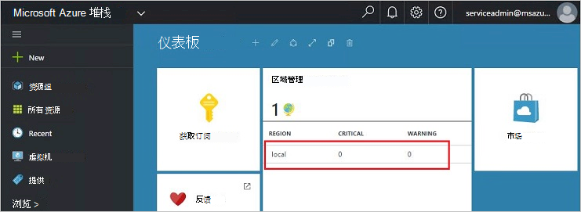
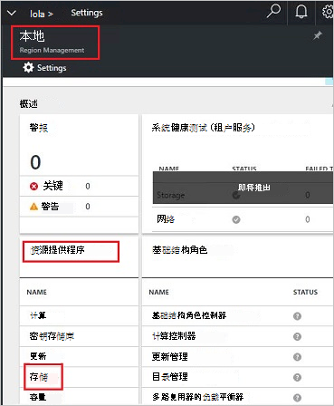
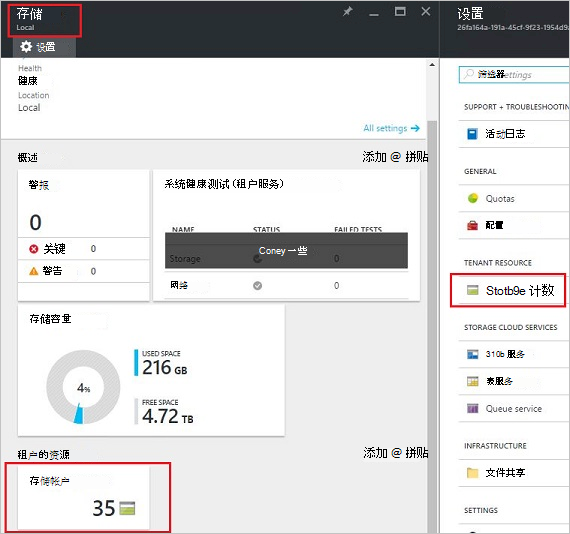
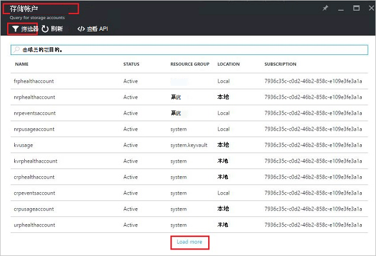
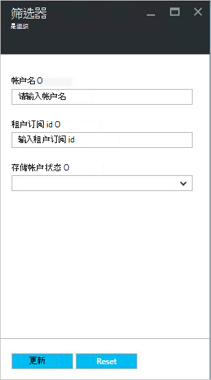
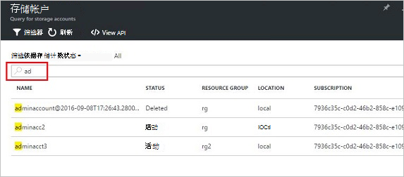
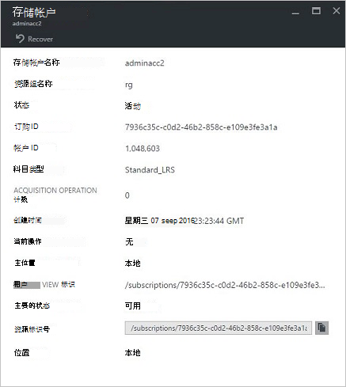
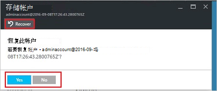
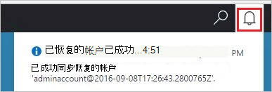
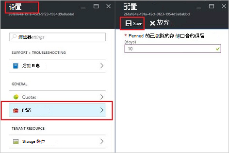

<properties
    pageTitle="管理 Azure 堆栈存储帐户 |Microsoft Azure"
    description="了解如何查找、 管理、 恢复和回收 Azure 堆栈存储帐户"
    services="azure-stack"
    documentationCenter=""
    authors="AniAnirudh"
    manager="darmour"
    editor=""/>

<tags
    ms.service="azure-stack"
    ms.workload="na"
    ms.tgt_pltfrm="na"
    ms.devlang="na"
    ms.topic="get-started-article"
    ms.date="09/26/2016"
    ms.author="anirudha"/>

# <a name="manage-storage-accounts-in-azure-stack"></a>管理 Azure 堆栈中的存储帐户

了解如何管理在 Azure 堆栈来查找、 恢复和回收存储容量基于业务需求的存储帐户。

## <a name="find-a-storage-account"></a>查找存储帐户

通过 Azure 堆栈中，可以查看区域中的存储帐户的列表︰

1.  在 internet 浏览器中，导航到[https://portal.azurestack.local](https://portal.azurestack.local/)。

2.  以管理员身份 （使用您在部署过程中提供的凭据） 登录到 Azure 堆栈门户

3.  默认仪表板 — 在查找**区域管理**列表，然后单击想要探索 – 例如地区**(本地**)。

    

4.  从**资源提供程序**列表中选择**存储**。

    

5.  现在，在存储资源提供程序管理刀片式服务器 – 向下滚动到"存储帐户"选项卡并单击它。

    
    
    所生成的页面是该区域中的存储帐户的列表。

    

默认情况下，显示前 10 个客户。 您可以选择要获取更多通过单击底部的列表的"加载详细信息"链接 <br>
OR <br>
如果您感兴趣的特定的存储帐户 – 可**过滤，提取相关的帐户**只。<br>

若要筛选的帐户︰

1. 单击筛选按钮顶部的刀片式服务器。

2. 筛选器刀片式服务器，它允许您指定**帐户名称**、 **订阅 ID**或**状态**进行微调的存储帐户列表显示。 适当地使用它们。

3. 单击更新。 应相应地刷新列表。

    

4. 若要重置筛选器 – 单击滤镜按钮，清除选择和更新。

搜索文本框中的存储帐户列表刀片，顶部，可以突出显示的帐户列表中的选定的文本。 完整名称或 id 无法很容易地访问时，这是非常方便的在这种情况。<br>
可以使用这里的免费文字来帮助查找您感兴趣的科目。




## <a name="look-at-account-details"></a>查看帐户详细信息

一旦您找到您有兴趣查看的帐户，您可以单击查看某些详细信息的特定帐户上。 新刀片将打开类似帐户、 创建时间、 位置等类型的帐户详细信息。




## <a name="recover-a-deleted-account"></a>恢复已删除的帐户

您可能想要恢复已删除的帐户的情况。<br>
在 AzureStack 中，没有非常简单的方法来做到这一点。

1.  请浏览到存储帐户列表。 [请参见查找存储帐户](#find-a-storage-account)

2.  在列表中找到该特定帐户。 您可能需要进行筛选。

3.  检查状态的帐户。 它应该显示"删除"。

4.  单击打开帐户详细信息刀片式服务器的帐户上。

5.  在此刀片式服务器 – 找到"恢复"按钮，单击它。

6.  按"是"确认

    

7.  恢复正在进程...等待指示已成功。
    您还可以单击顶部的门户网站来查看进度指示"bell"图标。

    

  一旦恢复的帐户成功地进行同步，一个可以返回到使用它。

### <a name="some-gotchas"></a>一些问题

- 您已删除的帐户显示为"不保留"状态。

  这意味着，被删除的帐户已超过保留期，可能再也无法恢复。

- 帐目列表中不显示已删除的帐户。

  这可能意味着删除的帐户已被垃圾回收。 在这种情况下将不能恢复了。 下面，请参阅"回收容量"。

## <a name="set-retention-period"></a>设置保留期

保留周期的设置允许管理员指定时间段 （0 到 9999 天） 之间的天其间可能可以恢复已删除的任何帐户。 默认保留期设置为 15 天。 将该值设置为"0"表示所有已删除的帐户立即将不保留，标记为定期的垃圾回收。

若要更改保留时间 –

1.  在 internet 浏览器中，导航到[https://portal.azurestack.local](https://portal.azurestack.local/)。

2.  以管理员身份 （使用您在部署过程中提供的凭据） 登录到 Azure 堆栈门户

3.  默认仪表板 — 在查找**区域管理**列表，然后单击想要探索 – 例如地区**(本地**)。

4.  从**资源提供程序**列表中选择**存储**。

5.  单击设置图标以打开设置刀片式服务器上。

6.  单击配置的保留期间。

7.  您可以编辑的值并将其保存。

 此值将会立即生效，并反映在您的整个地区。



## <a name="reclaim-capacity"></a>回收容量

有一个保留期之一是副作用的已删除的帐户将继续，直到它从保留期消耗容量。 现在作为一名管理员可能需要收回这一种方法删除帐户空间即使保留期尚未到期。 当前可以使用的命令行以显式重写的保留期并立即回收容量。 要做到这一点-

1.  假设您具有 Azure PowerShell 安装和配置。 如果不是请按照说明进行操作︰ 要安装最新的 Azure PowerShell 版本并将其与您 Azure 的订阅，请参阅[如何安装和配置 Azure PowerShell](http://azure.microsoft.com/documentation/articles/powershell-install-configure/)。
    有关 cmdlet Azure 资源管理器的详细信息，请参阅[使用 Azure PowerShell 使用 Azure 资源管理器](http://go.microsoft.com/fwlink/?LinkId=394767)

2.  运行该 cmdlet:

    ```
    PS C:\\>; Clear-ACSStorageAccount -ResourceGroupName system
    -FarmName <your farmname>
    ```

> 有关详细信息，请参阅[AzureStack powershell 文档](https://msdn.microsoft.com/library/mt637964.aspx)

> [AZURE.NOTE] 运行该 cmdlet 将永久删除该帐户及其内容。 它将不再恢复。 使用时要小心。

