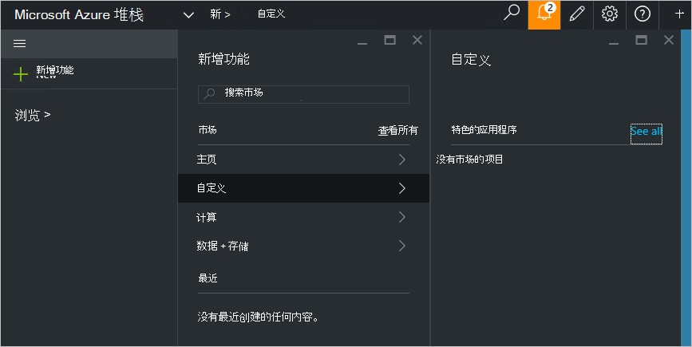

<properties
    pageTitle="在 Azure 堆栈 （服务管理员） 发布自定义市场项目 |Microsoft Azure"
    description="服务管理员，以了解如何将自定义的市场项目发布 Azure 堆栈中。"
    services="azure-stack"
    documentationCenter=""
    authors="rupisure"
    manager="byronr"
    editor=""/>

<tags
    ms.service="azure-stack"
    ms.workload="na"
    ms.tgt_pltfrm="na"
    ms.devlang="na"
    ms.topic="article"
    ms.date="09/26/2016"
    ms.author="rupisure"/>

# Azure 堆栈市场

市场是项自定义 Azure 堆栈类似服务、 应用程序和资源的集合。 它是承租人是哪里可创建新资源并将其部署新的应用程序的位置。 服务管理员可以添加到市场和承租人的自定义项将会马上看到它们。

要打开市场，请单击**新建**。

市场上每隔 5 分钟更新。

## 市场上项目

市场上的每个项目有︰

-   有关资源调配的 Azure 资源管理器模板

-   元数据，如字符串、 图标和其他市场营销宣传资料

-   在门户中显示项的格式设置信息

发布到市场上的每一项使用 Azure 库软件包 (azpkg) 的格式。 部署或运行时的资源 （如代码，软件或虚拟机映像的 zip 文件） 应添加到 Azure 堆栈分开，不能作为市场项的一部分。 

## 下一步行动

[创建和发布市场项目](azure-stack-create-and-publish-marketplace-item.md)
