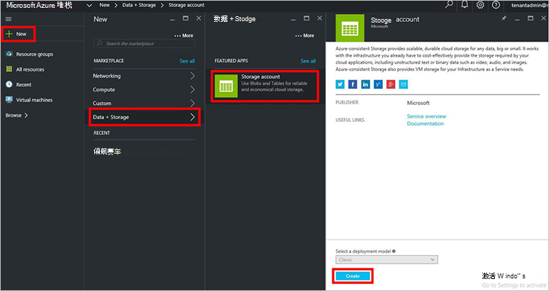
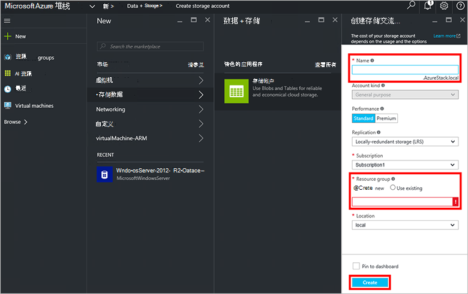
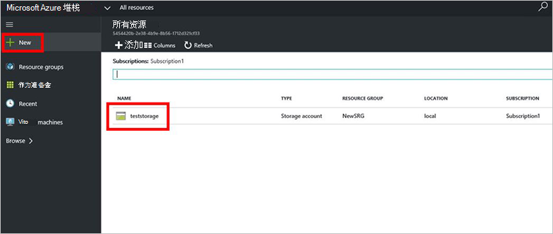

<properties
    pageTitle="在 Azure 堆栈中的存储帐户 |Microsoft Azure"
    description="了解如何创建一个堆栈 Azure 存储帐户。"
    services="azure-stack"
    documentationCenter=""
    authors="ErikjeMS"
    manager="byronr"
    editor=""/>

<tags
    ms.service="azure-stack"
    ms.workload="na"
    ms.tgt_pltfrm="na"
    ms.devlang="na"
    ms.topic="get-started-article"
    ms.date="09/26/2016"
    ms.author="erikje"/>

# 在 Azure 堆栈中存储帐户

存储帐户包括 Blob 和表服务，以及存储数据对象的唯一命名空间。 默认情况下，您的帐户中的数据是仅对您的存储帐户所有者可用。

1.  在 Azure 堆栈 POC 计算机，登录`https://portal.azurestack.local`作为[一名管理员](azure-stack-connect-azure-stack.md#log-in-as-a-service-administrator)，然后单击**新建** > **数据 + 存储** > **存储帐户**。

    

2.  在**创建存储帐户**刀片式服务器，键入您的存储帐户的名称。 创建新的**资源组**，或选择一个现有，然后单击**创建**来创建存储帐户。

    

3. 若要查看新的存储帐户，单击**所有资源**，然后搜索的存储帐户并单击其名称。

    
    
## 下一步行动

[使用 Azure 资源管理器模板](azure-stack-arm-templates.md)

[了解有关 Azure 存储帐户](../storage/storage-create-storage-account.md)

[下载 Azure 堆栈一致 Azure 存储验证指南](http://aka.ms/azurestacktp1doc)
