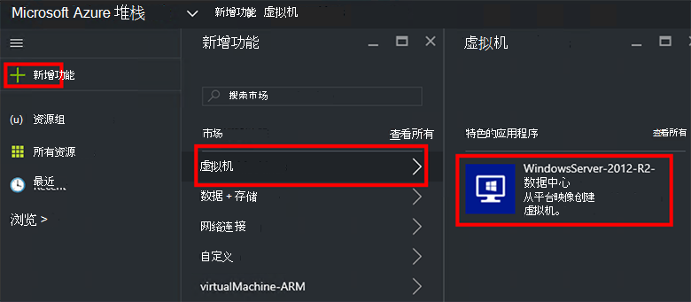
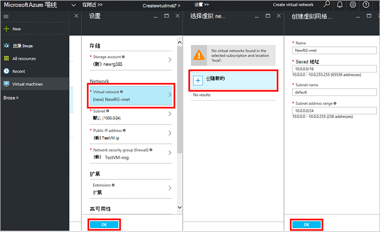
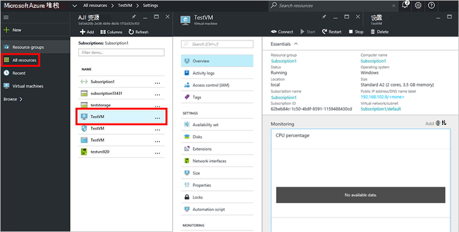

<properties
    pageTitle="配置虚拟机时在 Azure 堆栈 （租户） |Microsoft Azure"
    description="作为承租人，了解如何配置虚拟机时 Azure 堆栈中。"
    services="azure-stack"
    documentationCenter=""
    authors="ErikjeMS"
    manager="byronr"
    editor=""/>

<tags
    ms.service="azure-stack"
    ms.workload="na"
    ms.tgt_pltfrm="na"
    ms.devlang="na"
    ms.topic="get-started-article"
    ms.date="10/12/2016"
    ms.author="erikje"/>

# 配置虚拟机

作为管理员，您可以创建虚拟机，以评估在计划中提供它们之前的资源。

## 配置虚拟机

1.  在 Azure 堆栈 POC 计算机，登录`https://portal.azurestack.local`作为[一名管理员](azure-stack-connect-azure-stack.md#log-in-as-a-service-administrator)，然后单击**新建** > **虚拟机** > **WindowsServer 2012-R2 数据中心**。  

    

2.  在**基本知识**刀片式服务器，输入**名称**、**用户名**和**密码**。 对于**虚拟机磁盘类型**，选择**硬盘**。 选择**订阅**。 创建**资源组**，或选择一个现有，然后单击**确定**。  

3.  **选择尺寸**刀片式服务器，在**基本 A1**，请单击，然后单击**选择**。  

4.  在**设置**刀片式服务器，单击**虚拟网络**。 在**选择虚拟网络**刀片式服务器，单击**新建**。 在**创建虚拟网络**刀片式服务器，接受所有默认设置，然后单击**确定**。 在**设置**刀片式服务器，请单击**确定**。

    

5.  在**摘要**刀片式服务器，请单击**确定**以创建该虚拟机。  

6. 若要查看新的虚拟机，单击**所有资源**，然后搜索的虚拟机并单击其名称。

    

## 下一步行动

[存储帐户](azure-stack-provision-storage-account.md)
