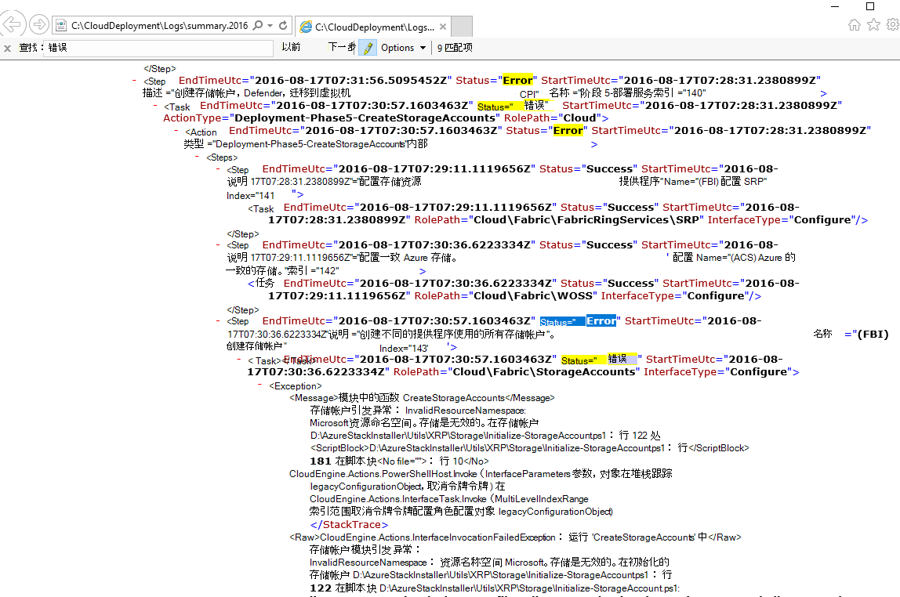
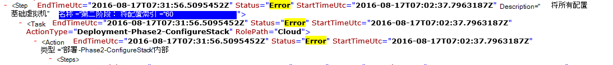

<properties
    pageTitle="重新运行失败的步骤从部署 |Microsoft Azure"
    description="如果在部署过程中出现故障，您可以尝试以下步骤以重新运行中它在什么位置出错的部署。"
    services="azure-stack"
    documentationCenter=""
    authors="ErikjeMS"
    manager="byronr"
    editor=""/>

<tags
    ms.service="azure-stack"
    ms.workload="na"
    ms.tgt_pltfrm="na"
    ms.devlang="na"
    ms.topic="get-started-article"
    ms.date="09/26/2016"
    ms.author="erikje"/>
    
# 重新运行失败的步骤中部署
  
如果在部署过程中出现故障，您可以尝试以下步骤以重新运行中它在什么位置出错的部署。

## 查找失败

请注意故障，特别是调用的步骤中调用的部分失败。 例如，

**2016-08-17 00:30:57 错误 1 > 1 > 操作︰ 步骤 60.140.143 的调用失败。正在停止调用的行动计划。**

这是将从哪里开始重新运行部署的部署步骤。

## 在失败中找到更多详细信息

如果希望有关错误的更多详细信息，请查找关联**摘要。YYYY-毫米-DD.tt.N.log.xml**在 **C:\CloudDeployment\Logs\**文件夹。
搜索字符串"错误"，它向下跟踪整个输出直到看到大量的非 XML 格式文本包含错误消息 （此部分通常与一致的"错误"的字符串的最后一个实例）。 例如︰

您可以使用此信息来跟踪重新运行的步骤、 跟进"Index"号的最后一个错误。 在上面的图像中，可以看到 （从底部开始）︰ 143、 140，并随后向上滚动，您会看到 60:

这把所有放在一起 （现在从上到下），您进入 60.140.143，像 PS 控制台输出的故障 （如上面的"查找失败"一节所示）。

## 重新运行在某一特定步骤的部署

现在，您已经的部署失败的步骤，您可以尝试从该步骤的部署-重新运行。

> [AZURE.IMPORTANT] 必须按正确的用户，与发生故障的上下文中运行以下命令。 如果之前已加入到域中的主机发生故障，请为本地管理员帐户运行这些步骤。 如果发生故障的主机已连接到域之后，请以域管理员身份 (azurestack\azurestackadmin) 运行这些步骤。

### 执行调用 EceAction 命令

1. 从提升 PS 控制台，导入以下模块︰

        Import-Module C:\CloudDeployment\CloudDeployment.psd1 -Force
        Import-Module C:\CloudDeployment\ECEngine\EnterpriseCloudEngine.psd1 -Force 

2. 然后执行下面的命令 （从使用此处的示例）︰

        Invoke-EceAction -RolePath Cloud -ActionType Deployment -Start 60.140.143 -Verbose

3.  这将启动中标识该步骤的部署通过调用 EceAction 命令的-Start 参数

### 结果 a-重新运行 /-开始的

无论您选择选项，重新开始部署，将从指定的启动参数。

1.  故障恢复时，会继续完成部署。

2.  如果部署在再次失败...
    
    - 相同的地方︰ 故障可能不是可恢复的且需要进一步调查。

    - 之后它在什么位置出错这次到新位置︰ 您还可以尝试让它再次将这些同样的步骤。

    - 之前它在什么位置出错这次到新位置︰ 停下手中的错与幂等调用，这需要进一步的调查。

## 下一步行动

[连接到 Azure 堆栈](azure-stack-connect-azure-stack.md)

