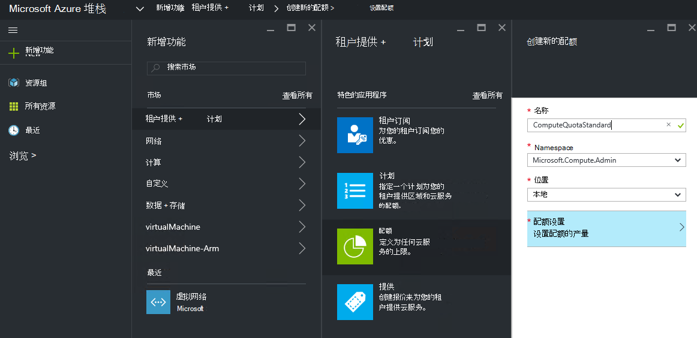
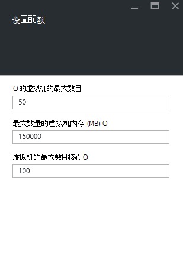
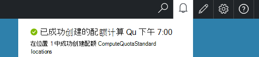

<properties
    pageTitle="配额在 Azure 堆栈 |Microsoft Azure"
    description="管理员设置配额来限制承租人有权访问的资源的最大金额。"
    services="azure-stack"
    documentationCenter=""
    authors="mattmcg"
    manager="byronr"
    editor=""/>

<tags
    ms.service="azure-stack"
    ms.workload="na"
    ms.tgt_pltfrm="na"
    ms.devlang="na"
    ms.topic="get-started-article"
    ms.date="09/26/2016"
    ms.author="mattmcg"/>

# 在 Azure 堆栈设置配额

配额定义的租户订阅可以提供或使用的资源的限制。 例如，配额可能允许承租人若要创建最多五个虚拟机。 若要将服务添加到计划中，管理员必须配置该服务的配额设置。

配额是可配置的每一项服务，每个位置，使管理员能够提供精确地控制资源消耗。 管理员可以创建一个或多个配额资源并将它们与计划，这意味着它们可以提供其服务的差异化的产品。 可以从该服务的**资源提供程序**管理刀片式服务器创建给定服务的配额。

订阅包含多个计划提供一个租户可以使用所提供的每个计划的所有资源。

## 若要创建 IaaS 配额

1.  在浏览器中，转到[https://portal.azurestack.local](https://portal.azurestack.local/)。

    登录到 Azure 堆栈门户管理员身份 （通过使用您在部署期间提供的凭据）。

2.  选择**新建**，然后选择**配额**。

3.  选择您要为其创建配额的第一个服务。 为 IaaS 配额，按照下列步骤进行计算、 网络和存储服务。
在此示例中，我们首先创建的配额的计算服务。 在**Namespace**列表中，选择**Microsoft.Compute.Admin**名称空间。

    > 

4.  选择配额 （例如，本地） 的定义所在的位置。

5.  在**配额设置**项，它说**设置配额容量**。 单击此项可配置的配额设置。

6.  在**设置配额**刀片式服务器，您将看到您可以为其配置限制的所有计算资源。 每种类型都有与之关联的默认值。 您可以更改这些值，也可以选择**确定**按钮，底部的刀片式服务器以接受默认值。

    > 

7.  配置值并单击**确定**后，**配额设置**项将显示为**已配置**。 单击**确定**以创建**配额**资源。

    您应该看到一个通知，说明正在创建配额资源。

8.   已成功创建配额设置后，您将收到第二个通知。 计算服务配额现在已准备好要与一个计划关联。 重复的网络和存储服务，这些步骤，您就可以创建一个 IaaS 计划 ！

    >   

## 计算配额类型

|**类型**                    |**默认值**| **说明**|
|--------------------------- | ------------------------------------|------------------------------------------------------------------|
|虚拟机的最大数量   |50|订阅可以在此位置中创建的虚拟机的最大数目。 |
|虚拟机内核的最大数量              |100|最大订阅可以在此位置创建的内核数 （例如，A3 VM 都有四个核心）。|
|虚拟机内存 (GB) 的最大数量         |150|最大可供应以兆字节的 RAM 的数量 （例如，A1 VM 所消耗 1.75 GB 的 RAM）。|

> [AZURE.NOTE] 在此技术预览中不实施配额的计算。

## 存储配额类型

|**项目**                           |**默认值**   |**说明**|
|---------------------------------- |------------------- |-----------------------------------------------------------|
|最大容量 (GB)              |500                 |可由该位置中的订阅的总存储容量。|
|存储客户总数   |20                  |在此位置创建可以订阅的存储帐户的最大数目。|

## 网络配额类型

|**项目**                                                   |**默认值**   |**说明**|
|----------------------------------------------------------| ------------------- |--------------------------------------------------------------------------------------------------------------------------------------------------------------------|
| 最大的公共 Ip                         |50                  |最大订阅可以在此位置中创建的公用 Ip 数。 |
| 最大虚拟网络                   |50                  |订阅可以在此位置中创建的虚拟网络的最大数目。 |
| 最大虚拟网络网关           |1                   |虚拟网络网关 （VPN 网关） 订阅可在此位置创建的最大数目。 |
| 最大网络连接                |2                   |订阅可以创建在该位置中的所有虚拟网络网关之间的网络连接 （点对点或站点到站点） 的最大数目。 |
| 最大负载平衡器                     |50                  |订阅可以在此位置中创建的负载平衡器的最大数目。 |
| 最大的 Nic                               |100                 |订阅可以在该位置创建接口的网络接口的最大数目。 |
| 最大的网络安全组            |50                  |订阅可以在此位置创建的网络安全组最大数量。 |
