<properties
    pageTitle="部署在 Azure 堆栈上的 SQL Server 资源提供程序 |Microsoft Azure"
    description="部署在 Azure 堆栈上一个 SQL Server 资源提供程序适配器的详细的步骤。"
    services="azure-stack"
    documentationCenter=""
    authors="Dumagar"
    manager="byronr"
    editor=""/>

<tags
    ms.service="multiple"
    ms.workload="na"
    ms.tgt_pltfrm="na"
    ms.devlang="na"
    ms.topic="article"
    ms.date="09/26/2016"
    ms.author="dumagar"/>

# 部署在 Azure 的堆栈上的 SQL Server 资源提供程序适配器

> [AZURE.NOTE] 以下信息只适用于 Azure 堆栈 TP1 部署中。

使用本文按照 Azure 堆栈的概念 (POC)，证据上 SQL Server 资源提供程序适配器设置的详细的步骤。 请参阅[使用 Azure 堆栈上的 SQL 数据库](azure-stack-sql-rp-deploy-short.md)以了解资源提供程序的功能和体系结构。

## 在部署之前设置的步骤

部署资源提供程序之前，您需要︰

- 具有默认 Windows 服务器映像与.NET 3.5
- 请关闭 Internet Explorer (IE) 增强的安全性
- 安装最新版本的 Azure PowerShell

### 创建映像的 Windows 服务器包括.NET 3.5

如果下载了 Azure 堆栈位 2/23/2016年之后因为默认基本 Windows Server 2012 R2 映像包含在此下载内容及更高版本的.NET 3.5 框架，您可以跳过此步骤。

如果您下载 2/23/2016年之前，您需要使用.NET 3.5 映像创建 Windows Server 2012 R2 数据中心 VHD 并集是作为平台映像存储库中的默认图像。

### 关闭 IE 增强安全和启用 cookie

若要部署的资源提供，您 PowerShell 集成脚本环境 (ISE) 作为管理员运行，因此您需要允许 Internet Explorer 配置文件用于为管理员和用户登录登录到 Azure Active Directory 中的 cookie 和 JavaScript。

**若要关闭 IE 增强的安全性︰**

1. 登录到 AzureStack/管理员，Azure 堆栈的概念验证 (PoC) 计算机，然后打开服务器管理器。

2. 管理员和用户关闭**IE 增强的安全配置**。

3. **ClientVM.AzureStack.local**虚拟机以管理员的身份登录，然后打开服务器管理器。

4. 管理员和用户关闭**IE 增强的安全配置**。

**若要启用 cookie:**

1. 在 Windows 启动屏幕上，单击**所有应用程序****窗口附件**用鼠标右键单击**Internet Explorer**，指向**更多**，和，然后单击**以管理员身份运行**。

2. 如果出现提示，**建议使用的安全性**，请检查，然后单击**确定**。

3. 在 Internet Explorer 中单击**工具 （齿轮） 图标** &gt; **Internet 选项** &gt; **隐私**选项卡。

4. 单击**高级**，确保这两种**接受**按钮被选中，单击**确定**，然后再次单击**确定**。

5. 关闭 Internet Explorer 并重新启动以管理员身份 PowerShell ISE。

### 安装 Azure PowerShell 的 Azure 堆栈兼容版本

1. 从您的客户端虚拟机中卸载任何现有的 Azure PowerShell。

2. 以 AzureStack/管理员身份登录到 Azure 堆栈 POC 机器。

3. 使用远程桌面时，登录到**ClientVM.AzureStack.local**虚拟机作为管理员。

4. 打开控制面板，单击**卸载程序**&gt;单击**Azure PowerShell** &gt;单击**卸载**。

5. [下载最新的 Azure PowerShell 支持 Azure 堆栈](http://aka.ms/azstackpsh)并安装它。

    安装 PowerShell 之后，您可以运行此验证 PowerShell 脚本以确保可以连接到 Azure 堆栈实例 （应显示登录 web 页）。

## 引导资源提供商部署 PowerShell

1. 将 Azure 堆栈 POC 的远程桌面连接到 clientVm.AzureStack.Local 和 azurestack 作为登录\\azurestackuser。

2. [下载 SQLRP 二进制](http://aka.ms/massqlrprfrsh)文件。 您可能需要通过右击该文件，选择**属性**并从**常规**选项卡刻度**取消阻止**，**确定**删除 Internet 下载安全块。 这应防止无法加载文件或程序集异常与 DeploymentTelemetry.dll 和后续跟踪部署异常有关。

3. 将文件解压缩到 d:\\SQLRP。

4. 运行 d:\\SQLRP\\Bootstrap.cmd 文件以管理员身份 (azurestack\\管理员)。

    在 PowerShell ISE 中打开 Bootstrap.ps1 文件。

5. 当 PowerShell ISE 窗口完成加载时，请单击播放按钮，或按 F5。

    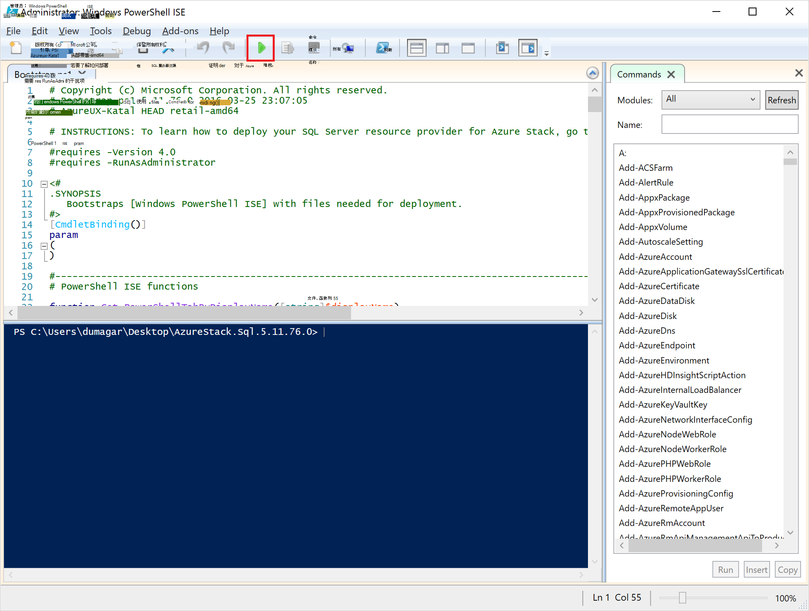

    将加载两个主要的选项卡，每个包含的所有脚本和部署资源提供程序所需的文件。

## 准备系统必备组件

单击**准备系统必备组件**选项卡︰

- 创建所需的证书
- 将项目上载到 Azure 堆栈上存储帐户
- 发布库项目

### 创建所需的证书
这个**新建的 SslCert.ps1**脚本添加\_。AzureStack.local.pfx SSL 证书为 d:\\SQLRP\\系统必备组件\\BlobStorage\\容器文件夹。 该证书保护的资源提供者和本地实例的 Azure 资源管理器之间的通信。

1. 在主要**准备系统必备组件**选项卡，单击**New SslCert.ps1**选项卡并运行它。

2. 在出现提示时，键入私钥，**请记下的此密码**保护的 PFX 密码。 您将稍后需要它。

### 上载到 Azure 堆栈上存储帐户的所有项目

1. 单击**上载-Microsoft.Sql-RP.ps1**选项卡，然后运行它。

2. 在 Windows PowerShell 凭据请求对话框中，键入 Azure 堆栈服务管理员凭据。

3. 提示的 Azure 活动目录租户 id，请键入 Azure Active Directory 租户完全限定的域名称︰ 例如，microsoftazurestack.onmicrosoft.com。

    弹出窗口询问凭据。

    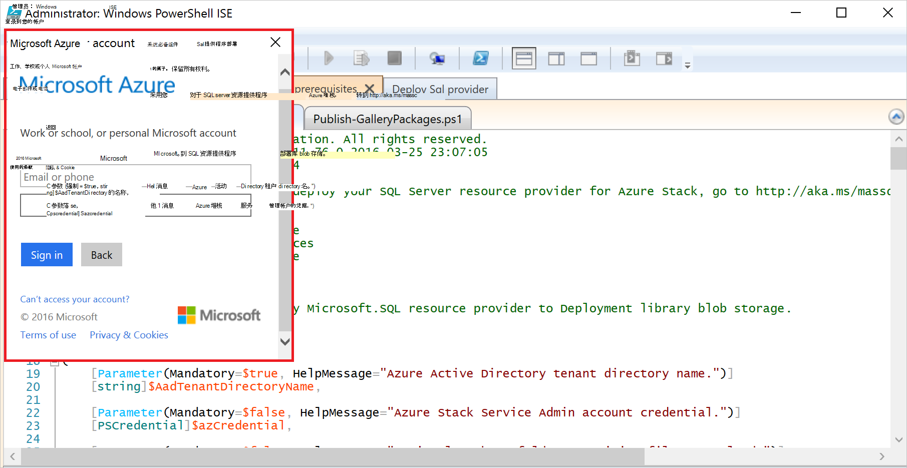

    > [AZURE.TIP] 如果没有出现的弹出菜单，您要么没有关闭 IE 增强的安全性，要在这台机器和用户启用 JavaScript 或您没有接受了 IE 中的 cookie。 请参阅[设置在部署之前的步骤](#set-up-steps-before-you-deploy)。

4. 键入 Azure 堆栈服务管理员凭据，然后单击**登录**。

### 发布以后资源创建的库项目

选择**发布 GalleryPackages.ps1**选项卡，然后运行它。 此脚本将两个市场的项目添加到可用来部署数据库资源市场项目的 Azure 堆栈 POC 门户的市场。

## 部署 SQL Server 资源提供程序 VM

现在，您已经准备 Azure 堆栈 PoC 的必要证书和市场项目，您可以部署一个 SQL Server 资源提供程序。 请单击**部署 SQL 提供程序**选项卡︰

   - 提供了部署过程引用 JSON 文件中的值
   - 部署资源提供程序
   - 更新本地 DNS
   - 注册的 SQL Server 资源提供程序适配器

### 提供在 JSON 文件中的值

单击**Microsoft.Sqlprovider.Parameters.JSON**。 此文件的 Azure 资源管理器模板需要正确地部署到 Azure 叠的参数。

1. 填写在 JSON 文件中的**空**参数︰

    - 请确保您为 SQL 资源提供虚拟机提供的**adminusername**和**adminpassword** :

        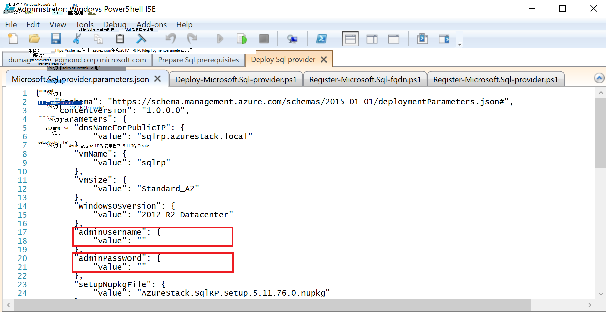

    - 请确保您[准备 prequisites](#prepare-prerequisites)步骤中所记下的**SetupPfxPassword**参数中提供的密码︰

    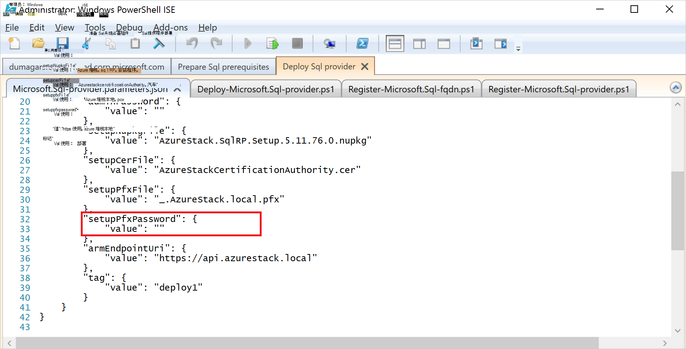

2. 单击**保存**以保存该参数文件。

### 部署资源提供程序

1. 单击**部署-Microsoft.sql-provider.PS1**选项卡，然后运行该脚本。
2. 在 Azure Active Directory 在出现提示时键入您组织的名称。
3. 在弹出的窗口中，将提交堆栈 Azure 服务管理员凭据。

完全部署可能需要在某些高利用率的 Azure 堆栈 Poc 的 25 到 55 分钟。 最长的步骤将需要状态配置 (DSC) 扩展并且 PowerShell 执行，这是最后一步。 每一个可能需要 10-25 分钟。

### 更新本地 DNS

1. 单击**注册-Microsoft.SQL-fqdn.ps1**选项卡，然后运行该脚本。
2. 当提示您为 Azure 活动目录租户 ID 时，输入您 Azure Active Directory 租户完全合格的域名称︰ 例如， **microsoftazurestack.onmicrosoft.com**。

### 注册 SQL RP 资源提供程序##

1. 单击**注册-Microsoft.SQL-provider.ps1**选项卡，然后运行该脚本。

2. 当系统提示您输入凭据时，输入用户名和密码使用以下值︰

   - **sqlRpUsername**
   - **sqlRpPassw0rd**

   > [AZURE.IMPORTANT] 这些是*文本*值，则需要键入时提示您输入凭据。 这些不是占位符。 **执行*不*类型 * * 在部署虚拟机之前保存在参数文件中的 username\password。

## 验证使用 Azure 堆栈门户部署

1. 登录 ClientVM，以**AzureStack\AzureStackUser**身份再次登录。

2. 在桌面上，请单击**Azure 堆栈 POC 门户**和登录为服务管理门户

3. 验证部署成功完成。 单击**浏览** &gt; **资源组**&gt;单击您所使用的资源组 （默认值为**SQLRP**），然后确保刀片式服务器 （上半部分） 的精要部分读取**部署成功**。

      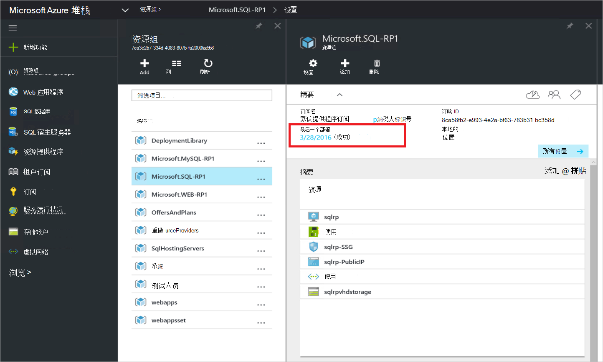

4. 验证注册成功。 单击**浏览** &gt; **资源供应商**，然后寻找**本地 SQL**:

      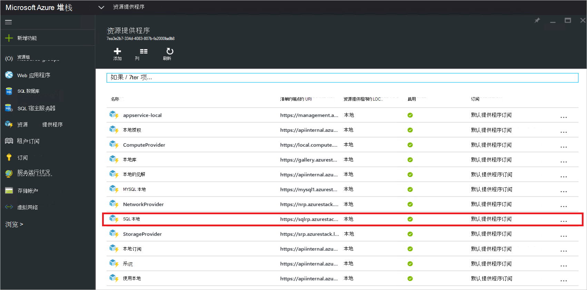

## 通过将其连接到支持的 SQL 服务器给 SQL 资源提供商提供的容量

1. 以服务管理员身份登录到 Azure 堆栈 POC 门户

2. 单击**资源提供商** &gt; **本地 SQL** &gt; **转到资源提供程序管理** &gt; **服务器** &gt; **添加**。

    **SQL 承载服务器**刀片式服务器是您可以对实际 SQL Server 的实例作为资源提供程序的后端连接 SQL Server 资源提供程序。

    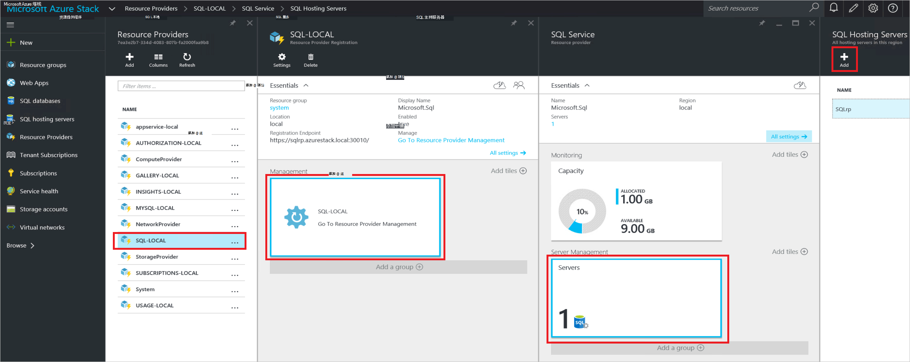

3. 填入您的 SQL Server 实例的连接详细信息窗体。 默认情况下，预配置的 SQL Server 称为"SQLRP"与"sa"中的管理员用户名和密码 JSON 在 VM 运行的参数中的"adminpassword"参数中提出。

## 创建第一个 SQL 数据库来测试部署

1. 以服务管理员身份登录到 Azure 堆栈 POC 门户

2. 单击**浏览** &gt; **SQL 数据库** &gt; **添加**
  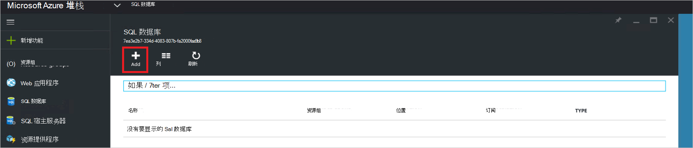

3. 填写窗体与数据库的详细信息，包括**服务器名称**、**服务器管理员登录**和**密码**为**新服务器**刀片式服务器中新的*虚拟服务器*。

    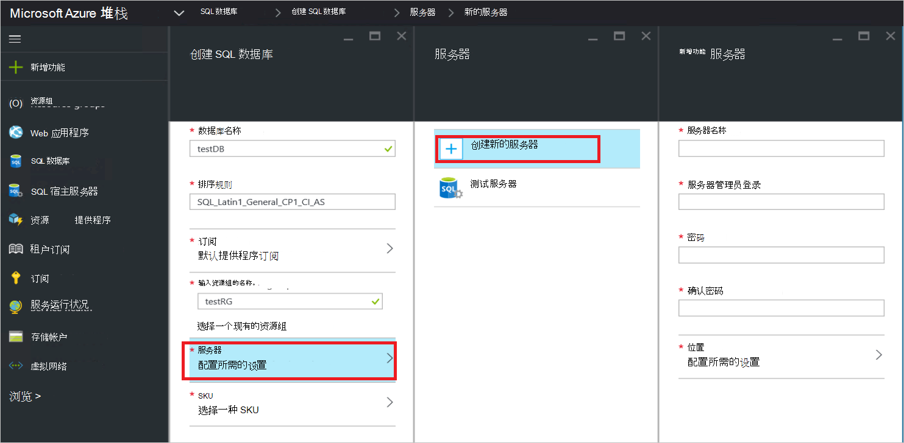

    虚拟服务器是一个人工的构造。 它没有映射到 SQL Server 本身，但通过在连接字符串中，在此过程结束时生成的资源提供程序的用户名而清单。 **注意您输入单独的虚拟服务器的密码**。 门户将永远不显示密码。

4. 您需要选取一个定价层数据库。

    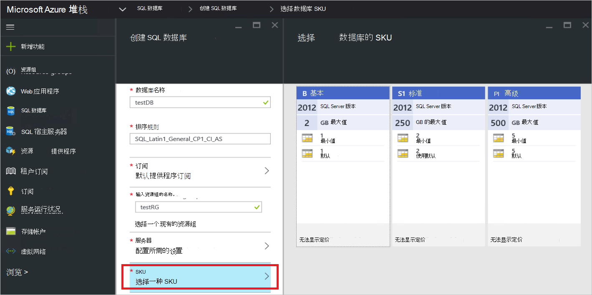

    在此版本中，未实现层但他们消耗跟踪 Azure 资源管理器作为一种方式来展示您可以创建在强制实施配额等独特之处。

5. 提交窗体并等待完成部署。

6. 在得到刀片式服务器，请注意"连接字符串"字段。 在 Azure 堆栈中，您可以使用该字符串中的任何应用程序需要 SQL Server 访问 （例如，web 应用程序）。

    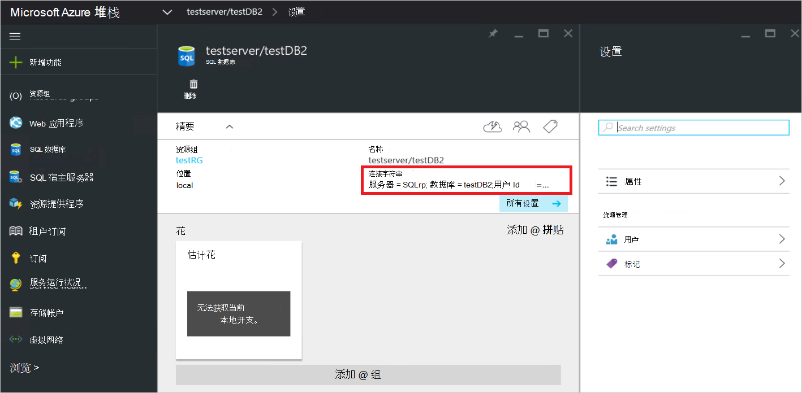

## 下一步行动

请尝试其他的[PaaS 服务](azure-stack-tools-paas-services.md)如[MySQL 服务器资源提供者](azure-stack-mysql-rp-deploy-short.md)和[Web 应用程序资源提供程序](azure-stack-webapps-deploy.md)。
