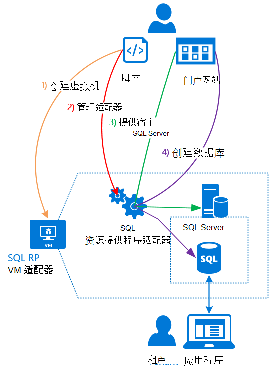

<properties
    pageTitle="在 Azure 堆栈上使用 SQL 数据库 |Microsoft Azure"
    description="了解如何将 SQL 数据库部署为 Azure 堆栈和快速步骤部署 SQL Server 资源提供程序适配器上的服务。"
    services="azure-stack"
    documentationCenter=""
    authors="Dumagar"
    manager="byronr"
    editor=""/>

<tags
    ms.service="multiple"
    ms.workload="na"
    ms.tgt_pltfrm="na"
    ms.devlang="na"
    ms.topic="article"
    ms.date="09/26/2016"
    ms.author="dumagar"/>

# 在 Azure 堆栈上使用 SQL 数据库

> [AZURE.NOTE] 以下信息只适用于 Azure 堆栈 TP1 部署中。

使用 SQL Server 资源提供程序适配器作为 Azure 堆栈的服务公开 SQL 数据库。 安装资源提供程序后，您和您的用户可以创建数据库，云本机应用程序、 网站基于 SQL，并无需设置虚拟机 (VM) 基于 SQL 的工作负荷承载 SQL Server 每次。

资源提供程序概念 (PoC) 验证期间没有 SQL Azure 数据库的所有功能，因为这篇文章开头，资源提供程序体系结构的概述。 然后可以简要概述了设置具有[部署在 Azure 堆栈 POC 的 SQL 数据库资源提供程序适配器](azure-stack-sql-rp-deploy-long.md)中的详细步骤的链接的资源提供程序的步骤。

## SQL Server 资源提供程序适配器体系结构
资源提供程序不能提供所有数据库的 SQL Azure 数据库管理功能。 例如，弹性数据库池和数据库性能拨动态的向上和向下的能力将不可用。 然而，资源提供程序支持相同的创建、 读取、 更新和删除 (CRUD) 操作，可在 SQL Azure 数据库。

资源提供程序由三个组件组成︰

- **SQL 虚拟机资源提供程序适配器**，其涵盖的资源提供过程和承载 SQL Server 的服务器。
- **资源提供程序本身**，其处理资源调配请求并公开数据库资源。
- **该宿主 SQL Server 的服务器**，它提供对数据库的容量。

以下概念图显示这些组件和部署资源提供程序、 设置服务器承载 SQL Server，然后创建数据库时，您要通过的步骤。

## 快速部署的资源提供程序的步骤
如果您已经熟悉 Azure 堆栈，请使用这些步骤。 如果您想了解更多信息，请每一节中的链接或直接转到[部署在 Azure 堆栈 POC 的 SQL 数据库资源提供程序适配器](azure-stack-sql-rp-deploy-long.md)。

1.  请确保您完成所有[步骤在部署之前设置](azure-stack-sql-rp-deploy-long.md#set-up-steps-before-you-deploy)资源提供程序︰

  - .NET 3.5 框架已经设置在基本的 Windows 服务器映像。 （如果您下载后 2 月 23 2016年的 Azure 堆栈位您可以跳过此步骤。）
  - [安装了兼容的 Azure 堆栈的 Azure PowerShell 版](http://aka.ms/azStackPsh)。
  - 在 ClientVM，[启用增强的安全关闭 Internet Explorer 和 cookie](azure-stack-sql-rp-deploy-long.md#Turn-off-IE-enhanced-security-and-enable-cookies)的 Internet Explorer 安全设置。

2. [下载 RP SQL Server 二进制文件](http://aka.ms/massqlrprfrsh)并将其解压到您 Azure 堆栈 POC 在 ClientVM。

3. [运行 bootstrap.cmd 脚本和脚本](azure-stack-sql-rp-deploy-long.md#Bootstrap-the-resource-provider-deployment-PowerShell-and-Prepare-for-deployment)。

    通过打开在 PowerShell 集成脚本环境 (ISE) 两个主要选项卡分组的一组脚本。 运行所有已加载的脚本按顺序从左到右中每个选项卡。

    1. 在**准备**选项卡中从左到右到运行的脚本︰

        - 创建一个通配符证书来保护资源提供者和 Azure 资源管理器之间的通信。
        - Azure 堆栈，可以将证书及所有其他项目上载到存储帐户。
        - 发布库包，以便您可以部署 SQL 通过与资源库。

        > [AZURE.IMPORTANT] 如果后提交 Azure Active Directory 租户无明显原因的任何脚本挂起，您的安全设置可能会阻止已部署运行时所需的 DLL。 要解决此问题，请寻找资源提供程序文件夹中的 Microsoft.AzureStack.Deployment.Telemetry.Dll 并右击该、 单击**属性**，然后在**常规**选项卡中检查**取消阻止**。

    1. 在**部署**选项卡中从左到右到运行的脚本︰

        - 承载您的资源提供程序和 SQL Server[部署虚拟机](azure-stack-sql-rp-deploy-long.md#Deploy-the-SQL-Server-Resource-Provider-VM)。 此脚本引用 JSON 参数文件，您需要在运行脚本之前更新一些值。
        - [注册的本地 DNS 记录](azure-stack-sql-rp-deploy-long.md#Update-the-local-DNS)映射到您的资源提供程序虚拟机。
        - [注册资源提供](azure-stack-sql-rp-deploy-long.md#Register-the-SQL-RP-Resource-Provider)与本地 Azure 资源管理器中。

        > [AZURE.IMPORTANT] 所有的脚本假定基本操作系统映像满足先决条件 (.NET 3.5 安装，JavaScript 和 ClientVM 和 Azure PowerShell 安装一个兼容版本上启用 cookie)。 如果在运行脚本时出现错误，请仔细检查您满足了先决条件。

6. 在 Azure 堆栈门户[连接到服务器的承载 SQL Server 资源提供程序](#Provide-capacity-to-your-SQL-Resource-Provider-by-connecting-it-to-a-hosting-SQL-server)。 单击**浏览** &gt; **资源提供商** &gt; **SQLRP** &gt; **转到资源提供程序管理** &gt; **服务器** &gt; **添加**。

    使用用户名和密码时部署虚拟机的资源提供使用"sa"。

7. [测试新的 SQL Server 资源提供程序](/azure-stack-sql-rp-deploy-long.md#create-your-first-sql-database-to-test-your-deployment)，将部署在 Azure 堆栈门户中的 SQL 数据库。 单击**创建** &gt; **自定义** &gt; **SQL Server 数据库**。

这应该会看到您的 SQL Server 资源供应商，向上以及运行在大约 45 分钟内 （具体取决于您的硬件）。
