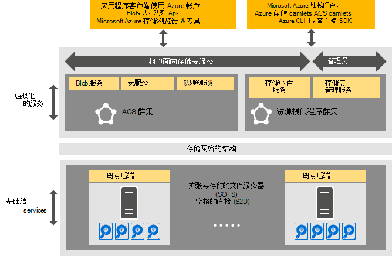

<properties
    pageTitle="介绍一致 Azure 存储 |Microsoft Azure"
    description="了解有关一致 Azure 存储"
    services="azure-stack"
    documentationCenter=""
    authors="AniAnirudh"
    manager="darmour"
    editor=""/>

<tags
    ms.service="azure-stack"
    ms.workload="na"
    ms.tgt_pltfrm="na"
    ms.devlang="na"
    ms.topic="get-started-article"
    ms.date="09/26/2016"
    ms.author="anirudha"/>

# Azure 一致存储的简介
Azure 一致的存储是一组存储在 Microsoft Azure 堆栈中的云服务。 Azure 一致的存储提供了斑点、 表、 队列和 Azure 一致语义的帐户管理功能。 它还提供功能，以帮助管理存储服务是云管理员。 本文介绍 Azure 一致的存储，并讨论如何存储云服务 Azure 堆栈中的很好地补充丰富的[Windows 服务器 2016年的软件定义的存储能力](https://blogs.technet.microsoft.com/windowsserver/2016/04/14/ten-reasons-youll-love-windows-server-2016-5-software-defined-storage/)。

Azure 一致的存储提供了以下三大类的功能︰

- **Blob**︰ 页面 blob、 阻止 blob，和追加 blob   [Azure 一致 blob](https://msdn.microsoft.com/library/azure/dd179355.aspx#Anchor_1)与
  的行为

- **表**︰ 实体、 分区和  [Azure 一致的表](https://msdn.microsoft.com/library/azure/dd179355.aspx#Anchor_3)与其他表属性
  行为

- **队列**︰ 可靠和持久消息和  [Azure 一致](https://msdn.microsoft.com/library/azure/dd179355.aspx#Anchor_2)的队列的队列
  行为

- **帐户**︰ 存储帐户资源管理与  [Azure 一致的帐户](https://azure.microsoft.com/documentation/articles/storage-create-storage-account/)
  通用的存储帐户调配通过[Azure 资源管理器部署模型](https://azure.microsoft.com/documentation/articles/resource-manager-deployment-model/)的行为

- **管理**︰ 管理租户面向和一致 Azure 存储内部存储服务 （在其他文章中讨论）

## Azure 一致的存储体系结构

图 1。 Azure 一致的存储︰ 解决方案视图

## Azure 一致的存储虚拟化服务和群集

在 Azure 一致的存储体系结构中，所有租户或管理员可访问的存储服务虚拟都化。 也就是说，它们运行在服务提供程序管理、 高可用性的虚拟机基于[Hyper-V](https://technet.microsoft.com/library/dn765471.aspx)功能在[Windows 服务器 2016年](http://www.microsoft.com/server-cloud/products/windows-server-2016/)。
虽然虚拟机高度可用基于[Windows 服务器故障转移群集](https://technet.microsoft.com/library/dn765474.aspx)技术，Azure 一致的存储虚拟化服务本身也是基于[Azure 服务结构技术](http://azure.microsoft.com/campaigns/service-fabric/)来宾聚集、 高度可用的服务。

Azure 一致的存储采用了 Azure 堆栈部署中的两个服务结构簇。
也共享的其他基础资源提供服务的服务结构群集 （"RP 群集"） 上部署的存储资源提供服务。 其余的存储虚拟化的数据路径服务--包括 Blob、 表和队列服务--位于第二个服务结构群集 （"一致 Azure 存储群集"）。

## Blob 服务和软件定义的存储

Blob 返回服务结束，另一方面，将直接[向外扩展文件服务器](https://technet.microsoft.com/library/hh831349.aspx)群集节点上运行。 在 Azure 堆栈解决方案体系结构中，向外扩展文件服务器基于[存储空间直接](https://technet.microsoft.com/library/mt126109.aspx)-基于、 共享型故障转移群集。 图 1 描述了主要的一致 Azure 存储组件服务和其分布式的部署模型。 正如您看到图中，一致 Azure 存储 dovetails 与现有软件定义的存储功能，在 Windows 服务器 2016年。 没有特殊硬件是超出这些 Windows 服务器平台要求一致 Azure 存储需求。

## 存储服务器场

存储的服务器场是存储基础架构、 资源和共同提供租户是外向型的和面向管理员的一致 Azure 存储服务在 Azure 堆栈部署的后端服务的集合。 具体而言，存储场包含下列内容︰

- 存储硬件 （例如，向外扩展文件服务器节点、 磁盘）

- 存储结构资源 （例如，SMB 共享）

- 与存储相关的服务结构服务 （例如，Blob 端点服务关闭一致 Azure 存储群集）

- 向外扩展文件服务器节点 （例如，Blob 服务） 运行的存储相关的服务

## IaaS，PaaS 的存储使用情况

Azure 一致的存储页面 blob，在 Azure，提供所有基础结构中的虚拟磁盘作为服务 (IaaS) 使用方案︰

- 通过在页面 blob 中使用自定义的 OS 磁盘创建虚拟机

- 通过在页面 blob 中使用自定义的 OS 映像创建虚拟机

- 在新的页面 blob 中使用 Azure 市场图像创建虚拟机

- 在新的页面 blob 中使用空白磁盘创建虚拟机

同样，平台即服务 (PaaS) 方案，为一致 Azure 存储块 blob，追加 blob，队列和表工作在 Azure 中一样。

## 用户角色

Azure 一致的存储是有价值的两个用户角色︰

- 应用程序所有者，包括开发人员和 IT 企业。 他们不再需要维护，或者部署两个版本的应用程序和脚本的各个公共云，并在数据中心托管私有云之间完成相同的工作。 Azure 一致的存储提供了通过 REST API、 SDK、 cmdlet 和 Azure 堆栈门户的存储服务。

- 服务提供商，包括企业 IT、 人员部署和管理基于 Microsoft Azure 堆栈的多租户存储云服务。

## 下一步行动

- [一致 azure 存储︰ 差异和考虑事项](azure 的堆栈-acs-差异-tp2.md)
