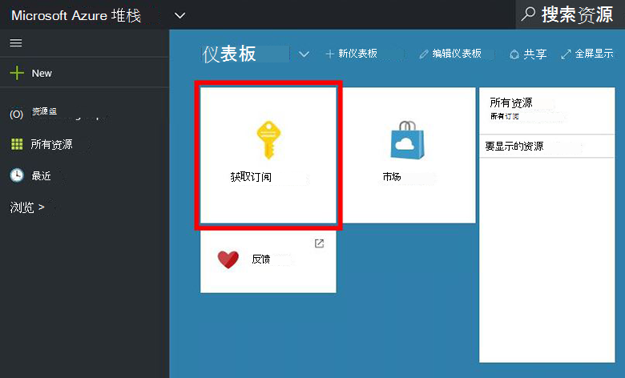
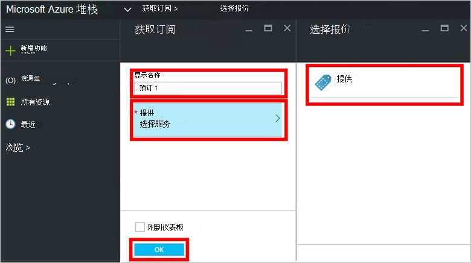
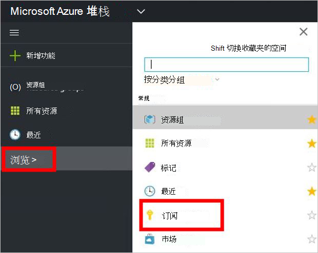

<properties
    pageTitle="提供订阅，并且设置 Azure 堆栈 （租户） 中的一个虚拟机 |Microsoft Azure"
    description="作为承租人，了解如何提供订阅，并且设置 Azure 堆栈中的一个虚拟机。"
    services="azure-stack"
    documentationCenter=""
    authors="ErikjeMS"
    manager="byronr"
    editor=""/>

<tags
    ms.service="azure-stack"
    ms.workload="na"
    ms.tgt_pltfrm="na"
    ms.devlang="na"
    ms.topic="get-started-article"
    ms.date="09/26/2016"
    ms.author="erikje"/>

# 为服务订阅

现在，您已经[创建报价](azure-stack-create-offer.md)，测试您的租户可以创建订阅。

1.  在 Azure 堆栈 POC 计算机，登录`https://portal.azurestack.local`作为[承租人](azure-stack-connect-azure-stack.md#log-in-as-a-tenant)并单击**订阅**。

    

2.  在**显示名称**字段中，键入您的订阅的名称**提供了**单击其中一个**优惠选择**刀片式服务器，以提供和，然后单击**创建**。

    

4.  要查看您创建的订阅，请单击**浏览**，单击**订阅**，然后单击您的新订购。  

    

您订阅的报价后，刷新门户网站以查看哪些服务属于新订阅。

## 下一步行动

[配置虚拟机](azure-stack-provision-vm.md)
