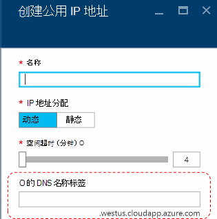
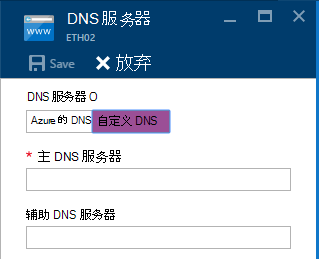
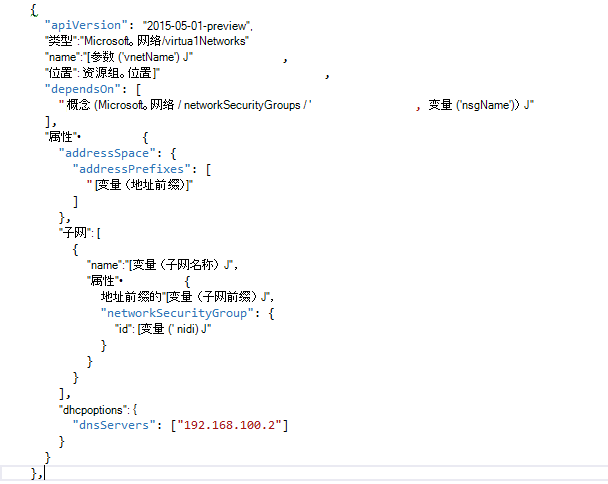

<properties
    pageTitle="了解在 Azure 堆栈 TP2 DNS |Microsoft Azure"
    description="了解新的 DNS 功能和功能在 Azure 堆栈 TP2"
    services="azure-stack"
    documentationCenter=""
    authors="ScottNapolitan"
    manager="darmour"
    editor=""/>

<tags
    ms.service="azure-stack"
    ms.workload="na"
    ms.tgt_pltfrm="na"
    ms.devlang="na"
    ms.topic="get-started-article"
    ms.date="09/26/2016"
    ms.author="scottnap"/>

# 介绍 idn Azure 堆栈，则
================================

idn，则是技术预览 2 Azure 堆栈，可用于解析外部 DNS 名称 （例如 http://www.bing.com) 中的新功能。
它还允许您将内部的虚拟网络名称注册。 通过这种方式，可以解决虚拟机相同的虚拟网络上通过名称而不是 IP 地址，而无需提供 DNS 服务器的自定义项目。

事情一直都有在 Azure，但现在它太在 Windows 服务器 2016年和 Azure 堆栈中可用。

Idn，则有何功能？
------------------

与 idn Azure 堆栈中，则，而无需指定 DNS 服务器的自定义项目获得了以下功能。

-   共享针对租户工作负载的 DNS 名称解析服务。

-   获得名称解析和 DNS 注册租户虚拟网络中的权威 DNS 服务。

-   从租户的 Vm 的 Internet 名称解析的递归 DNS 服务。 承租人不再需要指定自定义的 DNS 条目来解析互联网名称 (例如，www.bing.com)。

仍可以使您自己的 DNS，并如果您希望使用自定义的 DNS 服务器。 但现在，如果您只希望能够解决 Internet DNS 命名并能连接到相同的虚拟网络中的其他虚拟机，您不需要指定任何内容并能。

Idn，则不做些什么？
---------------------

Idn，哪些则不允许您执行的是创建可以从虚拟的网络外部解析的名称的 DNS 记录。

在 Azure，您必须指定一个 DNS 名称标签，可以与一个公共 IP 地址相关联的。 您可以选择标签 （前缀），但 Azure 选择后缀，这根据您在其中创建的公用 IP 地址的区域。

在上面的图像中，Azure 将创建的"A"记录在 DNS 区域**westus.cloudapp.azure.com**下指定的 DNS 名称标签。 前缀和后缀组合在一起构成了完全限定域名 (FQDN) 可解析从任何地方到公用互联网。

在 TP2，Azure 堆栈仅支持 idn，则内部名称登记，因此它无法执行以下。

-   创建 DNS 记录下现有承载 DNS 区域 (例如，azurestack.local)。

-   创建 DNS 区域 （如 Contoso.com)。

-   创建您自己的自定义 DNS 区域下一条记录。

-   支持购买的域名。

更改在 DNS 中从 Azure 堆栈 TP1
-----------------------------------

在 Azure 堆栈的技术预览 1 (TP1) 发布，您必须提供自定义的 DNS 服务器，如果想要能够解析主机名称而不是按 IP 地址。 这意味着，如果您正在创建的虚拟网络或虚拟机，您必须提供至少一个 DNS 服务器条目。 对于 TP1 POC 环境中，这意味着输入该 POC 结构 DNS 服务器，即 192.168.200.2 的 IP。

如果您创建了一个通过门户的虚拟机，您必须在虚拟网络连接或以太网适配器设置中选择**自定义的 DNS** 。

在 TP2，您可以选择 Azure DNS 并不需要指定自定义的 DNS 服务器条目。

如果您创建一个 VM 模板通过使用您自己的图像，您必须添加**DHCPOptions**属性和 DNS 服务器来获取 DNS 名称解析正常工作。 下图显示了这样的样子。

在 TP2，不再需要对您的虚拟机模板，以允许您的 Vm 来解析互联网名称进行这些更改。 他们应该能解决问题。