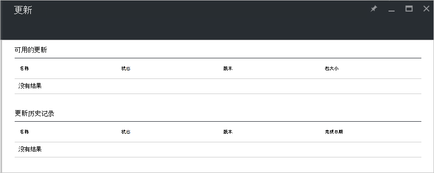

<properties
    pageTitle="在 Azure 堆栈中的更新 |Microsoft Azure"
    description="了解有关在 Azure 堆栈中的更新"
    services="azure-stack"
    documentationCenter=""
    authors="HeathL17"
    manager="byronr"
    editor=""/>

<tags
    ms.service="azure-stack"
    ms.workload="na"
    ms.tgt_pltfrm="na"
    ms.devlang="na"
    ms.topic="article"
    ms.date="09/26/2016"
    ms.author="Helaw"/>

# 在 Azure 堆栈中的更新管理
技术预览 2 引入管理 Azure 堆栈更新体验的预览。  在本主题中，您将导航到更新节点。  

## 更新刀片式服务器
1.  若要访问更新刀片式服务器，请单击**浏览**，然后单击**更新**。

2.  单击**本地**位置。

3.  您将看到一个屏幕，其中列出可用的更新，并更新历史记录。  技术预览 2，在没有更新将可供安装。  

    

## 下一步行动
- [了解 Azure 堆栈 POC 体系结构](azure-stack-architecture.md)      
- [了解部署系统必备组件](azure-stack-deploy.md)
- [部署 Azure 堆栈](azure-stack-run-powershell-script.md)
 
    
  

  

