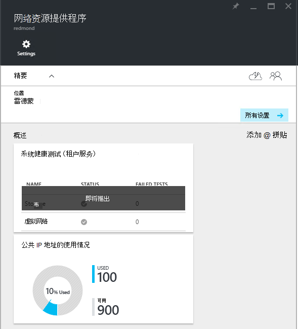
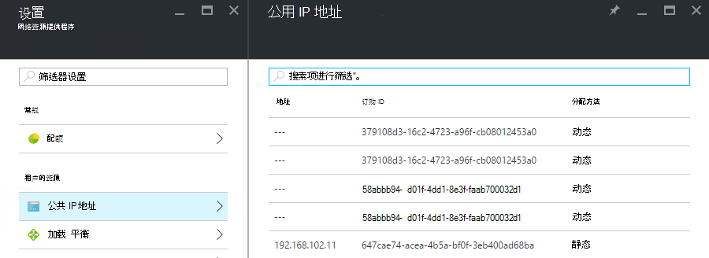

<properties
    pageTitle="查看公用 IP 地址的消耗情况的 TP2 |Microsoft Azure"
    description="管理员可以查看区域中的公用 IP 地址的消耗"
    services="azure-stack"
    documentationCenter=""
    authors="ScottNapolitan"
    manager="darmour"
    editor=""/>

<tags
    ms.service="azure-stack"
    ms.workload="na"
    ms.tgt_pltfrm="na"
    ms.devlang="na"
    ms.topic="get-started-article"
    ms.date="09/26/2016"
    ms.author="scottnap"/>

# 在 Azure 堆栈 TP2 查看公用 IP 地址的消耗情况

作为服务管理员，您可以查看已分配给承租人，来分配，仍然可用的公用 IP 地址的数目和百分比在该位置中已分配的公用 IP 地址的公用 IP 地址的数目。

**公共 IP 地址使用**平铺显示的公用 IP 地址已用完所有的公用 IP 地址池结构上跨，是否他们已用于租户 IaaS VM 实例、 结构基础结构服务或由承租人显式创建的公用 IP 地址资源的总数。

此麻将牌的目的是使 Azure 堆栈管理员总数已消耗在此位置的公用 IP 地址的一种。 这可以帮助管理员确定是否这些不足对此资源。

在**设置**刀片式服务器，**租户资源**下的**公用 IP 地址**菜单项列出只这些公用 IP 地址已被*显式创建的承租人*。 在这种情况下，**使用**公用 IP 地址的**公用 IP 地址使用**平铺数始终是不同的 （超过）**租户资源**下的**公用 IP 地址**图块上的数字。

## 查看公用 IP 地址使用信息

若要查看已消耗在区域中的公用 IP 地址的总数︰

1.  在 Azure 堆栈门户中，单击**浏览**，然后选择**资源提供程序**。

2.  **资源提供程序**的列表中，选择**网络资源提供者管理**。

3.  或者，也可以单击浏览**|位置**，然后选择您想要查看列表中的位置。 然后，在**资源提供程序**界面上选择**网络资源提供者管理**。

4.  **网络资源提供商**登录刀片式服务器在**概述**部分中显示的**公用 IP 地址使用**平铺。

请记住，**使用**数字代表从所有公共 IP 地址的公用 IP 地址分配的池在该位置。 **可用**数字代表从所有公共 IP 地址的公用 IP 地址池尚未分配，仍然可以使用。 中所有公共 IP 地址的使用或分配地址数公用 IP 总数的百分比**%使用**数字表示地址池在该位置。

## 查看由租户订阅创建的公用 IP 地址

要查看显式创建的租户订阅特定区域中的公用 IP 地址的列表，请转到**设置**刀片式服务器的**网络资源提供程序管理**，然后选择**公用 IP 地址**。

您可能注意到某些公用 IP 地址动态分配出现在列表中，但没有尚未与它们相关联的地址。 这是因为地址资源，尚未创建网络资源提供者，而非网络控制器。

网络控制器不会为此资源分配地址，直到它实际绑定到接口、 网络接口卡 (NIC)、 负载平衡器或虚拟网络网关。 时的公用 IP 地址绑定到一个接口中，网络控制器分配 IP 地址，并在**地址**字段中显示。

## 视图的公用 IP 地址的信息汇总表

有大量的公用 IP 地址分配的不同确定地址是否出现在列表中一个或另一个事例。

| **公共 IP 地址的分配情况** | **出现在使用率摘要** | **在租户公用 IP 地址列表中显示** |
| ------------------------------------- | ----------------------------| ---------------------------------------------- |
| 尚未分配到 NIC 或负载平衡器 （临时） 的动态公用 IP 地址 | 不 | 是的 |
| 分配给 NIC 或负载平衡器的动态的公用 IP 地址。 | 是的 | 是的 |
| 分配给租户 NIC 或负载平衡器的静态的公用 IP 地址。 | 是的 | 是的 |
| 指派给结构基础结构服务终结点的静态的公用 IP 地址。 | 是的 | 不 |
| 公共 IP 地址和隐式为 IaaS VM 实例创建用于在虚拟网络上的出站 NAT。 这些是只要承租人创建一个 VM 实例，以便虚拟机可以发送信息给互联网，在幕后创建。 | 是的 | 不 |
