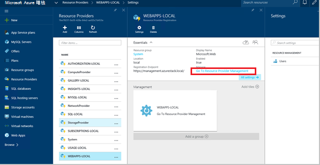
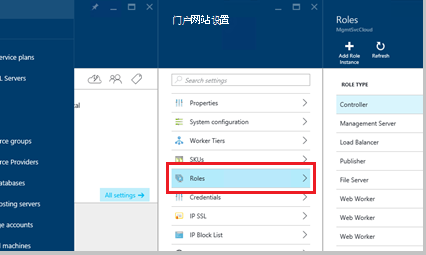
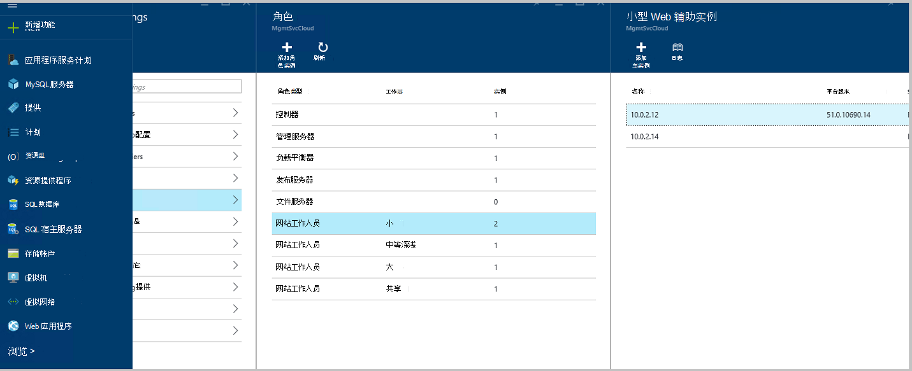
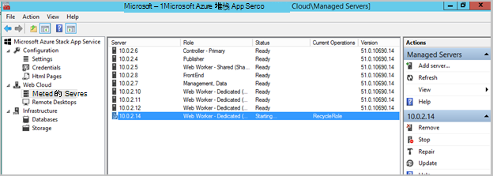
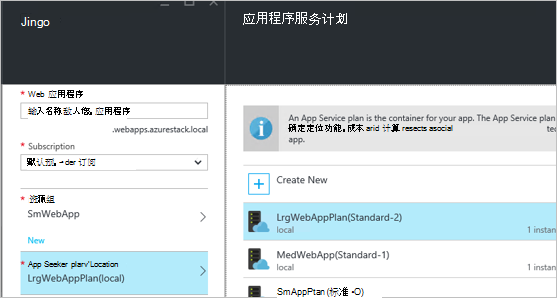
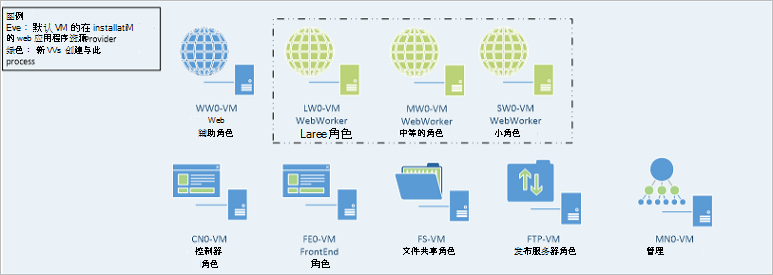

<properties
    pageTitle="添加更多的 web 应用程序的 Web 辅助角色 |Microsoft Azure"
    description="对于缩放 Azure 堆栈 Web 应用程序的详细的指导"
    services="azure-stack"
    documentationCenter=""
    authors="kathm"
    manager="slinehan"
    editor=""/>

<tags
    ms.service="azure-stack"
    ms.workload="app-service"
    ms.tgt_pltfrm="na"
    ms.devlang="na"
    ms.topic="article"
    ms.date="09/26/2016"
    ms.author="kathm"/>

#   <a name="web-apps-adding-more-web-worker-roles"></a>Web 应用程序︰ 添加多个 web 辅助角色

> [AZURE.NOTE] 以下信息只适用于 Azure 堆栈 TP1 部署中。

本文档提供有关如何扩展 Web 应用程序 web 辅助角色的说明。 它包含创建其他 web 辅助角色，以支持 web 的应用程序提供的任意大小的步骤。

Azure 堆栈支持免费和共享的 web 应用程序部署。 若要添加其他类型，您将需要添加多个 web 辅助角色。

如果您不能确定什么默认 Web 应用程序安装与部署，您可以查看其他信息[在此处](azure-stack-webapps-overview.md)。

以下步骤都需要到缩放 web 辅助角色︰

1.  [创建新的虚拟机](#step-1-create-a-new-vm-to-support-the-new-instance-size)

2.  [配置虚拟机](#step-2-configure-the-virtual-machine)

3.  [在 Azure 堆栈门户配置 web 辅助角色](#step-3-configure-the-web-worker-role-in-the-azure-stack-portal)

4.  [配置应用程序服务计划](#step-4-configure-app-service-plans)

##<a name="step-1-create-a-new-vm-to-support-the-new-instance-size"></a>步骤 1︰ 创建新的虚拟机，以支持新的实例大小

[这篇文章](azure-stack-provision-vm.md)，确保进行以下选择中所述创建虚拟机︰

 - 用户名和密码︰ 提供相同的用户名和密码提供安装 Web 应用程序时。

 - 订阅︰ 使用默认提供程序订阅。

 - 资源组︰ 选择**AppService 本地**。

> [AZURE.NOTE]将辅助角色的虚拟机存储在应用程序部署到 Web 应用程序所在的资源组。 （这是建议使用此版本的。）

##<a name="step-2-configure-the-virtual-machine"></a>步骤 2︰ 配置虚拟机

一旦完成部署，支持 web 辅助角色需要以下配置︰

1.  在主机上，打开服务器管理器，单击**工具** &gt; **HyperV 管理器**。

2.  通过使用与您在步骤 1 中创建新的虚拟机的远程桌面协议 (RDP) 连接。 服务器的名称位于摘要窗格中选中每个虚拟机。

3.  通过单击**开始**按钮，然后键入 PowerShell PowerShell。 右键单击**PowerShell.exe**，然后选择**以管理员身份运行**在管理员模式下打开 PowerShell。

4.  复制和粘贴每个以下命令 （一次一个） 到 PowerShell 窗口，并按输入︰

    ```netsh advfirewall firewall set rule group="File and Printer Sharing" new enable=Yes```
    ```netsh advfirewall firewall set rule group="Windows Management Instrumentation (WMI)" new enable=yes```
    ```reg add HKLM\\SOFTWARE\\Microsoft\\Windows\\CurrentVersion\\Policies\\system /v LocalAccountTokenFilterPolicy /t REG\_DWORD /d 1 /f```

5.  重新启动虚拟机。

> [AZURE.NOTE]注意︰ 这些是 Web 应用程序的最低硬件要求。 它们是 Azure 堆栈中包含的 Windows 2012 R2 图像的默认设置。 提供了说明，供将来参考，并为那些使用不同的图像。

##<a name="step-3-configure-the-web-worker-role-in-the-azure-stack-portal"></a>步骤 3︰ 在 Azure 堆栈门户配置 web 辅助角色

1.  作为**ClientVM**的服务管理员打开门户。

2.  导航到**资源提供商** &gt; **WEBAPPS 本地**。

    
 
3.  单击**转到资源提供者管理**。

4.  单击**角色**。

    
 
5.  单击**添加角色实例**。

6.  单击您想要部署到 （小中，大，或共享） 的新实例**层**。

    
 
7.  进行以下配置︰
 - 服务器名︰ 提供 （在第 1 节） 创建的服务器的 IP 地址。
 - 角色类型︰ Web 工作人员。
 - 工作层︰ 匹配层所选大小。

8. 单击**确定。**

9. 登录到 CN0 虚拟机，然后打开**Web 云管理 MMC**。

10. 导航到**Web 云** &gt; **的受控服务器**。

11. 单击您刚部署的服务器名称。 检查状态列中，并等待下, 一步将移到状态为"就绪"。

    

##<a name="step-4-configure-app-service-plans"></a>步骤 4︰ 配置应用程序服务计划

> [AZURE.NOTE]在 Web 应用程序的当前版本中，必须在单独的资源组中存储应用程序服务计划。 构建 web 应用程序中，每个大小为一个资源组，其相应的资源组中放置应用程序计划。

1.  登录到门户网站 ClientVM 上。

2.  导航到**新** &gt; **Web 和移动**。

3.  选择想要部署的 web 应用程序。

4.  为 web 应用程序，提供信息，然后选择**AppService 计划 / 位置**。

-   单击**新建**。

-   创建新的计划，选择相应的定价层计划。

> [AZURE.NOTE]您可以创建时此刀片式服务器上的多个计划。 但是，部署之前请确保选择了相应的计划。

下面显示可用的多个计划的一个示例︰    

##<a name="final-web-app-service-vm-configuration"></a>最终的 Web 应用程序服务虚拟机配置

下面的图像提供环境的视图，当有扩展 web 辅助角色。 绿色的项表示新增的角色。
    
