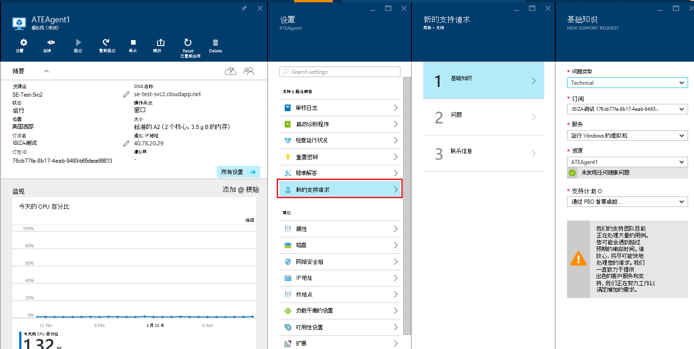
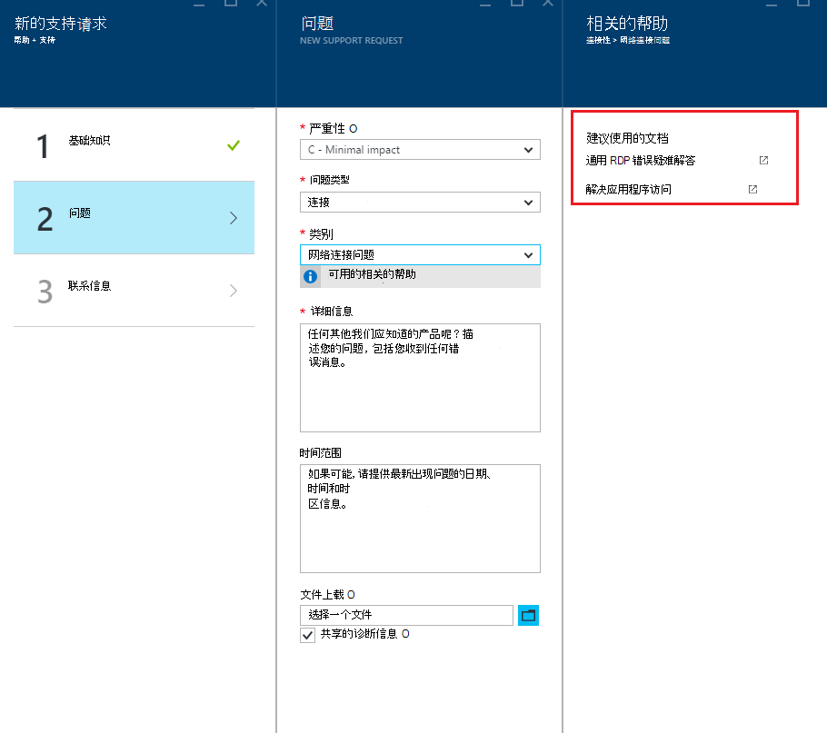

<properties
     pageTitle="如何创建 Azure 支持请求 |Microsoft Azure"
     description="如何创建 Azure 支持请求。"
     services="Azure Supportability"
     documentationCenter=""
     authors="ganganarayanan"
     manager="scotthit"
     editor=""/>

<tags
     ms.service="azure-supportability"
     ms.workload="na"
     ms.tgt_pltfrm="na"
     ms.devlang="na"
     ms.topic="article"
     ms.date="10/25/2016"
     ms.author="gangan"/>

# 如何创建 Azure 支持请求

## 摘要
Azure 的客户可以创建和管理在 Azure 的门户中， [https://portal.azure.com](https://portal.azure.com)的支持请求。
>[AZURE.NOTE] 德国的 Azure 门户是[https://portal.microsoftazure.de](https://portal.microsoftazure.de)和[https://portal.azure.us](https://portal.azure.us)是 Azure 的政府门户网站。

根据客户反馈，我们已能够专注于三个主要目标更新支持请求体验︰

- **Streamlined**︰ 减少点击和刀片可简化提交技术支持请求的过程。
- **集成版**︰ 当您正在排查 Azure 的资源问题时，它应该很容易无需切换上下文中打开该资源的支持请求。
- **高效**︰ 收集关键信息技术支持工程师将需要有效地解决您的问题。

## 入门教程
从顶部导航菜单或直接从资源刀片式服务器，您可以创建一个支持请求。

**从顶部导航栏**

**从资源刀片式服务器**

## 基础知识
支持请求过程的第一步收集有关您的问题和支持计划的基本信息。

让我们来看一个例子︰ 与虚拟机正在面临技术困难和怀疑网络连接问题。
在向导的第一步中选择的服务 （"虚拟机运行 Windows"） 和资源 （您的虚拟机的名称） 启动的进程获得帮助以解决此问题。

>[AZURE.NOTE] Azure 订阅管理 （诸如帐单、 配额调整和帐户转移） 提供无限制的支持。 要获得技术支持，您需要支持计划。 [了解更多有关的支持计划](https://azure.microsoft.com/support/plans)。

## 问题
在向导的第二步会收集有关该问题的其他详细信息。 提供准确的详细信息，在这一步让我们来将您的案例路由到最佳的技术支持工程师的问题，并着手尽快诊断该问题。

继续从上面的虚拟机连接示例，需要填写此窗体可以指示网络连接问题，并将提供更多细节的问题，包括当您遇到此问题的大致时间。

## 相关的帮助
对于某些问题，我们将提供相关的帮助链接来解决这些问题。 如果没有帮助的建议的文档，您可以继续通过创建一个支持请求的过程。

## 联系信息
在向导的最后一步确认您的联系信息，以便我们知道如何与您联系。

根据您的问题的严重性，您可能会要求以指示您是否想我们与您联系在上班或如果您希望使用全天候响应，这意味着我们可以在任何时候联系您。

## 管理支持请求
创建支持请求后，您可以查看**管理支持请求**页的详细信息。

**从顶部导航栏**

在**管理支持请求**页上，您可以查看所有支持请求和它们的状态。

选择要查看详细信息，包括严重和为技术支持工程师进行响应的预期的时间的支持请求。

如果您想要更改请求的严重性级别，请单击**对业务的影响**平铺。 在上面的示例中，该请求当前设置为严重度 c。

单击拼贴显示严重性可以向打开的支持请求分配的列表。

>[AZURE.NOTE] 最高严重等级级别取决于您的支持计划。 [了解更多有关的支持计划](https://azure.microsoft.com/support/plans)。

## 反馈
我们都是开放的反馈和建议 ！ 请向我们发送您的[建议](https://feedback.azure.com/forums/266794-support-feedback)。 此外，您可以与我们进行通过[使用 Twitter](https://twitter.com/azuresupport)或[MSDN 论坛](https://social.msdn.microsoft.com/Forums/azure)。

## 了解更多信息
[Azure 的支持常见问题解答](https://azure.microsoft.com/support/faq)
