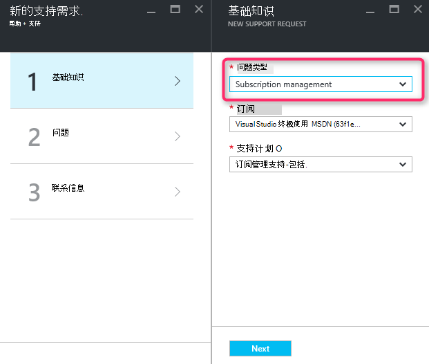

<properties
     pageTitle="不可用的 SKU 系列 |Microsoft Azure"
     description="一些 SKU 系列不可用于此区域选择的订阅。"
     services="Azure Supportability"
     documentationCenter=""
     authors="ganganarayanan"
     manager="scotthit"
     editor=""/>

<tags
     ms.service="azure-supportability"
     ms.workload="na"
     ms.tgt_pltfrm="na"
     ms.devlang="na"
     ms.topic="article"
     ms.date="08/12/2016"
     ms.author="gangan"/>

# 不可用的 SKU 系列

在某些地区，某些 Sku 不会自动提供关于新的预订。  [区域中引入了更强大的 Sku](https://azure.microsoft.com/updates/announcing-new-dv2-series-virtual-machine-size/)和旧的普及 SKU 下降可能发生该错误。
创建支持请求来增加计算核心配额时，将显示"*部分 SKU 系列不可用于此区域的选定订阅*"消息。

您可以查阅 SKU 在[Azure 服务区域的](https://azure.microsoft.com/regions/#services)页面的可用性。 

若要请求的访问权限从您的订阅限制了 SKU，创建"订阅管理"支持请求。

- 在基本操作页上选择问题类型为"订阅管理"并单击"下一步"。

- 在问题页上，选择问题类型为"其他常规问题"和输入的完全相同的区域和 SKU 没有看见。
这将有助于加快支持过程。

- 在联系信息页面上输入您的联系详细信息，请单击"创建"。

## 反馈
我们都是开放的反馈和建议 ！ 向我们发送您的[建议](https://feedback.azure.com/forums/266794-support-feedback)。 此外，您可以与我们进行通过[使用 Twitter](https://twitter.com/azuresupport)或[MSDN 论坛](https://social.msdn.microsoft.com/Forums/azure)。

## 了解更多信息
[Azure 的支持常见问题解答](https://azure.microsoft.com/support/faq)
