<properties
    pageTitle="从备份存储库中的另一个 DPM 服务器恢复数据 |Microsoft Azure"
    description="恢复您已从注册到该存储库的任何 DPM 服务器保护到 Azure 备份存储库的数据。"
    services="backup"
    documentationCenter=""
    authors="nkolli1"
    manager="shreeshd"
    editor=""/>

<tags
    ms.service="backup"
    ms.workload="storage-backup-recovery"
    ms.tgt_pltfrm="na"
    ms.devlang="na"
    ms.topic="article"
    ms.date="08/08/2016"
    ms.author="giridham;jimpark;trinadhk;markgal"/>

# 从备份存储库中的另一个 DPM 服务器恢复数据
现在，您可以恢复您已从注册到该存储库的任何 DPM 服务器保护到 Azure 备份存储库的数据。 因此，这样做的过程完全集成到 DPM 管理控制台，类似于其他恢复工作流。

若要从备份存储库中的另一个 DPM 服务器恢复数据将需要[系统中心 Data Protection Manager UR7](https://support.microsoft.com/en-us/kb/3065246)和[最新的 Azure 备份代理](http://aka.ms/azurebackup_agent)。

## 从另一个 DPM 服务器恢复数据
要从另一个 DPM 服务器恢复数据︰

1. 从 DPM 管理控制台的**恢复**选项卡上，单击**添加外部 DPM** (在屏幕的左上方)。

    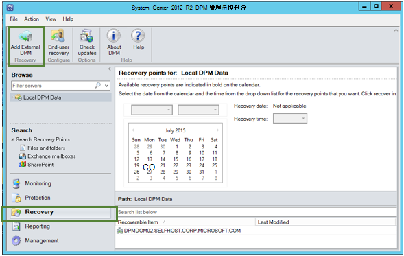

2. 下载新的**存储库凭据**存储库相关的**DPM 服务器**的数据将被恢复，从备份存储库，使用注册的 DPM 服务器的列表中选择 DPM 服务器并提供**加密密码短语**与 DPM 服务器正在恢复其数据。

    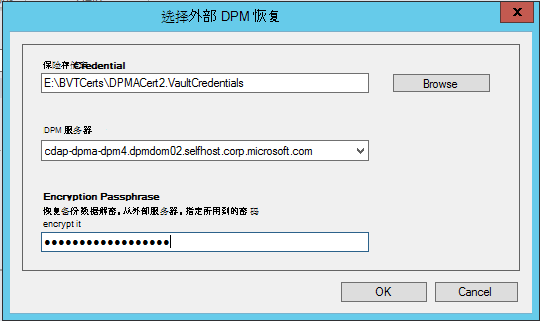

    >[AZURE.NOTE] 只与同一注册存储库相关的 DPM 服务器可以恢复彼此的数据。

    已成功添加外部 DPM 服务器后，您可以浏览外部 DPM 服务器和本地 DPM 服务器**恢复**选项卡中的数据。

3. 浏览外部 DPM 服务器保护的生产服务器的可用列表并选择相应的数据源。

    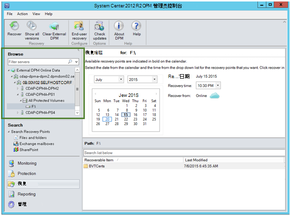

4. 选择**月份和年份**从**恢复点**下拉列表中，选择所需的**恢复日期**创建恢复点时，然后选择**恢复时间**。

    文件和文件夹的列表将显示在底部窗格中进行浏览和恢复到任何位置。

    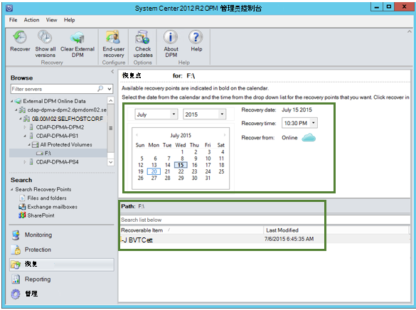

5. 右键单击适当的项目，单击**恢复**。

    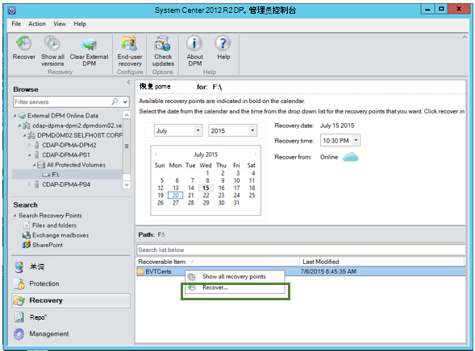

6. 查看**所选内容中恢复**。 验证数据和要恢复的备份副本的时间，以及从中创建备份副本的源。 如果所选内容不正确，请单击**取消**以返回到恢复选项卡上，选择适当的恢复点。 如果所选内容是正确的请单击**下一步**。

    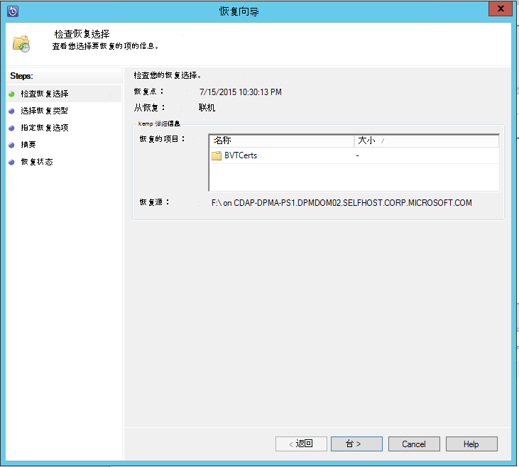

7. 选择**恢复到备用位置**。 **浏览**可用于恢复的正确位置。

    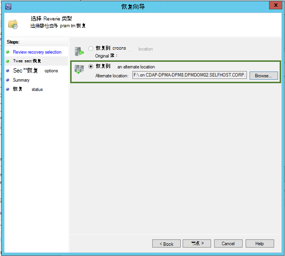

8. 选择的选项与**创建副本**、**跳过**或**覆盖**。
    - 事件没有名称冲突，**创建副本**将创建该文件的副本。
    - 恢复文件没有名称冲突的事件中，**跳过**将跳过。
    - **覆盖**将覆盖现有文件复制在发生名称冲突时指定的位置。

    选择适当选项**还原安全机制**。 您可以应用安全设置的目标计算机的数据将被恢复或在恢复点的创建的时间是适用于产品的安全设置。

    确定是否在恢复成功完成之后，将发送一条**通知**。

    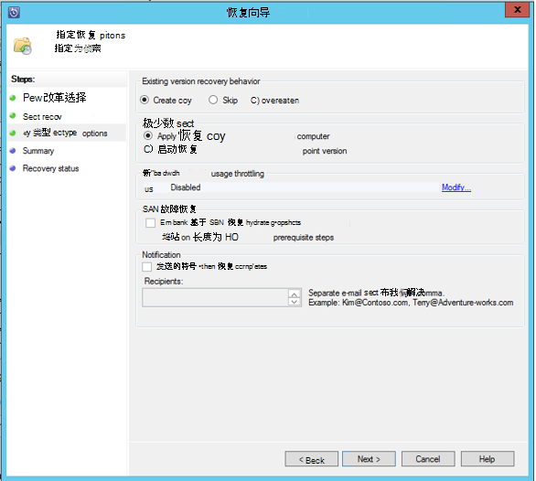

9. **摘要**屏幕列出到目前为止所选择的选项。 当您单击**恢复**时，则会将数据恢复到适当的内部部署位置。

    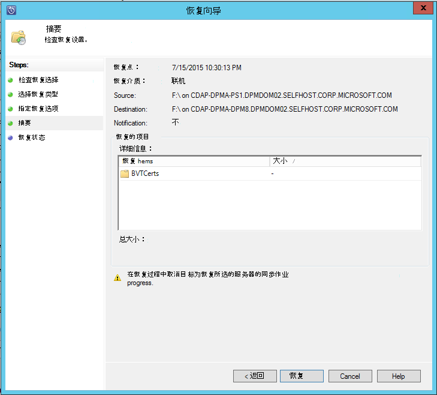

    >[AZURE.NOTE] 恢复作业都可监视 DPM 服务器的**监视**选项卡中。

    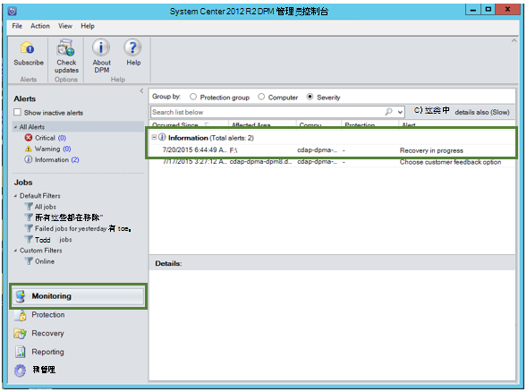

10. 要删除外部的 DPM 服务器的视图的 DPM 服务器的**恢复**选项卡上，您可以单击**清除外部 DPM** 。

    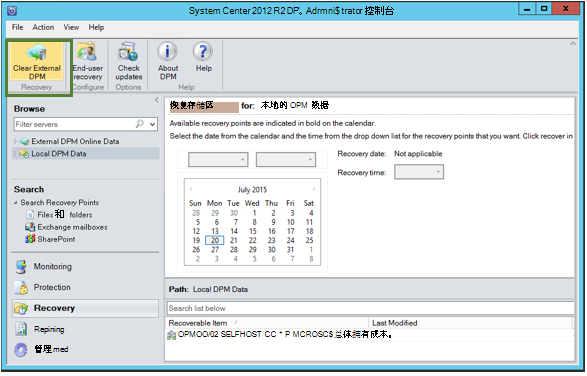

## 错误消息疑难解答
|不。 |  错误消息 | 故障排除步骤。 |
| :-------------: |:-------------| :-----|
|1。|        此服务器未注册到指定的存储库凭据存储库。|  **的原因︰**选定的存储库凭据文件不属于相关的 DPM 服务器尝试恢复备份存储库时，会出现此错误。   **解决方案︰**下载从 DPM 服务器注册到该备份存储库存储库凭据文件。|
|2。|        可恢复的数据不可用，或者所选的服务器不是一个 DPM 服务器。|   **的原因︰**有没有其他 DPM 服务器与 DPM 2012 R2 UR7 注册到备份存储库，或 DPM 服务器，DPM 2012 R2 UR7 与不尚未上载的元数据，或选定的服务器不是 DPM 服务器 （也称为 Windows 服务器或 Windows 客户端）。   **解决方案︰**如果有其他 DPM 服务器注册到备份存储库，请确保 SCDPM 2012 R2 UR7 和新 Azure 备份安装代理。  如果有其他 DPM 服务器注册到备份存储区与 DPM 2012 R2 UR7，等待安装的 UR7 开始恢复过程后的一天。 夜间作业将上载所有以前受保护的备份至云的元数据。 可恢复数据。|
|3。|        没有其他 DPM 服务器已注册到此电子仓库。|   **的原因︰**没有任何其他 DPM 服务器与 DPM 2012 R2 UR7 或以上注册到电子仓库正在尝试故障恢复。 **解决方案︰**如果有其他 DPM 服务器注册到备份存储库，请确保 SCDPM 2012 R2 UR7 和新 Azure 备份安装代理。 如果有其他 DPM 服务器注册到备份存储区与 DPM 2012 R2 UR7，等待安装的 UR7 开始恢复过程后的一天。 夜间作业将上载所有以前受保护的备份至云的元数据。 可恢复数据。|
|4。|        提供的加密密码与密码短语与下列服务器不匹配︰**<server name>**|  **的原因︰**加密的数据从正在恢复的 DPM 服务器的数据的过程中所使用的加密密码与提供加密密码不匹配。 工程师不能对数据进行解密。 因此恢复失败。 **解决方案︰**请提供与 DPM 服务器正在恢复其数据完全相同的加密密码。|

## 常见问题及的解答︰
1. **为什么不能添加外部 DPM 服务器从另一个 DPM 服务器安装的 UR7 和最新的 Azure 备份代理后？**

    A） 对现有的 DPM 服务器与受云 （早于更新汇总 7 使用更新汇总） 的数据源，您必须等待至少一天要开始*添加外部 DPM 服务器*的 UR7 和最新的 Azure 备份代理在安装之后。 这需要将 DPM 玂臔竤舱的元数据上载到 Azure。 出现这种情况第一次通过夜间作业。

2. **Azure 备份代理程序所需的最低版本是什么？**

    A） 的 Azure 的备份代理程序最低版本以启用此功能是 2.0.8719.0。  可以通过导航到控制面板验证 azure 的备份代理版本**>**所有控制板面的项目**>**程序和功能**>**Microsoft Azure 恢复服务代理。 如果版本小于 2.0.8719.0，下载[最新的 Azure 备份代理程序](https://go.microsoft.com/fwLink/?LinkID=288905)并安装。

    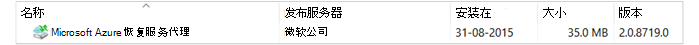

## 下一步︰
•[备份的 azure 常见问题解答](backup-azure-backup-faq.md)
