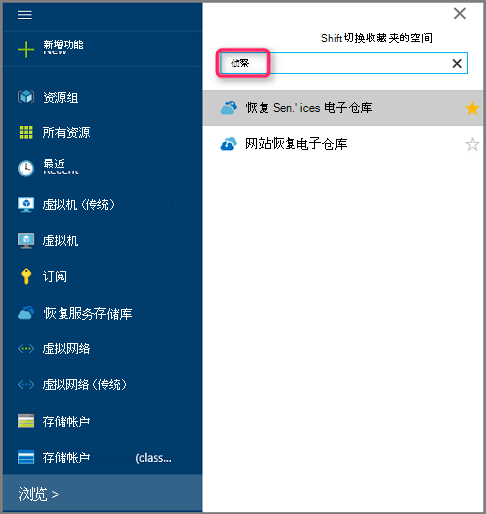
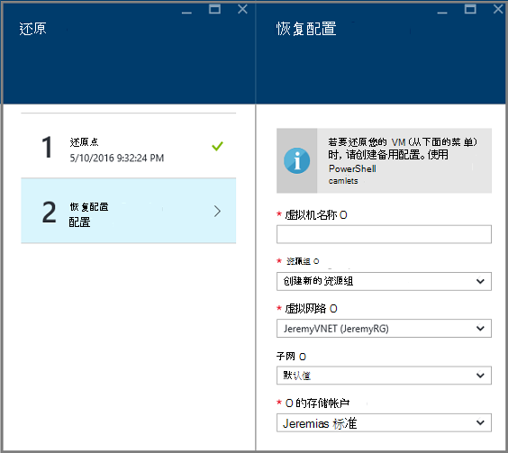

<properties
    pageTitle="从使用 Azure 门户的备份中还原虚拟机 |Microsoft Azure"
    description="从恢复点使用 Azure 门户恢复 Azure 的虚拟机"
    services="backup"
    documentationCenter=""
    authors="markgalioto"
    manager="cfreeman"
    editor=""
    keywords="还原备份;如何还原;恢复点;"/>

<tags
    ms.service="backup"
    ms.workload="storage-backup-recovery"
    ms.tgt_pltfrm="na"
    ms.devlang="na"
    ms.topic="article"
    ms.date="08/10/2016"
    ms.author="trinadhk; jimpark;"/>

# 使用 Azure 门户网站还原虚拟机

> [AZURE.SELECTOR]
- [在传统门户网站还原虚拟机](backup-azure-restore-vms.md)
- [在 Azure 门户网站还原虚拟机](backup-azure-arm-restore-vms.md)

通过在定义的时间间隔将数据快照保护您的数据。 这些快照被称为恢复点和恢复服务存储库中存储。 如果或当需要修复或重建一个虚拟机，您可以从任何已保存的恢复点恢复 VM。 当恢复的恢复点时，则返回或恢复点拍摄时还原虚拟机的状态。 本文介绍了如何还原虚拟机。

> [AZURE.NOTE] Azure 具有用于创建和使用资源的两种部署模型︰[资源管理器和经典](../resource-manager-deployment-model.md)。 这篇文章提供的信息和过程还原部署使用资源管理器模型的虚拟机。

## 恢复的恢复点

1. 登录到[Azure 门户](http://portal.azure.com/)

2. 在 Azure 的菜单上，单击**浏览**，并在服务列表中，键入**恢复服务**。 服务列表中的调整到键入的内容。 当您看到**恢复服务存储库**时，请选择它。

    

    将显示在预订中的存储库的列表。

    

3. 从列表中选择与您要还原的虚拟机相关联的电子仓库。 当您单击该存储库时，则其操控板打开。

    

4. 现在，您已经在存储库面板中。 在**备份项**平铺上，单击**Azure 的虚拟机**，以显示与存储库相关联的虚拟机。

    

    **备份项**刀片式服务器将打开并显示 Azure 的虚拟机的列表。

    

5. 从列表中选择虚拟机打开仪表板。 VM 仪表板将打开监视区域，其中包含还原点的图块。

    

6. 在 VM 面板菜单上，单击**还原**

    

    将打开还原刀片式服务器。

    

7. **还原**刀片式服务器，请单击**还原点**以打开**选择还原点**刀片式服务器。

    

    默认情况下，对话框会显示最近 30 天的所有还原点。 使用显示**筛选器**来更改还原点的时间范围。 默认情况下，会显示所有一致性的还原点。 修改**所有还原点**筛选器以选择特定的一致性的还原点。 有关每种类型的还原点，请参见[数据一致性](./backup-azure-vms-introduction.md#data-consistency)的解释。  
    - **还原点一致性**从该列表中选择︰
        - 崩溃一致恢复点
        - 应用程序一致性恢复点，
        - 文件系统一致的恢复点
        - 所有还原点。  

8. 选择一个还原点，然后单击**确定**。

    

    **还原**刀片式服务器显示设置还原点。

    

9. 在**还原**刀片式服务器，**还原配置**将自动打开设置还原点之后。

    

## 选择虚拟机还原配置

既然选择了还原点，请选择还原虚拟机的配置。 配置恢复的 VM 选项包括使用︰ Azure 的门户网站或 PowerShell。

> [AZURE.NOTE] 门户网站还原虚拟机提供快速创建的选项。 如果您希望自定义将来还原虚拟机的虚拟机配置，使用 PowerShell 还原备份磁盘并将其附加到虚拟机配置的选择。 请参阅[还原一个特殊的网络配置的虚拟机](#restoring-vms-with-special-network-configurations)。

1. 如果您尚不存在，请转到**恢复**刀片式服务器。 确保**还原点**已被选中，并单击**恢复配置**以打开**恢复配置**刀片式服务器。

    

2. **恢复配置**刀片式服务器，输入或选择下列字段的每个值︰
    - **虚拟机名称**-为虚拟机提供一个名称。 名称必须是唯一的 （对于经典的 VM) 的云服务的资源组 （用于资源管理器部署的 VM)。 如果它已经存在于该订阅，则不能替换该虚拟机。
    - **资源组**-使用现有资源组，或创建一个新。 如果您正在恢复一个经典的虚拟机，请使用此字段指定新的云服务的名称。 如果创建新资源组/云服务时，名称必须是全局唯一的。 通常情况下，云服务名称是与面向公众的 URL-例如: [cloudservice]。 cloudapp.net。 如果您尝试使用的名称已经在使用云资源组/云服务，Azure 分配资源组/云服务虚拟机相同的名称。 Azure 显示资源组/云服务和虚拟机未与任何相似性组相关联。 有关详细信息，请参阅[如何迁移从好友小组与区域虚拟网 (VNet)](../virtual-network/virtual-networks-migrate-to-regional-vnet.md)。
    - **虚拟网络**的选择 (VNET) 在创建虚拟机的虚拟网络。 字段中提供了与此订阅关联的所有 VNETs。 虚拟机的资源组将显示在括号中。
    - **子网**-如果 VNET 有子网，第一个子网默认选中的。 如果有其他的子网，请选择所需的子网。
    - **存储帐户**-此菜单列出了在恢复服务存储库相同的位置中存储帐户。 在选择存储帐户，选择帐户共享恢复服务存储库所在的位置。 不支持将区域冗余的存储帐户。 如果没有恢复服务存储库所在的位置与存储帐户，您必须创建一个在开始还原操作之前。 在括号中提到的存储帐户复制类型。

    > [AZURE.NOTE] 如果您正在恢复一个资源管理器部署的虚拟机，则必须标识虚拟网络 (VNET)。 虚拟网络 (VNET) 是可选的经典的 VM。

3. **恢复配置**刀片式服务器，请单击**确定**以完成还原配置。

4. 在**还原**刀片式服务器，单击**还原**触发还原操作。

    

## 跟踪执行还原操作

一旦触发还原操作，备份服务创建用于跟踪还原操作作业。 备份服务还会创建和暂时的门户的通知区域中显示通知。 如果看不到通知，您始终可以单击通知图标，以查看您的通知。

在它被处理时，查看该操作或查看它完成时，打开备份作业列表。

1. 在 Azure 的菜单上，单击**浏览**，并在服务列表中，键入**恢复服务**。 服务列表中的调整到键入的内容。 当您看到**恢复服务存储库**时，请选择它。

    

    将显示在预订中的存储库的列表。

    

2. 从列表中选择与您还原虚拟机相关联的电子仓库。 当您单击该存储库时，则其操控板打开。

3. 保险存储仪表板的**备份作业**中平铺，单击**Azure 的虚拟机**，以显示与该存储库相关联的作业。

    

    **备份作业**刀片式服务器将打开并显示作业的列表。

    

## 特殊的网络配置还原虚拟机
也可以备份和还原以下的特殊的网络配置的虚拟机。 但是，这些配置需要时通过还原过程进行一些特殊处理。

- 在负载平衡器 （内部的和外部的） 的虚拟机
- 与多个保留 ip 地址的虚拟机
- 具有多个 Nic 的虚拟机

>[AZURE.IMPORTANT] 在创建虚拟机的特殊的网络配置，必须使用 PowerShell 从磁盘还原创建虚拟机。

若要完全还原到磁盘后重新创建虚拟机，请执行以下步骤︰

1. 请将磁盘恢复使用[PowerShell](../backup-azure-vms-automation.md#restore-an-azure-vm)恢复服务存储库中

2. 创建虚拟机配置所需的负载平衡器/多个 NIC/多保留 IP 使用 PowerShell cmdlet 和使用它创建的虚拟机所需配置。
    - 在[内部负载平衡器](https://azure.microsoft.com/documentation/articles/load-balancer-internal-getstarted/)使用云服务中创建虚拟机
    - 创建虚拟机连接到 [互联网面临负载平衡器] (https://azure.microsoft.com/en-us/documentation/articles/load-balancer-internet-getstarted/)
    - 创建具有[多个 Nic](https://azure.microsoft.com/documentation/articles/virtual-networks-multiple-nics/)的 VM
    - 创建具有[多个保留 ip 地址](https://azure.microsoft.com/documentation/articles/virtual-networks-reserved-public-ip/)的虚拟机

## 下一步行动
现在，您可以恢复您的 Vm，参阅疑难解答信息常见错误及虚拟机上。 另外，请检查出管理任务与您的 Vm 上的文章。

- [解决错误](backup-azure-vms-troubleshoot.md#restore)
- [管理虚拟机](backup-azure-manage-vms.md)
