<properties
    pageTitle="准备您的环境以备份资源管理器部署虚拟机 |Microsoft Azure"
    description="确保您的环境已经做好准备的 Azure 中的虚拟机备份"
    services="backup"
    documentationCenter=""
    authors="markgalioto"
    manager="cfreeman"
    editor=""
    keywords="备份;备份;"/>

<tags
    ms.service="backup"
    ms.workload="storage-backup-recovery"
    ms.tgt_pltfrm="na"
    ms.devlang="na"
    ms.topic="article"
    ms.date="08/21/2016"
    ms.author="trinadhk; jimpark; markgal;"/>


# <a name="prepare-your-environment-to-back-up-resource-manager-deployed-virtual-machines"></a>准备您的环境以备份资源管理器部署虚拟机

> [AZURE.SELECTOR]
- [模型资源管理器](backup-azure-arm-vms-prepare.md)
- [经典模型](backup-azure-vms-prepare.md)

本文提供的步骤准备您的环境以备份资源管理器部署的虚拟机 (VM)。 显示过程中的步骤使用 Azure 的门户。  

Azure 备份服务有两种类型的电子仓库 （电子仓库和恢复服务存储库的备份） 来保护您的虚拟机。 备份存储库来保护虚拟机部署使用经典的部署模型。 恢复服务存储库来保护**两个经典部署或资源管理器部署的虚拟机**。 必须使用恢复服务存储库来保护一个资源管理器部署的虚拟机。

>[AZURE.NOTE] Azure 具有用于创建和使用资源的两种部署模型︰[资源管理器和经典](../resource-manager-deployment-model.md)。 [准备您的环境以备份 Azure 的虚拟机](backup-azure-vms-prepare.md)上使用传统部署模型的虚拟机的详细信息，请参见

可以保护或备份资源管理器部署的虚拟机 (VM) 之前，请确保存在这些系统必备组件︰

- 创建恢复服务存储库 （或识别现有恢复服务存储库）*中 VM 的同一个位置*。
- 选择方案、 定义的备份策略，并定义要保护的项目。
- 检查虚拟机代理的虚拟机上安装。
- 请检查网络连接

如果您知道您的环境中已存在这些条件然后进入[备份您的虚拟机的文章](backup-azure-vms.md)。 如果您需要设置或检查任何这些系统必备组件，这篇文章将引导您完成步骤准备该系统必备组件。


## <a name="limitations-when-backing-up-and-restoring-a-vm"></a>备份和还原 VM 时的限制

准备您的环境之前，请了解的局限性。

- 不支持备份与 16 个以上的数据磁盘的虚拟机。
- 不支持备份虚拟机与保留的 IP 地址和任何已定义的终结点。
- Linux Docker 扩展虚拟机的备份不受支持。 
- 备份数据并不包括安装网络驱动器连接到虚拟机。 
- 不支持在还原期间替换现有的虚拟机。 如果您尝试还原虚拟机虚拟机存在时，还原操作将失败。
- 不支持跨区域的备份和恢复。
- 您可以备份所有公共区域的 Azure 中的虚拟机 （请参见[清单](https://azure.microsoft.com/regions/#services)的支持的地区）。 如果您正在寻找该地区目前的不受支持，它不会在下拉列表中的电子仓库创建过程。
- 您可以备份虚拟机仅用于选择操作系统版本︰
  - **Linux**: Azure 备份支持除核心操作系统 Linux [，都认可通过 Azure 的分配的列表](../virtual-machines/virtual-machines-linux-endorsed-distros.md)。  其他携带-您的自己的 Linux 发行版本还可能只要 VM 代理的虚拟计算机上可用的工作和支持对于 Python 存在。
  - **Windows Server**︰ 不支持的版本早于 Windows Server 2008 R2。
- 还原域控制器只有通过 PowerShell 支持 (DC) 虚拟机是多 DC 配置的一部分。 了解有关信息[还原多个 DC 域控制器](backup-azure-restore-vms.md#restoring-domain-controller-vms)。
- 只有通过 PowerShell 支持还原虚拟机具有以下特殊的网络配置。 还原操作完成后，在用户界面中使用还原工作流创建的虚拟机不会有这些网络配置。 若要了解详细信息，请参阅[还原特殊的网络配置的虚拟机](backup-azure-restore-vms.md#restoring-vms-with-special-netwrok-configurations)。
  - 在负载平衡器配置 （内部的和外部的） 下的虚拟机
  - 具有多个保留的 IP 地址的虚拟机
  - 具有多个网络适配器的虚拟机

## <a name="create-a-recovery-services-vault-for-a-vm"></a>为虚拟机创建恢复服务存储库

恢复服务存储库是存储的备份和恢复点随着时间的推移已创建的实体。 恢复服务存储库还包含与受保护的虚拟机相关的备份策略。

若要创建一个恢复服务存储库︰

1. 登录到[Azure 的门户](https://portal.azure.com/)。

2. 中心的菜单上，单击**浏览**，在资源的列表中，键入**恢复服务**。 在您开始键入时，将筛选列表根据您的输入。 单击**恢复服务存储库**。

    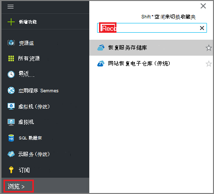 <br/>

    恢复服务存储库列表中的显示。

3. 在**恢复服务存储库**菜单上，单击**添加**。

    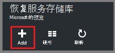

    恢复服务存储库刀片式服务器将打开，并提示您提供的**名称**、**订阅**、**资源组**和**位置**。

    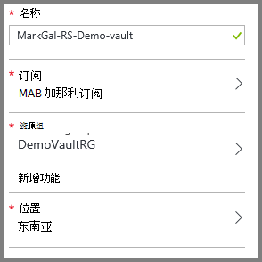

4. 对于**名称**，输入好记的名称来标识该存储库。 名称必须是唯一的 Azure 的订阅。 键入包含 2 至 50 个字符的名称。 它必须以字母开头，可以包含字母、 数字和连字符。

5. 单击以查看可用的订阅的**订阅**。 如果您不能确定要使用哪种订阅，使用默认值 （或建议） 订阅。 将多个选项，如果您组织的帐户与多个 Azure 订阅关联。

6. 单击**资源组**来查看可用资源组列表，或单击**新建**以创建新的资源组。 有关资源组的完整信息，请参阅[Azure 资源管理器概述](../azure-resource-manager/resource-group-overview.md)

7. 单击以选择该存储库的地理区域的**位置**。 保险存储，**必须**是在同一区域作为您想要保护的虚拟机。

    >[AZURE.IMPORTANT] 如果您不确定您的虚拟机所在的位置，存储库创建对话框，关闭并转到门户中的虚拟机的列表。 如果必须在多个区域中的虚拟机，您需要在每个地区创建恢复服务存储库。 在转到下一个位置之前在第一个位置中创建该存储库。 没有必要以指定存储帐户备份数据 — 恢复服务存储库存储和备份 Azure 服务自动处理这。

8. 单击**创建**。 它可能需要一段时间的恢复服务存储库创建。 监视在门户上方右侧区域中的状态通知。 创建存储库后，它的恢复服务存储库列表中显示。

    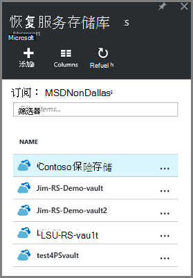

    现在，您已经创建了您的存储库，了解如何设置存储复制。

## <a name="set-storage-replication"></a>设置存储复制

存储复制选项允许您选择地理冗余存储到本地冗余存储之间。 默认情况下，您的存储库具有地理冗余存储。 保留设置为地理冗余存储，如果这是您主要的备份选项。 如果希望不是很一样持久便宜选项，请选择本地冗余存储。 阅读更多关于[地理冗余](../storage/storage-redundancy.md#geo-redundant-storage)和[Azure 存储复制概述](../storage/storage-redundancy.md)中的[本地冗余](../storage/storage-redundancy.md#locally-redundant-storage)存储选项。

若要编辑存储复制设置︰

1. 选择您的存储库，以打开存储库面板，并设置刀片式服务器。 如果未打开刀片式服务器**的设置**，单击存储库面板中的**所有设置**。

2. 在**设置**刀片式服务器，单击**备份基础架构** > 要打开刀片式服务器**备份配置**的**备份配置**。 在**备份配置**刀片式服务器，选择存储复制选项为您的存储库。

    

    在选择了您的存储库的存储选项之后, 您就可以存储库相关联的虚拟机。 若要开始该关联，应发现并注册 Azure 的虚拟机。


## <a name="select-a-backup-goal-set-policy-and-define-items-to-protect"></a>选择备份目标、 策略设置和定义项保护

在注册之前的保险库中，虚拟机运行搜索过程，以确保已添加到该订阅任何新的虚拟机的标识。 在订阅中，及其他信息的虚拟机的列表处理查询 Azure 如云服务名称和地区。 在 Azure 的门户中，方案指的是您要放在恢复服务存储库。 策略是频率以及何时被采取恢复点的计划。 策略还包含恢复点的保留范围。

1. 如果已经打开一个恢复服务存储库，请继续步骤 2。 如果没有打开，保险存储恢复服务，但又在 Azure 的门户中，在中心菜单上，单击**浏览**。

  - 在资源的列表中，键入**恢复服务**。
  - 在您开始键入时，将筛选列表根据您的输入。 当您看到**恢复服务存储库**时，请单击它。

     <br/>

    恢复服务存储库列表中的出现。
  - 从恢复服务存储库列表中，选择存储库。

    所选电子仓库操控板打开。

    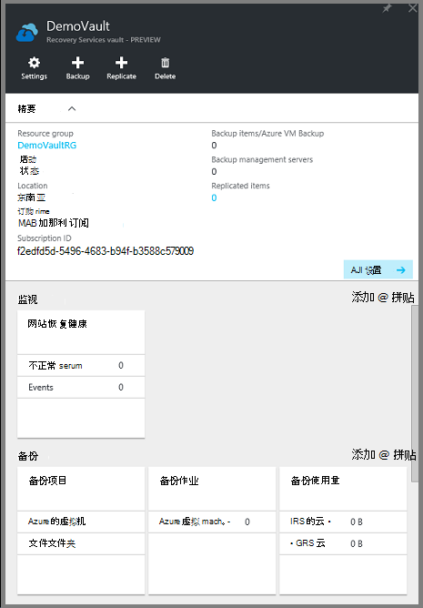

2. 从存储库面板菜单中，单击要打开刀片式服务器备份的**备份**。

    

    当打开刀片式服务器时，备份服务搜索订阅中任何新的虚拟机。

    

3. 在备份刀片式服务器，请单击打开备份目标刀片式服务器的**备份目标**。

    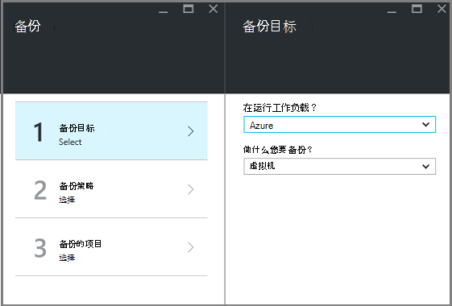

4. 在备份目标刀片式服务器，设置**在运行您的负载**到 Azure 和**您要备份**到虚拟机，然后单击**确定**。

    备份目标刀片式服务器关闭并打开备份策略刀片式服务器。

    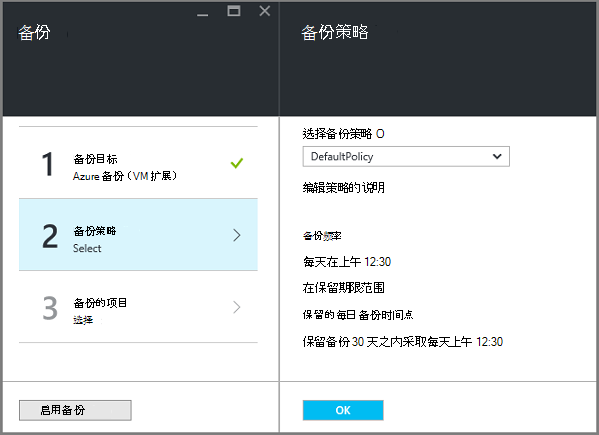

5. 备份策略刀片式服务器，选择要应用于该存储库并单击**确定**的备份策略。

    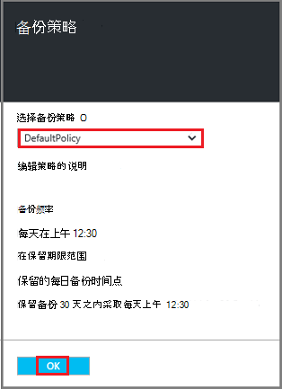

    详细信息中列出了默认策略的详细信息。 如果您想要创建新的策略，选择**新建从下拉菜单。** 下拉菜单中还提供了一个选项来切换时拍摄快照，到下午 7 点的时间。 有关定义的备份策略的说明，请参阅[定义的备份策略](backup-azure-vms-first-look-arm.md#defining-a-backup-policy)。 当您单击**确定**时，备份策略是与该存储库相关联。

    下一步选择要存储库相关联的 Vm。

6. 选择虚拟机指定的策略相关联，并单击**选择**。

    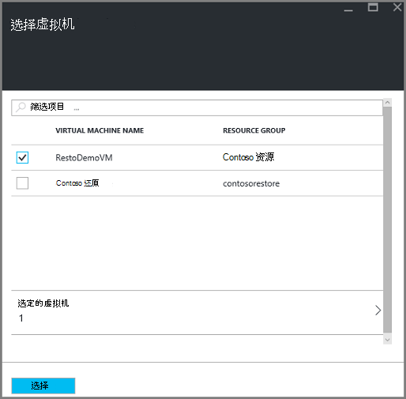

    如果看不到所需的虚拟机，检查它存在相同的 Azure 恢复服务存储库位置中。

7. 现在，您已经定义保险存储，备份刀片式服务器中的所有设置请都单击底部的页上**启用备份**。 这将策略部署到该存储库和虚拟机。

    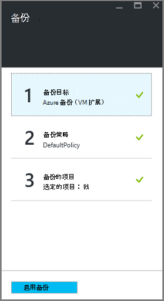

在准备中的下一个阶段安装虚拟机代理或确保 VM 代理安装。


## <a name="install-the-vm-agent-on-the-virtual-machine"></a>在虚拟机上安装虚拟机代理

必须为备份扩展工作 Azure 的虚拟机上安装 Azure VM 代理。 如果 VM 已创建从 Azure 的库，然后 VM 代理已存在虚拟机上。 此信息将提供在您所在的情况下**使用 VM 创建从 Azure 库-例如从内部数据中心迁移虚拟机。 在这种情况下，虚拟机工程师需要安装以保护虚拟机。

了解有关[VM 代理程序](https://go.microsoft.com/fwLink/?LinkID=390493&clcid=0x409)以及[如何安装虚拟机代理](../virtual-machines/virtual-machines-windows-classic-manage-extensions.md)。

如果有备份 Azure VM 的问题，检查 Azure VM 代理已正确安装在虚拟机上 （请参见下表）。 如果您创建一个自定义的虚拟机，且配置虚拟机之前[确保**安装虚拟机代理**复选框已选中](../virtual-machines/virtual-machines-windows-classic-agents-and-extensions.md)。

下表提供了有关 VM 代理为 Windows 和 Linux 虚拟机的附加信息。

| **操作** | **窗口** | **Linux** |
| --- | --- | --- |
| 安装虚拟机代理 | <li>下载并安装[代理 MSI](http://go.microsoft.com/fwlink/?LinkID=394789&clcid=0x409)。 您需要管理员权限才能完成安装。 <li>[更新虚拟机的属性](http://blogs.msdn.com/b/mast/archive/2014/04/08/install-the-vm-agent-on-an-existing-azure-vm.aspx)，以指示已安装代理。 | <li> 从 GitHub 安装最新的[Linux 代理](https://github.com/Azure/WALinuxAgent)。 您需要管理员权限才能完成安装。 <li> [更新虚拟机的属性](http://blogs.msdn.com/b/mast/archive/2014/04/08/install-the-vm-agent-on-an-existing-azure-vm.aspx)，以指示已安装代理。 |
| 正在更新虚拟机代理 | 更新虚拟机代理是简单，只需重新安装[虚拟机代理的二进制文件](http://go.microsoft.com/fwlink/?LinkID=394789&clcid=0x409)。 <br>确保 VM 代理更新时运行任何备份操作。 | 按照说明[更新 Linux 虚拟机代理](../virtual-machines-linux-update-agent.md)。 <br>确保 VM 代理更新时运行任何备份操作。 |
| 正在验证虚拟机代理安装 | <li>导航到 Azure VM 中的*C:\WindowsAzure\Packages*文件夹。 <li>您应该发现存在 WaAppAgent.exe 文件。<li> 用鼠标右键单击该文件，转到**属性**，然后选择**详细信息**选项卡。 产品版本字段应为 2.6.1198.718 或更高版本。 | N/A |


### <a name="backup-extension"></a>备份扩展名

一旦在虚拟机上安装了 VM 代理，Azure 备份服务将安装到虚拟机代理备份扩展名。 备份 Azure 服务无缝升级和修补程序有哪些备份扩展名。

备份服务正在运行 VM 安装备份扩展名。 一个正在运行的虚拟机提供了最大的机会获取应用程序一致性的恢复点。 但是，Azure 备份服务将继续备份 VM，即使它关闭，而不能安装该扩展。 这被称为脱机虚拟机。 在这种情况下，恢复点将*崩溃一致*。


## <a name="network-connectivity"></a>网络连接

为了管理虚拟机快照，备份扩展需要连接到 Azure 的公用 IP 地址。 不合适的互联网连接，虚拟机的 HTTP 请求的超时时间，则备份操作将失败。 如果您的部署访问限制 （通过网络安全组 (NSG)，例如），然后选择其中一个选项来为备份的通信提供了道路︰

- [白名单的 Azure 数据中心 IP 范围](http://www.microsoft.com/en-us/download/details.aspx?id=41653)的有关如何到白名单的 IP 地址，请参阅有关的说明文章。
- 将部署 HTTP 代理服务器的路由通信。

在决定使用哪个选项时，权衡是可管理性、 精细的控制和成本之间。

|选项|优势|缺点|
|------|----------|-------------|
|白名单的 IP 地址范围| 没有额外的成本。<br><br>在 NSG 打开访问，使用<i>一组 AzureNetworkSecurityRule</i> cmdlet。 | 复杂，不易管理，为受影响的 IP 范围随时间变化。<br><br>提供对整个 Azure，并不只是存储访问。|
|HTTP 代理服务器| 在代理服务器中对允许存储 Url 的精确控制。<br>单个点的互联网访问的虚拟机。<br>不受 Azure IP 地址更改。| 使用代理服务器软件运行虚拟机的附加成本。|

### <a name="whitelist-the-azure-datacenter-ip-ranges"></a>白名单 Azure 数据中心 IP 范围

到白名单 Azure 数据中心 IP 地址范围，请在 IP 地址范围，并说明参阅[Azure 网站](http://www.microsoft.com/en-us/download/details.aspx?id=41653)了解详细信息。

### <a name="using-an-http-proxy-for-vm-backups"></a>为虚拟机备份使用 HTTP 代理服务器
当备份虚拟机，请在虚拟机上的备份扩展快照管理将命令发送到 Azure 存储使用 HTTPS API。 路由通过 HTTP 代理服务器的备份扩展通信，因为它是唯一的组件配置为公用的 Internet 访问。

>[AZURE.NOTE] 没有无代理软件时应使用的建议。 请确保您选择下面的配置步骤与兼容的代理。

下面的示例图像显示使用 HTTP 代理服务器所需的三个配置步骤︰

- 应用程序虚拟机将路由代理 VM 通过公共互联网发往所有 HTTP 通信量。
- 代理服务器虚拟机允许传入通讯量从虚拟机中的虚拟网络。
- 网络安全组 (NSG) 名为 NSF 锁定需要安全规则允许出站 Internet 通讯从代理的虚拟机。

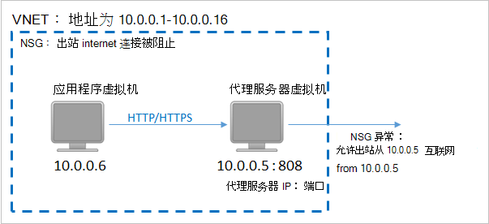

若要使用 HTTP 代理服务器为公用的 Internet 通信，请执行以下步骤︰

#### <a name="step-1-configure-outgoing-network-connections"></a>第 1 步。 配置传出网络连接

###### <a name="for-windows-machines"></a>对于 Windows 机器
这将设置代理服务器配置为本地系统帐户。

1. [PsExec](https://technet.microsoft.com/sysinternals/bb897553)的下载
2. 从提升提示符下，运行下面的命令

     ```
     psexec -i -s "c:\Program Files\Internet Explorer\iexplore.exe"
     ```
     它会打开 internet 浏览器窗口。
3. 请转到工具-> Internet 选项-> 连接-> LAN 设置。
4. 验证系统帐户的代理服务器设置。 设置代理服务器的 IP 和端口。
5. 关闭 Internet Explorer。

这将设置计算机范围的代理配置，并将用于所有传出的 HTTP/HTTPS 通信。

如果您有安装代理服务器上的当前用户帐户 （不是本地系统帐户），使用下面的脚本将它们应用于 SYSTEMACCOUNT:

```
   $obj = Get-ItemProperty -Path Registry::”HKEY_CURRENT_USER\Software\Microsoft\Windows\CurrentVersion\Internet Settings\Connections"
   Set-ItemProperty -Path Registry::”HKEY_USERS\S-1-5-18\Software\Microsoft\Windows\CurrentVersion\Internet Settings\Connections" -Name DefaultConnectionSettings -Value $obj.DefaultConnectionSettings
   Set-ItemProperty -Path Registry::”HKEY_USERS\S-1-5-18\Software\Microsoft\Windows\CurrentVersion\Internet Settings\Connections" -Name SavedLegacySettings -Value $obj.SavedLegacySettings
   $obj = Get-ItemProperty -Path Registry::”HKEY_CURRENT_USER\Software\Microsoft\Windows\CurrentVersion\Internet Settings"
   Set-ItemProperty -Path Registry::”HKEY_USERS\S-1-5-18\Software\Microsoft\Windows\CurrentVersion\Internet Settings" -Name ProxyEnable -Value $obj.ProxyEnable
   Set-ItemProperty -Path Registry::”HKEY_USERS\S-1-5-18\Software\Microsoft\Windows\CurrentVersion\Internet Settings" -Name Proxyserver -Value $obj.Proxyserver
```

>[AZURE.NOTE] 如果代理服务器日志中发现"(407) 代理服务器要求身份验证"，请检查您的身份验证已安装正确。

######<a name="for-linux-machines"></a>对于 Linux 机器

添加以下行```/etc/environment```文件︰

```
http_proxy=http://<proxy IP>:<proxy port>
```

添加以下行到```/etc/waagent.conf```文件︰

```
HttpProxy.Host=<proxy IP>
HttpProxy.Port=<proxy port>
```

#### <a name="step-2-allow-incoming-connections-on-the-proxy-server"></a>第 2 步。 在代理服务器上允许的传入连接︰

1. 在代理服务器上，打开 Windows 防火墙。 最简单的方法来访问防火墙是搜索具有高级安全性的 Windows 防火墙。

    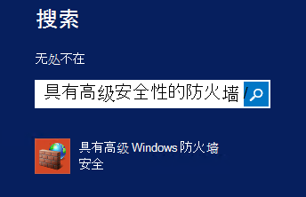

2. 在 Windows 防火墙对话框中，右键单击**入站规则**，请单击**新规则...**。

    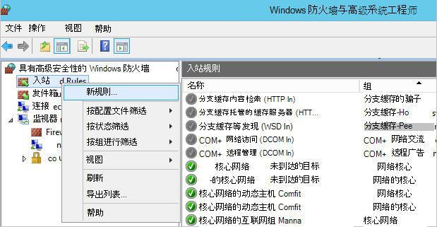

3. 在**新建入站规则向导**中，选择**规则类型****自定义**选项，并单击**下一步**。
4. 在页面上选择的**程序**，选择**所有程序**，然后单击**下一步**。

5. 在**协议和端口**页上，输入以下信息并单击**下一步**︰

    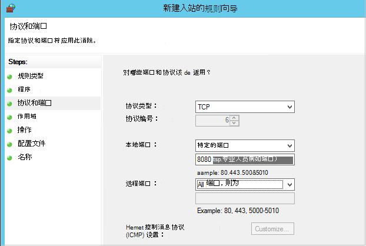

    - 为*协议类型*选择*TCP*
    - *本地*端口选择*特定的端口*，在下面的字段中指定```<Proxy Port>```已配置。
    - 对于*远程端口*中，选择*所有端口*

    向导的其余部分，请单击到最后，为此规则指定一个名称。

#### <a name="step-3-add-an-exception-rule-to-the-nsg"></a>第 3 步。 加入 NSG 的例外规则︰

在 Azure PowerShell 命令提示符处，输入以下命令︰

以下命令将添加到 NSG 的异常。 此异常将允许从 10.0.0.5 上的任何端口到端口 80 (HTTP) 或 443 (HTTPS) 上任何 Internet 地址的 TCP 通信。 如果您需要在公共 Internet 中某个特定的端口，请确保添加到该端口```-DestinationPortRange```也。

```
Get-AzureNetworkSecurityGroup -Name "NSG-lockdown" |
Set-AzureNetworkSecurityRule -Name "allow-proxy " -Action Allow -Protocol TCP -Type Outbound -Priority 200 -SourceAddressPrefix "10.0.0.5/32" -SourcePortRange "*" -DestinationAddressPrefix Internet -DestinationPortRange "80-443"
```


*这些步骤对于本例使用特定的名称和值。请为部署输入时，或剪切并粘贴到您的代码的详细信息，使用的名称和值。*


现在，您知道您有网络连接，您就可以备份 VM。 请参阅[备份资源管理器部署的虚拟机](backup-azure-arm-vms.md)。

## <a name="questions"></a>问题？
如果您有问题，或[向我们发送反馈](http://aka.ms/azurebackup_feedback)您想要查看包含，任何功能。

## <a name="next-steps"></a>下一步行动
现在，您已经准备您的环境的备份 VM，您的下一个逻辑步骤是创建一个备份。 规划的文章提供了有关备份虚拟机的更多详细的信息。

- [备份虚拟机](backup-azure-vms.md)
- [规划您的 VM 备份基础结构](backup-azure-vms-introduction.md)
- [管理虚拟机备份](backup-azure-manage-vms.md)
