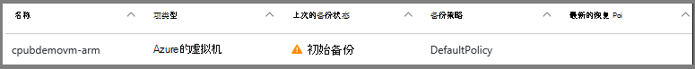
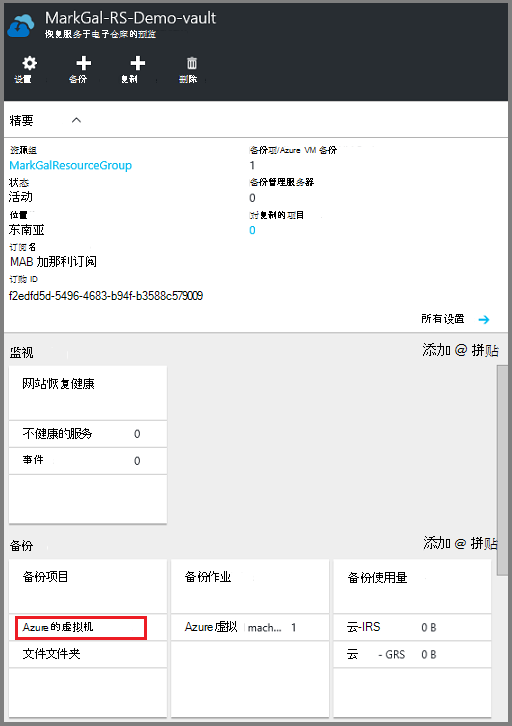
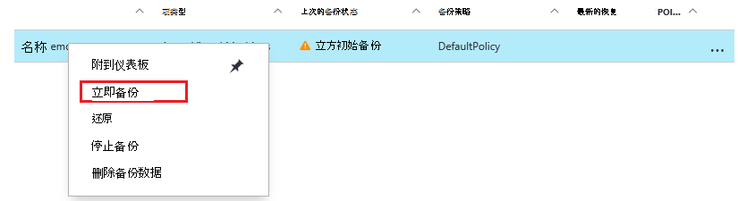
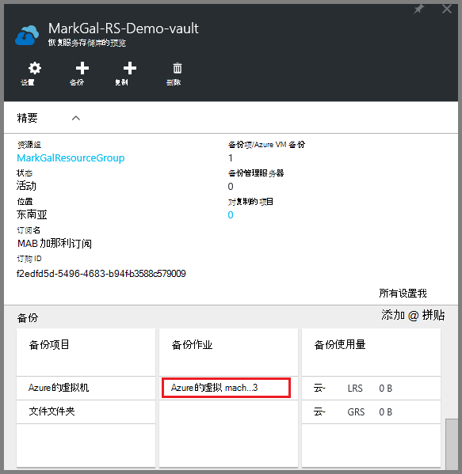
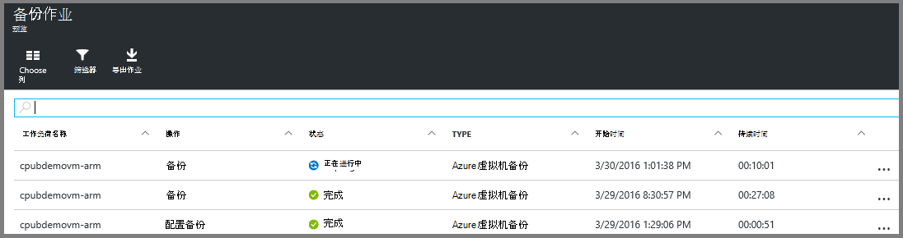

<properties
    pageTitle="备份恢复服务存储库到 Azure Vm |Microsoft Azure"
    description="发现、 注册和 Azure 虚拟机备份到 Azure 虚拟机备份这些过程恢复服务的保险库。"
    services="backup"
    documentationCenter=""
    authors="markgalioto"
    manager="cfreeman"
    editor=""
    keywords="虚拟机备份;备份虚拟机;备份和灾难恢复;arm vm 备份"/>

<tags
    ms.service="backup"
    ms.workload="storage-backup-recovery"
    ms.tgt_pltfrm="na"
    ms.devlang="na"
    ms.topic="article"
    ms.date="07/29/2016"
    ms.author="trinadhk; jimpark; markgal;"/>

# 备份恢复服务存储库到 Azure 的虚拟机

> [AZURE.SELECTOR]
- [备份到恢复服务保险存储的虚拟机](backup-azure-arm-vms.md)
- [备份到备份存储库的虚拟机](backup-azure-vms.md)

这篇文章提供有关备份恢复服务存储库到 Azure Vm （资源管理器部署和经典部署） 的过程。 备份虚拟机的工作大部分进入了准备工作。 您可以备份或保护虚拟机之前，必须完成[系统必备组件](backup-azure-arm-vms-prepare.md)以准备您的环境以保护您的虚拟机。 完成了系统必备组件之后，您可以启动备份操作来获取您的虚拟机的快照。

>[AZURE.NOTE] Azure 具有用于创建和使用资源的两种部署模型︰[资源管理器和经典](../resource-manager-deployment-model.md)。 您可以恢复服务存储库与保护资源管理器部署虚拟机和虚拟机的经典。 有关使用传统部署模型的虚拟机的详细信息，请参阅[Azure 的虚拟机的备份](backup-azure-vms.md)。

有关其他信息，请参阅[规划虚拟机备份基础结构在 Azure](backup-azure-vms-introduction.md)和[Azure 的虚拟机](https://azure.microsoft.com/documentation/services/virtual-machines/)上的文章。

## 触发备份作业

备份与恢复服务存储库，相关的策略定义了频率和时间运行备份操作。 默认情况下，第一次定时的备份是初始备份。 直到初始备份时，**备份作业**刀片上上次的备份状态将显示为**警告 （初始备份挂起）**。

除非您初始备份将很快开始，建议您**立即备份**运行。 下面的过程将启动从存储库面板。 此过程是完成所有系统必备组件之后运行初始备份作业。 如果已运行初始备份作业，则此过程不可用。 关联的备份策略确定下一个备份作业。  

若要运行初始备份作业︰

1. 在存储库操控板上**备份**拼贴，请单击**Azure 的虚拟机**。  
    

    打开**备份项**刀片式服务器。

2. 在**备份项**刀片式服务器，右键单击想要备份该存储的库并单击**立即备份**。

    

    触发备份作业。  

    

3. 若要查看您的初始备份已完成，在存储库面板在**备份作业**图块上，单击**Azure 的虚拟机**。

    

    打开备份作业刀片式服务器。

4. 在**备份作业**刀片式服务器，您可以看到所有作业的状态。

    

    >[AZURE.NOTE] 作为备份操作的一部分，备份 Azure 服务到备份扩展每个虚拟机将刷新所有写操作，并采取一致的快照中发出命令。

    备份作业完成后，状态为*已完成*。

## 解决错误
如果您的虚拟机上运行入时后备的问题，请参见[VM 疑难解答文章](backup-azure-vms-troubleshoot.md)有关的帮助。

## 下一步行动

现在，保护您的 VM，签出以下文章的其他管理任务可以执行与您的虚拟机，以及如何还原虚拟机。

- [管理和监视您的虚拟机](backup-azure-manage-vms.md)
- [还原虚拟机](backup-azure-arm-restore-vms.md)
