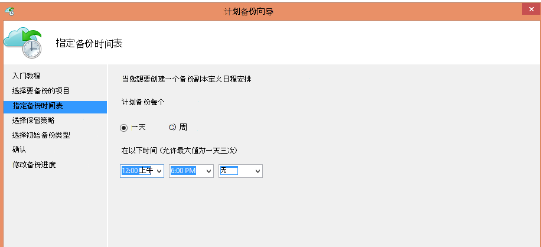
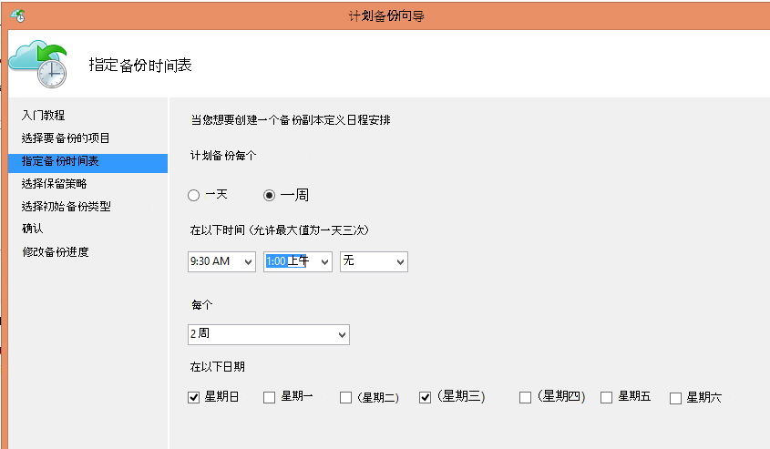
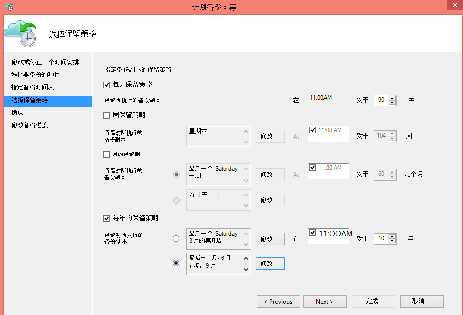
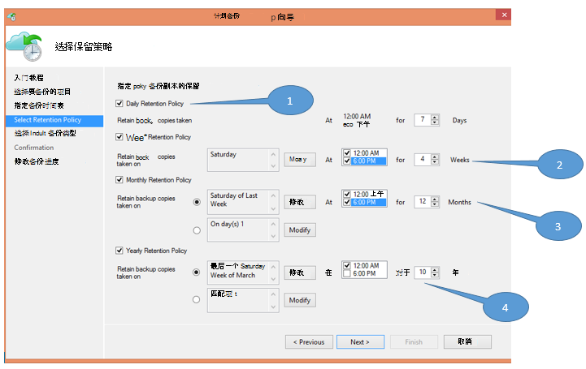
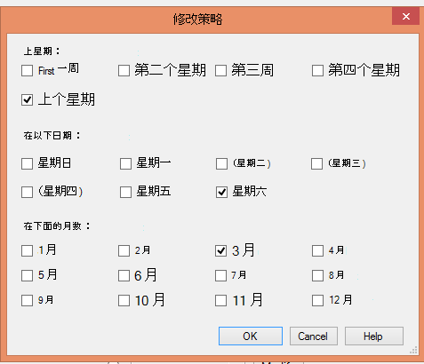

<properties
   pageTitle="使用 Azure 备份来替换您的磁带基础结构 |Microsoft Azure"
   description="了解如何备份 Azure 提供类似磁带的语义，这使您可以备份和还原在 Azure 中的数据"
   services="backup"
   documentationCenter=""
   authors="trinadhk"
   manager="vijayts"
   editor=""/>
<tags
   ms.service="backup"
   ms.devlang="na"
   ms.topic="article"
   ms.tgt_pltfrm="na"
   ms.workload="storage-backup-recovery"
   ms.date="09/27/2016"
   ms.author="jimpark;trinadhk;markgal"/>

# 使用 Azure 备份来替换您的磁带基础架构

Azure 备份和系统中心 Data Protection Manager 的客户将能够︰

- 备份数据中哪些最适合组织需要的计划。
- 将备份数据保留更长的时间段
- 使他们长期保留的部分 （而不是磁带） 需要的 Azure。

本文介绍了客户如何启用备份和保留策略。 使用磁带来解决其 long term 保留客户现在需要有一个强大和可行的替代方案具有此功能的可用性。 在 Azure 备份最新版本中启用的功能 (位于[此处](http://aka.ms/azurebackup_agent))。 系统中心 DPM 客户必须更新，至少，DPM 2012 R2 UR5 Azure 备份服务使用 DPM 之前。

## 备份计划是什么？
备份时间表表示备份操作的频率。 例如，下面的屏幕中的设置指示每天在下午 6 时和午夜执行备份。

客户还可以安排每周一次的备份。 例如，下面的屏幕中的设置指示，执行备份每个备用星期天和星期三在上午 9:30 和凌晨 1:00 点。

## 保留策略是什么？
保留策略指定的持续时间必须为其存储备份。 而不是只指定备份的所有点"平面策略"，客户可以指定在进行备份时根据不同的保留策略。 例如，采取每日备份点，这将作为操作恢复点，保留 90 天。 备份时间点在每个季度末为审核目的采取保留更长时间的持续时间。

在此策略中指定的"保留点"的总数为 90 （每磅为单位） + 40 (每一个 10 年的同期) = 130。

## 示例-将两者放在一起

1. **每天保留策略**︰ 执行每日备份存储为七天。
2. **每周保留策略**︰ 在午夜，星期六下午 6 点每天的备份会保留四周
3. **每月保留策略**︰ 在午夜，每个月最后一个周六的下午 6 点的备份会保留 12 个月内
4. **每年的保留策略**︰ 在每年的三月最后一个星期六午夜的备份会保留 10 年

"保留点"总数 （客户可以从其恢复数据点） 前面的关系图中按以下方式计算︰

- 两个点每天七天 = 14 个恢复点
- 两个点每四个星期 = 8 周的恢复点
- 两个点每 12 个月 = 24 个月的恢复点
- 一个点，每年每 10 年 = 10 恢复点

恢复点的总数是 56。

> [AZURE.NOTE] Azure 备份的恢复点数量上没有限制。

## 高级的配置
通过在上面的屏幕，单击**修改**，客户可以进一步指定保留时间安排的灵活性。

## 下一步行动
关于 Azure 备份的详细信息，请参阅︰

- [Azure 备份简介](backup-introduction-to-azure-backup.md)
- [请尝试 Azure 的备份](backup-try-azure-backup-in-10-mins.md)
