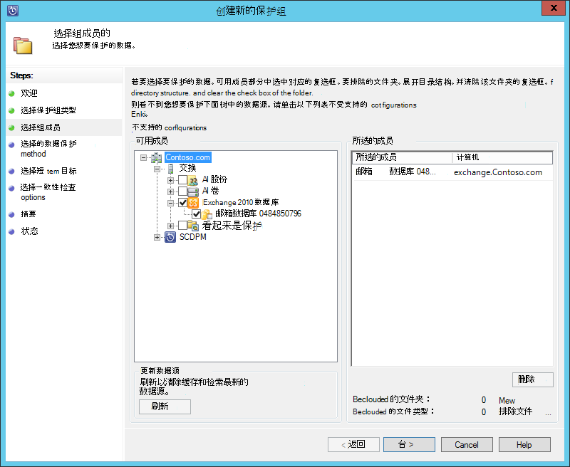
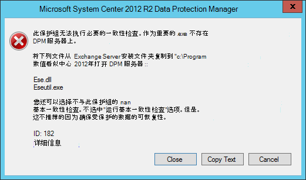
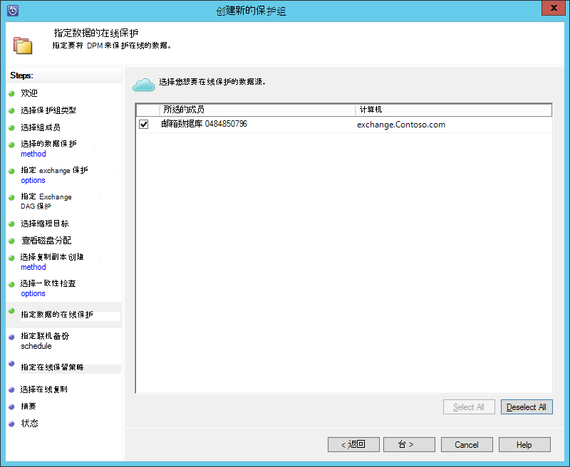
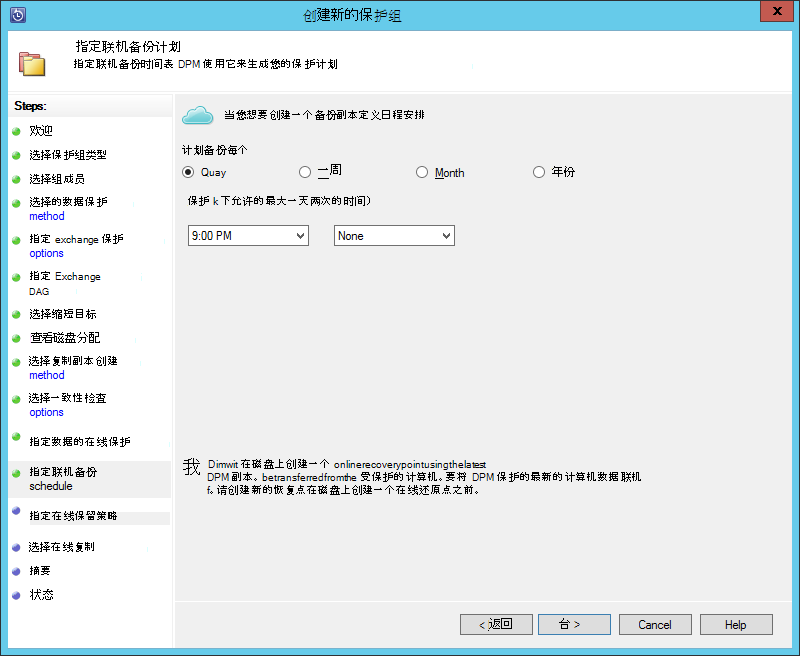
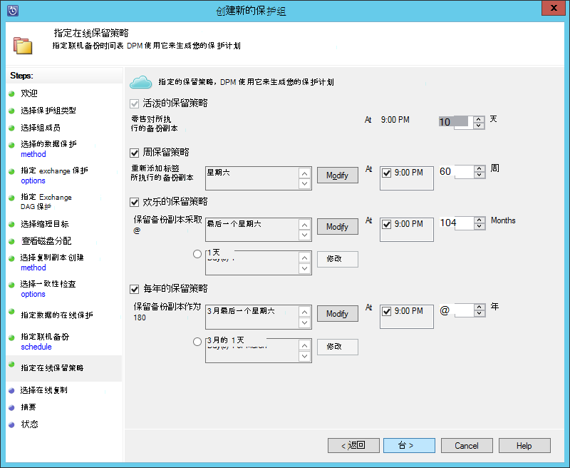
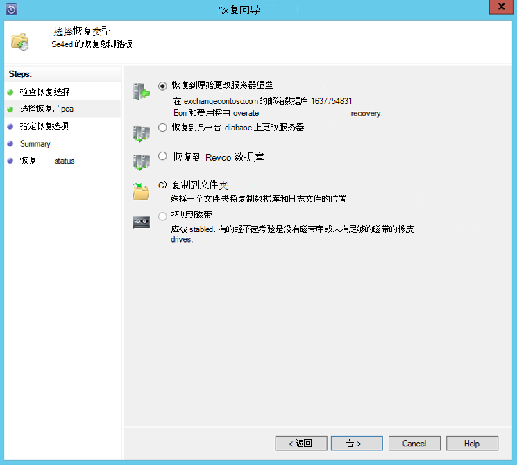

<properties
    pageTitle="备份到 Azure System Center 2012 R2 DPM 备份 Exchange 服务器 |Microsoft Azure"
    description="了解如何使用 System Center 2012 R2 DPM Azure 备份到备份 Exchange 服务器"
    services="backup"
    documentationCenter=""
    authors="MaanasSaran"
    manager="NKolli1"
    editor=""/>

<tags
    ms.service="backup"
    ms.workload="storage-backup-recovery"
    ms.tgt_pltfrm="na"
    ms.devlang="na"
    ms.topic="article"
    ms.date="08/15/2016"
    ms.author="anuragm;jimpark;delhan;trinadhk;markgal"/>

# System Center 2012 R2 DPM 使用 Azure 备份到备份 Exchange 服务器
本文介绍如何配置 Microsoft Exchange 服务器备份到 Azure 备份 System Center 2012 R2 Data Protection Manager (DPM) 服务器。  

## 更新
要成功注册 Azure 备份 DPM 服务器，您必须安装 System Center 2012 R2 DPM 和 Azure 备份代理程序的最新版本为最新的更新汇总。 从[Microsoft 目录](http://catalog.update.microsoft.com/v7/site/Search.aspx?q=System%20Center%202012%20R2%20Data%20protection%20manager)获取最新的更新汇总。

>[AZURE.NOTE] 本文中的示例，安装版本 2.0.8719.0 的 Azure 备份代理，并在 System Center 2012 R2 DPM 安装更新汇总 6。

## 系统必备组件
在继续之前，请确保已满足所有[系统必备组件](backup-azure-dpm-introduction.md#prerequisites)使用 Microsoft Azure 备份以保护工作负载。 这些先决条件包括︰

- 已创建了 Azure 站点上的备份存储库。
- 已下载到 DPM 服务器代理和保险存储凭据。
- 在 DPM 服务器上安装代理。
- 存储库凭据用于 DPM 服务器注册。
- 如果您正在保护 Exchange 2016，请升级到 DPM 2012 R2 UR9 或更高版本

## DPM 保护代理  
要在 Exchange 服务器上安装 DPM 保护代理，请执行以下步骤︰

1. 请确保正确配置防火墙。 请参阅[代理配置防火墙例外](https://technet.microsoft.com/library/Hh758204.aspx)。

2. 在 Exchange 服务器上安装代理，通过单击**管理 > 代理 > 安装**在 DPM 管理员控制台。 有关详细步骤，请参阅[安装 DPM 保护代理](https://technet.microsoft.com/library/hh758186.aspx?f=255&MSPPError=-2147217396)。

## 创建 Exchange 服务器玂臔竤舱

1. 在 DPM 管理员控制台中，单击**保护**，然后单击**新建**以打开**新建保护组**向导工具功能区上。

2. 在向导的**欢迎**屏幕上单击**下一步**。

3. 在**选择保护组类型**屏幕中，选择**服务器**，单击**下一步**。

4. 选择您想要保护并单击**下一步**的 Exchange 服务器数据库。

    >[AZURE.NOTE] 如果您正在保护 Exchange 2013，检查[Exchange 2013 的前提条件](https://technet.microsoft.com/library/dn751029.aspx)。

    在以下示例中，选择了 Exchange 2010 的数据库。

    

5. 选择的数据保护方法。

    保护组，命名，然后选择两个以下的选项︰

    - 我想要使用的磁盘的短期保护。
    - 我想要在线保护。

6. 单击**下一步**。

7. 如果您想要检查 Exchange Server 数据库的完整性，请选择**运行 Eseutil 检查数据完整性**选项。

    之后您选择此选项，备份一致性检查将以避免通过在 Exchange 服务器上运行**eseutil**命令生成的输入/输出通信量的 DPM 服务器上运行。

    >[AZURE.NOTE]若要使用此选项，必须将的 Ese.dll 和 Eseutil.exe 文件复制到 DPM 服务器上的 C:\Program 数值 System Center 2012 R2\DPM\DPM\bin 目录中。 否则，触发时出现以下错误︰  
    

8. 单击**下一步**。

9. **副本备份**，选择数据库，然后单击**下一步**。

    >[AZURE.NOTE] 如果您没有选择"完全备份"，至少一个 DAG 复制数据库，则不会截断日志。

10. 对于**短期的备份**，配置目标，然后单击**下一步**。

11. 检查可用的磁盘空间，，然后单击**下一步**。

12. 选择 DPM 服务器将创建初始复制，然后再单击**下一步**的时间。

13. 一致性检查选项，选择，然后单击**下一步**。

14. 选择您要备份到 Azure，数据库，然后单击**下一步**。 例如︰

    

15. 定义**Azure 备份**的日程安排，然后单击**下一步**。 例如︰

    

    >[AZURE.NOTE] 注意联机恢复点基于快速完整的恢复点。 因此，必须安排的在线恢复点后指定了明确完整的时间恢复点。

16. **Azure 备份**配置的保留策略，然后单击**下一步**。

17. 选择在线复制选项，并单击**下一步**。

    如果您有一个大的数据库，它可能需要很长的时间，在网络上创建的初始备份。 若要避免此问题，您可以创建脱机备份。  

    

18. 确认的设置，然后单击**创建组**。

19. 单击**关闭**。

## 恢复 Exchange 数据库

1. 要恢复 Exchange 数据库，请单击**恢复**在 DPM 管理员控制台。

2. 找到您想要恢复的 Exchange 数据库。

3. 从*恢复时间*下拉列表中选择联机恢复点。

4. 单击**恢复**以启动**故障恢复向导**。

对于在线恢复点，有五种恢复类型︰

- **恢复到原始 Exchange Server 位置︰**会将数据恢复到原始 Exchange 服务器。
- **将恢复到另一台 Exchange Server 数据库︰**会将数据恢复到另一台 Exchange 服务器上的另一个数据库。
- **将恢复到恢复数据库︰**会将数据恢复到 Exchange 恢复数据库 (RDB)。
- **复制到网络文件夹︰**会将数据恢复到网络文件夹。
- **复制到磁带︰**如果您有一个磁带库或独立磁带驱动器连接，并且 DPM 服务器上配置，恢复点将复制到磁带。

    

## 下一步行动

- [Azure 备份常见问题解答](backup-azure-backup-faq.md)
