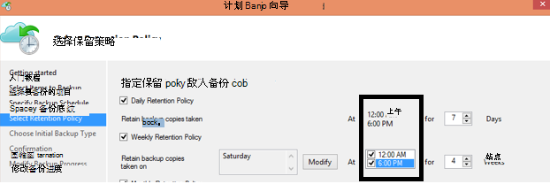

<properties
   pageTitle="Azure 备份常见问题 |Microsoft Azure"
   description="有关备份服务、 备份代理程序、 备份和保留、 恢复、 安全和有关备份和灾难恢复的其他常见问题常见问题的解答。"
   services="backup"
   documentationCenter=""
   authors="markgalioto"
   manager="jwhit"
   editor=""
   keywords="备份和灾难恢复;备份服务"/>

<tags
   ms.service="backup"
   ms.workload="storage-backup-recovery"
     ms.tgt_pltfrm="na"
     ms.devlang="na"
     ms.topic="get-started-article"
     ms.date="10/21/2016"
     ms.author="trinadhk; giridham; arunak; markgal; jimpark;"/>

# <a name="azure-backup-service--faq"></a>Azure 的备份服务常见问题解答


这篇文章是关于 Azure 备份服务的常见问题 （及其各自的答案） 列表。 我们的社区回复速度快，如果经常提出的问题，我们将它添加到这篇文章。 对问题的回答通常提供参考或支持的信息。 关于这篇文章或相关的文章 Disqus 部分 Azure 备份，可以提出问题。 您还可以在[论坛](https://social.msdn.microsoft.com/forums/azure/home?forum=windowsazureonlinebackup)中过帐 Azure 备份服务有关的问题。


## <a name="what-is-the-list-of-supported-operating-systems-from-which-i-can-back-up-to-azure-using-azure-backup-br"></a>从中我可以备份到 Azure 使用 Azure 备份的受支持操作系统的列表是什么？ <br/>
Azure 备份文件文件夹备份，应用程序备份使用 Azure 备份服务器和 SCDPM 支持以下操作系统的列表。

| 操作系统        | 平台           | SKU  |
| :------------- |-------------| :-----|
| Windows 8 和最新的 Sp      | 64 位 | 企业 Pro |
| Windows 7 和最新的 Sp      | 64 位 | 最终，企业、 专业版、 家庭高级版，家庭基本的初学者 |
| Windows 8.1 和最新的 Sp | 64 位      |    企业 Pro |
| Windows 10      | 64 位 | 企业、 Pro，家庭 |
|Windows Server 2012 R2 和最新的 Sp| 64 位| 标准、 数据中心、 基础|
|Windows Server 2012 和最新的 Sp|    64 位| 数据中心、 基础，标准|
|Windows 存储服务器 2012 R2 和最新的 Sp  |64 位|    标准工作组|
|Windows Server 2012 存储和最新的 Sp |64 位 |标准工作组
|Windows Server 2012 R2 和最新的 Sp  |64 位|    重要|
|Windows Server 2008 R2 SP1 |64 位|    标准，企业数据中心、 基础|
|Windows Server 2008 SP2    |64 位|    标准，企业数据中心、 基础|

Azure VM 备份

- **Linux**: Azure 备份支持除核心操作系统 Linux [，都认可通过 Azure 的分配的列表](../virtual-machines/virtual-machines-linux-endorsed-distros.md)。  其他携带-您的自己的 Linux 发行版本还可能只要 VM 代理的虚拟计算机上可用的工作和支持对于 Python 存在。
- **Windows Server**︰ 不支持的版本早于 Windows Server 2008 R2。

## <a name="where-can-i-download-the-latest-azure-backup-agent-br"></a>哪里可以下载最新的 Azure 备份代理？ <br/>
您可以备份 Windows 服务器、 系统中心 DPM 或 Windows 客户端，从[这里](http://aka.ms/azurebackup_agent)下载最新的代理。 如果您要备份一个虚拟机，使用 VM 代理 （它会自动安装正确的扩展名）。 VM 代理已在 Azure 的库中创建的虚拟机上。

## <a name="which-version-of-scdpm-server-is-supported-br"></a>SCDPM 服务器的版本是否支持？ <br/>
我们建议您在 SCDPM 的最新的更新汇总上安装[最新](http://aka.ms/azurebackup_agent)的 Azure 备份代理 (UR11 8 月 2016 年)

## <a name="when-configuring-the-azure-backup-agent-i-am-prompted-to-enter-the-vault-credentials-do-vault-credentials-expire"></a>在配置 Azure 备份代理程序时，系统提示我输入存储库凭据。 存储库凭据过期了？
是的存储库凭据过期后 48 小时。 如果该文件已过期，登录到 Azure 的门户网站，并下载存储库凭据文件从您的存储库。

## <a name="is-there-any-limit-on-the-number-of-vaults-that-can-be-created-in-each-azure-subscription-br"></a>是否有任何限制，可以在 Azure 的每个订阅中创建的电子仓库的数量？ <br/>
是的。 截至 9 月 2016，您可以创建 25 备份每个订阅的电子仓库。 您可以创建最多包含 25 恢复服务存储库，每个每个订阅的 Azure 备份每个受支持地区。 如果您需要更多的电子仓库，然后创建一个新订阅。

## <a name="are-there-any-limits-on-the-number-of-serversmachines-that-can-be-registered-against-each-vault-br"></a>是否有任何限制，可以针对每个存储库中注册的服务器/机的数目？ <br/>
是的您可以注册达 50 机每个存储库。 Azure IaaS 的虚拟机，限制为 200 每保险存储的虚拟机。 如果您需要注册多个计算机，创建新的存储库。

## <a name="how-do-i-register-my-server-to-another-datacenterbr"></a>如何注册我到另一个数据中心的服务器？<br/>
备份数据被发送到注册到该存储库的数据中心。 若要更改数据中心的最简单方法是卸载并重新安装代理注册到新的存储库所需的数据中心所属。

## <a name="what-happens-if-i-rename-a-windows-server-that-is-backing-up-data-to-azurebr"></a>如果重命名将数据备份到 Azure 的 Windows 服务器，怎么样？<br/>
当您重命名服务器时，则停止所有当前配置的备份。
您需要备份存储库中注册新的服务器的名称。 当您创建新的注册时，第一次备份操作是完全备份，而不是增量备份。 如果您需要恢复到旧服务器名称的保险库备份以前的数据，您可以恢复数据**恢复数据**向导中使用[**另一个服务器**](backup-azure-restore-windows-server.md#recover-to-an-alternate-machine)选项。

## <a name="what-types-of-drives-can-i-backup-files-and-folders-from-br"></a>文件和文件夹备份的驱动器的类型？ <br/>
以下一组驱动器/卷无法获取备份︰

- 可移动媒体︰ 驱动器必须报告为固定可使用备份的项源。
- 只读卷︰ 卷必须是可写入的卷影复制服务 (VSS) 对函数的。
- 离线卷︰ 卷必须处于联机状态的 VSS 函数。
- 网络共享︰ 卷必须是本地服务器上使用联机备份备份。
- 受 Bitlocker 保护的卷︰ 在备份前，必须锁定卷。
- 文件系统识别︰ NTFS 是唯一的文件系统支持此版本的在线备份服务。

## <a name="what-file-and-folder-types-can-i-back-up-from-my-serverbr"></a>哪些文件和文件夹的类型可以备份从我的服务器？<br/>
支持以下类型︰

- 加密
- 压缩
- 稀疏
- 压缩 + 稀疏
- 硬链接︰ 不受支持，已跳过
- 重新分析点︰ 不受支持，已跳过
- 加密 + 压缩︰ 不受支持，已跳过
- 加密 + 稀疏︰ 不受支持，已跳过
- 压缩流︰ 不支持，跳过
- 稀疏流︰ 不支持，跳过

## <a name="whats-the-minimum-size-requirement-for-the-cache-folder-br"></a>该缓存文件夹的最小要求是什么？ <br/>
该缓存文件夹的大小决定了要备份的数据量。 缓存文件夹应该是 5%的所需的数据存储空间。

## <a name="if-my-organization-has-one-vault-how-can-i-isolate-one-servers-data-from-another-server-when-restoring-databr"></a>如果我的组织有一个电子仓库，如何可以我隔离来自另一台服务器的一台服务器的数据还原数据时？<br/>
注册到同一存储库中的所有服务器可以都恢复由其他服务器都*使用相同密码的*备份数据。 如果您有想要从您的组织中的其他服务器隔离其备份数据的服务器，这些服务器使用指定的密码短语。 例如，人力资源部服务器可能使用一个加密密码，记帐服务器，以及存储服务器的第三。

## <a name="can-i-migrate-my-backup-data-or-vault-between-subscriptions-br"></a>可以"迁移"我备份数据或订阅存储库？ <br/>
不。 保险存储订阅级别创建，不能重新分配到另一个订阅创建。

## <a name="does-the-azure-backup-agent-work-on-a-server-that-uses-windows-server-2012-deduplication-br"></a>使用 Windows Server 2012 重复数据消除技术的服务器可以处理 Azure 备份代理程序？ <br/>
是的。 代理服务将消除重复的数据转换为普通的数据，当它准备备份操作。 它然后优化备份的数据加密的数据，，然后将加密的数据发送给联机备份服务。

## <a name="if-i-cancel-a-backup-job-once-it-has-started-is-the-transferred-backup-data-deleted-br"></a>如果我取消备份作业开始之后，将删除传输备份数据？ <br/>
不。 备份存储库存储的备份数据，必须取消为止已转移。 Azure 备份使用检查点机制有时会在备份过程中备份数据添加检查点。 由于备份的数据检查点下, 一步的备份过程可以验证文件的完整性。 触发下一次备份会有以前备份的数据增量。 增量备份提供了更好地利用带宽，以便不需要反复传输相同的数据。

在 Azure VM 备份后取消该作业，传输的数据被忽略，并且最新备份将增量数据传输从以前成功的备份作业。

## <a name="why-am-i-seeing-the-warning-azure-backups-have-not-been-configured-for-this-server-even-though-i-had-scheduled-regular-backups-previously-br"></a>为什么我会看到警告"Azure 备份尚未配置此服务器"即使我已经以前安排定期备份？ <br/>
当备份日程安排设置存储在本地服务器上没有存储在备份存储库中的设置相同，则会出现此警告。 当服务器或设置恢复到已知的良好状态时，备份时间表会失去同步。 如果您收到此警告，[重新配置的备份策略](backup-azure-manage-windows-server.md)，然后**运行立即备份**Azure 的本地服务器重新同步。

## <a name="what-firewall-rules-should-be-configured-for-azure-backup-br"></a>应该将规则配置为 Azure 备份哪些防火墙？ <br/>
在内部部署的到 Azure 和工作负荷到 Azure 数据的无缝防护，建议您允许您的防火墙与以下 Url 进行通信︰

- www.msftncsi.com
- \*.Microsoft.com
- \*.WindowsAzure.com
- \*。 microsoftonline.com
- \*。 windows.net

##<a name="can-i-install-the-azure-backup-agent-on-an-azure-vm-already-backed-by-the-azure-backup-service-using-the-vm-extension-br"></a>可以在 Azure 备份服务使用 VM 扩展已备有 Azure VM 上安装 Azure 备份代理程序？ <br/>
绝对。 Azure 的备份提供 VM 级别备份了 Azure 虚拟机使用 VM 扩展。 您可以在来宾 Windows 操作系统来保护文件和文件夹上的访客操作系统上安装 Azure 备份代理。

## <a name="can-i-install-the-azure-backup-agent-on-an-azure-vm-to-back-up-files-and-folders-present-on-temporary-storage-provided-by-the-azure-vm-br"></a>可以在 Azure VM 备份文件和文件夹显示在 Azure VM 所提供的临时存储安装 Azure 备份代理程序？ <br/>
可以在来宾 Windows 操作系统上安装 Azure 备份代理程序和文件和文件夹备份到临时存储。 但是，请注意备份失败后清除临时存储数据。 此外，如果已删除临时存储数据，只能还原到非易失性存储器。

## <a name="i-have-installed-azure-backup-agent-to-protect-my-files-and-folders-can-i-now-install-scdpm-to-work-with-azure-backup-agent-to-protect-on-premises-applicationvm-workloads-to-azure-br"></a>我已经安装了 Azure 备份代理程序来保护我的文件和文件夹。 现在可以安装 SCDPM 使用 Azure 备份代理程序来保护到 Azure 的内部应用程序/VM 工作负载 <br/>
若要使用 SCDPM Azure 备份，建议安装 SCDPM 第一次，只有这样才能安装 Azure 备份代理。 这可确保 SCDPM 的 Azure 备份代理的无缝集成，并允许直接从管理控制台的 SCDPM 到 Azure，保护的文件/文件夹，应用程序工作负载和虚拟机。 安装 Azure 备份后安装 SCDPM 用于上述目的的代理没有建议或支持。

## <a name="what-is-the-length-of-file-path-that-can-be-specified-as-part-of-azure-backup-policy-using-azure-backup-agent-br"></a>什么是可以被指定为使用 Azure 备份代理的 Azure 备份策略的一部分的文件路径的长度？ <br/>  
Azure 的备份代理程序依赖 NTFS。 [文件路径长度规范受 Windows API 的限制](https://msdn.microsoft.com/library/aa365247.aspx#fully_qualified_vs._relative_paths)。 如果备份文件的文件路径长度大于所指定的 Windows API，客户可以选择备份父文件夹或磁盘驱动器的备份文件。  

## <a name="what-characters-are-allowed-in-file-path-of-azure-backup-policy-using-azure-backup-agent-br"></a>Azure 备份策略使用 Azure 备份代理程序的文件路径中允许使用哪些字符？ <br>  
 Azure 的备份代理程序依赖 NTFS。 它使[NTFS 支持字符](https://msdn.microsoft.com/library/aa365247.aspx#naming_conventions)将作为文件规范的一部分。  

## <a name="can-i-use-azure-backup-server-to-create-a-bare-metal-recovery-bmr-backup-for-a-physical-server-br"></a>可以使用 Azure 备份服务器以创建物理服务器裸机恢复 (BMR) 备份？ <br/>
是的。

## <a name="can-i-configure-the-backup-service-to-send-mail-if-a-backup-job-fails-br"></a>可以将配置备份服务备份作业失败时发送邮件？ <br/>
是的备份服务有 PowerShell 脚本可用于基于事件的多个警报。 有关完整说明，请参见[警报通知](backup-azure-manage-vms.md#alert-notifications)

## <a name="is-there-a-limit-on-the-size-of-each-data-source-being-backed-up-br"></a>要备份的每个数据源的大小是否有限制？ <br/>
在存储库级别还有可以备份的数据量没有限制，Azure 备份会造成限制 （对于所有实用目的，这些限制是非常高） 对数据源的最大大小。 截至 8 月 2015年是受支持的操作系统的最大大小数据源︰

|S.No | 操作系统 |  最大值的数据源 |
| :-------------: |:-------------| :-----|
|1| Windows Server 2012 或更高| 54400 GB|
|2| Windows 8 或更高| 54400 GB|
|3| Windows Server 2008 中，Windows Server 2008 R2 | 1700 GB|
|4| Windows 7 | 1700 GB|

下表说明了如何确定每个数据源的大小。

|   数据源  |   详细信息 |
| :-------------: |:-------------|
|音量 |从单个卷的服务器或客户端计算机备份的数据量|
|Hyper-V 虚拟机 | 要备份虚拟机的所有 Vhd 的数据的总和|
|Microsoft SQL Server 数据库 | 要备份的单个 SQL 数据库大小的 |
|Microsoft SharePoint |在 SharePoint 服务器场备份的内容和配置数据库的总和|
|Microsoft Exchange |要备份的 Exchange 服务器中的所有 Exchange 数据库的总和|
|BMR/系统状态 |BMR 或系统状态备份这台计算机的每个单个副本|

## <a name="are-there-limits-on-the-number-of-times-a-backup-job-can-be-scheduled-per-daybr"></a>可以将备份作业安排每天的时间的数量是否有限制？<br/>
是的您可以运行备份作业 Windows 客户端或 Windows 服务器上最多三次 / 天。 长达一天两次，可以在系统中心 DPM 运行备份作业。 您可以在备份作业为 IaaS Vm 每天运行一次。

## <a name="is-there-a-difference-between-the-scheduling-policy-for-dpm-and-windows-server-ie-on-windows-server-without-dpm-br"></a>有 DPM 的调度策略和 Windows 服务器 （即在未 DPM 的 Windows 服务器） 之间的区别吗？ <br/>
是的。 使用 DPM，您可以指定每日、 每周、 每月和年度计划。 Windows 服务器 （不含 DPM) 允许您指定只有每日和每周的日程安排。

## <a name="is-there-a-difference-between-the-retention-policy-for-dpm-and-windows-serverclient-ie-on-windows-server-without-dpmbr"></a>有 DPM 的保留策略和 Windows 服务器/客户端 （即在未 DPM 的 Windows 服务器） 之间的区别吗？<br/>
不，两个 DPM 和 Windows 服务器/客户端具有每日、 每周、 每月和每年的保留策略。

## <a name="can-i-configure-my-retention-policies-selectively--ie-configure-weekly-and-daily-but-not-yearly-and-monthlybr"></a>可以配置我保留策略有选择地 – 即配置每周和每日但不是每年、 每月一次？<br/>
是的 Azure 备份保留结构允许您可以充分灵活地定义按照您的要求的保留策略。

## <a name="can-i-schedule-a-backup-at-6pm-and-specify-retention-policies-at-a-different-timebr"></a>可以在下午 6 点的"计划备份"并指定"保留策略"，在其他时间吗？<br/>
不。 保留策略仅可以应用于备份点。 在下面的图像中，备份在上午 12 点和下午 6 点指定的保留策略。 <br/>


<br/>

## <a name="is-an-incremental-copy-transferred-for-the-retention-policies-scheduled-br"></a>增量复制传输计划保留策略？ <br/>
否，增量复制发送基于备份计划页中提到的时间。 根据保留策略决定，可以保留点。

## <a name="if-a-backup-is-retained-for-a-long-duration-does-it-take-more-time-to-recover-an-older-data-point-br"></a>如果备份可保留很长时间，需要更多的时间来恢复旧数据点？ <br/>
 不，时间恢复最早或最新的点是相同的。 每个恢复点的行为像一个完整的点。

## <a name="if-each-recovery-point-is-like-a-full-point-does-it-impact-the-total-billable-backup-storagebr"></a>每个恢复点相当于一个完整的点，它会影响收费的总体备份存储？<br/>
典型的长期保留单点产品备份数据存储为满点。 完整的点是存储*效率低下*，而是更容易和更快地恢复。 增量拷贝存储*效率高*但需要还原的数据，这将影响您的恢复时间链。 Azure 的备份存储体系结构提供以最佳方式存储的数据的快速恢复，较低的存储成本这两个领域的最佳产品。 此数据存储方法确保入口和出口带宽有效使用。 数据存储量和恢复数据所需的时间都是保持在最低限度。 了解详细信息[增量备份](https://azure.microsoft.com/blog/microsoft-azure-backup-save-on-long-term-storage/)的保存方式是有效的。

## <a name="is-there-a-limit-on-the-number-of-recovery-points-that-can-be-createdbr"></a>有的可以创建的恢复点数量限制吗？<br/>
不。 我们必须消除限制的恢复点。 您可以创建任意多个任意所需的恢复点。

## <a name="why-is-the-amount-of-data-transferred-in-backup-not-equal-to-the-amount-of-data-i-backed-upbr"></a>为什么在备份过程中不等于我备份的数据量传输的数据量？<br/>
 从 Azure 备份代理程序或 SCDPM 或 Azure 备份服务器，备份的所有数据被压缩，加密传输之前。 压缩和加密应用后，备份存储库中的数据是较小的 30-40%。

## <a name="is-there-a-way-to-adjust-the-amount-of-bandwidth-used-by-the-backup-servicebr"></a>有什么办法来调整备份服务使用的带宽量？<br/>
 是的使用中备份代理程序**更改属性**选项来调整带宽。 调整带宽和时间时使用的带宽的量。 有关详细信息，请参阅[网络带宽限制](../backup-configure-vault.md#enable-network-throttling)。

## <a name="my-internet-bandwidth-is-limited-for-the-amount-of-data-i-need-to-back-up-is-there-a-way-i-can-move-data-to-a-certain-location-with-a-large-network-pipe-and-push-that-data-into-azure-br"></a>我的互联网带宽是我需要备份的数据量有限。 有一种大型网络与某一特定位置的数据管道，然后将数据推入 Azure 可以移动的方法吗？ <br/>
您可以将数据备份到 Azure 通过标准的联机备份过程，也可以使用 Azure 导入/导出服务转移到 blob 存储在 Azure 中的数据。 还有没有其他到 Azure 存储中获取备份日期的方式。 有关如何使用 Azure 的备份使用 Azure 导入/导出服务的信息，请参阅[脱机备份工作流](backup-azure-backup-import-export.md)项目。

## <a name="how-many-recoveries-can-i-perform-on-the-data-that-is-backed-up-to-azurebr"></a>备份到 Azure 的数据可以进行多少恢复？<br/>
从 Azure 备份恢复的数量没有限制。

## <a name="do-i-have-to-pay-for-the-egress-traffic-from-azure-data-center-during-recoveriesbr"></a>是否需要在恢复期间支付外出通信量从 Azure 数据中心？<br/>
 不。 您恢复是免费的不收取的出站通信。

## <a name="is-the-data-sent-to-azure-encrypted-br"></a>将数据发送到 Azure 加密？ <br/>
是的。 内部服务器/客户端/SCDPM 使用在计算机上 AES256 加密数据，并通过安全的 HTTPS 链接发送数据。

## <a name="is-the-backup-data-on-azure-encrypted-as-wellbr"></a>位于 Azure 文件也会加密备份数据？<br/>
 是的。 发送到 Azure 的数据仍然是加密 （在其余部分）。 Microsoft 将随时备份数据未解密。 Azure VM 备份 Azure 备份依赖于虚拟机的加密即如果 VM 使用 Azure 磁盘加密或某些其他加密技术进行加密，Azure 备份使用加密来保护您的数据。

## <a name="what-is-the-minimum-length-of-encryption-key-used-to-encrypt-backup-data-br"></a>用于对备份数据进行加密的加密密钥的最小长度是什么？ <br/>
 加密密钥应至少为 16 个字符。

## <a name="what-happens-if-i-misplace-the-encryption-key-can-i-recover-the-data-or-can-microsoft-recover-the-data-br"></a>如果我忘记放置位置加密密钥会怎么样？ 可以恢复数据 （或者） Microsoft 是否可以恢复数据？ <br/>
只有在客户的场所是存在用于对备份数据进行加密的密钥。 Microsoft 不维护 Azure 中的副本，而又没有任何对密钥的访问。 如果客户 misplaces 键，Microsoft 不能恢复备份的数据。

## <a name="how-do-i-change-the-cache-location-specified-for-the-azure-backup-agentbr"></a>如何更改为 Azure 备份代理指定的缓存位置？<br/>
 按顺序遍历下更改缓存位置的项目符号列表。
- 在提升的命令提示符下执行以下命令来停止备份引擎︰

  ```PS C:\> Net stop obengine```

- 不移动这些文件。 相反，将缓存空间文件夹复制到另一个驱动器具有足够的空间。 确认备份正在使用新的高速缓存空间后，可以删除原始的缓存空间。

- 新的缓存空间文件夹的路径更新下面的注册表项。<br/>

|注册表路径 | 注册表项 | 值 |
| ------ | ------- | ------|
| `HKEY_LOCAL_MACHINE\SOFTWARE\Microsoft\Windows Azure Backup\Config` | ScratchLocation | *新的缓存文件夹位置* |
| `HKEY_LOCAL_MACHINE\SOFTWARE\Microsoft\Windows Azure Backup\Config\CloudBackupProvider` | ScratchLocation | *新的缓存文件夹位置* |

- 通过在提升的命令提示符下执行以下命令来重新启动备份引擎︰

  ```PS C:\> Net start obengine```

  一旦备份创建已成功完成在新的缓存位置，您可以删除原始缓存文件夹。

## <a name="where-can-i-put-the-cache-folder-for-the-azure-backup-agent-to-work-as-expectedbr"></a>可以放置 Azure 备份代理程序，以达到预期效果的缓存文件夹的位置<br/>
不推荐该缓存文件夹的以下位置︰

- 网络共享或可移动媒体︰ 必须为需要使用联机备份备份服务器的本地缓存文件夹。 网络位置或可移动媒体，如 USB 驱动器不受支持。
- 离线卷︰ 缓存文件夹必须处于联机状态的预期使用 Azure 备份代理程序的备份。

## <a name="are-there-any-attributes-of-the-cache-folder-that-are-not-supportedbr"></a>是否有不支持的任何属性缓存文件夹？<br/>
 缓存文件夹不支持以下属性或其组合︰

- 加密
- 重复数据消除
- 压缩
- 稀疏
- 重新分析点

建议该缓存文件夹和元数据都不 VHD 具有以上特性的 Azure 备份代理预期正常工作。
