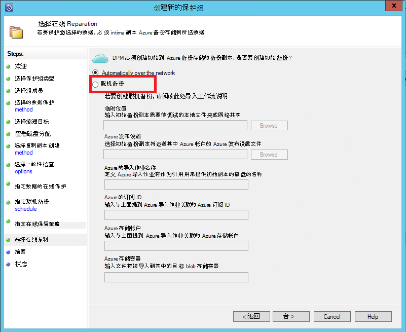
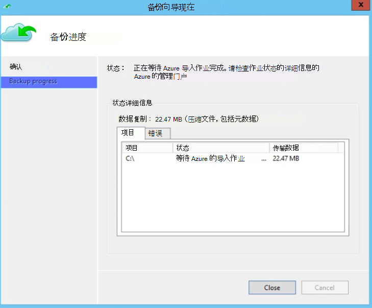
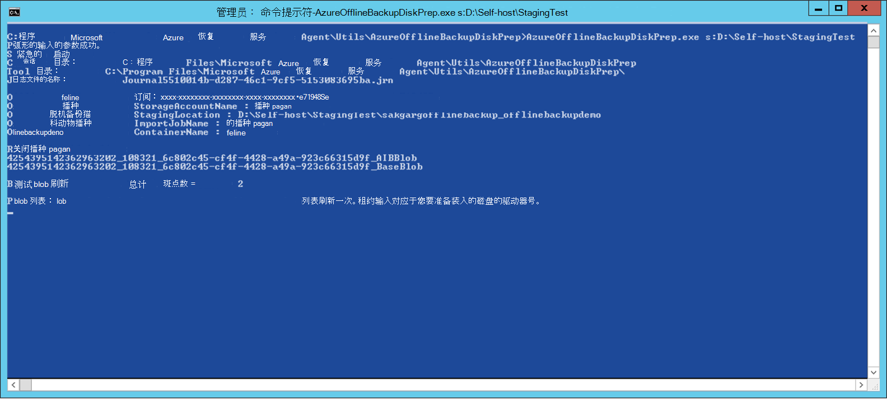
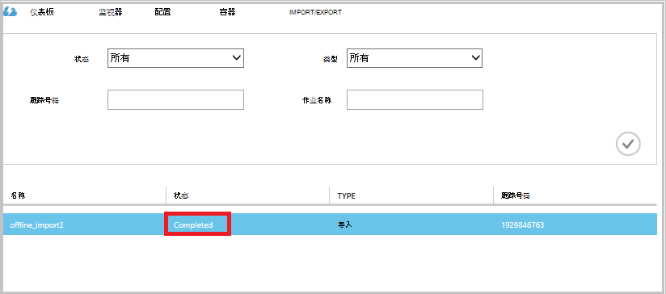

<properties
   pageTitle="Azure 备份-脱机备份或使用 Azure 导入/导出服务初始种子设定 |Microsoft Azure"
   description="了解如何 Azure 备份使您可以发送数据从使用 Azure 导入/导出服务网络。 本文介绍了使用 Azure 导入导出服务脱机播种的初始备份数据。"
   services="backup"
   documentationCenter=""
   authors="saurabhsensharma"
   manager="shivamg"
   editor=""/>
<tags
   ms.service="backup"
   ms.devlang="na"
   ms.topic="article"
   ms.tgt_pltfrm="na"
   ms.workload="storage-backup-recovery"
   ms.date="08/16/2016"
   ms.author="jimpark;saurabhsensharma;nkolli;trinadhk"/>

# 在 Azure 备份脱机备份工作流
Azure 备份有几个内置的效率提高，对到 Azure 数据的初始完整备份期间保存网络和存储成本。 初始完整备份通常传输大量的数据，而需要更多的网络带宽与后续传输仅增量/增量备份的备份相比。 Azure 备份压缩初始备份。 通过离线传播的过程中，Azure 备份可以使用磁盘将压缩初始备份离线数据上载到 Azure。  

在[Azure 导入/导出服务](../storage/storage-import-export-service.md)使您能够使用磁盘将数据传输到 Azure 紧密集成的 Azure 备份脱机播种过程。 如果您有数万亿字节 (Tb) 的高延迟和低带宽的网络上传输所需要的初始备份数据，可以使用脱机播种工作流来运送到 Azure 数据中心的一个或多个硬驱上的初始备份副本。 这篇文章概括介绍了完成此工作流的步骤。

## 概述

与脱机播种的 Azure 备份和 Azure 导入/导出功能，可以很容易地通过使用磁盘将离线数据上载到 Azure。 而不是通过网络传输初始完整拷贝，将备份数据写入到*临时位置*。 结果复制到临时位置使用 Azure 导入/导出工具完成操作后，此数据写入一个或多个 SATA 驱动器，具体取决于数据量。 这些驱动器最终往最接近的 Azure 数据中心。

[8 月 2016年更新的 Azure 备份 （及更高版本）](http://go.microsoft.com/fwlink/?LinkID=229525)包括*Azure 磁盘准备工具*，名为 AzureOfflineBackupDiskPrep，它︰

   - 可帮助您通过使用 Azure 导入/导出工具准备 Azure 导入您的驱动器。
   - 自动创建在[Azure 的传统门户网站](https://manage.windowsazure.com)而不是使用旧版本的 Azure 备份手动创建相同的 Azure 导入作业的 Azure 导入/导出服务。

备份到 Azure 数据的上载完成后，Azure 备份将备份数据复制到备份存储库并计划增量备份。

  > [AZURE.NOTE] 若要使用 Azure 磁盘准备工具，请确保您已安装了 8 月 2016年更新的 Azure 备份 （或更高版本），并执行所有步骤的工作流与它。 如果您使用的较旧版本的 Azure 备份，您可以在本文的稍后部分中详细介绍使用 Azure 导入/导出工具准备 SATA 驱动器。

## 系统必备组件

- [熟悉的 Azure 导入/导出工作流](../storage/storage-import-export-service.md)。
- 然后再启动该工作流，请确保以下︰
    - 已创建备份 Azure 存储库。
    - 已下载存储库凭据。
    - Windows 服务器/Windows 客户端或系统中心 Data Protection Manager 服务器上安装了 Azure 备份代理和 Azure 备份存储库中注册计算机。
- 从中您计划备份数据的计算机上的[下载的 Azure 发布文件设置](https://manage.windowsazure.com/publishsettings)。
- 准备一个临时位置，这可能是一个网络共享或其他计算机上的驱动器。 临时位置暂时存储，暂时在此工作流过程中使用。 确保临时位置具有足够的磁盘空间来存放您的初始副本。 例如，如果您正在备份 500 GB 的文件服务器，请确保临时区域至少 500 GB。 （少量使用由于压缩中）。
- 请确保您正在使用受支持的驱动器。 使用导入/导出服务支持只有 3.5 英寸 SATA II/III 硬驱动器。 不支持大于 8 TB 的硬驱。 您可以将附加 SATA II/III 磁盘外部到大多数计算机使用 SATA II/III USB 适配器。 请检查服务支持的驱动器的最新一套的 Azure 导入/导出文档。
- SATA 驱动器写入器连接到的计算机上启用 BitLocker。
- 已连接到计算机到 SATA 驱动器写入器[下载 Azure 导入/导出工具](http://go.microsoft.com/fwlink/?LinkID=301900&clcid=0x409)。 如果您已经下载并安装 8 月 2016年更新的 Azure 备份 （或更高版本），则不需要此步骤。

## 工作流
本节中的信息可帮助您完成离线备份工作流，以便可以到 Azure 数据中心提供数据并将其上载到 Azure 存储。 如果您有关于导入服务或过程的所有方面的问题，请参阅前面提到的[导入服务概述](../storage/storage-import-export-service.md)文档。

### 启动脱机备份

1. 计划备份时，您将看到下面的屏幕 （在 Windows 服务器，Windows 客户端或系统中心 Data Protection Manager）。

    

    这是在系统中心 Data Protection Manager 对应屏幕︰  
    

    输入的说明如下所示︰

    - **暂存位置**︰ 初始备份副本写入临时存储位置。 这可能是一个网络共享或本地计算机上。 如果在复制计算机和源计算机不同，我们建议您指定的临时位置的完整网络路径。
    - **Azure 导入作业名称**︰ 由哪些 Azure 导入服务和 Azure 备份跟踪传输所发送的数据在磁盘对 Azure 的唯一名称。
    - **Azure 发布设置**︰ 一种 XML 文件，包含有关您订阅的配置文件信息。 它还包含与您的订购的安全凭据。 您可以[下载该文件](https://manage.windowsazure.com/publishsettings)。 提供的发布设置文件的本地路径。
    - **Azure 订阅 ID**︰ 订阅计划启动 Azure 导入作业的 Azure 订阅 ID。 如果您有多个 Azure 订阅，使用您想要导入作业相关联的订阅 ID。
    - **Azure 存储帐户**︰ 将与 Azure 导入作业关联的提供 Azure 订阅中的经典类型存储帐户。
    - **Azure 存储容器**︰ 目标存储 blob，在此作业的数据导入其中的 Azure 存储帐户的名称。

    > [AZURE.NOTE] 如果已注册服务器到 Azure 恢复服务存储库从[Azure 的门户网站](https://portal.azure.com)为您的备份不是云解决方案提供程序 (CSP) 订阅上，您仍可以从 Azure 门户创建一个经典类型存储帐户和用于离线备份工作流。

    保存所有这些信息，因为您需要在以下步骤中重新输入。 如果您使用 Azure 磁盘准备工具准备磁盘，只能*临时位置*是必需的。    

2. 完成该工作流，并**立即回**Azure 备份的管理控制台，可以启动的脱机备份副本中选择。 初始备份写入到临时区域作为本步骤的一部分。

    

    若要完成相应的工作流程在系统中心 Data Protection Manager，**保护组**，用鼠标右键单击，然后选择**创建恢复点**选项。 然后选择**在线保护**选项。

    

    在操作完成后，就可以用于磁盘准备的临时位置。

    

### 准备一个 SATA 驱动器，并通过使用 Azure 磁盘准备工具创建 Azure 导入作业
Azure 磁盘准备工具可用于恢复服务代理的安装目录 (8 月 2016年更新及更高版本) 中的以下路径。

   *\Microsoft**Azure**恢复**服务** Agent\Utils\*

1. 转到该目录，并将**AzureOfflineBackupDiskPrep**目录复制到复制计算机在其装载驱动器要做好。 确保复制计算机与以下︰

      - 复制计算机可以使用**启动脱机备份**工作流中提供的同一网络路径访问脱机播种工作流的临时位置。

      - BitLocker 启用的计算机上。

      - 计算机可以访问的 Azure 的门户。

      如果有必要，请复制计算机可以与源计算机相同。

2. 使用 Azure 磁盘准备工具的目录作为当前目录中，打开提升的命令提示符复制计算机上并运行下面的命令︰

      *.\AzureOfflineBackupDiskPrep.exe* s: <*临时位置路径*> [p <*PublishSettingsFile 路径*>:]

| 参数 | 说明
|-------------|-------------|
|s: <*临时位置路径*> | 用于提供临时输入**启动脱机备份**工作流中的位置的路径的必填字段输入。 |
|p: <*PublishSettingsFile 路径*> | 可选的输入，它用来提供您输入**启动脱机备份**工作流中的**Azure 发布设置**文件的路径。 |

> [AZURE.NOTE] &lt;通往 PublishSettingFile&gt;不同的复制计算机和源计算机时，值是必需的。

运行该命令时，该工具将请求 Azure 导入作业需要做好的驱动器所对应的选项。 如果只有单个导入作业与提供临时位置相关联，您将看到像后面的一个屏幕。

     
3. 输入您想要准备要转移到 Azure 装入的磁盘没有结尾冒号的驱动器号。 提供格式的驱动器后，系统提示您确认。

此工具然后开始准备磁盘备份的数据。 您可能需要附加其他磁盘提供的磁盘没有足够的空间用于备份数据的情况下，工具提示时。  

在该工具的成功执行结束时，您提供的一个或多个磁盘准备运送到 Azure。 此外，Azure 的传统门户网站上创建导入作业过程**启动脱机备份**工作流中提供的名称。 最后，该工具会显示磁盘需要发运 Azure 数据中心的送货地址和 Azure 的传统门户网站上查找导入作业的链接。

    
4. 运送该工具提供的地址到磁盘并保持跟踪号码供以后参考。 
5. 当您转到该工具显示的链接时，您将看到您指定**启动脱机备份**工作流中的 Azure 存储帐户。 这里您可以看到新创建的导入作业的存储帐户的**导入/导出**选项卡上。

    
6. 单击**传送信息**页面的底部来更新您的联系详细信息，如下面的屏幕中所示。 Microsoft 使用此信息来导入作业完成后运送回磁盘。

    
7. 在下一个屏幕上输入的发货详细资料。 提供对应的磁盘，运往 Azure 数据中心**交付承运人**和**跟踪号码**详细信息。

    

### 完成工作流
导入作业完成后，初始备份数据可用于您的存储帐户。 恢复服务代理然后将此帐户数据保险存储备份或恢复服务的内容复制保险存储，适用。 在下一个计划的备份时间，Azure 备份代理通过初始备份副本执行增量备份。

> [AZURE.NOTE] 以下各节应用于早期版本的 Azure 备份不具有访问权限的 Azure 磁盘准备工具的用户。

### 准备一个 SATA 驱动器

1. 复制计算机下载[Microsoft Azure 导入/导出工具](http://go.microsoft.com/fwlink/?linkid=301900&clcid=0x409)。 确保从您计划要运行的命令下一集的计算机可以访问的临时位置。 如果有必要，请复制计算机可以与源计算机相同。

2. WAImportExport.zip 文件解压缩。 运行 WAImportExport 工具，设置格式的 SATA 驱动器，将备份数据写入到 SATA 驱动器，并对它进行加密。 运行下面的命令之前，请确保在计算机上启用了 BitLocker。  

    *.\WAImportExport.exe PrepImport /j: <*JournalFile*>.jrn /id: <*会话 Id*> /sk: <*StorageAccountKey*> /BlobType:**PageBlob* * /t: <*TargetDriveLetter*>/格式化 / 加密 /srcdir: <*临时位置*> /dstdir: <*DestinationBlobVirtualDirectory*>/*

    > [AZURE.NOTE] 如果您已经安装的 Azure 备份 （或更高版本） 8 月 2016年更新，确保您输入的临时位置**现在回**屏幕上相同，并包含 AIB 和基 Blob 文件。

| 参数 | 说明
|-------------|-------------|
| /j: <*JournalFile*>| 日志文件的路径。 每个驱动器必须有一个日志文件。 目标驱动器上不能将日志文件。 日志文件扩展名为.jrn，并创建运行此命令的过程。|
|/id: <*会话标识符*> | 会话 ID 标识的复制会话。 它用来确保准确恢复中断的复制会话。 在复制会话中复制的文件存储在目标驱动器上的会话 ID 命名的目录中。|
| /sk: <*StorageAccountKey*> | 已导入的数据的存储帐户的帐户密码。 密钥必须相同输入备份的策略保护组创建过程。|
| / BlobType | Blob 类型。 仅当指定**PageBlob** ，则此工作流就会成功。 这不是默认选项，应在该命令中所述。 |
|/t: <*TargetDriveLetter*> | 而当前的复制会话的目标硬盘结尾冒号的驱动器号。|
|/format | 要格式化的驱动器的选项。 指定此参数，当驱动器需要进行格式化。否则，可以将其省略。 该工具格式化驱动器之前，它会从控制台确认提示。 若要取消确认，指定 /silentmode 参数。|
|加密 / | 用于加密驱动器的选项。 当驱动器已经没有尚未被使用 BitLocker 加密，需要的工具进行加密时，请指定此参数。 如果已使用 BitLocker 加密了驱动器，省略此参数，指定 /bk 参数，并提供现有的 BitLocker 密钥。 如果您指定 /format 参数，您还必须指定 / 加密参数。 |
|/srcdir: <*SourceDirectory*> | 源目录，它包含要复制到的目标驱动器的文件。 请确保指定的目录名称具有完整，而不是相对路径。|
|/dstdir: <*DestinationBlobVirtualDirectory*> | 在 Azure 存储帐户中目标虚拟目录的路径。 请确保指定的目标虚拟目录或 blob 时，请使用有效的容器名称。 请记住容器名称必须为小写。  此容器的名称应该是您输入在创建备份的策略保护组过程中的一个。|

  > [AZURE.NOTE] 捕获整个工作流的信息的 WAImportExport 文件夹中创建日志文件。 在 Azure 的门户网站中创建导入作业时，您需要此文件。

  

### 在 Azure 的门户网站中创建导入作业
1. 转到您的存储帐户[Azure 的传统门户网站](https://manage.windowsazure.com/)中，在任务窗格中单击**导入/导出**，然后**创建导入作业**。

    

2. 在向导的步骤 1，表明您已经准备好您的驱动器，驱动器日志文件可用。
3. 在向导的步骤 2，提供负责此导入作业的用户的联系信息。
4. 在步骤 3 中，您在上一节中获得的驱动器日志文件上传。
5. 在步骤 4 中，输入在创建备份的策略保护组过程中输入的导入作业的描述性名称。 您输入的名称可能包含小写字母、 数字、 连字符和下划线，必须以字母开头，并且不能包含空格。 您选择的名称用于跟踪您的作业，而他们正在进行和完成。
6. 接下来，从列表中选择您的数据中心地区。 数据中心区域表示数据中心和地址必须向其提供您的软件包。

    

7. 在步骤 5 中，从列表中选择返回运营商和承运人帐户号码输入。 Microsoft 使用此帐户来导入作业完成后发运给您您的驱动器。

8. 运送该磁盘，然后输入要跟踪货物的状态跟踪号码。 在数据中心中到达磁盘之后，将其复制到存储帐户，并更新状态。

    

### 完成工作流
初始备份数据可用于您的存储帐户后，Microsoft Azure 恢复服务代理将此帐户数据的内容复制到备份存储区或保险存储恢复服务，适用。 下一步的计划备份时间，Azure 备份代理通过初始备份副本执行增量备份。

## 下一步行动
- Azure 导入/导出工作流上的任何问题，请参阅[使用导入/导出的 Microsoft Azure 服务将数据传输到 Blob 存储](../storage/storage-import-export-service.md)。
- 请参阅备份 Azure[常见问题解答](backup-azure-backup-faq.md)工作流有关的任何问题的离线备份一节。
