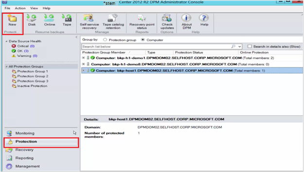

<properties
    pageTitle="SharePoint 场到 Azure 的 DPM/Azure 备份服务器保护 |Microsoft Azure"
    description="本文将概述 DPM/Azure 备份服务器保护的 SharePoint 场到 Azure"
    services="backup"
    documentationCenter=""
    authors="adigan"
    manager="Nkolli1"
    editor=""/>

<tags
    ms.service="backup"
    ms.workload="storage-backup-recovery"
    ms.tgt_pltfrm="na"
    ms.devlang="na"
    ms.topic="article"
    ms.date="09/29/2016"
    ms.author="adigan;giridham;jimpark;trinadhk;markgal"/>

# 备份到 Azure 的 SharePoint 服务器场
您 SharePoint 场到 Microsoft Azure 使用备份系统中心 Data Protection Manager (DPM) 大致相同的备份的其他数据源中。 Azure 的备份可以灵活地为每日创建的备份计划，每周、 每月或每年备份点，可以为不同的时间点备份保留策略选项。 DPM 提供的功能来存储本地磁盘拷贝用于快速恢复时间目标 (RTO)，并存储到 Azure 经济、 长期保留的拷贝。

## SharePoint 受支持的版本和相关的保护方案
为 DPM azure 备份支持下列方案︰

| 工作负荷 | 版本 | SharePoint 部署 | DPM 部署类型 | DPM-System Center 2012 R2 | 保护和恢复 |
| -------- | ------- | --------------------- | ------------------- | --------------------------- | ----------------------- |
| SharePoint | SharePoint 2013 年，SharePoint 2010，SharePoint 2007 SharePoint 3.0 | 作为物理服务器或 Hyper-V / VMware 虚拟机部署的 SharePoint   --------------   SQL AlwaysOn | 物理服务器或内部部署 Hyper-V 虚拟机 | 支持备份到 Azure 从更新汇总 5 | 保护 SharePoint 场恢复选项︰ 恢复服务器场、 数据库和从磁盘恢复点的文件或列表项。  从 Azure 的恢复点的场和数据库恢复。 |

## 在开始之前
有几件事情需要确认之前备份到 Azure 的 SharePoint 场。

### 系统必备组件
在继续之前，请确保已满足所有[先决条件使用 Microsoft Azure 备份](backup-azure-dpm-introduction.md#prerequisites)以保护工作负载。 系统必备组件的某些任务包括︰ 创建备份存储库、 下载存储库凭据、 安装 Azure 备份代理和保险存储库中注册 DPM/Azure 备份服务器。

### DPM 代理
必须在运行 SharePoint、 正在运行 SQL Server 的服务器和其他属于 SharePoint 服务器场的所有服务器的服务器上安装 DPM 代理。 有关如何设置保护代理的详细信息，请参阅[安装保护代理](https://technet.microsoft.com/library/hh758034(v=sc.12).aspx)。  一个例外是您仅在一个 web 前端 (WFE) 服务器上安装代理。 DPM 需要一个 WFE 服务器上的代理，只是为了作为保护的入口点。

### SharePoint 服务器场
对于服务器场中每 10 万个项目，必须有至少 2 GB 的卷上的空间的 DPM 文件夹所在的位置。 目录生成都需要这么大。 对于 DPM 恢复 （站点集合、 站点、 列表、 文档库、 文件夹、 各个文档和列表项） 的特定项目，编录生成创建的每个内容数据库中包含的 Url 的列表。 在 DPM 管理员控制台的**恢复**任务区域中的恢复项目窗格中，您可以查看 Url 的列表。

### SQL Server
作为本地系统帐户运行 DPM。 DPM 备份 SQL Server 数据库，运行 SQL Server 的服务器需要系统管理员帐户的权限。 之前您备份正在运行 SQL Server 的服务器上将 NT AUTHORITY\SYSTEM 设置为*系统管理员*。

如果 SharePoint 服务器场已配置了 SQL Server 别名的 SQL Server 数据库，则 DPM 将保护前端 Web 服务器上安装 SQL Server 的客户端组件。

### SharePoint 服务器
性能取决于许多因素，如 SharePoint 场的大小，作为一般性指导一个 DPM 服务器可以保护 25 TB SharePoint 服务器场。

### DPM 更新汇总 5
若要开始到 Azure SharePoint 场的保护，您需要安装 DPM 5 或更高版本的更新汇总。 更新汇总 5 提供保护到 Azure 的 SharePoint 场，如果此服务器场配置通过使用 SQL AlwaysOn 的能力。
有关详细信息，请参阅博客帖子会引起[DPM 更新汇总 5]( http://blogs.technet.com/b/dpm/archive/2015/02/11/update-rollup-5-for-system-center-2012-r2-data-protection-manager-is-now-available.aspx)

### 不支持的内容
- DPM 保护 SharePoint 服务器场搜索索引或应用程序服务数据库不能提供保护。 您将需要单独配置这些数据库的保护。
- DPM 不提供承载 SharePoint SQL Server 数据库的备份服务器 (SOFS) 的向外扩展文件共享上。

## 配置 SharePoint 保护
在能够使用 DPM 来保护 SharePoint 之前，您必须通过使用**ConfigureSharePoint.exe**配置 SharePoint VSS 编写器服务 （WSS 写入程序服务）。

在前端 web 服务器上的 DPM 安装路径  芣 \bin 文件夹中，您可以找到**ConfigureSharePoint.exe** 。 此工具为 SharePoint 服务器场提供保护代理的凭据。 WFE 在单个服务器上运行它。 如果您有多个 WFE 服务器，选择只需一个配置玂臔竤舱时。

### 若要配置 SharePoint VSS 编写器服务
1. 在 WFE 服务器上，在命令提示符下，转到 [DPM 安装位置] \bin\
2. 输入 ConfigureSharePoint EnableSharePointProtection。
3. 输入的服务器场管理员凭据。 此帐户应 WFE 服务器上的本地管理员组的成员。 如果服务器场管理员不是本地管理员授予 WFE 服务器上的以下权限︰
  - 授予对 DPM 文件夹 （%程序 Files%\Microsoft 数据保护 Manager\DPM） WSS_Admin_WPG 组完全控制。
  - 授予对 DPM 注册表项 (HKEY_LOCAL_MACHINE\SOFTWARE\Microsoft\Microsoft Data Protection Manager) WSS_Admin_WPG 组只读访问权限。

>[AZURE.NOTE] 您将需要有在 SharePoint 服务器场管理员凭据更改时重新运行 ConfigureSharePoint.exe。

## 通过使用 DPM 备份 SharePoint 服务器场
DPM 和 SharePoint 场如以前所述配置之后，DPM 保护 SharePoint。

### 为了保护 SharePoint 服务器场
1. 从 DPM 管理员控制台的**保护**选项卡上，单击**新建**。
    

2. 在**新建保护组**向导的**选择保护组类型**页上，选择**服务器**，，然后单击**下一步**。

    

3. 在**选择组成员**屏幕中，选择您想要保护并单击**下一步**的 SharePoint 服务器的复选框。

    

    >[AZURE.NOTE] 安装 DPM 代理，您可以看到在该向导的服务器。 DPM 还显示其结构。 因为您运行 ConfigureSharePoint.exe 时，DPM 与 SharePoint VSS 编写器服务和其相应的 SQL Server 数据库进行通信，并识别 SharePoint 场结构、 相关联的内容数据库和任何对应的项。

4. **选择的数据保护方法**在页上，输入**保护组**的名称，并选择您首选的*保护方法*。 单击**下一步**。

    

    >[AZURE.NOTE] 磁盘保护方法有助于满足很短的恢复时间目标。 Azure 是与磁带相比经济和长期的防护目标。 有关详细信息，请参阅[使用 Azure 的备份来替换您的磁带基础架构](https://azure.microsoft.com/documentation/articles/backup-azure-backup-cloud-as-tape/)

5. 在**指定的短期目标**页上，选择您首选的**保留范围**并识别要备份发生时。

    

    >[AZURE.NOTE] 因为通常是 5 天内的数据需要恢复时，我们五天在磁盘上保留各种选择，并确保其备份速度在非生产时间，为了使本示例。

6. 检查为此保护组，分配的存储池中磁盘空间，然后单击**下一步**。

7. 对于每个保护组，DPM 分配的磁盘空间来存储和管理副本。 此时，DPM 必须创建选定数据的一个拷贝。 选择如何和您想要创建的复制副本，然后单击**下一步**。

    

    >[AZURE.NOTE] 若要确保网络通信流不受影响，选择生产时间之外的时间。

8. DPM 执行复制副本上的一致性检查确保数据完整性。 有两个可用选项。 您可以定义要运行一致性检查的计划或 DPM 可以运行一致性检查自动复制副本上的，每当它变得不一致。 选择您的首选的选项，然后单击**下一步**。

    

9. 在**指定在线保护数据**页上，选择您想要保护，对 SharePoint 场，然后单击**下一步**。

    

10. **指定联机备份计划**页上选择您首选的日程，然后单击**下一步**。

    

    >[AZURE.NOTE] DPM 在不同的时间最多的两个每日备份提供到 Azure。 Azure 备份还可以控制可用于备份在高峰和非高峰时间使用[Azure 备份网络限制](https://azure.microsoft.com/en-in/documentation/articles/backup-configure-vault/#enable-network-throttling)的 WAN 带宽的量。

11. 具体取决于备份计划的选择，在**指定在线保留策略**页上，选择每日、 每周、 每月和每年备份点的保留策略。

    

    >[AZURE.NOTE] DPM 使用的备份的不同时间点的祖父-父-子保留方案，可以在其中选择不同的保留策略。

12. 类似于磁盘，一个初始参考点的复制副本需要创建在 Azure。 选择首的选项创建到 Azure，初始备份副本，然后单击**下一步**。

    

13. 查看**摘要**页上的所选的设置，然后单击**创建组**。 在创建保护组之后，您将看到一条成功消息。

    

## 通过使用 DPM 从磁盘恢复 SharePoint 项
在下面的示例中，*恢复 SharePoint 项*已被意外删除，需要恢复。

1. 打开**DPM 管理员控制台**。 **保护**选项卡中显示所有 DPM 保护的 SharePoint 场。

    

2. 要开始恢复的项，请选择**恢复**选项卡。

    

3. 您可以搜索 SharePoint*恢复 SharePoint 项*使用的恢复点范围内的基于通配符搜索。

    

4. 从搜索结果中选择适当的恢复点，用鼠标右键单击该项目，然后选择**恢复**。

5. 此外可以浏览多个恢复点，并选择要恢复的项目或数据库。 选择**日期 > 恢复时间**，然后选择正确**数据库 > SharePoint 场 > 恢复点 > 项目**。

    

6. 用鼠标右键单击该项目，然后选择**恢复**以打开**恢复向导**。 单击**下一步**。

    

7. 选择您想要执行的恢复的类型，然后单击**下一步**。

    

    >[AZURE.NOTE] 选择**恢复到原始**示例中的将恢复到原始的 SharePoint 网站的项目。

8. 选择您要使用的**恢复过程**。
    - 如果 SharePoint 场不更改，并且正在被恢复的恢复点相同，请选择**恢复而不使用恢复服务器场**。
    - 如果 SharePoint 场恢复点创建以来已更改，请选择**恢复使用恢复服务器场**。

    

9. 提供一个临时的 SQL Server 实例位置来临时，恢复数据库并提供 DPM 服务器和服务器运行 SharePoint 恢复该项临时文件共享。

    

    DPM 将附加承载 SharePoint 项与临时的 SQL Server 实例的内容数据库。 从内容数据库，DPM 服务器恢复项目，并把它放在 DPM 服务器上的临时文件位置。 现在是临时位置的 DPM 服务器恢复的项目需要导出到 SharePoint 场上的临时位置。

    

10. 选择**指定恢复选项**，并将安全设置应用到 SharePoint 服务器场或应用安全设置的恢复点。 单击**下一步**。

    

    >[AZURE.NOTE] 您可以选择限制网络带宽的使用。 这在生产时间减少到生产服务器的影响。

11. 查看摘要信息，并再单击**恢复**开始恢复的文件。

    

12. 在**DPM 管理员控制台**中查看**状态**的恢复，现在选择**监视**选项卡。

    

    >[AZURE.NOTE] 现在还原该文件。 您可以刷新 SharePoint 网站以查看已还原的文件。

## 从 Azure 的 SharePoint 数据库还原使用 DPM

1. 若要恢复 SharePoint 内容数据库，浏览各种恢复点 （如前面所示），并选择要恢复的恢复点。

    

2. 双击要显示可用的 SharePoint 目录信息的 SharePoint 恢复点。

    > [AZURE.NOTE] 因为 SharePoint 场受到长期保留在 Azure 中，没有目录信息 （元数据） 是在 DPM 服务器上可用。 因此，每当需要恢复的时间点 SharePoint 内容数据库，您需要进行再次编目的 SharePoint 服务器场。

3. 单击**重新分类**。

    

    **云 Recatalog**状态窗口将打开。

    

    目录编制过程完成后，状态将变为*成功*。 单击**关闭**。

    

4. 单击 SharePoint 对象 DPM**恢复**选项卡中的显示来获取内容的数据库结构。 用鼠标右键单击该项目，然后单击**恢复**。

    

5. 在这种情况下，按照[本文前面的恢复步骤](#restore-a-sharepoint-item-from-disk-using-dpm)从磁盘恢复 SharePoint 内容数据库。

## 常见问题解答
问︰ 哪些版本的 DPM 支持 SQL Server 2014年和 SQL 2012 (SP2)？ 
答︰ 更新汇总 4 的 DPM 2012 R2 支持两者。

问︰ 恢复到原始位置的 SharePoint 项目如果 SharePoint 配置通过使用 SQL AlwaysOn （保护磁盘上）？ 
答︰ 是的该项目可以恢复到原始的 SharePoint 站点中。

问︰ 如果 SharePoint 配置通过使用 SQL AlwaysOn 是否可以恢复到原始位置的 SharePoint 数据库？ 
答︰ 因为 SharePoint 数据库 SQL AlwaysOn 中配置，则不能修改除非可用性组被删除。 因此，DPM 无法将数据库还原到原始位置。 您可以恢复到另一个 SQL Server 实例的 SQL Server 数据库。

## 下一步行动
- 了解更多有关 DPM 保护的 SharePoint-请参阅[视频系列-DPM 保护的 SharePoint](http://channel9.msdn.com/Series/Azure-Backup/Microsoft-SCDPM-Protection-of-SharePoint-1-of-2-How-to-create-a-SharePoint-Protection-Group)
- 查看[System Center 2012-Data Protection Manager 的发行说明](https://technet.microsoft.com/library/jj860415.aspx)
- 查看[发行说明的 Data Protection Manager System Center 2012 SP1 中](https://technet.microsoft.com/library/jj860394.aspx)
