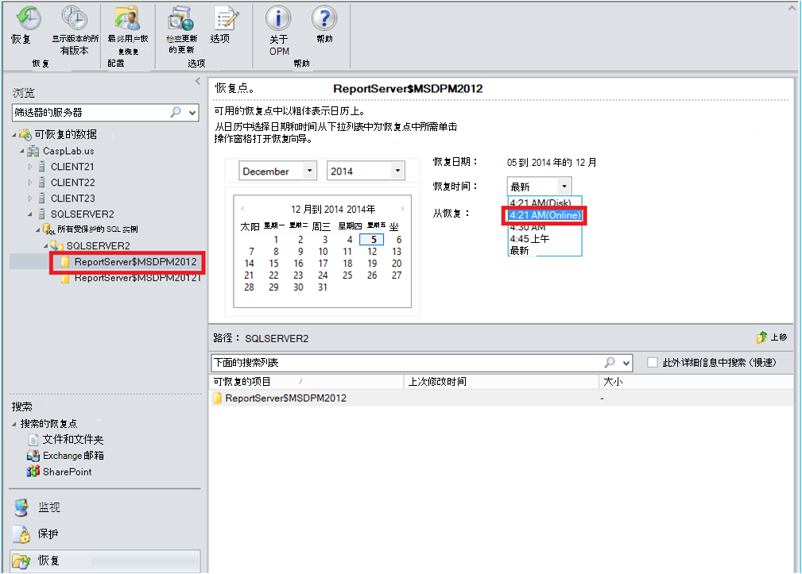

<properties
    pageTitle="Azure 用于 SQL Server 工作负载使用 DPM 备份 |Microsoft Azure"
    description="简介使用 Azure 备份服务的 SQL Server 数据库备份"
    services="backup"
    documentationCenter=""
    authors="adigan"
    manager="Nkolli1"
    editor=""/>

<tags
    ms.service="backup"
    ms.workload="storage-backup-recovery"
    ms.tgt_pltfrm="na"
    ms.devlang="na"
    ms.topic="article"
    ms.date="09/27/2016"
    ms.author="adigan;giridham; jimpark;markgal;trinadhk"/>

# 对于 SQL Server 工作负载使用 DPM azure 备份

本文将引导您完成使用 Azure 备份的 SQL Server 数据库备份的配置步骤。

若要备份到 Azure 的 SQL Server 数据库，您需要 Azure 帐户。 如果您没有帐户，您可以在只需几分钟的时间创建免费的试用帐户。 有关详细信息，请参阅[Azure 免费试用版](https://azure.microsoft.com/pricing/free-trial/)。

SQL Server 数据库备份到 Azure 和恢复从 Azure 的管理包括三个步骤︰

1. 创建一个备份策略，以保护 SQL Server 数据库到 Azure。
2. 创建按需备份拷贝，到 Azure。
3. 从 Azure 中恢复数据库。

## 在开始之前
在开始之前，请确保已满足所有[系统必备组件](../backup-azure-dpm-introduction.md#prerequisites)使用 Microsoft Azure 备份以保护工作负载。 系统必备组件如介绍任务︰ 创建备份的存储库、 下载存储库凭据，安装 Azure 备份代理，和存储库中注册服务器。

## 创建一个备份策略，以保护到 Azure 的 SQL Server 数据库

1. 在 DPM 服务器上，单击**保护**区。

2. 在工具功能区上，单击**新建**以创建一个新的保护组。

    

3. DPM 显示指导开始屏幕上创建**保护组**。 单击**下一步**。

4. 选择**服务器**。

    

5. 展开要备份的数据库所在的 SQL Server 的计算机。 DPM 显示各种可以从该服务器上备份的数据源。 展开**所有 SQL 共享**，选择 （在本例中我们选择报表服务器 $MSDPM2012 和报表服务器 $MSDPM2012TempDB） 的数据库进行备份。 单击**下一步**。

    

6. 提供保护组的名称并选择**我希望在线保护**复选框。

    

7. 在**指定的短期目标**屏幕中，包括必需的输入来创建备份到磁盘的点。

    这里我们可以看到，**在保留期限范围**设置为*5 天*，**同步频率**设置为每一次*15 分钟*即从该处执行备份的频率。 **快速完整备份**设置为*8:00 至下午*。

    

    >[AZURE.NOTE] 在 8:00 PM （根据屏幕输入） 某一备份点是备份点的前一天的下午 8:00 从传输已被修改的数据每天产生。 此过程称为**快速完整备份**。 同步日志的交易记录时每隔 15 分钟，如果需要恢复数据库，请在下午 9:00 – 那么点通过重播最后的日志创建快速完整备份时间点 (在此例中 8 pm)。

8. 单击**下一步**

    DPM 显示全部可用的存储空间和潜在磁盘空间的利用率。

    

    默认情况下，DPM 创建一个每个数据源 （SQL Server 数据库） 用于初始备份副本的卷。 使用此方法，逻辑磁盘管理器 (LDM) 限制 DPM 保护到 300 的数据源 （SQL Server 数据库）。 若要变通解决此限制，请选择**共同查找 DPM 存储池中的数据**，选项。 如果使用此选项时，DPM 使用单个卷对于多个数据源，它允许 DPM 保护达 2000年的 SQL 数据库。

    如果选择了**自动增大卷**选项，DPM 可以考虑增加备份卷随着生产数据的增长。 如果不选择**卷的自动增长**选项，DPM 将限制备份存储用于保护组中的数据源。

9. 管理员可选择传输此初始备份手动 （关闭网络） 为避免带宽拥塞或通过网络。 他们还可以配置初始传输可能的时间。 单击**下一步**。

    

    初始备份副本需要传输整个数据源 （SQL Server 数据库） 生产服务器 （SQL Server 计算机） 到 DPM 服务器。 此数据可能很大，并通过网络传输数据可能超过带宽。 因此，管理员可以选择传输初始备份︰**手动**（使用可移动媒体） 以免带宽拥塞，或**自动通过网络**（在指定的时间）。

    初始备份完成后，备份的其余部分是在初始备份的增量备份。 增量备份往往很小，轻松地通过网络传输。

10. 请选择所需的一致性检查运行并单击**下一步**。

    

    DPM 可以执行一致性检查到检查备份点的完整性。 它计算该文件在 DPM 生产服务器 （在此情况下 SQL Server 计算机） 和备份数据的备份文件的校验和。 发生冲突，则假定在 DPM 备份文件已损坏。 DPM 纠正了备份数据，通过发送对应于校验和不匹配的块。 一致性检查是一个性能密集型操作，管理员有计划一致性检查或自动运行的选项。

11. 若要指定数据源的在线保护，选择数据库保护对 Azure 并单击**下一步**。

    

12. 管理员可以选择备份时间表和保留策略，适应其组织的策略。

    

    在此示例中，执行备份每天一次在下午 12:00 和晚上 8 点 （在屏幕的下半部分）

    >[AZURE.NOTE] 最好有一些短期的恢复点在磁盘上进行快速恢复。 这些恢复点用于"运营恢复"。 Azure 作为好异地位置更高的服务级别协议，并保证可用性。

    **最佳实践**︰ 确保使用 DPM 的本地磁盘备份完成后安排人员 Azure 备份。 这样，最新的磁盘备份，拷贝到 Azure。

13. 选择保留策略计划。 在[使用 Azure 的备份来替换您的磁带基础结构文章](backup-azure-backup-cloud-as-tape.md)提供了有关的保留策略的工作原理的详细信息。

    

    在此示例中︰

    - 备份在中午 12:00 和晚上 8 点 （在屏幕的下半部分） 采取一天一次，保留 180 天。
    - 上周六中午 12:00 在备份 在 104 周保留
    - 下午 12:00 的最后一个周六备份 保留为 60 个月
    - 中午 12:00 3 月最后一个周六备份 10 年来保留

14. 单击**下一步**，并选择适当的选项，将初始备份副本转移到 Azure。 您可以选择**自动在网络上**或**离线备份**。

    - **通过网络自动**根据为备份选择的时间表将备份数据转移到 Azure。
    - **脱机备份**的工作原理进行了说明在[Azure 备份中的离线备份工作流](backup-azure-backup-import-export.md)。

    选择要发送到 Azure 的初始备份副本并单击**下一步**的相关传输机制。

15. 一旦您查看策略详细信息**摘要**屏幕中的，单击**创建组**按钮以完成该工作流。 您可以单击**关闭**按钮并监视作业进度监视工作区中。

    

## SQL Server 数据库的按需备份
前面的步骤创建的备份策略，仅在发生第一次备份时创建"恢复点"。 而不是等待计划程序启动，触发器创建恢复以下步骤手动点。

1. 等待，直到创建恢复点之前的数据库保护组状态显示了**确定**。

    

2. 右击数据库并选择**创建恢复点**。

    

3. 在下拉菜单中选择**在线保护**，然后单击**确定**。 这将启动在 Azure 创建恢复点。

    

4. 您可以查看**监视**在工作区中，您将找到正在进行中的作业进度完成类似下图所示的一个。

    

## 从 Azure 恢复 SQL Server 数据库
以下步骤需要从 Azure 恢复受保护的实体 （SQL Server 数据库）。

1. 打开 DPM 服务器管理控制台。 导航到**恢复**工作区可以看到备份 dpm 服务器的位置。 浏览 （在 $MSDPM2012 此案例报表服务器） 所需的数据库。 选择**从恢复**时间的结尾为**联机**。

    

2. 右键单击数据库名称，然后单击**恢复**。

    

3. DPM 显示恢复点的详细信息。 单击**下一步**。 若要覆盖数据库，选择**恢复到 SQL Server 原始实例**的恢复类型。 单击**下一步**。

    

    在此示例中，DPM 允许数据库恢复到另一个 SQL Server 实例或独立的网络文件夹。

4. 在**指定恢复选项**屏幕中，可以选择像网络带宽使用率限制恢复选项，用于调节带宽使用的恢复。 单击**下一步**。

5. 在**摘要**屏幕中，可以看到到目前为止提供的所有恢复配置。 单击**恢复**。

    恢复状态显示了要恢复的数据库。 您可以单击**关闭**以关闭向导并在**监视**工作区中查看进度。

    

    完成恢复后，恢复的数据库是应用程序一致性。

### 下一步︰

•[备份的 azure 常见问题解答](backup-azure-backup-faq.md)
