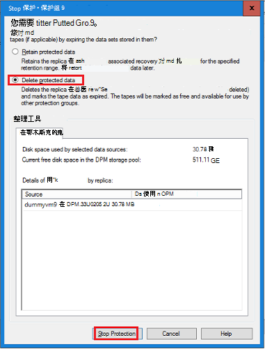
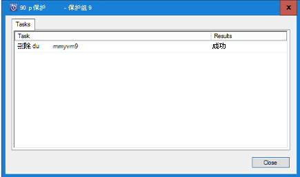
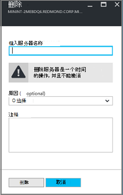

<properties
   pageTitle="删除 Azure 备份存储库 |Microsoft Azure"
   description="如何删除 Azure 备份存储库。 为什么您不能删除备份存储库的故障排除。 "
   services="service-name"
   documentationCenter="dev-center-name"
   authors="markgalioto"
   manager="cfreeman"
   editor=""/>

<tags
   ms.service="backup"
   ms.devlang="na"
   ms.topic="article"
   ms.tgt_pltfrm="na"
   ms.workload="storage-backup-recovery"
   ms.date="08/29/2016"
   ms.author="markgal;trinadhk"/>

# 删除 Azure 备份存储库

Azure 备份服务有两种类型的电子仓库的保险存储备份和恢复服务存储库。 备份存储库是第一个。 然后恢复服务存储库应运而生以支持扩展的资源管理器部署。 由于扩展的功能，必须在存储库中存储的信息相关性删除恢复服务存储库可以好像比所需更难。

|**部署类型**|**门户网站**|**电子仓库名称**|
|--------------|----------|---------|
|经典|经典|备份存储库|
|资源管理器|Azure|保险存储恢复服务|

> [AZURE.NOTE] 备份存储库不能保护资源管理器部署解决方案。 但是，可以使用恢复服务存储库来保护原来已部署的服务器和虚拟机。  

在本文中，我们使用术语中，存储库，来指代保险存储备份或恢复服务存储库的一般形式。 我们使用的正式名称、 备份存储库或恢复服务存储库中时有必要区分电子仓库。

## 删除恢复服务存储库

删除恢复服务存储库是单步进程-*提供该存储库不包含任何资源*。 您可以删除恢复服务存储库之前，必须删除或删除存储库中的所有资源。 如果您尝试删除一个包含资源的电子仓库，就像下图一样的错误。

  

已清除该存储库中的资源，直到单击**重试**产生同样的错误。 如果手足无措有关此错误消息，请单击**取消**，请按照下面的步骤来删除恢复服务存储库中的资源。

### 保护虚拟机存储库中删除项目

如果您已打开恢复服务存储库，请跳过第二步。

1.  打开 Azure 的门户网站，并从仪表板打开您想要删除该存储的库。

    如果您没有恢复服务电子仓库固定到面板，在中心菜单上，单击**更多服务**，在资源的列表中，键入**恢复服务**。 在您开始键入时，列表筛选器根据您的输入。 单击**恢复服务电子仓库**。

      

    恢复服务存储库列表中的显示。 从列表中，选择您想要删除该存储的库。

    

2. 在存储库视图中，查看**精要**窗格。 若要删除一个电子仓库，不能有任何受保护的项。 如果您看到一些非零，请在**备份的项目**或**备份管理服务器**，您必须删除这些项目之后，才能删除该存储库。

    

    虚拟机和文件/文件夹被视为备份的项，并在**备份项目**区域中的精要窗格中列出。 DPM 服务器在**备份管理服务器**区域中的精要窗格中列出。 **复制的项目**属于 Azure 站点恢复服务。

3. 要从存储库删除受保护的项，请存储库中查找的项。 在存储库面板中单击**设置**，然后单击打开该刀片式服务器的**备份项目**。

    

    **备份项**刀片式服务器有单独的列表，并根据项目类型︰ Azure 的虚拟机或文件文件夹 （请参阅图像）。 显示的默认项类型列表是 Azure 的虚拟机。 要查看存储库中的文件文件夹的项目的列表，请从下拉菜单中选择**文件文件夹**。

4. 保护虚拟机存储库中删除项目之前，必须停止该项目的备份作业并删除恢复点数据。 为存储库中的每个项，请执行以下步骤︰

    一。 **备份项目**刀片式服务器，请右键单击该项目，并从上下文菜单中，选择**停止备份**。

    

    打开刀片式服务器停止备份。

    b。 在**停止备份**刀片式服务器，从**选择选项**菜单中，选择**删除已备份的数据**> 键入的项的名称 >，然后单击**停止备份**。

      键入以确认要删除的项的名称。 **停止备份**按钮将激活，直到您验证要停止的项目。 如果看不到对话框中键入备份的项的名称，您选择了**保留备份数据**选项。

    

      （可选） 您可以提供一个原因为什么您要删除的数据，并添加注释。 单击**停止备份**后，允许删除作业完成，然后再尝试删除该存储库。 若要验证作业已经完成，请检查 Azure 消息。  
   作业完成后，您将收到一条消息指出已停止备份过程和备份数据已删除该项目。

    c。 删除列表，请在**备份项目**菜单中的项后请单击**刷新**查看存储库中的剩余项目。

      

      如果列表中没有任何项，则滚动到备份存储库刀片式服务器中的**精要**窗格中。 就不会有任何**备份项目**、**备份管理服务器**或列**复制项**。 如果项仍然显示在存储库中，返回步骤 3 以上并选择不同的项目类型列表。  

5. 保险存储工具栏中有没有更多的项目，请单击**删除**。

    

6. 当系统询问确认要删除该存储库，请单击**是**。

    存储库将被删除，门户将返回到**新建**服务菜单。

## 如果我停止备份过程，但保留数据？

如果您停止备份过程，但意外地*保留*数据，必须删除备份数据后才可以删除该存储库。 要删除备份数据︰

1. **备份项目**刀片式服务器，右键单击该项目，并在上下文菜单上单击**删除备份数据**。

    

    打开刀片式服务器**删除已备份的数据**。

2. **删除已备份的数据**刀片上, 键入项的名称，然后单击**删除**。

    

    一旦您已经删除的数据，上面，请转到步骤 4 c 并继续进程。

## 删除用于 DPM 服务器保护的保险存储

可以删除使用 DPM 服务器保护的保险存储之前，必须清除所有已创建的恢复点，然后注销存储库服务器。

要删除与保护组相关联的数据︰

1. 在 DPM 管理员控制台中，单击**保护**选择玂臔竤舱、 选择保护组成员，和工具功能区中，单击**删除**。 您必须选择**删除**按钮工具功能区中显示的成员。 在示例中，该成员是**dummyvm9**。 如果保护组中有多个成员，请按住 Ctrl 键可选择多个成员。

    

    **停止保护**对话框将打开。

2. 在**停止保护**对话框中，选择**删除受保护的数据**，并单击**停止保护**。

    

    您不想保留受保护的数据，因为您需要清除电子仓库，以将其删除。 这取决于多少恢复点和多少数据是保护组中，它要花从几秒到几分钟的时间来删除此数据。 完成作业后，**停止保护**对话框中显示的状态。

    

3. 继续此过程，所有的保护组中的所有成员。

    您必须删除所有受保护的数据和保护组。

4. 从保护组中删除所有成员后, 切换到 Azure 的门户。 打开存储库面板中，并确保没有任何**备份项**、**备份管理服务器**或**复制项目**。 在存储库工具栏上，单击**删除**。

    

    如果有备份管理服务器注册到该存储库，您将无法删除该存储库，即使没有数据存储库中的。 如果您认为已经删除备份管理服务器与存储库，但仍有**精要**窗格中显示的服务器，请参阅[查找注册到该存储库的备份管理服务器](backup-azure-delete-vault.md#find-the-backup-management-servers-registered-to-the-vault)。

5. 当系统询问确认要删除该存储库，请单击**是**。

    存储库将被删除，门户将返回到**新建**服务菜单。

## 删除电子仓库用于保护生产服务器

您可以删除一个电子仓库，用于保护生产服务器之前，必须删除或注销存储库服务器。

要删除与该存储库相关联的生产服务器︰

1. 在 Azure 的门户中，打开存储库面板，然后单击**设置** > **备份基础架构** > **的生产服务器**。

    

    **生产服务器**刀片式服务器将打开，并列出存储库中的所有生产服务器。

    

2. 在**生产服务器**刀片式服务器，右键单击该服务器，然后单击**删除**。

    

    **删除**刀片式服务器打开。

    

3. 在**删除**刀片式服务器，请确认要删除，然后单击**删除**的服务器的名称。 您必须正确输入服务器激活的**删除**按钮的名称。

    一旦存储库已被删除，您将收到一条消息指出已删除存储区。 删除存储库中的所有服务器后, 滚动回存储库面板中精要窗格中。

4. 在存储库面板中，请确保没有**备份项**、**备份管理服务器**或**复制项目**。 在存储库工具栏上，单击**删除**。

5. 当系统询问确认要删除该存储库，请单击**是**。

    存储库将被删除，门户将返回到**新建**服务菜单。

## 删除备份存储库

以下是有关说明删除备份电子仓库中经典的门户。 保险存储备份和恢复服务存储库是相同的︰ 您可以删除该存储库之前，请删除项和保留的数据。

1. 打开传统门户网站。

2. 从备份存储库列表中，选择您想要删除该存储的库。

    

    保险存储面板会打开。 查看与存储库相关联的 Windows 服务器和/或 Azure 虚拟机的数量。 另外，看在 Azure 中消耗的总存储。 您将需要停止任何备份作业，然后再删除该存储库中删除现有数据。

3. 单击**受保护的项**选项卡，然后单击**停止保护**

    

    **停止保护的存储库**对话框将出现。

4. 在**停止保护的存储库**对话框中，选中**删除关联的备份数据**，然后单击。  
   或者，可以选择停止保护的原因并提供的注释。

    

    删除存储库中的项目之后, 电子仓库将为空。

    

5. 在选项卡的列表中，单击**注册项**。 在存储库中注册每一项，选择该项目，并单击**注销**。

    

6. 在选项卡的列表中，请单击**操控板**打开该选项卡。 验证没有任何已注册的服务器或 Azure 云在受保护的虚拟机。 同时，验证存储区中没有任何数据。 单击**删除**可删除存储库。

    

    删除备份存储库确认屏幕打开。 为什么您要删除该存储库并单击选择 .  

    

    保险存储被删除，并且您返回经典门户的仪表板。

### 查找备份管理服务器注册到该存储库

如果您有多个服务器注册到一个电子仓库，它可以很难记住它们。 请参阅服务器注册到该存储库，并将其删除︰

1. 打开存储库面板。

2. **精要**窗格中，单击要打开该刀片式服务器的**设置**。

    

3. 在**设置刀片式服务器**，请单击**备份基础结构**。

4. 在**备份基础架构**刀片式服务器，单击**备份管理服务器**。 备份管理服务器刀片式服务器打开。

    

5. 若要从列表中删除服务器，右键单击服务器名称，然后单击**删除**。
    **删除**刀片式服务器打开。

6. 在**删除**刀片式服务器，提供的服务器的名称。 如果名称太长，可以复制并粘贴它从备份管理服务器的列表。 然后单击**删除**。  
