<properties
    pageTitle="介绍 Azure DPM 备份 |Microsoft Azure"
    description="备份 DPM 服务器使用 Azure 备份服务简介"
    services="backup"
    documentationCenter=""
    authors="Nkolli1"
    manager="shreeshd"
    editor=""
    keywords="系统中心 Data Protection Manager，数据保护管理器、 dpm 备份"/>

<tags
    ms.service="backup"
    ms.workload="storage-backup-recovery"
    ms.tgt_pltfrm="na"
    ms.devlang="na"
    ms.topic="article"
    ms.date="08/08/2016"
    ms.author="trinadhk;giridham;jimpark;markgal;adigan"/>

# 准备到 Azure 使用 DPM 备份工作负载

> [AZURE.SELECTOR]
- [Azure 的备份服务器](backup-azure-microsoft-azure-backup.md)
- [SCDPM](backup-azure-dpm-introduction.md)
- [Azure 备份服务器 （传统）](backup-azure-microsoft-azure-backup-classic.md)
- [SCDPM （传统）](backup-azure-dpm-introduction-classic.md)

本文介绍了使用 Microsoft Azure 备份来保护您的系统中心 Data Protection Manager (DPM) 服务器和工作负载。 通过阅读它，您就会明白︰

- Azure DPM 服务器备份的工作原理
- 系统必备组件以实现平滑的备份体验
- 遇到的典型错误，以及如何处理它们
- 受支持的方案

> [AZURE.NOTE] Azure 具有用于创建和使用资源的两种部署模型︰[资源管理器和经典](../resource-manager-deployment-model.md)。 这篇文章提供的信息和过程还原部署使用资源管理器模型的虚拟机。

System Center DPM 备份的文件和应用程序数据。 可以存储在磁盘上的磁带，或备份到 Azure 使用 Microsoft Azure 备份到 DPM 备份数据。 DPM 交互使用 Azure 的备份︰

- **作为物理服务器或内部部署虚拟机部署 DPM** — 如果 DPM 部署作为物理服务器或可以备份数据恢复服务以及磁盘和磁带保险存储到内部部署 Hyper-V 虚拟机备份。
- **DPM Azure 的虚拟机作为部署**— — 从与更新 3 System Center 2012 R2，DPM 可以部署为 Azure 的虚拟机。 如果 DPM 将部署为 Azure 的虚拟机，您可以将数据备份到 Azure 的磁盘连接到 DPM Azure 虚拟机，或者能够将数据存储到恢复服务存储库支持它的大量分流。

## 为什么从 DPM 备份到 Azure 吗？

使用 Azure 备份进行备份 DPM 服务器的业务好处包括︰

- 对于内部 DPM 部署，可以使用 Azure 作为长期部署到磁带的替代方法。
- 对于 DPM Azure 中的部署，Azure 备份允许您卸载从 Azure 的磁盘上的存储使您能够通过将较旧的数据存储在恢复服务存储库和磁盘上的新数据来扩大规模。

## 系统必备组件
准备 Azure 备份来备份 DPM 数据，如下所示︰

1. **创建恢复服务存储库**— — 在 Azure 的门户网站中创建一个电子仓库。
2. **下载存储库凭据**— 下载用于注册到恢复服务存储库的 DPM 服务器的凭据。
3. **安装 Azure 备份代理**— — 从 Azure 的备份，请在每个 DPM 服务器上安装代理。
4. **注册服务器**— 恢复服务存储库到 DPM 服务器注册。

### 1.创建恢复服务存储库
若要创建一个恢复服务存储库︰

1. 登录到[Azure 的门户](https://portal.azure.com/)。

2. 中心的菜单上，单击**浏览**，在资源的列表中，键入**恢复服务**。 在您开始键入时，将筛选列表根据您的输入。 单击**恢复服务存储库**。

    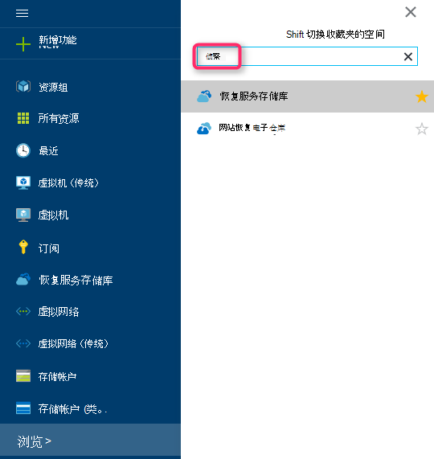

    恢复服务存储库列表中的显示。

3. 在**恢复服务存储库**菜单上，单击**添加**。

    

    恢复服务存储库刀片式服务器将打开，并提示您提供的**名称**、**订阅**、**资源组**和**位置**。

    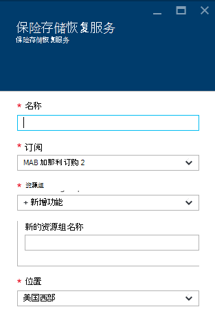

4. 对于**名称**，输入好记的名称来标识该存储库。 名称必须是唯一的 Azure 的订阅。 键入包含 2 至 50 个字符的名称。 它必须以字母开头，可以包含字母、 数字和连字符。

5. 单击以查看可用的订阅的**订阅**。 如果您不能确定要使用哪种订阅，使用默认值 （或建议） 订阅。 将多个选项，如果您组织的帐户与多个 Azure 订阅关联。

6. 单击**资源组**来查看可用资源组列表，或单击**新建**以创建新的资源组。 有关资源组的完整信息，请参阅[Azure 资源管理器概述](../azure-resource-manager/resource-group-overview.md)

7. 单击以选择该存储库的地理区域的**位置**。

8. 单击**创建**。 它可能需要一段时间的恢复服务存储库创建。 监视在门户上方右侧区域中的状态通知。
创建存储库后，它将打开门户中。

### 设置存储复制

存储复制选项允许您选择地理冗余存储到本地冗余存储之间。 默认情况下，您的存储库具有地理冗余存储。 保留设置为地理冗余存储，如果这是您主要的备份选项。 如果希望不是很一样持久便宜选项，请选择本地冗余存储。 阅读更多关于[地理冗余](../storage/storage-redundancy.md#geo-redundant-storage)和[Azure 存储复制概述](../storage/storage-redundancy.md)中的[本地冗余](../storage/storage-redundancy.md#locally-redundant-storage)存储选项。

若要编辑存储复制设置︰

1. 选择您的存储库，以打开存储库面板，并设置刀片式服务器。 如果未打开刀片式服务器**的设置**，单击存储库面板中的**所有设置**。

2. 在**设置**刀片式服务器，单击**备份基础架构** > 要打开刀片式服务器**备份配置**的**备份配置**。 在**备份配置**刀片式服务器，选择存储复制选项为您的存储库。

    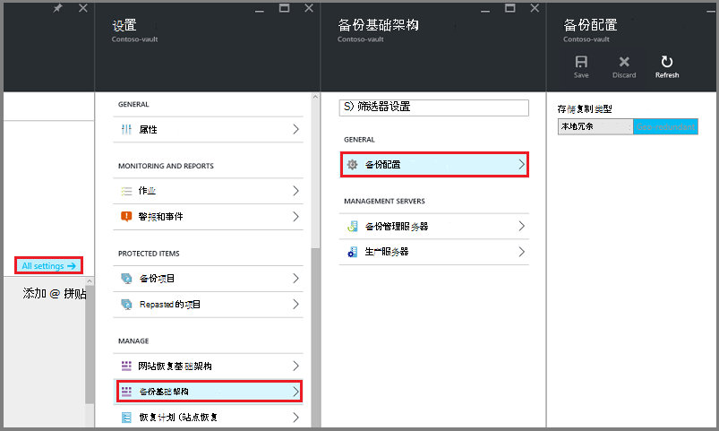

    在选择了您的存储库的存储选项之后, 您就可以存储库相关联的虚拟机。 若要开始该关联，应发现并注册 Azure 的虚拟机。

### 2.下载存储库凭据

存储库凭据文件是生成的每个备份的存储库的门户网站的证书。 门户然后上载中的公共密钥对访问控制服务 (ACS)。 该证书的私钥可供作为输入提供计算机注册工作流中的流中的用户。 这对将备份数据发送到备份 Azure 服务中识别存储库的计算机身份验证。

登记工作流期间只使用存储库凭据。 它是用户的责任，以确保存储库凭据文件不会受到影响。 如果它落在任何恶意用户的手中，可以使用存储库凭据文件注册其他计算机免受同一存储库。 但是，随着使用属于客户的密码加密备份数据，不能破坏现有备份数据。 为了缓解这一问题，保险存储凭据有效期设置为在 48hrs 中。 下载恢复服务的存储库凭据任意数量的时间 – 但只有最新的存储库凭据文件适用登记工作流过程。

存储库凭据文件是通过安全通道从 Azure 的门户网站下载。 Azure 备份服务没有意识到该证书的专用密钥和专用密钥不保留在门户网站或服务。 使用以下步骤将存储库凭据文件下载到本地计算机。

1. 登录到[Azure 的门户](https://portal.azure.com/)。

2. 与其打开恢复服务存储库到想要注册 DPM 计算机。

3. 默认情况下会打开刀片式服务器的设置。 如果它关闭的请单击**设置**电子仓库操控板打开设置刀片式服务器上的。 在刀片式服务器设置，单击**属性**。

    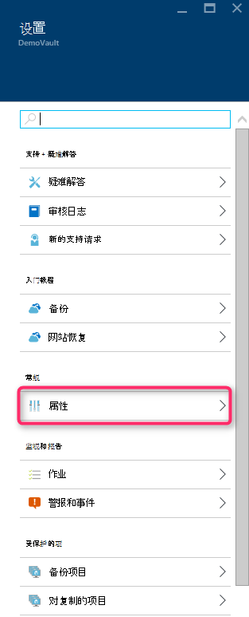

4. 在属性页上单击**备份**凭据的**下载**。 门户网站生成存储库凭据文件，这可供下载。

    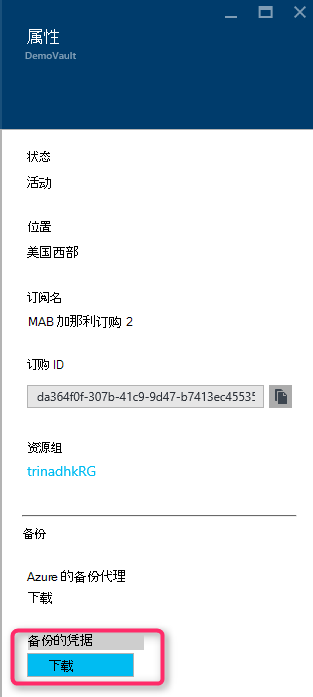

门户将生成存储库凭据使用电子仓库名称和当前日期的组合。 单击**保存**将下载到本地帐户的下载文件夹，存储库凭据或另存为存储库凭据指定位置保存菜单中选择。 它只占用一分钟要生成的文件的时间。

### 请注意
- 确保存储库凭据文件保存在可通过您的计算机的位置。 如果它存储在文件共享和 SMB，检查访问权限。
- 存储库凭据文件只在登记工作流使用。
- 存储库凭据文件过后 48hrs，可以从门户网站上下载。

### 3.安装备份代理

创建后 Azure 备份存储库，应在每个备份的数据和应用程序到 Azure 使您 Windows 计算机 （Windows 服务器的 Windows 客户端，系统中心 Data Protection Manager 服务器、 Azure 备份服务器计算机） 上安装代理。

1. 与其打开恢复服务存储库到想要注册 DPM 计算机。

2. 默认情况下会打开刀片式服务器的设置。 如果它关闭的请单击**设置**以打开设置刀片式服务器。 在刀片式服务器设置，单击**属性**。

    

3. 在设置页上在**Azure 备份代理程序**下，单击**下载**。

    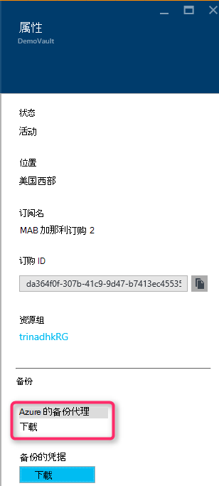

   代理程序下载后，双击 MARSAgentInstaller.exe 启动 Azure 备份代理程序的安装。 选择安装文件夹和暂存文件夹所需的代理。 指定的缓存位置必须有可用空间，即至少 5%的备份数据。

4.  如果您使用代理服务器连接到互联网，在**代理配置**屏幕中，输入代理服务器的详细信息。 如果使用经过身份验证的代理服务器，请在此屏幕中输入用户名称和密码的详细信息。

5.  Azure 备份代理安装.NET Framework 4.5 和 Windows PowerShell （如果还没有提供的话） 来完成安装。

6.  代理在安装之后，**关闭**该窗口。

    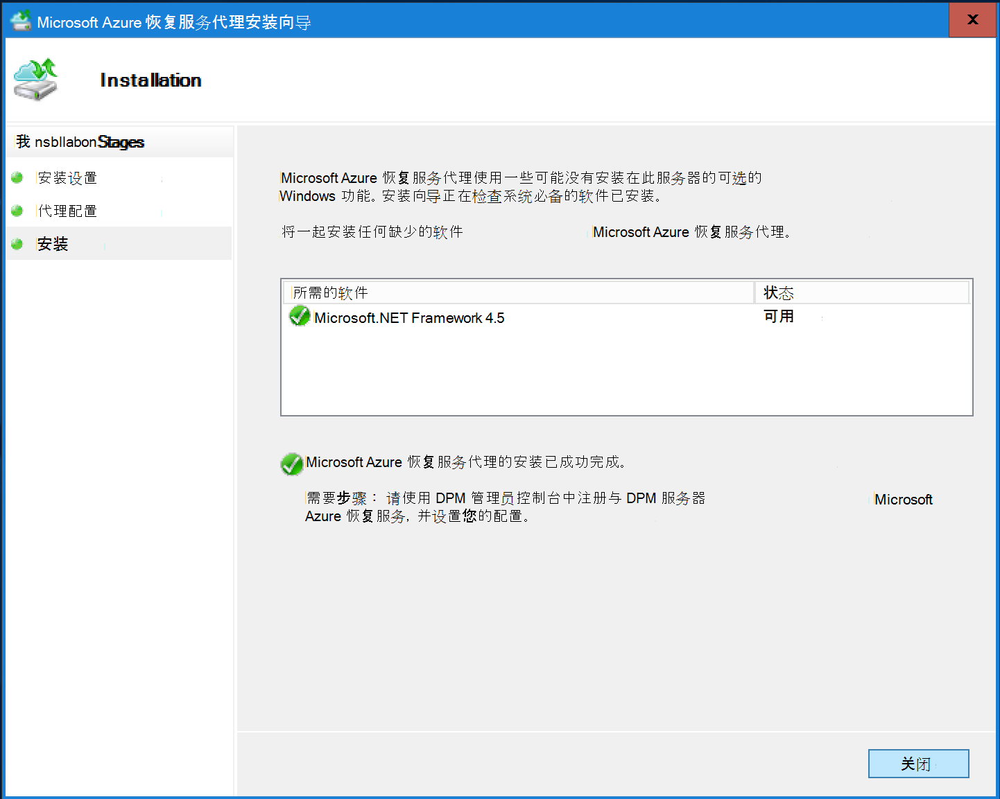

7. 到**DPM 服务器注册到**该存储库，在**管理**选项卡中单击**联机**。 然后，选择**注册**。 它将打开注册安装向导。

8. 如果您使用代理服务器连接到互联网，在**代理配置**屏幕中，输入代理服务器的详细信息。 如果使用经过身份验证的代理服务器，请在此屏幕中输入用户名称和密码的详细信息。

    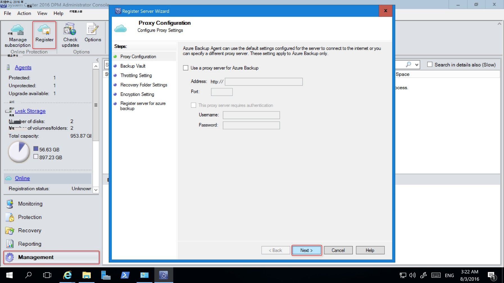

9. 在存储库凭据屏幕中，浏览到并选择以前下载的存储库凭据文件。

    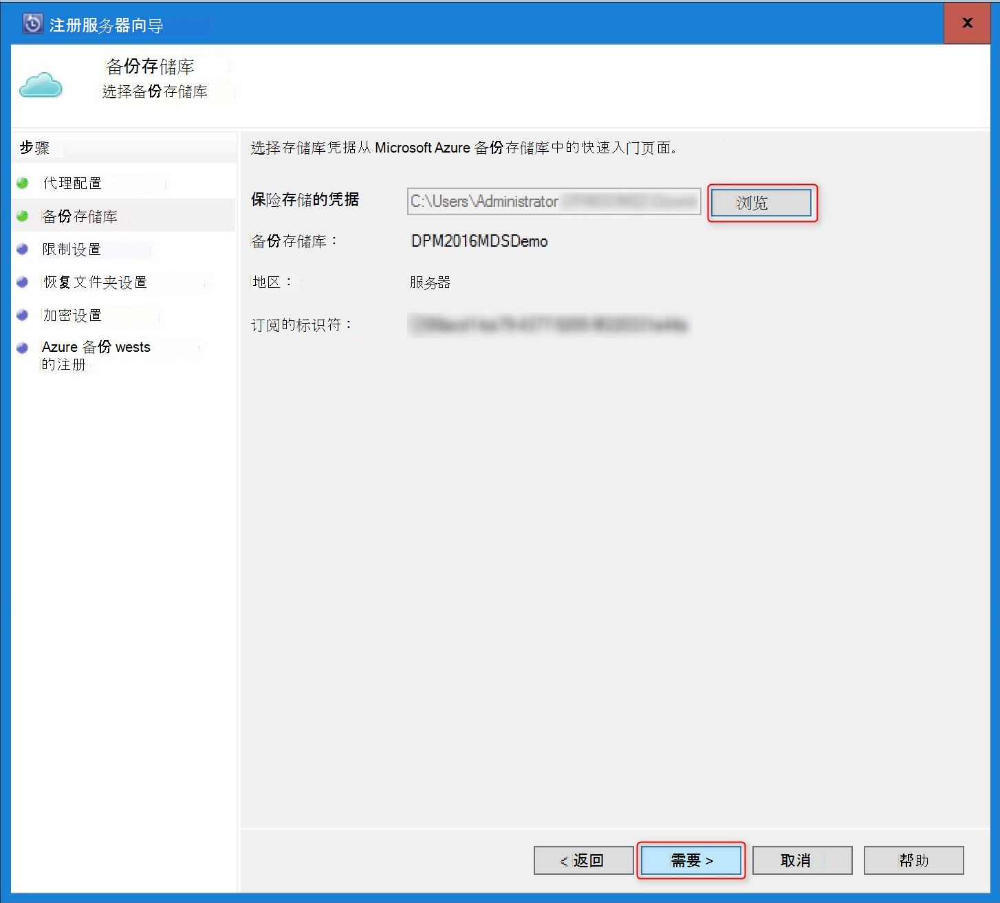

    存储库凭据文件是仅适用于 48 小时 （后从门户网站上下载）。 如果您遇到此屏幕 （例如，"保险存储凭据提供文件已过期"），登录到 Azure 的门户网站和下载存储库凭据再次文件中的任何错误。

    确保存储库凭据文件在安装应用程序可以访问这些位置可用。 如果您遇到访问相关的错误，将存储库凭据文件复制到此计算机中的临时位置并重试该操作。

    如果您遇到一个无效的存储库凭据错误 （例如，"无效的存储库凭据提供"） 的文件已损坏，或者不具有最新的凭据与恢复服务无关。 重试后从门户网站下载新的存储库凭据文件操作。 如果用户单击中的 Azure 门户，连续快速地**下载存储库凭据**选项，通常出现此错误。 在这种情况下，只有第二个存储库凭据文件是有效的。

10. 若要在工作和非工作时间，在**带宽限制设置**屏幕中，过程控制网络带宽的使用可以设置带宽使用率限制和定义工作和非工作时间。

    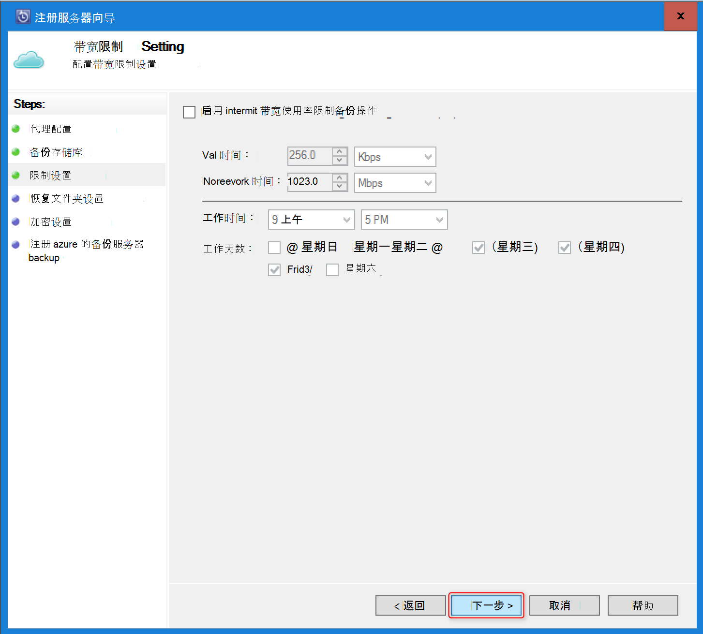

11. 在**恢复文件夹设置**屏幕中，从 Azure 下载文件的文件夹的浏览将暂时转移。

    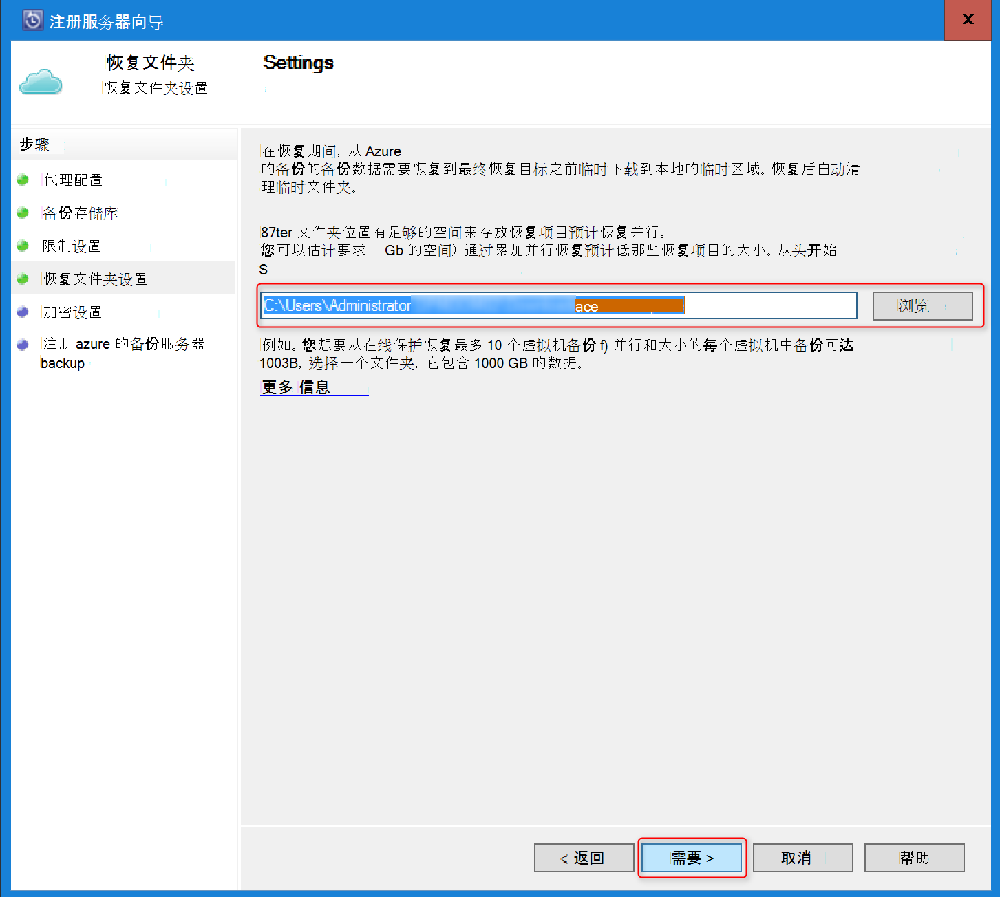

12. 在**加密设置**屏幕中，可以生成密码短语，或提供一个密码短语 （16 个字符的最小值）。 请记住要将密码保存在安全的位置。

    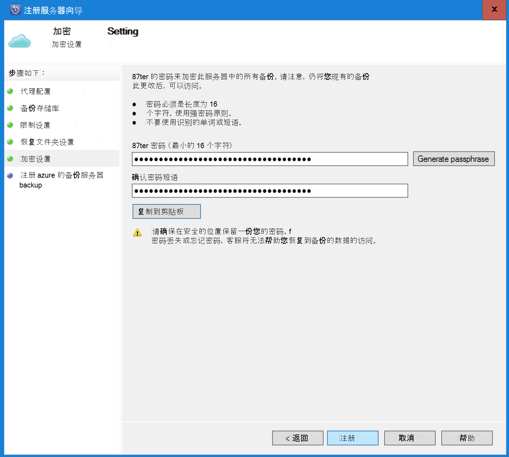

    > [AZURE.WARNING] 如果密码丢失或忘记;Microsoft 不能帮助恢复备份的数据。 最终用户拥有的加密密码，Microsoft 不具有可视性由最终用户所使用的密码。 请在安全的位置保存该文件根据需要在恢复操作过程。

13. 一旦单击**注册**按钮时，计算机成功注册到该存储库，您现在就可以开始备份到 Microsoft Azure。

14. 当使用 Data Protection Manager，您可以修改在登记工作流过程中通过选择**联机****管理**选项卡下单击**配置**选项指定的设置。

## 要求 （和限制）

- 作为物理服务器或 System Center 2012 SP1 或 System Center 2012 R2 上安装 Hyper-V 虚拟机，可以运行 DPM。 此外可以为 Azure 至少在 System Center 2012 R2 与上运行的虚拟机运行 DPM 2012 R2 更新汇总 3年或 Windows 虚拟机在 VMWare 上 System Center 2012 R2 具有至少运行更新汇总 5。
- 如果您在使用 System Center 2012 SP1 运行 DPM 应安装更新汇总 2 向上系统中心 Data Protection Manager sp1。 这是必需的才可以安装 Azure 备份代理。
- DPM 服务器应具有 Windows PowerShell 和.Net Framework 4.5 安装。
- DPM 可以备份到 Azure 备份大多数工作负荷。 有关什么支持查看完整列表 Azure 备份支持下列项目。
- 使用"复制到磁带"选项将无法恢复 Azure 备份中存储的数据。
- 您需要 Azure 帐户启用 Azure 备份功能。 如果您没有帐户，您可以在几分钟创建免费的试用帐户。 阅读有关[Azure 备份定价](https://azure.microsoft.com/pricing/details/backup/)。
- 使用 Azure 备份要求 Azure 备份代理安装在要备份的服务器上。 每台服务器必须有至少 5%的备份，可用作本地可用存储的数据的大小。 例如，备份 100 GB 的数据最少需要 5 GB 的空闲位置中的可用空间。
- 数据将存储在 Azure 存储库存储。 您可以备份到 Azure 备份保险存储的数据量没有限制，但数据源 （例如虚拟机或数据库） 的大小不应超过 54400 GB。

备份到 Azure 支持这些文件类型︰

- 加密 （仅适用于完整备份）
- 压缩 （支持增量备份）
- 稀疏 （支持增量备份）
- 压缩和稀疏 （视为稀疏）

并且，这些不受支持︰

- 不支持区分大小写的文件系统上的服务器。
- 硬链接 （跳过）
- 重分析点 （跳过）
- 加密和压缩 （跳过）
- 加密和稀疏 （跳过）
- 压缩的流
- 稀疏流

>[AZURE.NOTE] 从 sp1 开始向上 System Center 2012 DPM 中您可以备份到 Azure 使用 Microsoft Azure 备份 DPM 保护的工作负载。
