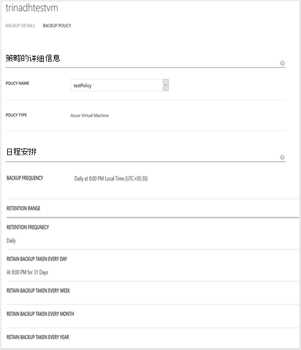
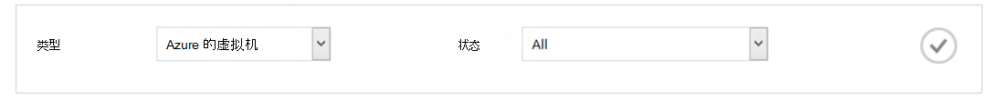

<properties
    pageTitle="管理和监视 Azure 虚拟机备份 |Microsoft Azure"
    description="了解如何管理和监视 Azure 虚拟机备份"
    services="backup"
    documentationCenter=""
    authors="trinadhk"
    manager="shreeshd"
    editor=""/>

<tags
    ms.service="backup"
    ms.workload="storage-backup-recovery"
    ms.tgt_pltfrm="na"
    ms.devlang="na"
    ms.topic="article"
    ms.date="08/31/2016"
    ms.author="trinadhk; jimpark; markgal;"/>

# <a name="manage-and-monitor-azure-virtual-machine-backups"></a>管理和监视 Azure 虚拟机备份

> [AZURE.SELECTOR]
- [管理 Azure VM 备份](backup-azure-manage-vms.md)
- [管理经典 VM 备份](backup-azure-manage-vms-classic.md)

本文提供了有关公共管理和经典模型在 Azure 中受保护的虚拟机监视任务的信息。  

>[AZURE.NOTE] Azure 具有用于创建和使用资源的两种部署模型︰[资源管理器和经典](../resource-manager-deployment-model.md)。 [准备您的环境以备份 Azure 的虚拟机](backup-azure-vms-prepare.md)上使用传统部署模型的虚拟机的详细信息，请参见

## <a name="manage-protected-virtual-machines"></a>管理受保护的虚拟机

管理受保护的虚拟机︰

1. 查看和管理备份虚拟机的设置，请单击**受保护的项**选项卡。

2. 单击要**备份详细信息**选项卡，其中显示您上次备份的信息，请参阅受保护的项的名称。

    

3. 若要查看和管理备份策略为虚拟机的设置，请单击**策略**选项卡。

    

    **备份策略**选项卡会显示现有的策略。 您可以根据需要进行修改。 如果您需要创建一个新策略将在**策略**页上单击**创建**。 请注意，是否您想要删除的策略它不应该有任何与它相关联的虚拟机。

    

4. **作业**页上的虚拟机中可以获得有关动作或状态的详细信息。 单击该列表以获取详细信息，在作业或筛选器为特定虚拟机的作业。

    

## <a name="on-demand-backup-of-a-virtual-machine"></a>虚拟机的按需备份
一旦它被配置为保护，您可以执行按需备份虚拟机。 如果初始备份将挂起虚拟机，按需备份将创建一套完整的虚拟机在 Azure 的备份存储库中。 如果第一次备份完成后，会按需备份仅发送更改从上次备份到 Azure 的备份即保险它始终是增量。

>[AZURE.NOTE] 按需备份的保留范围设置为指定的每日备份策略对应于虚拟机中保留的保留值。  

若要执行按需备份虚拟机︰

1. 导航到**受保护的项**页 （如果尚未选中），选择**Azure 虚拟机**作为**类型**并单击**选择**按钮。

    

2. 选择您要在其执行按需备份，然后单击页面底部**立即备份**按钮上的虚拟机。

    

    这将在选定的虚拟机上创建一个备份作业。 通过此作业创建的恢复点的保留范围将与虚拟机相关联的策略中指定的相同。

    

    >[AZURE.NOTE] 若要查看与虚拟机相关联的策略，向下钻取到虚拟机中的**受保护的项**页并转到备份策略选项卡。

3. 创建作业后，您可以单击**查看作业**祝酒栏以查看相应的作业在作业页中的按钮上。

    

4. 作业成功完成之后, 恢复点将创建可以用于还原虚拟机。 这也将增加 1**保护项目**页中恢复点列的值。

## <a name="stop-protecting-virtual-machines"></a>停止保护虚拟机
您可以选择停止将来的备份虚拟机具有以下选项︰

- 保留与 Azure 备份存储库中的虚拟机的备份数据
- 删除与虚拟机的备份数据

如果您已选择要保留备份数据与虚拟机相关联，您可以使用备份数据还原虚拟机。 价格的这种虚拟机的详细信息，请单击[此处](https://azure.microsoft.com/pricing/details/backup/)。

若要停止保护虚拟机︰

1. 导航到**受保护的邮件**页面选择**Azure 的虚拟机**作为筛选器类型，（如果尚未选中） 并单击**选择**按钮。

    

2. 选择虚拟机并单击页面底部的**停止保护**。

    

3. 默认情况下，Azure 备份并不会删除与该虚拟机的备份数据。

    

    如果您想要删除备份数据，请选择复选框。

    

    请选择一个理由停止备份。 虽然这是可选的提供一个原因有助于 Azure 备份处理反馈意见并确定其优先级的客户方案。

4. 单击**提交**按钮来提交**停止保护**作业。 **查看作业**以查看相应的作业在**作业**页上单击。

    

    如果您没有选择**停止保护**向导然后开机自检作业完成时**删除关联的备份数据**的选项，保护状态将变为**停止保护**。 直到被显式删除，数据将保留使用 Azure 的备份。 您始终可以通过在**受保护的项**页中选择虚拟机并单击**删除**删除的数据。

    

    如果您已选择**删除关联的备份数据**选项，虚拟机将不是**受保护的项**页的一部分。

## <a name="re-protect-virtual-machine"></a>重新保护虚拟机
如果不选择**删除关联的备份数据**选项中**停止保护**，可以按照下面的步骤类似于备份注册虚拟机重新保护虚拟机。 一旦受到保护，此虚拟机将具有备份数据保留之前停止保护和恢复点创建后重新保护。

后重新保护，虚拟计算机的保护状态将更改为**受保护**如果有之前**停止保护**的恢复点。

  

>[AZURE.NOTE] 后重新保护虚拟机，您可以选择不同的策略比虚拟机被保护的最初策略。

## <a name="unregister-virtual-machines"></a>取消注册虚拟机

如果您希望备份的存储库中删除虚拟机︰

1. 单击页面底部的**注销**按钮。

    

    Toast 通知将出现在请求确认屏幕的底部。 单击**是**以继续。

    

## <a name="delete-backup-data"></a>删除备份数据
您可以删除与虚拟机，或者关联的备份数据︰

- 在过程中停止保护作业
- 停止保护作业被完成之后的虚拟机上

若要删除处于*停止保护*状态的虚拟机上的备份数据后**停止备份**作业成功完成︰

1. 导航到**受保护的项**页为*类型*选择**Azure 虚拟机**并单击**选择**按钮。

    

2. 选择虚拟机。 虚拟机将处于**停止保护**状态。

    

3. 单击页面底部的**删除**按钮。

    

4. 在**删除备份数据**向导中，选择删除备份数据 （强烈推荐） 的原因并单击**提交**。

    

5. 这将创建一个作业以删除所选的虚拟机的备份数据。 单击**查看作业**以查看相应的作业在作业页。

    

    完成作业后，将从**受保护的项目**页面删除虚拟机所对应的项。

## <a name="dashboard"></a>仪表板
在**仪表板**页上可以查看有关 Azure 的虚拟机，其存储和最近 24 小时内与它们关联的作业的信息。 您可以查看备份状态以及任何关联的备份错误。


>[AZURE.NOTE] 在仪表板中的值来刷新记录每 24 小时一次。

## <a name="auditing-operations"></a>审核操作
Azure 的备份提供了审查的"操作"的日志备份操作触发的客户轻松地看到完全备份的存储库上执行管理操作。 操作日志启用很好总结和审核备份操作的支持。

操作日志中记录了以下操作︰

- 注册
- 注销
- 配置保护
- 备份 （同时安排以及通过 BackupNow 的按需备份）
- 还原
- 停止保护
- 删除备份数据
- 添加策略
- 删除策略
- 更新策略
- 取消作业

若要查看备份存储库所对应的操作日志︰

1. 在 Azure 门户中，导航到**管理服务**，然后单击**操作日志**选项卡。

    

2. 在筛选器中选择**备份***类型*和*服务名称*中指定的备份存储库名称单击**提交**。

    

3. 操作日志中，在选择的任何操作，然后单击对应于某个操作的详细信息，请参阅**详细信息**。

    

    **向导的详细信息**中包含有关操作触发，作业 Id，此操作触发时，和操作的开始时间在其的资源的信息。

    

## <a name="alert-notifications"></a>警报通知
您可以自定义警报通知作业在门户网站中。 这被通过基于 PowerShell 的预警规则定义操作日志事件。 我们建议使用*PowerShell 1.3.0 版或更高*。

要定义自定义通知要备份失败警报，示例命令将如下所示︰

```
PS C:\> $actionEmail = New-AzureRmAlertRuleEmail -CustomEmail contoso@microsoft.com
PS C:\> Add-AzureRmLogAlertRule -Name backupFailedAlert -Location "East US" -ResourceGroup RecoveryServices-DP2RCXUGWS3MLJF4LKPI3A3OMJ2DI4SRJK6HIJH22HFIHZVVELRQ-East-US -OperationName Microsoft.Backup/backupVault/Backup -Status Failed -TargetResourceId /subscriptions/86eeac34-eth9a-4de3-84db-7a27d121967e/resourceGroups/RecoveryServices-DP2RCXUGWS3MLJF4LKPI3A3OMJ2DI4SRJK6HIJH22HFIHZVVELRQ-East-US/providers/microsoft.backupbvtd2/BackupVault/trinadhVault -Actions $actionEmail
```

**资源 Id**︰ 如上面一节中所述可以获取此操作日志弹出窗口中。 ResourceUri 中的某项操作的详细信息弹出窗口是为此 cmdlet 提供资源 Id。

**操作名称**︰ 这将的格式为"Microsoft.Backup/backupvault/<EventName>"所在的事件名称注册、 注销、 ConfigureProtection 之一，备份、 还原、 StopProtection、 DeleteBackupData、 CreateProtectionPolicy、 DeleteProtectionPolicy、 UpdateProtectionPolicy

**状态**︰ 支持值是-已启动，成功和失败。

**ResourceGroup**: ResourceGroup 的触发操作的资源。 您可以从资源 Id 值来获得此。 字段*/resourceGroups/*和*/providers/*在资源 Id 值之间的值是 ResourceGroup 的值。

**名称**︰ 通知规则的名称。

**CustomEmail**︰ 指定要向其发送警报通知的自定义电子邮件地址

**SendToServiceOwners**︰ 此选项将通知发送到所有管理员和订阅的联管理员。 它可以用在**新建 AzureRmAlertRuleEmail** cmdlet

### <a name="limitations-on-alerts"></a>警报上的限制
基于事件的通知会受到以下限制︰

1. 在备份存储库中的所有虚拟机，将触发预警。 不能自定义它为特定组的备份存储库中的虚拟机获取警报。
2. 此功能将在预览。 [了解更多信息](../monitoring-and-diagnostics/insights-powershell-samples.md#create-alert-rules)
3. 您将收到来自"alerts-noreply@mail.windowsazure.com"。 目前，您不能修改电子邮件发件人。

## <a name="next-steps"></a>下一步行动

- [还原 Azure 的虚拟机](backup-azure-restore-vms.md)
