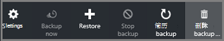

<properties
    pageTitle="管理资源管理器部署虚拟机备份 |Microsoft Azure"
    description="了解如何管理和监控资源管理器部署虚拟机备份"
    services="backup"
    documentationCenter=""
    authors="trinadhk"
    manager="shreeshd"
    editor=""/>

<tags
    ms.service="backup"
    ms.workload="storage-backup-recovery"
    ms.tgt_pltfrm="na"
    ms.devlang="na"
    ms.topic="article"
    ms.date="08/11/2016"
    ms.author="jimpark; markgal; trinadhk"/>

# 管理 Azure 虚拟机备份

> [AZURE.SELECTOR]
- [管理 Azure VM 备份](backup-azure-manage-vms.md)
- [管理经典 VM 备份](backup-azure-manage-vms-classic.md)

这篇文章管理虚拟机备份，提供指导，并解释了门户的仪表板中可用的备份警报信息。 本文中的指南适用于恢复服务存储库中使用虚拟机。 本文未涵盖创建虚拟机，也不介绍如何保护虚拟机。 保护与恢复服务电子仓库在 Azure Azure 资源管理器部署虚拟机基础知识，请参阅[先睹为快︰ 备份虚拟机到恢复服务存储库](backup-azure-vms-first-look-arm.md)。

## 管理存储库和受保护的虚拟机

在 Azure 的门户中，恢复服务保险存储仪表板提供了访问的信息存储库包括︰

- 最新的备份快照，它也是最新的还原点 < br\>
- 备份策略 < br\>
- 总大小的所有备份快照 < br\>
- 设有保险存储的虚拟机数量 < br\>

许多虚拟机备份管理任务开始与面板中打开该存储库。 但是，因为可以使用存储库来保护多个项 （或多个虚拟机），若要查看有关特定虚拟机的详细信息，请打开电子仓库项目仪表板。 下面的过程演示如何打开*保险存储仪表板*，然后继续到*电子仓库项目仪表板*。 指出如何添加电子仓库和保险项目到 Azure 的仪表板存储通过使用仪表板命令针这两个过程中有"技巧"。 对仪表板的针是一种创建存储库或项目的快捷方式。 此外可以执行常用命令的快捷方式。

>[AZURE.TIP] 如果您有多个仪表板，并且打开刀片式服务器，使用在窗口的底部深蓝色滑块滑动来回 Azure 的仪表板。

### 在操控板打开恢复服务存储库︰

1. 登录到[Azure 的门户](https://portal.azure.com/)。

2. 中心的菜单上，单击**浏览**，在资源的列表中，键入**恢复服务**。 在您开始键入时，列表筛选器根据您的输入。 单击**恢复服务存储库**。

      

    恢复服务存储库列表中的显示。

      

    >[AZURE.TIP] 如果固定到 Azure 仪表板存储库，该存储库时立即访问打开 Azure 门户网站。 若要固定到仪表板，电子仓库存储库列表中，用鼠标右键单击该存储库，并选择**固定到仪表板**。

3. 从存储库列表中，选择要打开的仪表板的电子仓库。 选择该存储库时，将打开存储库面板和**设置**刀片式服务器。 在下面的图像中， **Contoso 保险存储**仪表板将突出显示。

    

### 打开存储库项目仪表板

前面的过程中您可以打开存储库面板。 打开存储库项目仪表板︰

1. 在保险存储操控板上**备份项**拼贴，请单击**Azure 的虚拟机**。

    

    **备份项目**刀片式服务器列出每一项的最后一个备份的作业。 在此示例中，没有一台虚拟机，demovm-markgal，受此存储库。  

    

    >[AZURE.TIP] 为了便于访问，您可以锁定电子仓库项目到 Azure 的仪表板。 固定电子仓库项目中，存储库项目列表中，用鼠标右键单击该项并选择**固定到仪表板**。

2. 在**备份项**刀片式服务器，请单击项目将其打开存储库项目仪表板。

    

    打开存储库项目仪表板和其**设置**刀片式服务器。

    

    从存储库项目的仪表板，您可以如完成多项重要的管理任务:

    - 更改策略或创建新的备份策略 < br\>
    - 查看还原点，并查看它们的一致性状态 < br\>
    - 虚拟机的按需备份 < br\>
    - 停止保护虚拟机 < br\>
    - 恢复保护虚拟机的 < br\>
    - 删除备份数据 （或恢复点） < br\>
    - [还原备份 （或恢复点）](./backup-azure-arm-restore-vms.md#restore-a-recovery-point) < br\>

对于下面的过程中，起始点是电子仓库项目仪表板。

## 管理备份策略

1. 上[电子仓库项目仪表板](backup-azure-manage-vms.md#open-a-vault-item-dashboard)，请单击要打开刀片式服务器**设置**的**所有设置**。

    

2. **设置**刀片式服务器，请单击以打开该刀片式服务器的**备份策略**。

    在刀片式服务器，显示的备份频率和保留范围详细信息。

    

3. 从菜单中**选择备份策略**︰
    - 若要更改策略，选择不同的策略并单击**保存**。 新策略将立即应用到电子仓库。 < br\>
    - 若要创建一个策略，选择**新建**。

    

    有关创建备份策略的说明，请参阅[定义的备份策略](backup-azure-manage-vms.md#defining-a-backup-policy)。

[AZURE.INCLUDE [backup-create-backup-policy-for-vm](../../includes/backup-create-backup-policy-for-vm.md)]

## 虚拟机的按需备份
一旦它被配置为保护，您可以执行按需备份虚拟机。 如果初始备份尚未有定论，按需备份在恢复服务存储库中创建虚拟机的完整副本。 如果初始备份完成后，按需备份将从以前的快照，只发送更改，到恢复服务存储库。 也就是说，后续的备份都增量。

>[AZURE.NOTE] 按需备份的保留范围是为在每日备份时间点策略中指定的保留值。 如果选择没有每日备份时间点，则将使用在每周备份时间点。

若要触发一个虚拟机的按需备份︰

- 在[存储库项目仪表板](backup-azure-manage-vms.md#open-a-vault-item-dashboard)上，单击**立即备份**。

    

    门户可以确保您想要启动按需备份作业。 单击**是**以启动备份作业。

    

    备份作业创建恢复点。 在保留期限范围的恢复点是与虚拟机相关联的策略中指定的保留范围相同。 跟踪进度的作业，请在存储库面板中，单击**备份作业**拼贴。  

## 停止保护虚拟机
如果您选择停止保护虚拟机，您是系统询问您是否要保留恢复点。 有两种方法来停止保护虚拟机︰
- 停止所有将来的备份作业，并删除所有恢复点，或
- 停止所有将来的备份作业但保持恢复点  

没有与存储在保留恢复点相关的成本。 但是，离开恢复点的优点是可以将虚拟机恢复以后，如果需要。 离开的恢复点的成本信息，请参阅[定价详细信息](https://azure.microsoft.com/pricing/details/backup/)。 如果您选择删除所有恢复点，则无法还原虚拟机。

若要停止保护虚拟机︰

1. 在[存储库项目仪表板](backup-azure-manage-vms.md#open-a-vault-item-dashboard)上，单击**停止备份**。

    

    打开刀片式服务器停止备份。

    

2. 在**停止备份**刀片式服务器，选择是要保留还是删除备份数据。 信息框中提供了有关您所选择的详细信息。

    

3. 如果您选择要保留的备份数据，请跳到步骤 4。 如果您选择删除备份数据，请确认您想要停止备份作业并删除恢复点-键入的项的名称。

    

    如果您不知道项目的名称，将鼠标悬停在要查看名称的感叹号。 项的名称也在顶部的刀片式服务器**停止备份**。

4. 选择提供的**原因**或**注释**。

5. 若要停止当前项的备份作业，请单击 

    一条通知消息，可以知道备份作业已停止。

    

## 虚拟机的恢复保护
如果为虚拟机保护已停止时选择了**保留备份数据**选项，，则可以恢复保护。 如果选择**删除备份数据**选项时，无法继续保护虚拟机。

要恢复为虚拟机保护

1. 在[电子仓库项目仪表板](backup-azure-manage-vms.md#open-a-vault-item-dashboard)，请单击**恢复备份**。

    

    打开刀片式服务器备份策略。

    >[AZURE.NOTE] 后重新保护虚拟机，您可以选择不同的策略比虚拟机被保护的最初策略。

2. 按照在[更改策略或创建新的备份策略](backup-azure-manage-vms.md#change-policies-or-create-a-new-backup-policy)，将为该虚拟机策略分配。

    一旦备份策略应用到虚拟机，您将看到下面的消息。

    

## 删除备份数据
您可以删除与虚拟机相关联的备份数据期间**停止备份**作业，或备份后的任何时间完成作业。 它甚至可能有益等待几天或几周之前删除的恢复点。 与恢复的恢复点，删除备份数据时，您不能选择要删除的特定恢复点。 如果您选择删除备份数据，则删除与该项目相关联的所有恢复点。

以下过程假定已停止或禁用虚拟机的备份作业。 一旦备份作业被禁用，**恢复备份**和**删除备份**选项可存储库项目仪表板中。

要删除与*禁用备份*虚拟机上的备份数据︰

1. 在[电子仓库项目仪表板](backup-azure-manage-vms.md#open-a-vault-item-dashboard)，请单击**删除备份**。

    

    打开刀片式服务器**删除已备份的数据**。

    

2. 键入以确认您要删除的恢复点的项目的名称。

    

    如果您不知道项目的名称，将鼠标悬停在要查看名称的感叹号。 项的名称也在顶部的刀片式服务器**删除已备份的数据**。

3. 选择提供的**原因**或**注释**。

4. 若要删除当前项的备份数据，请单击 

    一条通知消息，可以知道备份数据已被删除。

## 下一步行动

有关重新创建虚拟机从一个恢复点的信息，检查出[还原 Azure Vm](backup-azure-restore-vms.md)。 如果您需要在保护您的虚拟机上的信息，请参阅[先睹为快︰ 备份虚拟机到恢复服务存储库](backup-azure-vms-first-look-arm.md)。 监视事件的信息，请参阅[监视警报的 Azure 虚拟机备份](backup-azure-monitor-vms.md)。
