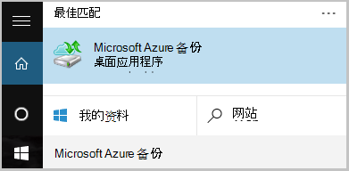
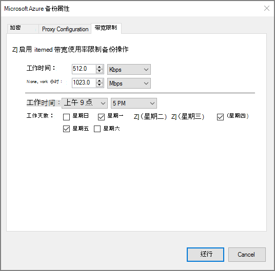

<properties
    pageTitle="管理 Azure 备份存储库和服务器使用传统部署模型的 Azure |Microsoft Azure"
    description="使用本教程来学习如何管理 Azure 备份存储库和服务器。"
    services="backup"
    documentationCenter=""
    authors="markgalioto"
    manager="jwhit"
    editor="tysonn"/>

<tags
    ms.service="backup"
    ms.workload="storage-backup-recovery"
    ms.tgt_pltfrm="na"
    ms.devlang="na"
    ms.topic="article"
    ms.date="09/27/2016"
    ms.author="jimpark;markgal"/>

# 管理 Azure 备份存储库和服务器使用传统部署模型

> [AZURE.SELECTOR]
- [资源管理器](backup-azure-manage-windows-server.md)
- [经典](backup-azure-manage-windows-server-classic.md)

本文中，您会发现通过 Azure 的传统门户网站和 Microsoft Azure 备份代理可用的备份管理任务的概述。

[AZURE.INCLUDE [learn-about-deployment-models](../../includes/learn-about-deployment-models-classic-include.md)]资源管理器的部署模型。

## 管理门户任务
1. 登录到[管理门户](https://manage.windowsazure.com)。

2. 单击**恢复服务**，然后单击备份存储库以查看快速启动页的名称。

    

通过选择快速启动页顶部的选项，可以查看可用的管理任务。

### 仪表板
选择**仪表板**以查看服务器的使用情况概览。 **使用概述**包括︰

- 注册到云的 Windows 服务器的数量
- Azure 云在受保护的虚拟机数量
- 在 Azure 中消耗总存储
- 新作业的状态

底部的仪表板可执行以下任务︰

- **管理证书**-如果证书被用于注册服务器，然后使用它来更新该证书。 如果您使用的存储库的凭据，请使用**管理证书**。
- **删除**-删除当前备份存储库。 如果不再使用备份存储库时，您可以删除它以释放存储空间。 已从存储库中删除所有已注册的服务器后，才会启用**删除**。

## 注册的项
选择要查看的服务器已注册到此电子仓库的名称的**注册项**。

**类型**筛选器默认到 Azure 的虚拟机。 若要查看已注册到此存储库服务器的名称，请从下拉菜单选择**Windows 服务器**。

从这里您可以执行以下任务︰

- **允许重新注册**-选中此选项，则服务器可以使用**注册向导**内部 Microsoft Azure 备份代理在第二次与备份存储库中注册该服务器。 您可能需要重新注册由于证书错误或如果服务器必须重新生成。
- **删除**-从该备份的存储库中删除服务器。 立即删除所有与该服务器关联的存储数据。

    

## 受保护的项
选择要查看的项目，从服务器备份的**保护项目**。

## 配置

从**配置**选项卡可以选择适当的存储冗余选项。 创建存储库后，在任何计算机注册到它之前，选择存储冗余选项的最佳时间是右。

>[AZURE.WARNING] 一旦一项注册到该存储库，存储冗余选项已被锁定，不能修改。

请参阅本文中的有关[存储冗余](../storage/storage-redundancy.md)。

## Microsoft Azure 备份代理任务

### 控制台

打开**Microsoft Azure 备份代理程序**（可以通过搜索*Microsoft Azure 备份*计算机中找到它）。

从可用备份代理程序控制台右侧的**操作**可以执行下列管理任务︰

- 注册服务器
- 计划备份
- 现在备份
- 更改属性

>[AZURE.NOTE] **恢复数据**，请参阅[将文件还原到 Windows 服务器或 Windows 客户端计算机](backup-azure-restore-windows-server.md)。

### 修改现有的备份

1. 在 Microsoft Azure 备份代理，单击**日程安排备份**。

    

2. **计划备份向导**中保留所选的**备份项目或时间更改**选项并单击**下一步**。

    

3. 如果您想要添加或更改项目，请在**选择要备份的项目**屏幕，请单击**添加项目**。

    您还可以从向导中的此页设置**排除设置**。 如果您想要排除的文件或读取的文件类型添加[排除设置](#exclusion-settings)的过程。

4. 选择的文件和文件夹备份，然后单击**好了**。

    

5. 指定的**备份时间表**，然后单击**下一步**。

    您可以安排 （在最多 3 次，每日） 的每日或每周备份。

    

    >[AZURE.NOTE] 在此[文章](backup-azure-backup-cloud-as-tape.md)中的详细说明指定的备份计划。

6. 选择备份副本的**保留策略**并单击**下一步**。

    

7. 此**确认**屏幕上查看信息，单击**完成**。

8. 一旦在向导完成创建**备份时间表**，请单击**关闭**。

    修改后的保护，您可以确认备份通过转到**作业**选项卡，并确认更改将反映在备份作业正确触发。

### 启用网络限制  
Azure 备份代理提供带宽限制选项卡上，以便您可以控制数据传输过程中网络带宽的使用方式。 此控件可以是有帮助的如果需要备份数据在工作时间，但不是希望备份过程干扰其他互联网通信。 限制的数据传输应用备份和恢复活动。  

若要启用带宽限制︰

1. 在**备份代理**，请单击**更改属性**。

2. 选择**启用互联网带宽使用率限制备份操作**复选框。

    

3. 一旦您已经启用了带宽限制，在**工作时间**和**非工作时间的**过程中指定允许备份数据传输带宽。

    带宽值 512 千字节每秒 (Kbps) 从开始，可以转达 1023 兆字节每秒 (Mbps)。 此外可以指定开始和完成**的工作时间**，与一周中的哪几天被视为工作天。 在指定的工作时间以外的时间被视为非工作时间。

4. 单击**确定**。

## 排除设置

1. 打开**Microsoft Azure 备份代理程序**（可以通过搜索*Microsoft Azure 备份*计算机中找到它）。

    

2. 在 Microsoft Azure 备份代理，单击**日程安排备份**。

    

3. 在计划备份向导将保留所选的**备份项目或时间更改**选项，然后单击**下一步**。

    

4. 单击**排除项设置**。

    

5. 单击**添加排除**。

    

6. 选择位置，然后单击**确定**。

    

7. 在**文件类型**字段中添加文件扩展名。

    

    添加.mp3 扩展名

    

    若要添加其他扩展名，请单击**添加排除**和输入其他文件类型扩展名 （添加.jpeg 扩展名）。

    

8. 当您已经添加的所有扩展，请单击**确定**。

9. 直到**确认页**上，单击**下一步**继续执行计划备份向导，然后单击**完成**。

    

## 下一步行动
- [从 Azure 还原 Windows 服务器或 Windows 客户端](backup-azure-restore-windows-server.md)
- 若要了解有关 Azure 备份的详细信息，请参阅[Azure 备份概述](backup-introduction-to-azure-backup.md)
- 访问[Azure 备份论坛](http://go.microsoft.com/fwlink/p/?LinkId=290933)
