<properties
    pageTitle="管理 Azure 恢复服务存储库和服务器 |Microsoft Azure"
    description="使用本教程来学习如何管理 Azure 恢复服务存储库和服务器。"
    services="backup"
    documentationCenter=""
    authors="markgalioto"
    manager="cfreeman"
    editor="tysonn"/>

<tags
    ms.service="backup"
    ms.workload="storage-backup-recovery"
    ms.tgt_pltfrm="na"
    ms.devlang="na"
    ms.topic="article"
    ms.date="10/19/2016"
    ms.author="jimpark; markgal"/>


# <a name="monitor-and-manage-azure-recovery-services-vaults-and-servers-for-windows-machines"></a>监视和管理 Azure 恢复服务存储库和服务器的 Windows 机器

> [AZURE.SELECTOR]
- [资源管理器](backup-azure-manage-windows-server.md)
- [经典](backup-azure-manage-windows-server-classic.md)

在这篇文章中，您会发现通过 Azure 的门户和 Microsoft Azure 备份代理可用的备份管理任务的概述。

[AZURE.INCLUDE [learn-about-deployment-models](../../includes/learn-about-deployment-models-rm-include.md)]经典的部署模型。

## <a name="management-portal-tasks"></a>管理门户任务

### <a name="access-your-recovery-services-vaults"></a>访问恢复服务存储库

1. 登录到[Azure 门户](https://portal.azure.com/)使用 Azure 订购。

2. 中心的菜单上，单击**浏览**，在资源的列表中，键入**恢复服务**。 在您开始键入时，将筛选列表根据您的输入。 单击**恢复服务电子仓库**。

    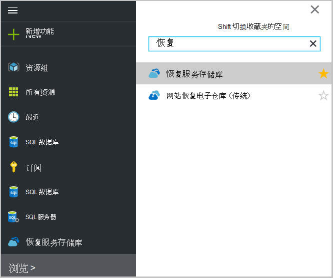 <br/>

2. 选择您想要查看打开恢复服务存储库仪表盘刀片式服务器列表中的电子仓库的名称。

    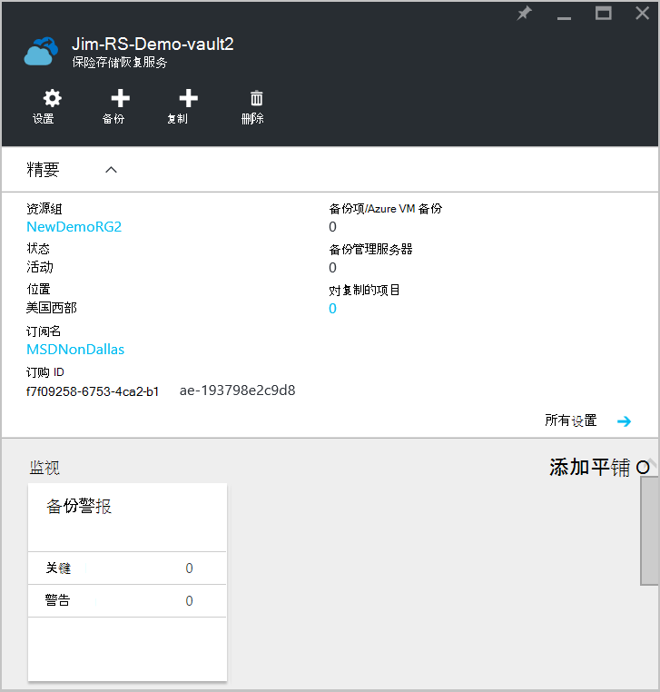 <br/>

## <a name="monitor-jobs-and-alerts"></a>监视作业和警报
您可以监视作业和警报从恢复服务存储库面板，在此可以看到︰

- 备份警报详细信息
- 文件和文件夹，以及 Azure 云在受保护的虚拟机
- 在 Azure 中消耗的总存储
- 备份作业的状态

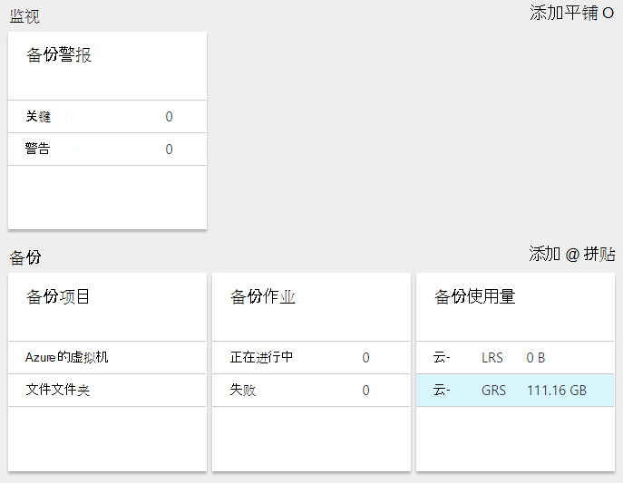

单击每种麻将牌中的信息将打开相关刀片式服务器管理相关的任务。

从控制板顶部︰

- 设置提供访问可用的备份任务。
- 备份-备份新的文件和文件夹 （或 Azure Vm） 到恢复服务存储库的帮助。
- 删除-如果不再使用恢复服务存储库时，您可以删除以释放存储空间。 已从存储库中删除所有受保护的服务器后，才会启用删除。


## <a name="alerts-for-backups-using-azure-backup-agent"></a>使用 Azure 的备份代理备份的通知︰
| 警报级别  | 发送警报 |
| ------------- | ------------- |
| 关键 | 备份失败，恢复失败  |
| 警告  | 备份完成时出现警告 （如果少于一百则不备份文件损坏问题，由于和一百多万的文件已成功备份）  |
| 提供信息  | 无  |
## <a name="manage-backup-alerts"></a>管理备份警报
单击**备份警报**拼贴来打开**备份警报**刀片式服务器并管理其警报。

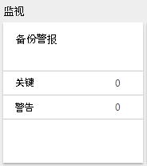

备份警报平铺显示的数目︰

- 在最近 24 小时内未解决的关键警报
- 在最近 24 小时内未解决的警告通知

单击这些链接可转到**备份警报**刀片式服务器已过滤的视图，这些警报 （紧急或警告）。

从备份警报刀片式服务器，您︰

- 选择要包括在您的通知的适当信息。

    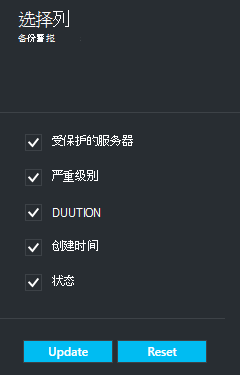

- 严重级别、 状态以及开始/结束时间筛选警报。

    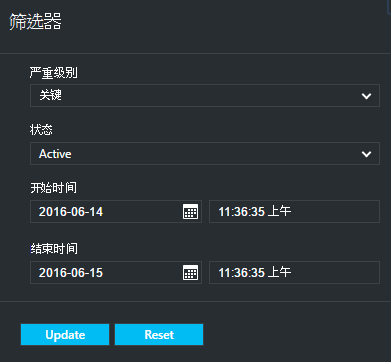

- 配置警报严重程度、 频率和收件人，以及打开或关闭警报。

    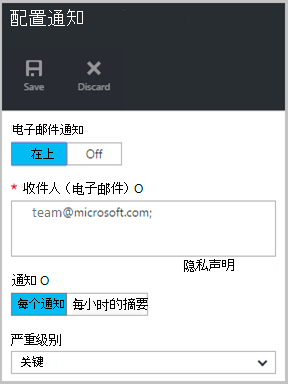

如果选择作为**通知**频率**每个警报**没有分组或减少在电子邮件中的出现。 每个警报导致 1 通知。 这是默认设置，并解析电子邮件也会立即发送出去。

如果**每小时摘要**选择作为**通知**频率一封电子邮件发给用户告诉他们存在无法解析在最后一个小时内生成的新警报。 解析电子邮件末尾的小时发送。

可以为以下严重性级别发送通知︰

- 关键
- 警告
- 信息

禁用作业详细信息刀片式服务器中的**禁用**按钮的预警。 当您单击时停用，您可以提供解析说明。

选择您希望显示**选择列**按钮的预警的一部分的列。

>[AZURE.NOTE] 通过选择的备份警报管理**设置**刀片式服务器，从**监视和报告 > 的警报和事件 > 备份警报**，然后单击**筛选器**或**配置通知**。

## <a name="manage-backup-items"></a>管理备份项
管理内部备份现管理门户中可用。 在操控板的备份部分中，**备份项目**平铺显示受保护的保险存储到备份项的数目。

单击备份项拼贴中的**文件文件夹**。

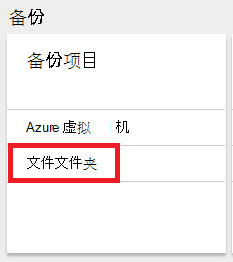

备份项目刀片式服务器打开在其中看到每个列出的项目的特定备份到文件文件夹设置的筛选器。

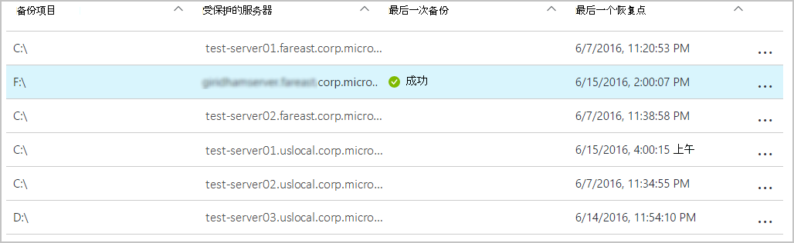

如果您从列表中选择一个特定的备份项，您会看到该项目的重要详细信息。

>[AZURE.NOTE] **设置**刀片式服务器，从文件和文件夹管理通过选择**保护项目 > 备份项目**，然后从下拉菜单中选择**文件文件夹**。

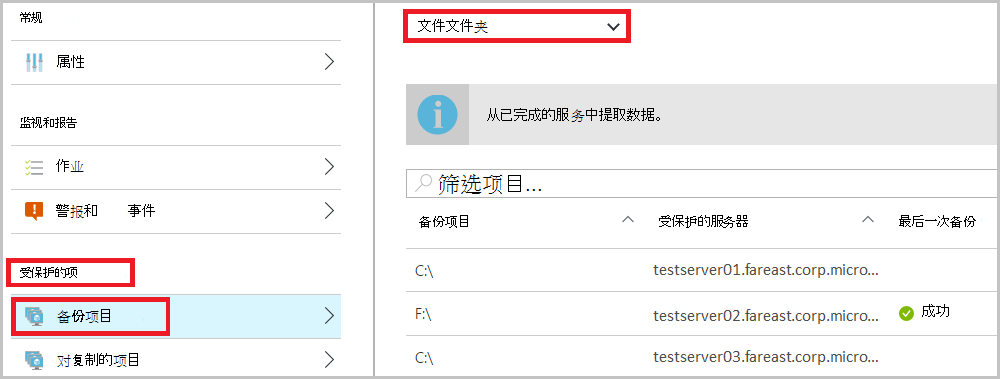

## <a name="manage-backup-jobs"></a>管理备份作业
（在内部部署服务器备份到 Azure） 时，备份工作对于内部部署和 Azure 的备份是在仪表板中可见。

在仪表板的备份部分中，备份作业平铺显示作业数︰

- 正在进行中
- 在过去的 24 小时中失败。

要管理您的备份作业，请单击刀片式服务器的备份作业打开**备份作业**平铺。

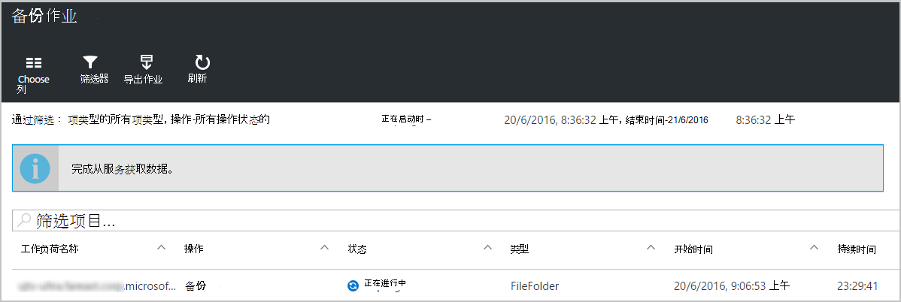

修改页面顶部的**选择列**按钮与备份作业刀片式服务器中可用的信息。

使用**筛选**按钮选择文件和文件夹和 Azure 虚拟机备份之间。

如果您没有看到您的备份的文件和文件夹，请单击页面顶部的**过滤器**按钮并从物料类型菜单中选择**文件和文件夹**。

>[AZURE.NOTE] 通过选择的备份作业管理**设置**刀片式服务器，从**监视和报告 > 作业 > 备份作业**，然后从下拉菜单中选择**文件文件夹**。

## <a name="monitor-backup-usage"></a>监视备份使用情况
在仪表板的备份部分中，备份使用平铺显示在 Azure 中消耗的存储。 为提供的存储利用率︰
- LRS 云的存储使用与存储库
- 与存储库相关联的云 GRS 存储利用率

## <a name="production-servers"></a>生产服务器
要管理您的生产服务器，请单击**设置**。 在管理下单击**备份基础架构 > 生产服务器**。

所有可用生产服务器生产服务器刀片式服务器列表。 单击以打开服务器详细信息列表中的服务器上。

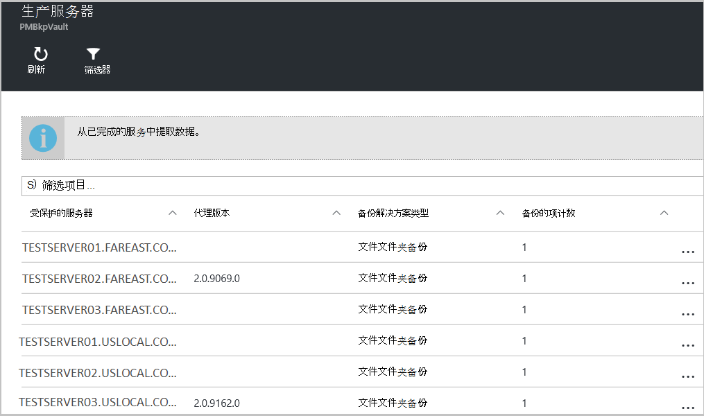

## <a name="microsoft-azure-backup-agent-tasks"></a>Microsoft Azure 备份代理任务

## <a name="open-the-backup-agent"></a>打开备份代理

打开**Microsoft Azure 备份代理程序**（您发现它通过搜索*Microsoft Azure 备份*您的计算机）。


从可用备份代理程序控制台右侧的**操作**中，您将执行下列管理任务︰

- 注册服务器
- 计划备份
- 现在备份
- 更改属性

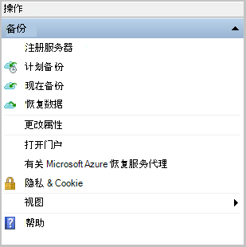

>[AZURE.NOTE] **恢复数据**，请参阅[将文件还原到 Windows 服务器或 Windows 客户端计算机](backup-azure-restore-windows-server.md)。

## <a name="modify-an-existing-backup"></a>修改现有的备份

1. 在 Microsoft Azure 备份代理，单击**日程安排备份**。

    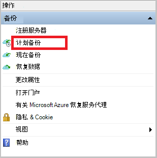

2. **计划备份向导**中保留所选的**备份项目或时间更改**选项并单击**下一步**。

    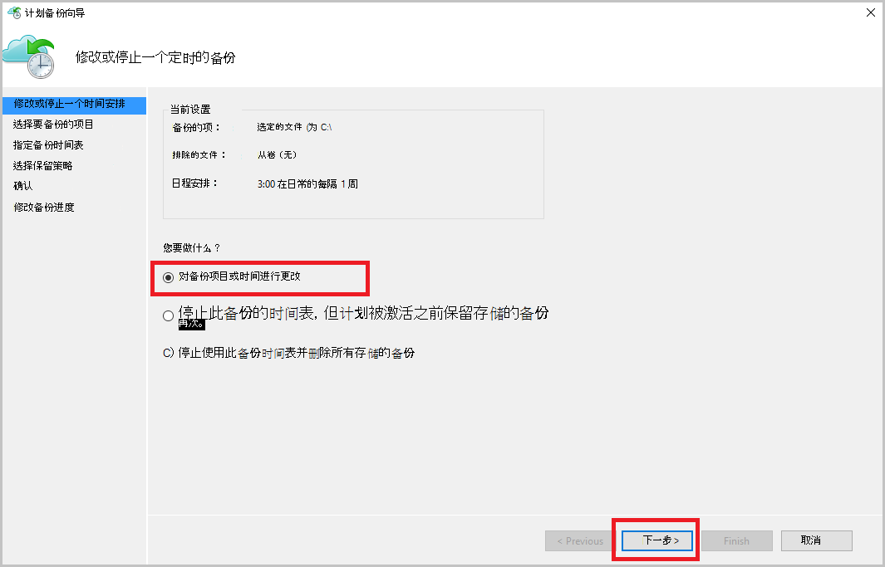

3. 如果您想要添加或更改项目，请在**选择要备份的项目**屏幕，请单击**添加项目**。

    您还可以从向导中的此页设置**排除设置**。 如果您想要排除的文件或读取的文件类型添加[排除设置](#exclusion-settings)的过程。

4. 选择的文件和文件夹备份，然后单击**好了**。

    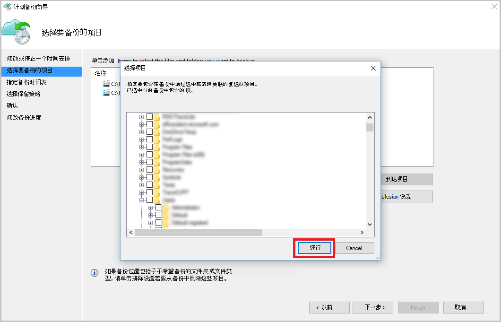

5. 指定的**备份时间表**，然后单击**下一步**。

    您可以安排 （在最多 3 次，每日） 的每日或每周备份。

    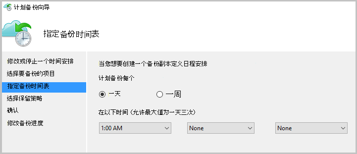

    >[AZURE.NOTE] 在此[文章](backup-azure-backup-cloud-as-tape.md)中的详细说明指定的备份计划。

6. 选择备份副本的**保留策略**并单击**下一步**。

    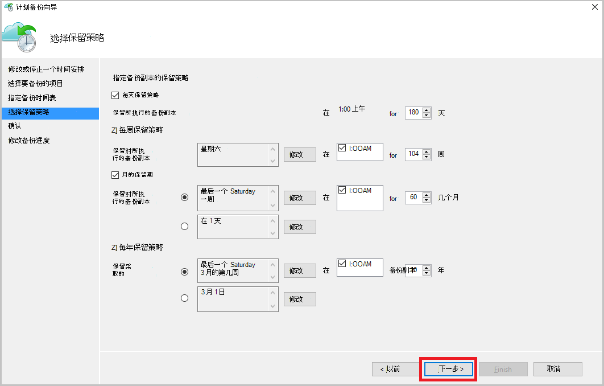

7. 此**确认**屏幕上查看信息，单击**完成**。

8. 一旦在向导完成创建**备份时间表**，请单击**关闭**。

    修改后的保护，您可以确认备份通过转到**作业**选项卡，并确认更改将反映在备份作业正确触发。

## <a name="enable-network-throttling"></a>启用网络限制  
Azure 备份代理提供带宽限制选项卡上，以便您可以控制数据传输过程中网络带宽的使用方式。 此控件可以是有帮助的如果需要备份数据在工作时间，但不是希望备份过程干扰其他互联网通信。 限制的数据传输应用备份和恢复活动。  

若要启用带宽限制︰

1. 在**备份代理**，请单击**更改属性**。

2. 在**带宽限制选项卡上，选择**启用 internet 带宽使用率限制为备份操作 * *。

    

    一旦您已经启用了带宽限制，在**工作时间**和**非工作时间的**过程中指定允许备份数据传输带宽。

    带宽值 512 千字节每秒 (Kbps) 从开始，可以转达 1023 兆字节每秒 (Mbps)。 此外可以指定开始和完成**的工作时间**，与一周中的哪几天被视为工作天。 在指定的工作时间以外的时间被视为非工作时间。

3. 单击**确定**。

## <a name="manage-exclusion-settings"></a>管理排除设置

1. 打开**Microsoft Azure 备份代理程序**（可以通过搜索*Microsoft Azure 备份*计算机中找到它）。

    

2. 在 Microsoft Azure 备份代理，单击**日程安排备份**。

    

3. 在计划备份向导将保留所选的**备份项目或时间更改**选项，然后单击**下一步**。

    

4. 单击**排除项设置**。

    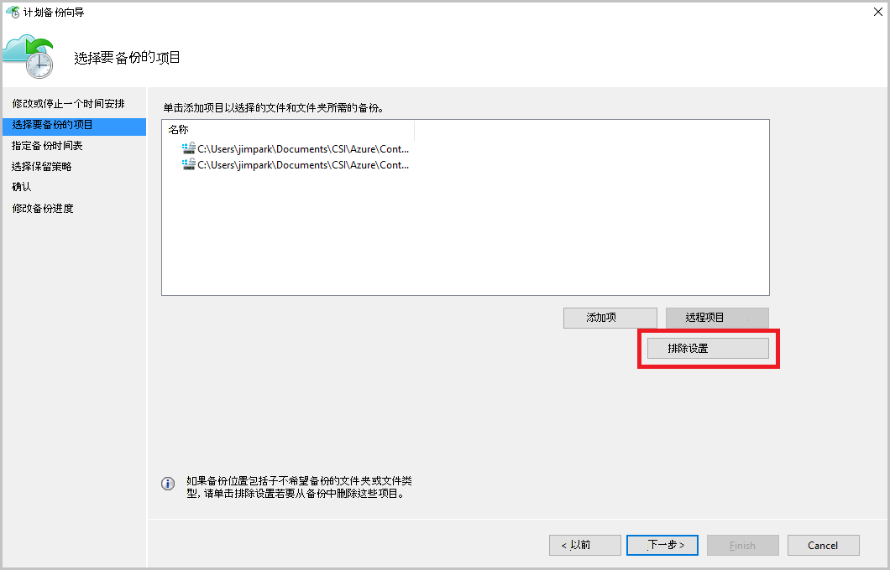

5. 单击**添加排除**。

    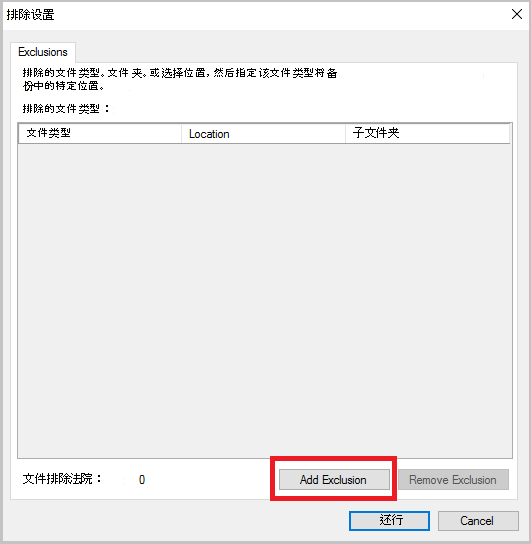

6. 选择位置，然后单击**确定**。

    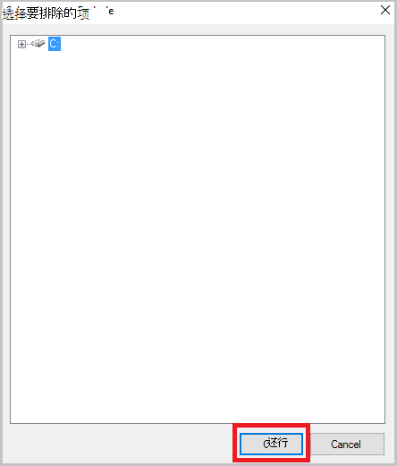

7. 在**文件类型**字段中添加文件扩展名。

    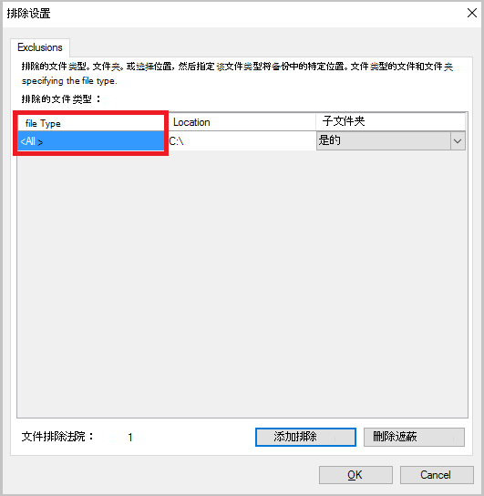

    添加.mp3 扩展名

    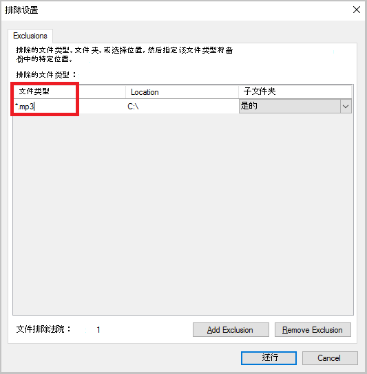

    若要添加其他扩展名，请单击**添加排除**和输入其他文件类型扩展名 （添加.jpeg 扩展名）。

    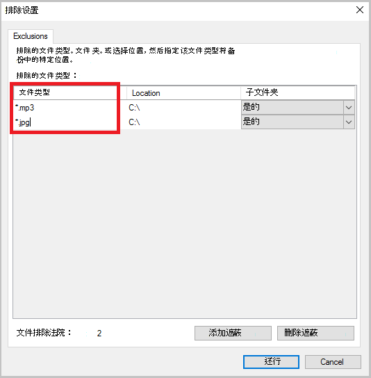

8. 当您已经添加的所有扩展，请单击**确定**。

9. 直到**确认页**上，单击**下一步**继续执行计划备份向导，然后单击**完成**。

    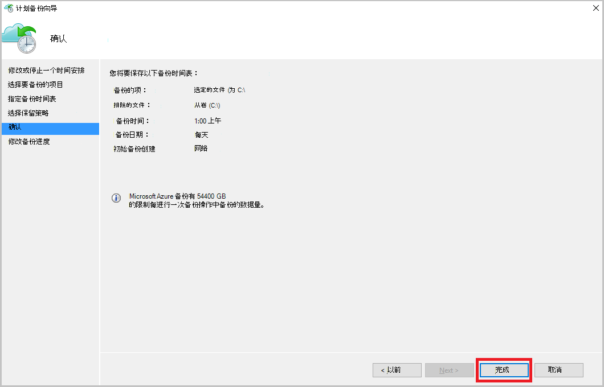

## <a name="frequently-asked-questions"></a>常见问题及的解答
**第 1 季度。备份作业状态将显示为 Azure 的备份代理程序，在已完成为什么不它获得立即反映在门户？**

A1。 那里是在最大延迟时间的 15 分钟之间的备份作业状态反映在 Azure 的备份代理和 Azure 的门户网站。

**Q.2 备份作业失败时，多长时间需要引发警报？**

A.2 警报引发在 Azure 备份失败的 20 分钟内。

**第 3 季度。有的案例如果配置通知将不会发送一封电子邮件吗？**

A3。 下面是为了减少警报声将不会发送通知的情况下︰

   - 如果每小时配置通知和警报是引发，在一个小时内解决
   - 作业被取消。
   - 第二个备份作业失败，因为原始备份作业正在进行中。

## <a name="troubleshooting-monitoring-issues"></a>监视的问题进行故障排除

**问题︰**作业和/或警报从 Azure 备份代理程序不显示在门户中。

**的故障排除步骤︰**此过程中， ```OBRecoveryServicesManagementAgent```，将作业和警报数据发送到 Azure 备份服务。 这一过程有时会卡或关机。

1. 要验证进程未运行，请打开**任务管理器**，并检查如果```OBRecoveryServicesManagementAgent```进程正在运行。

2. 假定该进程未运行，请打开**控制面板**，浏览服务列表中。 启动或重新启动**Microsoft Azure 恢复服务管理代理**。

    有关详细信息，浏览日志︰<br/>
`<AzureBackup_agent_install_folder>\Microsoft Azure Recovery Services Agent\Temp\GatewayProvider*`. 例如︰<br/> `C:\Program Files\Microsoft Azure Recovery Services Agent\Temp\GatewayProvider0.errlog`.

## <a name="next-steps"></a>下一步行动
- [从 Azure 还原 Windows 服务器或 Windows 客户端](backup-azure-restore-windows-server.md)
- 若要了解有关 Azure 备份的详细信息，请参阅[Azure 备份概述](backup-introduction-to-azure-backup.md)
- 访问[Azure 备份论坛](http://go.microsoft.com/fwlink/p/?LinkId=290933)
