<properties
  pageTitle="准备您的环境以备份工作负载使用 Azure 备份服务器 |Microsoft Azure"
  description="请确保您的环境正确准备备份工作负载使用 Azure 备份服务器"
  services="backup"
  documentationCenter=""
  authors="pvrk"
  manager="shivamg"
  editor=""
  keywords="azure 的备份服务器。备份存储库"/>

<tags
  ms.service="backup"
  ms.workload="storage-backup-recovery"
  ms.tgt_pltfrm="na"
  ms.devlang="na"
  ms.topic="article"
  ms.date="08/22/2016"
  ms.author="jimpark;trinadhk;pullabhk; markgal"/>

# <a name="preparing-to-back-up-workloads-using-azure-backup-server"></a>正在准备备份工作负载使用 Azure 备份服务器

> [AZURE.SELECTOR]
- [Azure 的备份服务器](backup-azure-microsoft-azure-backup.md)
- [SCDPM](backup-azure-dpm-introduction.md)
- [Azure 备份服务器 （传统）](backup-azure-microsoft-azure-backup-classic.md)
- [SCDPM （传统）](backup-azure-dpm-introduction-classic.md)


本文是关于准备您的环境以备份工作负载使用 Azure 备份服务器。 使用 Azure 备份服务器，您可以从单个控制台来保护如 Hyper-V 虚拟机、 Microsoft SQL Server，SharePoint 服务器，Microsoft Exchange 和 Windows 客户端应用程序工作负载。

>[AZURE.WARNING] Azure 的备份服务器继承工作负荷备份功能的 Data Protection Manager (DPM)。 您可以找到指向有关这些功能的一些 DPM 文档。 但是 Azure 备份服务器不在磁带上提供保护或集成与系统中心。

## <a name="1-windows-server-machine"></a>1.Windows 服务器计算机


Azure 备份服务器启动并运行的第一步是让 Windows 服务器计算机。

| 位置 | 最低要求 | 其他说明 |
| -------- | -------------------- | ----------------------- |
| Azure | Azure IaaS 虚拟机<br><br>A2 标准︰ 2 个核心，3.5 GB RAM | 您可以从 Windows Server 2012 R2 数据中心的简单库图像。 [保护 IaaS 工作负载使用 Azure 备份服务器 (DPM)](https://technet.microsoft.com/library/jj852163.aspx)具有许多细微差别。 确保您阅读的文章完全部署计算机之前。 |
| 内部部署 | Hyper-V 虚拟机，<br> VMWare 虚拟机，<br> 或物理主机<br><br>2 核心和 4 GB 内存 | 您可以消除使用 Windows 服务器重复数据消除的 DPM 存储。 了解更多有关[DPM 和重复数据消除](https://technet.microsoft.com/library/dn891438.aspx)的工作原理在一起时在 Hyper-V 虚拟机中部署。 |

> [AZURE.NOTE] 建议 Azure 备份服务器安装在 Windows Server 2012 R2 数据中心的机器上。 最新版的 Windows 操作系统自动享有大量的系统必备组件。

如果您计划将该服务器连接到一个域，某些时候，建议您使用域加入活动进行之前的 Azure 备份服务器安装。 *不支持*部署后将现有 Azure 备份服务器计算机移至一个新域。

## <a name="2-backup-vault"></a>2.备份存储库


无论您将备份数据发送到 Azure 或将其保存在本地时，软件将需要连接到 Azure。 要更好，Azure 备份服务器机器需要使用备份存储库进行注册。

若要创建备份存储库︰

1. 登录到[管理门户](http://manage.windowsazure.com/)。

2. 单击**新建** > **数据服务** > **恢复服务** > **备份存储库** > **快速创建**。 如果您有多个订阅与您组织的帐户，选择正确的订阅，以便备份存储库相关联。

3. 在**名称**框中，输入好记的名称来标识该存储库。 这需要针对每个订阅。

4. 在**区域**中，选择该存储库的地理区域。 通常情况下，基于数据 sovereignty 或网络延迟约束选取的保险存储区域。

    

5. 单击**创建存储库**。 它可以需要备份的存储库，以创建一段时间。 监视入口的底部的状态通知。

    

6. 一条消息，确认已成功创建存储库，并将列入活动为恢复服务页。
    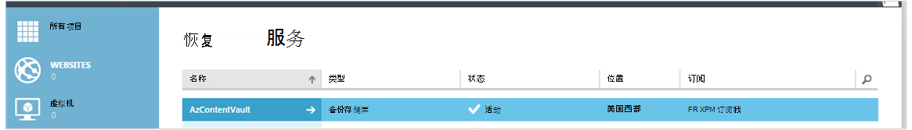

  > [AZURE.IMPORTANT] 请确保选择适当的存储冗余选项，在创建存储库后右。 阅读更多关于[地理冗余](../storage/storage-redundancy.md#geo-redundant-storage)和[本地冗余](../storage/storage-redundancy.md#locally-redundant-storage)选项在本[概述](../storage/storage-redundancy.md)中的。


## <a name="3-software-package"></a>3.软件程序包


### <a name="downloading-the-software-package"></a>下载的软件包

类似于保险存储的凭据，您可以下载 Microsoft Azure 备份应用程序工作负载，在备份存储库**快速起始页**。

1. 单击**应用程序工作负载 （磁盘到磁盘以云）**。 这将带您到下载中心页中，可以下载的软件包。

    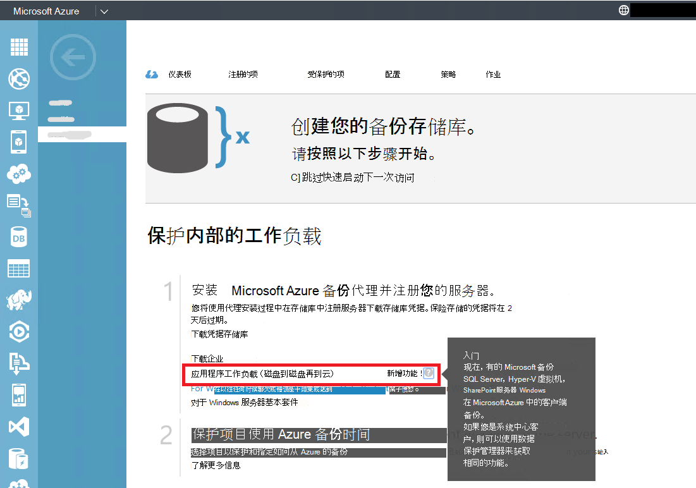

2. 单击**下载**。

    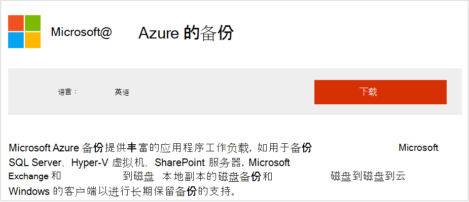

3. 选择所有文件，然后单击**下一步**。 下载来自 Microsoft Azure 备份下载页面的所有文件，并将所有文件都放在同一个文件夹中。
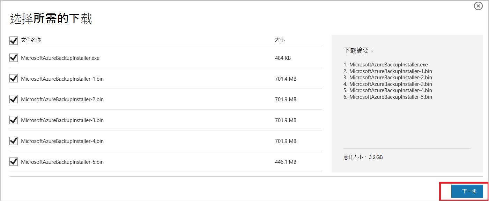

    因为下载的所有文件的大小一起 > 3 G，10Mbps 下载可能需要最多 60 分钟完成的下载链接。


### <a name="extracting-the-software-package"></a>解压缩的软件程序包

您已经下载的所有文件后，单击**MicrosoftAzureBackupInstaller.exe**。 这将启动**Microsoft Azure 备份安装向导**来安装程序将文件解压缩到您指定的位置。 继续执行向导，然后单击**提取**按钮以开始提取过程。

> [AZURE.WARNING] 需要至少 4 GB 的可用空间来解压缩安装文件。


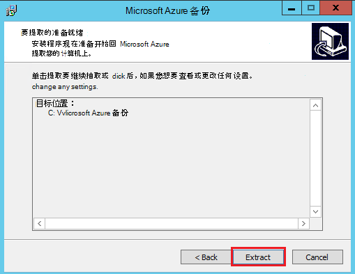

一旦提取处理完成，选中复选框以启动新提取的*setup.exe*开始安装 Microsoft Azure 备份服务器并单击**完成**按钮。

### <a name="installing-the-software-package"></a>安装软件包

1. 单击**Microsoft Azure 备份**启动安装向导。

    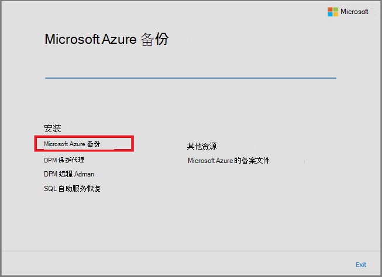

2. 在欢迎使用屏幕中，单击**下一步**按钮。 这将您带到*先决条件检查*部分。 在此屏幕中，单击**检查**按钮以确定 Azure 备份服务器的硬件和软件先决条件已得到满足。 如果所有前提条件都已满足成功，您将看到一个消息，指示计算机是否满足要求。 单击**下一步**按钮。

    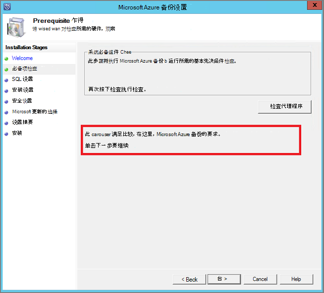

3. Microsoft Azure 备份服务器要求 SQL Server 标准和 Azure 备份服务器安装软件包捆绑与所需的适当的 SQL Server 二进制文件。 当启动新的 Azure 备份服务器安装时，应选择一个**安装新实例的 SQL Server 在此设置**的选项并单击**检查并安装**按钮。 系统必备组件已成功安装后，单击**下一步**。

    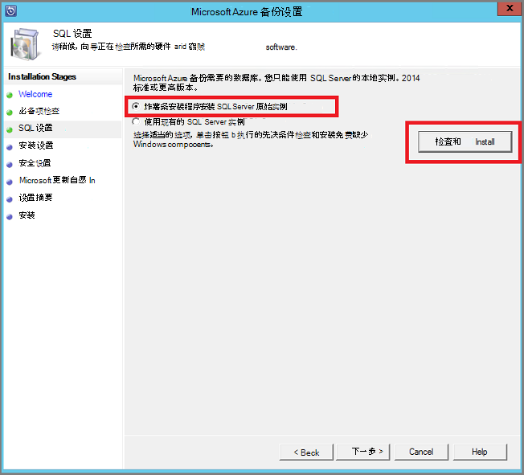

    建议重新启动机器发生故障，如果这样做，并**再次检查**单击。

    > [AZURE.NOTE] Azure 备份服务器与远程 SQL Server 实例无效。 需要本地 Azure 备份服务器所使用的实例。

4. 提供 Microsoft Azure 备份服务器文件的安装位置，然后单击**下一步**。

    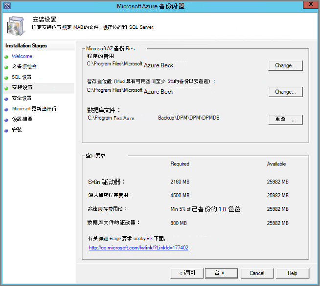

    暂存盘位置是 Azure 的备份要求。 确保至少 5%的计划备份到云中的数据的临时位置。 磁盘的保护，对于不同的磁盘需要安装完成之后进行配置。 有关存储池的详细信息，请参阅[配置存储池和磁盘存储](https://technet.microsoft.com/library/hh758075.aspx)。

5. 受限制的本地用户帐户提供一个强密码，并单击**下一步**。

    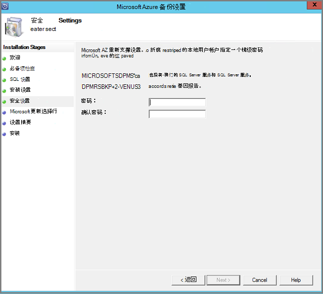

6. 选择您是否要使用*Microsoft 更新*来检查更新，然后单击**下一步**。

    >[AZURE.NOTE] 我们建议将重定向到 Microsoft 更新，Windows 和其他产品，如 Microsoft Azure 备份服务器提供安全更新和重要更新的 Windows 更新。

    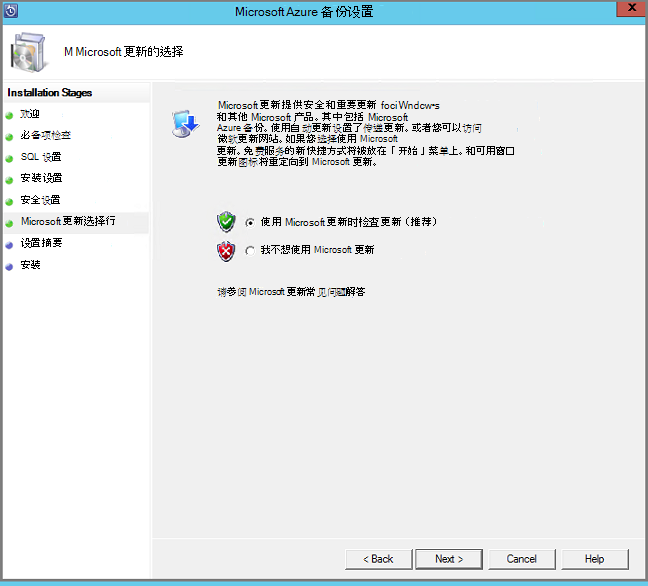

7. 查看*设置摘要*，然后单击**安装**。

    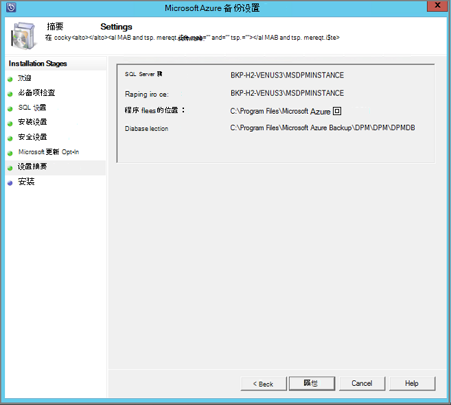

8. 安装发生阶段。 在第一阶段在服务器上安装 Microsoft Azure 恢复服务代理。 该向导还检查 Internet 连接。 如果 Internet 连接性是可用您就可以继续进行安装，否则，您需要提供代理详细信息以连接到互联网。

    下一步是配置 Microsoft Azure 恢复服务代理。 作为配置的一部分，您将必须提供要存储库凭据才能注册到备份存储库的计算机。 此外将提供用于加密/解密 Azure 和您的场所之间发送的数据。 可以自动生成一个密码短语或提供自己小 16 个字符的密码。 配置代理之前，请继续使用向导。

    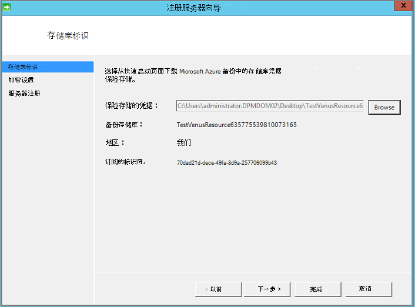

9. Microsoft 在 Azure 备份服务器的注册已成功完成后，总体安装向导继续执行第的安装和配置 SQL Server 和 Azure 备份服务器组件。 当 SQL Server 组件安装完成后时，安装了 Azure 备份服务器组件。

    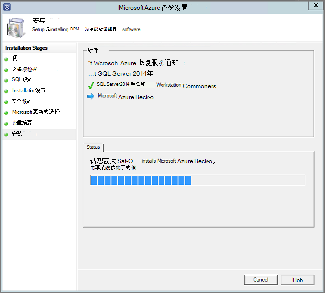


完成安装步骤后，产品的桌面图标将已创建也。 只需双击该图标可启动该产品。

### <a name="add-backup-storage"></a>添加备份存储

存储连接到 Azure 备份服务器机器上保留第一个备份副本。 有关添加磁盘的详细信息，请参阅[配置存储池和磁盘存储](https://technet.microsoft.com/library/hh758075.aspx)。

> [AZURE.NOTE] 您需要添加备份存储，即使您打算将数据发送到 Azure。 在 Azure 备份服务器的当前体系结构，Azure 备份存储库保存数据的*第二个*副本，而在本地存储区保存第一个 （并且是强制性） 的备份副本。  

## <a name="4-network-connectivity"></a>4.网络连接


Azure 备份服务器需要与产品要想成功的 Azure 备份服务连接。 要验证计算机是否连接到 Azure，使用```Get-DPMCloudConnection```commandlet Azure 备份服务器 PowerShell 控制台中的。 如果 commandlet 的输出为 TRUE，则连接存在，否则没有连接。

同时，Azure 订阅需要处于正常运行状态。 要查找您的订阅状态并对其进行管理，登录到[订阅门户]( https://account.windowsazure.com/Subscriptions)。

一旦您知道的 Azure 的连接性和 Azure 订阅的状态，可以使用下表来了解对提供的备份/恢复功能的影响。

| 连接状态 | Azure 的订阅 | 备份到 Azure| 备份到磁盘 | 从 Azure 还原 | 从磁盘恢复 |
| -------- | ------- | --------------------- | ------------------- | --------------------------- | ----------------------- |
| 连接 | 活动 | 允许 | 允许 | 允许 | 允许 |
| 连接 | 过期 | 停止 | 停止 | 允许 | 允许 |
| 连接 | Deprovisioned | 停止 | 停止 | 删除已停止和 Azure 的恢复点 | 停止 |
| 丢失的连接 > 15 天 | 活动 | 停止 | 停止 | 允许 | 允许 |
| 丢失的连接 > 15 天 | 过期 | 停止 | 停止 | 允许 | 允许 |
| 丢失的连接 > 15 天 | Deprovisioned | 停止 | 停止 |  删除已停止和 Azure 的恢复点 | 停止 |

### <a name="recovering-from-loss-of-connectivity"></a>从失去的连接恢复
如果有防火墙或代理服务器，使您无法访问 Azure，您到白名单需要在防火墙/代理配置文件中的下列域地址︰

- www.msftncsi.com
- \*.Microsoft.com
- \*.WindowsAzure.com
- \*。 microsoftonline.com
- \*。 windows.net

一旦连接到 Azure 已还原到 Azure 备份服务器上，可以执行的操作取决于 Azure 订阅状态。 上面的表具有有关允许计算机"连接"后执行的操作的详细信息。

### <a name="handling-subscription-states"></a>处理订阅状态

也可以在 Azure 的订阅*已到期*或*Deprovisioned*状态花到*活动*状态。 但是这样做有一些影响产品行为在不*活动*状态时︰

- 期间，它 deprovisioned， *Deprovisioned*订阅失去功能。 打开*活动*，被恢复的备份/恢复产品的功能。 本地磁盘上的备份数据还可以检索如果保持足够长的保留期间。 但是，Azure 中的备份数据是丢失并且无法恢复，一旦预订进入*Deprovisioned*状态。
- *过期*订阅仅失去功能，直到它已*活动*再次。 任何为该订阅已*到期*期间计划的备份将不会运行。


## <a name="troubleshooting"></a>故障排除

如果 Microsoft Azure 备份服务器失败，出现错误在安装阶段 （或备份或还原），请参阅详细信息此[错误代码文档](https://support.microsoft.com/kb/3041338)。
您也可以指[Azure 备份相关的常见问题解答](backup-azure-backup-faq.md)


## <a name="next-steps"></a>下一步行动

可以在 Microsoft TechNet 站点上获取[准备为 DPM 环境](https://technet.microsoft.com/library/hh758176.aspx)的详细的信息。 它还包含有关所支持配置的 Azure 备份服务器可以部署和使用的信息。

这些文章可以用于使用 Microsoft Azure 备份服务器的工作负荷保护深入理解。

- [SQL Server 备份](backup-azure-backup-sql.md)
- [SharePoint 服务器备份](backup-azure-backup-sharepoint.md)
- [备用服务器备份](backup-azure-alternate-dpm-server.md)
