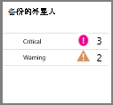
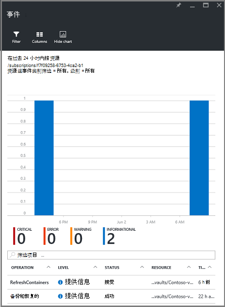

<properties
   pageTitle="监视资源管理器部署虚拟机备份 |Microsoft Azure"
   description="监视事件和警报从资源管理器部署虚拟机的备份。 将电子邮件发送根据警报。"
   services="backup"
   documentationCenter="dev-center-name"
   authors="markgalioto"
   manager="cfreeman"
   editor=""/>

<tags
ms.service="backup"
ms.workload="storage-backup-recovery"
ms.tgt_pltfrm="na"
ms.devlang="na"
ms.topic="article"
ms.date="08/25/2016"
ms.author="trinadhk; giridham;"/>

# <a name="monitor-alerts-for-azure-virtual-machine-backups"></a>监视 Azure 虚拟机备份的警报

警报是从事件阈值已满足或超过服务的响应。 了解这些问题开始可以降低业务成本的关键。 警报通常不会发生的时间表，并因此最好尽快知道后发生警报。 例如，备份或还原作业失败时，失败的 5 分钟内将出现警报。 在存储库面板中，备份警报平铺显示严重和警告级别的事件。 在备份警报设置中，您可以查看所有事件。 但是，如果警报发生时您正在使用一个单独的问题怎么办呢？ 如果您不知道该警报发生时，它可能是小的不便，或它可能危害数据。 若要确保正确的人都知道警报-当它发生时，将发送警报通知通过电子邮件服务配置。 设置电子邮件通知的详细信息，请参阅[配置通知](backup-azure-monitor-vms.md#configure-notifications)。

## <a name="how-do-i-find-information-about-the-alerts"></a>如何查找有关通知的信息？

若要查看有关事件引发警报的信息，您必须打开备份警报刀片式服务器。 有两种方法来打开备份警报刀片式服务器︰ 从备份警报平铺在存储库面板中，或从警报和事件刀片式服务器。

若要从备份警报平铺打开备份警报刀片式服务器︰

- 在**备份警报**图块上保险存储面板上，单击**严重**或**警告**，以查看该严重性级别的操作事件。

    


要从警报和事件刀片式服务器打开备份警报刀片式服务器︰

1. 从存储库面板中，单击**所有设置**。 

2. 在**设置**刀片式服务器，请单击**警报和事件**。 

3. 在**警报和事件**刀片式服务器，单击**备份警报**。 

    **备份警报**刀片式服务器将打开并显示筛选的警报。

    

4. 若要查看有关特定的警报，从事件列表的详细的信息单击该通知可打开其**详细信息**的刀片式服务器。

    

    若要自定义在列表中显示的属性，请参阅[查看其他事件属性](backup-azure-monitor-vms.md#view-additional-event-attributes)

## <a name="configure-notifications"></a>配置通知

 您可以配置服务以发送电子邮件通知发生在过去的 1 小时，或在特定类型的事件发生时的通知。

若要设置预警的电子邮件通知

1. 在备份警报菜单上，单击**配置通知**

    

    配置通知刀片式服务器打开。

    

2. **在配置通知刀片式服务器的电子邮件通知，请单击。**

    收件人和严重级别对话具有它们旁边带有一个星号，因为该信息是必需的。 提供至少一个电子邮件地址，并选择至少一个严重。

3. 在**收件人 （电子邮件）**对话框中，键入有关人员接收通知的电子邮件地址。 使用格式︰ username@domainname.com。 用分号 （;） 分隔多个电子邮件地址。

4. 在**通知**区域中，选择**每个警报**指定的警报发生时，发送通知或**每小时摘要**过去小时发送摘要。

5. 在**严重级别**对话框中，选择您要触发电子邮件通知的一个或多个级别。

6. 单击**保存**。
### <a name="what-alert-types-are-available-for-azure-iaas-vm-backup"></a>Azure IaaS VM 备份有何种警报类型？
| 警报级别  | 发送警报 |
| ------------- | ------------- |
| 关键 | 备份失败，恢复失败  |
| 警告  | 无 |
| 提供信息  | 无  |

### <a name="are-there-situations-where-email-isnt-sent-even-if-notifications-are-configured"></a>是否有电子邮件没有发送，即使配置通知的情况下？

有情况下，不发送警报，即使该通知已正确配置。 在以下情况下电子邮件通知不发送以避免警报声︰

- 如果每小时摘要，配置通知和警报是引发，在一个小时内解决。
- 该作业已取消。
- 备份作业将触发，然后无法，和另一个备份作业正在进行中。
- 计划的备份作业资源管理器启用虚拟机的启动，但 VM 不再存在。

## <a name="customize-your-view-of-events"></a>自定义事件的视图

**审核日志**设置附带了一组预定义的筛选器和列显示操作事件的信息。 可以自定义视图中，以便当打开刀片式服务器**的事件**，它将显示所需的信息。

1. 在[保险存储仪表板](./backup-azure-manage-vms.md#open-a-recovery-services-vault-in-the-dashboard)，浏览到并单击以打开**事件**刀片式服务器的**审核日志**。

    

    **事件**刀片式服务器打开筛选只针对当前存储库的操作事件。

    

    刀片式服务器显示严重、 错误、 警告和信息性为过去几周发生的事件的列表。 时间范围是在**筛选器**中设置的默认值。 **事件**刀片还显示一个条形图，该图跟踪事件发生。 如果不希望条形图，请参阅在**事件**菜单中，单击**隐藏图表**切换关闭图表。 事件的默认视图显示操作、 级别、 状态、 资源和时间的信息。 有关公开其他事件属性的信息，请参阅部分中，[展开事件信息](backup-azure-monitor-vms.md#view-additional-event-attributes)。

2. 操作事件，请在**操作**列中的其他信息请单击要打开其刀片式服务器的操作事件。 刀片式服务器包含有关事件的详细的信息。 事件分组通过其相关性 ID，在时间跨度内发生的事件的列表。

    

3. 若要查看有关某个特定事件，从事件列表的详细的信息请单击事件以打开其**详细信息**的刀片式服务器。

    

    事件级别信息是作为信息获取的那样详细。 如果希望查看有关每个事件，这么多信息，想要向**事件**刀片式服务器添加这么多细节请参阅部分中，[展开事件信息](backup-azure-monitor-vms.md#view-additional-event-attributes)。


## <a name="customize-the-event-filter"></a>自定义事件筛选器
使用**筛选器**来调整或在特定刀片式服务器中选择显示的信息。 若要筛选事件信息︰

1. 在[保险存储仪表板](./backup-azure-manage-vms.md#open-a-recovery-services-vault-in-the-dashboard)，浏览到并单击以打开**事件**刀片式服务器的**审核日志**。

    

    **事件**刀片式服务器打开筛选只针对当前存储库的操作事件。

    

2. 在**事件**菜单中，单击**筛选器**打开该刀片式服务器。

    

3. **筛选器**刀片上, 调整的**级别**、**时间跨度**和**调用方**的筛选器。 其他筛选器不可用，因为已将它们设置为提供恢复服务存储库的当前信息。

    

    您可以指定事件**级别**︰ 关键的错误、 警告或信息性。 您可以选择事件级别的任意组合，但必须具有至少一个选择级别。 打开或关闭切换级别。 **时间范围**筛选器允许您指定用于捕获事件的时间长度。 如果您使用自定义的时间范围，您可以设置开始和结束时间。

4. 一旦您准备查询使用您的筛选器操作日志，请单击**更新**。 结果显示**事件**刀片式服务器中。

    


### <a name="view-additional-event-attributes"></a>查看附加的事件属性
使用**列**按钮，您可以启用**事件**刀片式服务器上的列表中显示的附加的事件属性。 默认事件列表中的显示操作、 级别、 状态、 资源和时间的信息。 若要启用附加特性︰

1. 在**事件**刀片式服务器，单击**列**。

    

    打开刀片式服务器**选择列**。

    

2. 若要选择该属性，请单击复选框。 属性复选框来开启和关闭。

3. 单击**重置**来重置的**事件**刀片式服务器中的属性列表。 后添加或从列表中移除属性，使用**重置**，可以查看新的事件的属性列表。

4. 单击**更新**以更新的事件属性中的数据。 下表提供有关每个属性的信息。

| 列名称      |说明|
| -----------------|-----------|
| 操作|操作的名称|
| 级别|级别的操作中，值可以是︰ 信息性消息、 警告、 错误或严重|
|状态|描述操作的状态|
|资源|URL 所标识的资源;也称为资源 ID|
|时间|测量在该事件发生时的当前时间的时间|
|调用方|谁或什么调用或触发事件。可以是系统或用户|
|时间戳|当触发事件的时间|
|资源组|相关联的资源组|
|资源类型|资源管理器使用内部资源类型|
|订购 ID|相关联的订阅 ID|
|类别|事件的类别|
|相关性 ID|有相关事件的公共 ID|


## <a name="use-powershell-to-customize-alerts"></a>使用 PowerShell 自定义通知
您可以自定义警报通知作业在门户中。 若要获取这些作业，操作日志事件定义基于 PowerShell 的预警规则。 使用*PowerShell 1.3.0 版或更高版本*。

若要定义自定义通知要备份失败警报，请使用类似下面的脚本命令︰

```
PS C:\> $actionEmail = New-AzureRmAlertRuleEmail -CustomEmail contoso@microsoft.com
PS C:\> Add-AzureRmLogAlertRule -Name backupFailedAlert -Location "East US" -ResourceGroup RecoveryServices-DP2RCXUGWS3MLJF4LKPI3A3OMJ2DI4SRJK6HIJH22HFIHZVVELRQ-East-US -OperationName Microsoft.Backup/RecoveryServicesVault/Backup -Status Failed -TargetResourceId /subscriptions/86eeac34-eth9a-4de3-84db-7a27d121967e/resourceGroups/RecoveryServices-DP2RCXUGWS3MLJF4LKPI3A3OMJ2DI4SRJK6HIJH22HFIHZVVELRQ-East-US/providers/microsoft.backupbvtd2/RecoveryServicesVault/trinadhVault -Actions $actionEmail
```

**资源 Id** ︰ 可以从审计日志中获取资源 Id。 资源 Id 是在资源列中的操作日志中提供的 URL。

**操作名称**︰ 操作名称是"Microsoft.RecoveryServices/recoveryServicesVault/*事件名称*"可*事件名称*的格式︰<br/>
- 注册 <br/>
- 注销 <br/>
- ConfigureProtection <br/>
- 备份 <br/>
- 还原 <br/>
- StopProtection <br/>
- DeleteBackupData <br/>
- CreateProtectionPolicy <br/>
- DeleteProtectionPolicy <br/>
- UpdateProtectionPolicy <br/>

**状态**︰ 受支持的值是已启动、 成功或失败。

**ResourceGroup** ︰ 这是对资源所属的资源组。 可以将资源组列添加生成的日志。 资源组是信息的一种可用类型的事件。

**名称**︰ 通知规则的名称。

**CustomEmail** ︰ 指定要向其发送警报通知的自定义电子邮件地址

**SendToServiceOwners** ︰ 此选项将通知发送到所有管理员和订阅的联管理员。 它可以用在**新建 AzureRmAlertRuleEmail** cmdlet

### <a name="limitations-on-alerts"></a>警报上的限制
基于事件的通知会受到以下限制︰

1. 在恢复服务存储库中的所有虚拟机，将触发预警。 您不能自定义恢复服务存储库中的虚拟机的一个子集的通知。
2. 此功能将在预览。 [了解更多信息](../monitoring-and-diagnostics/insights-powershell-samples.md#create-alert-rules)
3. 从发送警报"alerts-noreply@mail.windowsazure.com"。 目前，您不能修改电子邮件发件人。


## <a name="next-steps"></a>下一步行动

事件日志启用很好总结和审核备份操作的支持。 记录下面的操作︰

- 注册
- 注销
- 配置保护
- 备份 （同时安排以及按需备份）
- 还原
- 停止保护
- 删除备份数据
- 添加策略
- 删除策略
- 更新策略
- 取消作业

有关事件的广泛解释，操作和审核日志跨 Azure 服务，请参阅文章，[查看事件日志和审核日志](../monitoring-and-diagnostics/insights-debugging-with-events.md)。

有关重新创建虚拟机从一个恢复点的信息，检查出[还原 Azure Vm](backup-azure-restore-vms.md)。 如果您需要在保护您的虚拟机上的信息，请参阅[先睹为快︰ 备份虚拟机到恢复服务存储库](backup-azure-vms-first-look-arm.md)。 了解如何在文章中，[管理 Azure 虚拟机备份](backup-azure-manage-vms.md)VM 备份的管理任务。
